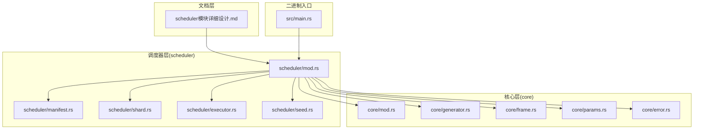
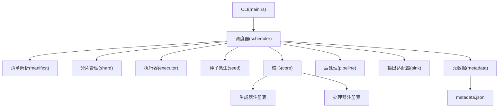
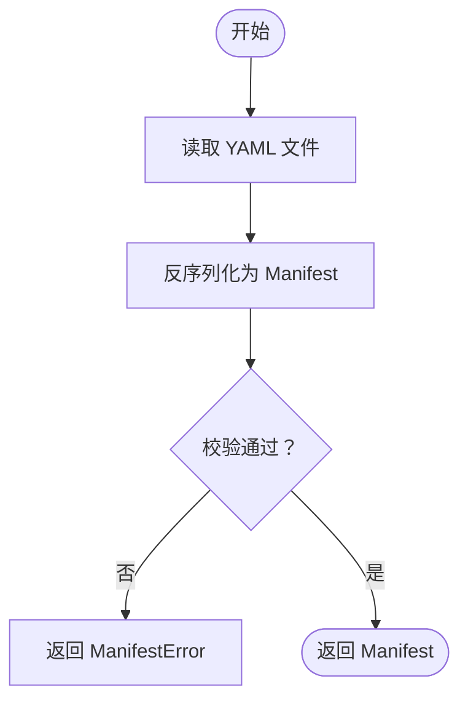
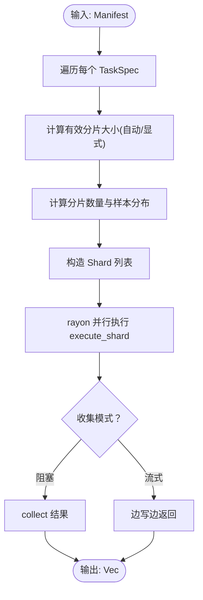
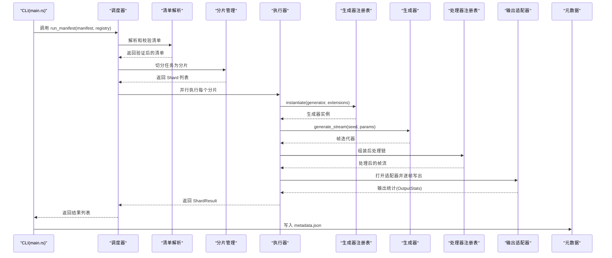
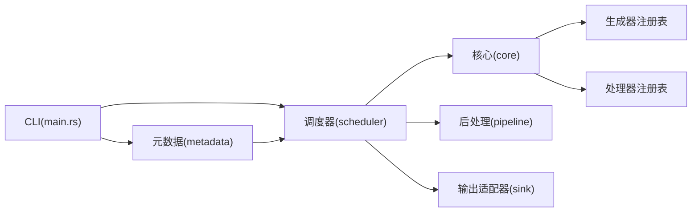

# 任务调度层

<cite>
**本文引用的文件**
- [scheduler模块详细设计.md](file://docs/scheduler模块详细设计.md)
- [main.rs](file://src/main.rs)
- [scheduler/mod.rs](file://src/scheduler/mod.rs)
- [scheduler/manifest.rs](file://src/scheduler/manifest.rs)
- [scheduler/shard.rs](file://src/scheduler/shard.rs)
- [scheduler/executor.rs](file://src/scheduler/executor.rs)
- [scheduler/seed.rs](file://src/scheduler/seed.rs)
- [core/mod.rs](file://src/core/mod.rs)
- [core/generator.rs](file://src/core/generator.rs)
- [core/frame.rs](file://src/core/frame.rs)
- [core/params.rs](file://src/core/params.rs)
- [core/error.rs](file://src/core/error.rs)
- [Cargo.toml](file://Cargo.toml)
- [minimal_ca.yaml](file://tests/manifests/minimal_ca.yaml)
- [multi_task.yaml](file://tests/manifests/multi_task.yaml)
</cite>

## 更新摘要
**变更内容**
- 新增了完整的调度器架构实现，包括清单解析、分片管理、并行执行等核心功能
- 更新了调度器模块的详细设计文档，反映实际实现的架构模式
- 增强了分片切分算法和确定性种子派生机制
- 完善了容错执行器和管道构建机制
- 更新了CLI与调度器的集成模式

## 目录
1. [简介](#简介)
2. [项目结构](#项目结构)
3. [核心组件](#核心组件)
4. [架构总览](#架构总览)
5. [组件详细分析](#组件详细分析)
6. [依赖关系分析](#依赖关系分析)
7. [性能考量](#性能考量)
8. [故障排查指南](#故障排查指南)
9. [结论](#结论)
10. [附录](#附录)

## 简介
任务调度层（scheduler）是 StructGen-rs 的协调中枢，负责将用户提供的 YAML 清单转换为可执行的任务，管理确定性种子派生，通过 rayon 线程池并行执行分片，串联"生成→后处理→写出"的流水线，并在两种执行模式之间自由切换：阻塞收集模式（中小规模）与流式写出模式（大规模）。调度器不关心具体生成什么数据，只负责编排与资源分配，确保完全确定性与弹性并行度。

## 项目结构
- 文档层：提供调度器、CLI、元数据等模块的详细设计规格，定义接口契约与交互时序。
- 核心层（core）：定义统一错误类型、帧与参数模型、生成器接口等公共抽象。
- 调度器层（scheduler）：实现清单解析、分片管理、并行执行、容错处理等核心功能。
- 二进制入口：CLI 作为唯一入口，装配注册表、启动调度器、生成元数据与汇总报告。

**图表来源**
- [scheduler模块详细设计.md](file://docs/scheduler模块详细设计.md)
- [scheduler/mod.rs](file://src/scheduler/mod.rs)
- [scheduler/manifest.rs](file://src/scheduler/manifest.rs)
- [scheduler/shard.rs](file://src/scheduler/shard.rs)
- [scheduler/executor.rs](file://src/scheduler/executor.rs)
- [scheduler/seed.rs](file://src/scheduler/seed.rs)
- [core/mod.rs](file://src/core/mod.rs)

## 核心组件
- 清单与任务规范：Manifest、TaskSpec，定义任务列表、全局配置、输出格式、分片策略等。
- 分片与结果：Shard 描述分片任务，ShardResult 汇总统计与错误。
- 种子派生：确定性派生函数，保证不同分片、不同任务的种子不冲突。
- 执行器：execute_shard 将生成器、后处理链、输出适配器串联起来。
- 公开入口：run_manifest 作为调度器唯一对外接口，负责分片切分与并行执行。

**章节来源**
- [scheduler/mod.rs](file://src/scheduler/mod.rs)
- [scheduler/manifest.rs](file://src/scheduler/manifest.rs)
- [scheduler/shard.rs](file://src/scheduler/shard.rs)
- [scheduler/seed.rs](file://src/scheduler/seed.rs)

## 架构总览
调度器采用"编排者"模式：CLI 负责装配与可观测性，scheduler 负责任务编排与并行，core 提供统一抽象，metadata 负责运行记录与进度。调度器通过注册表解耦生成器与处理器，通过输出适配器解耦具体格式。

**图表来源**
- [main.rs](file://src/main.rs)
- [scheduler/mod.rs](file://src/scheduler/mod.rs)
- [scheduler/manifest.rs](file://src/scheduler/manifest.rs)
- [scheduler/shard.rs](file://src/scheduler/shard.rs)
- [scheduler/executor.rs](file://src/scheduler/executor.rs)
- [scheduler/seed.rs](file://src/scheduler/seed.rs)

## 组件详细分析

### 清单解析与校验机制
- 解析：从 YAML 文件读取，反序列化为 Manifest。
- 校验：全局输出目录可写、任务名唯一、样本数大于 0、处理器与生成器名称存在于注册表、分片大小合法性等。
- 错误：ManifestError，立即返回并终止运行。

**图表来源**
- [scheduler/manifest.rs](file://src/scheduler/manifest.rs)

**章节来源**
- [scheduler/manifest.rs](file://src/scheduler/manifest.rs)

### 分片管理与并行执行策略
- 分片切分：按任务样本数与分片大小（自动或显式）切分为多个 Shard，派生唯一种子。
- 并行策略：使用 rayon 线程池，分片数为目标 CPU 核心数的 4 倍，工作窃取均衡负载。
- 执行模式：
  - 阻塞收集：rayon 并行收集结果，适合中小规模。
  - 流式写出：每个分片私有输出适配器，写入独立文件，适合大规模。

**图表来源**
- [scheduler/mod.rs](file://src/scheduler/mod.rs)
- [scheduler/shard.rs](file://src/scheduler/shard.rs)

**章节来源**
- [scheduler/mod.rs](file://src/scheduler/mod.rs)
- [scheduler/shard.rs](file://src/scheduler/shard.rs)

### 任务调度算法与资源管理
- 调度算法：分片粒度控制（默认不低于 1 样本），目标分片数为 CPU 核心数的 4 倍，避免线程调度开销。
- 资源管理：通过线程池大小与分片并发度限制 CPU 竞争；每个分片私有输出适配器，避免锁竞争。
- 确定性：种子派生为确定性函数，确保相同清单与二进制产生逐比特一致的输出。

**章节来源**
- [scheduler/shard.rs](file://src/scheduler/shard.rs)
- [scheduler/seed.rs](file://src/scheduler/seed.rs)

### 组件交互、数据流与集成模式
- CLI 作为唯一编排者：初始化日志、注册表、线程池，启动调度器，写入元数据，打印汇总报告。
- 调度器与核心：通过 GeneratorRegistry 与 ProcessorRegistry 解耦具体实现。
- 输出适配器：根据任务/全局配置选择格式，逐帧写出，最后汇总统计。

**图表来源**
- [main.rs](file://src/main.rs)
- [scheduler/mod.rs](file://src/scheduler/mod.rs)
- [scheduler/executor.rs](file://src/scheduler/executor.rs)

**章节来源**
- [main.rs](file://src/main.rs)
- [scheduler/mod.rs](file://src/scheduler/mod.rs)
- [scheduler/executor.rs](file://src/scheduler/executor.rs)

### 安全性、监控与故障恢复
- 安全性：调度器不直接处理敏感数据，通过注册表与适配器接口隔离实现细节。
- 监控：元数据层提供结构化日志与进度追踪，支持控制台与文件输出。
- 故障恢复：单分片失败不影响整体运行，记录错误并在元数据中标注失败分片。

**章节来源**
- [scheduler/executor.rs](file://src/scheduler/executor.rs)

## 依赖关系分析
- 调度器依赖 core 的统一错误、帧与参数模型、生成器接口与注册表。
- 调度器通过注册表间接依赖具体生成器与处理器实现。
- CLI 依赖调度器与元数据模块，负责装配与可观测性。
- 元数据模块依赖调度器的分片结果与核心的统计信息。

**图表来源**
- [main.rs](file://src/main.rs)
- [scheduler/mod.rs](file://src/scheduler/mod.rs)

**章节来源**
- [main.rs](file://src/main.rs)
- [scheduler/mod.rs](file://src/scheduler/mod.rs)

## 性能考量
- Rayon 工作窃取：目标分片数为 CPU 核心数的 4 倍，平衡不同生成器的执行时间差异。
- 零堆分配热路径：迭代器传递栈上帧，避免在帧级别做堆分配。
- 分片粒度控制：默认分片大小不低于 1 样本，减少调度开销。
- 流式写出：每个分片私有输出适配器，避免锁竞争与中间缓冲。

**章节来源**
- [scheduler/shard.rs](file://src/scheduler/shard.rs)
- [scheduler/executor.rs](file://src/scheduler/executor.rs)

## 故障排查指南
- 清单解析失败：检查 YAML 语法与字段类型，关注 ManifestError。
- 生成器/处理器未注册：确认名称存在于注册表，或检查注册流程。
- 线程数为 0：调整命令行或清单中的 num_threads。
- 部分分片失败：查看元数据中的失败分片记录，定位具体错误。
- 元数据写入失败：检查输出目录权限与磁盘空间。

**章节来源**
- [main.rs](file://src/main.rs)
- [scheduler/manifest.rs](file://src/scheduler/manifest.rs)

## 结论
调度器以完全确定性、弹性并行与容错隔离为核心设计原则，通过注册表与适配器接口实现高度解耦，支持中小规模阻塞收集与大规模流式写出两种模式。结合元数据与监控能力，确保运行过程可观测、结果可复现、问题可定位。

## 附录

### 技术栈与第三方依赖
- 语言与包管理：Rust、Cargo
- 序列化：serde、serde_json、serde_yaml
- 错误处理：thiserror
- 并行：rayon（通过 CLI 初始化线程池）
- 日志与观测：tracing/log（由元数据模块提供）

**章节来源**
- [Cargo.toml](file://Cargo.toml)

### 版本兼容性与约束条件
- 版本：StructGen-rs 0.1.0（包版本）
- 约束：清单中的全局配置可被命令行覆盖；分片大小不得为 0；任务样本数必须大于 0。
- 线程池：由 CLI 在程序启动时一次性设置，避免重复初始化。

**章节来源**
- [main.rs](file://src/main.rs)
- [scheduler/manifest.rs](file://src/scheduler/manifest.rs)

### 使用示例
- 最小化清单示例：展示了基本的 YAML 格式和参数配置
- 多任务清单示例：演示了如何在一个清单中定义多个不同的生成任务

**章节来源**
- [minimal_ca.yaml](file://tests/manifests/minimal_ca.yaml)
- [multi_task.yaml](file://tests/manifests/multi_task.yaml)