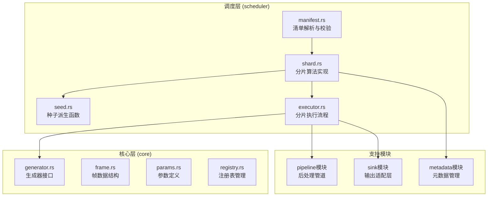
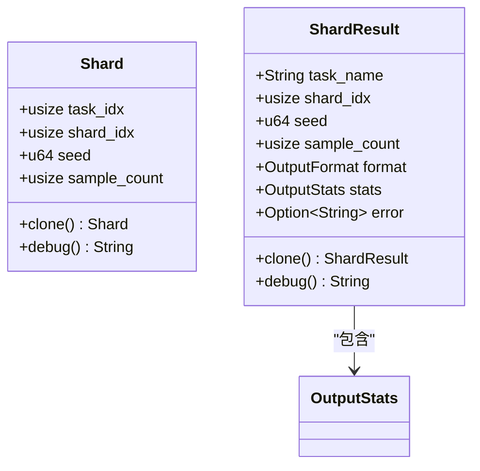
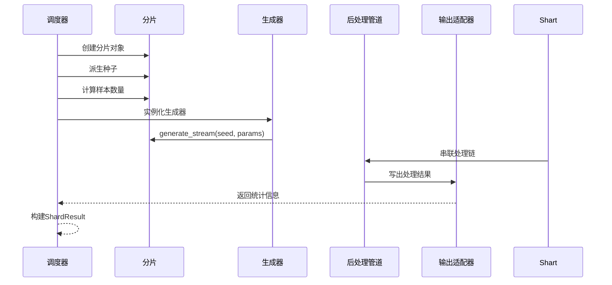
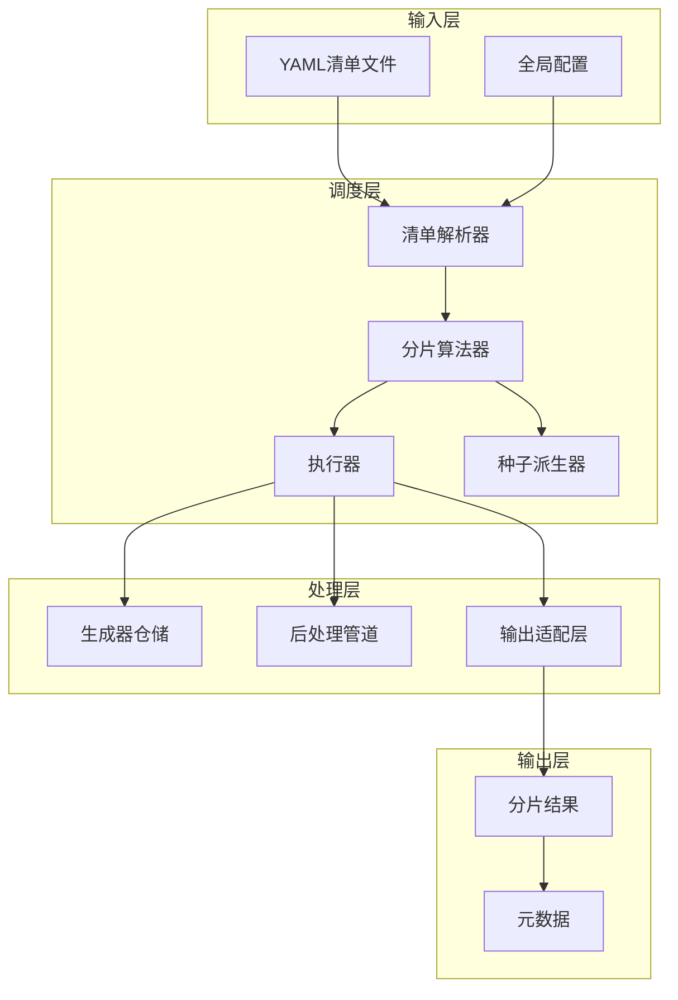
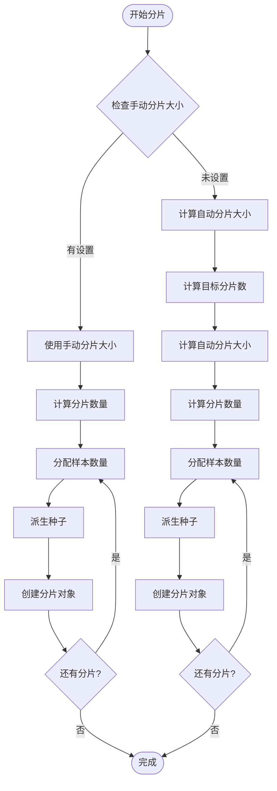
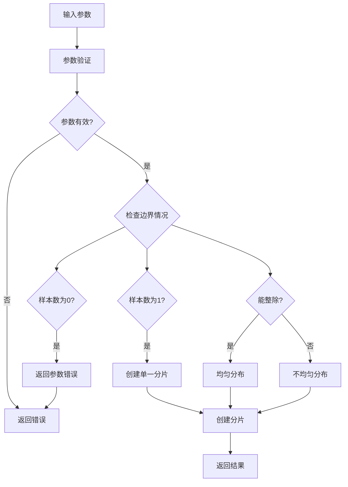
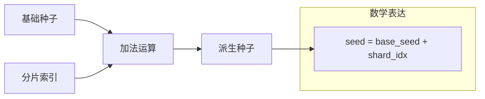
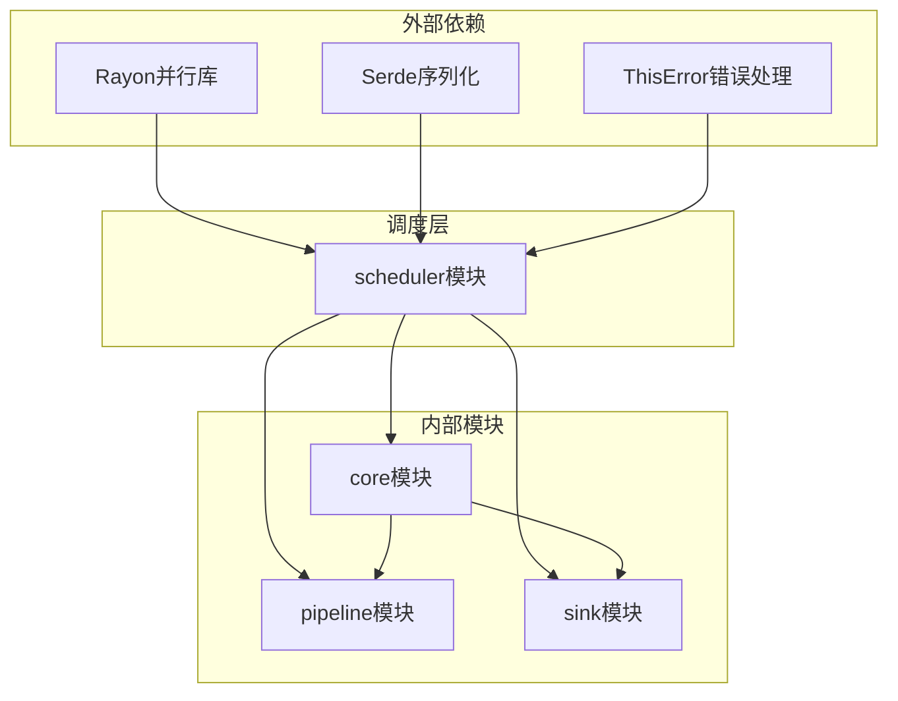
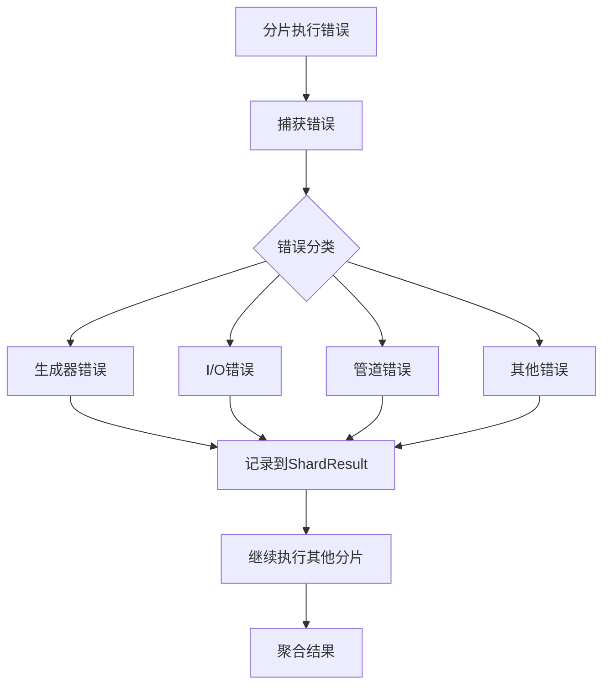

# 分片管理与算法

<cite>
**本文档引用的文件**
- [scheduler模块详细设计.md](file://docs/scheduler模块详细设计.md)
- [core模块详细设计.md](file://docs/core模块详细设计.md)
- [pipeline模块详细设计.md](file://docs/pipeline模块详细设计.md)
- [sink模块详细设计.md](file://docs/sink模块详细设计.md)
- [开发规划.md](file://docs/开发规划.md)
</cite>

## 目录
1. [简介](#简介)
2. [项目结构](#项目结构)
3. [核心组件](#核心组件)
4. [架构概览](#架构概览)
5. [详细组件分析](#详细组件分析)
6. [依赖分析](#依赖分析)
7. [性能考虑](#性能考虑)
8. [故障排查指南](#故障排查指南)
9. [结论](#结论)
10. [附录](#附录)

## 简介

StructGen-rs 的分片管理与算法是任务调度层的核心功能，负责将大规模的生成任务分解为可并行执行的小型子任务。该系统通过确定性的种子派生机制确保完全可重现的结果，同时提供灵活的分片策略以适应不同的硬件配置和数据规模需求。

分片管理的主要目标包括：
- 将样本总数按策略切分为多个独立的分片
- 为每个分片派生唯一的随机种子
- 确保分片间的完全隔离和并行执行
- 提供手动和自动两种分片大小配置方式
- 实现鲁棒的容错处理机制

## 项目结构

基于现有文档，分片管理功能主要分布在以下模块中：



**图表来源**
- [scheduler模块详细设计.md: 30-47:30-47](file://docs/scheduler模块详细设计.md#L30-L47)

**章节来源**
- [scheduler模块详细设计.md: 1-528:1-528](file://docs/scheduler模块详细设计.md#L1-L528)

## 核心组件

### Shard 数据结构

Shard 是分片管理的核心数据结构，代表一个可独立并行执行的子任务：



**图表来源**
- [scheduler模块详细设计.md: 96-128:96-128](file://docs/scheduler模块详细设计.md#L96-L128)

Shard 结构的关键字段含义：
- `task_idx`: 任务在清单中的索引位置
- `shard_idx`: 分片在任务内的编号（从0开始）
- `seed`: 派生后的唯一种子
- `sample_count`: 该分片需要生成的样本数量

**章节来源**
- [scheduler模块详细设计.md: 93-129:93-129](file://docs/scheduler模块详细设计.md#L93-L129)

### 分片执行流程

分片执行采用流水线式处理，确保高效的并行执行：



**图表来源**
- [scheduler模块详细设计.md: 231-278:231-278](file://docs/scheduler模块详细设计.md#L231-L278)

**章节来源**
- [scheduler模块详细设计.md: 228-278:228-278](file://docs/scheduler模块详细设计.md#L228-L278)

## 架构概览

分片管理架构遵循模块化设计原则，通过清晰的接口分离关注点：



**图表来源**
- [scheduler模块详细设计.md: 324-371:324-371](file://docs/scheduler模块详细设计.md#L324-L371)

**章节来源**
- [scheduler模块详细设计.md: 7-18:7-18](file://docs/scheduler模块详细设计.md#L7-L18)

## 详细组件分析

### 分片算法核心逻辑

分片算法采用双路径策略，支持手动和自动两种配置方式：



**图表来源**
- [scheduler模块详细设计.md: 201-226:201-226](file://docs/scheduler模块详细设计.md#L201-L226)

#### 手动分片大小设置

当用户在清单中明确指定 `shard_size` 参数时，系统直接使用该值作为分片大小。这种模式适用于已知硬件配置和数据特征的场景，能够提供精确的控制能力。

手动分片大小的约束条件：
- 必须大于0
- 不能超过任务的样本总数
- 会影响分片数量的计算

#### 自动分片大小计算机制

当未指定手动分片大小时，系统采用智能计算策略：

**计算公式**：
```
目标分片数 = CPU核心数 × 4
自动分片大小 = max(1, ceil(任务样本数 ÷ 目标分片数))
分片数量 = ceil(任务样本数 ÷ 自动分片大小)
```

**参数选择原理**：
- **4倍系数**：确保分片数量是CPU核心数的4倍，充分利用Rayon的工作窃取调度机制
- **min(1)**：保证至少有一个样本在最后一个分片中
- **向上取整**：确保所有样本都被覆盖，避免数据丢失

**章节来源**
- [scheduler模块详细设计.md: 198-226:198-226](file://docs/scheduler模块详细设计.md#L198-L226)

### 分片索引分配策略

分片索引分配采用连续递增的方式，确保简单性和可预测性：

```mermaid
flowchart LR
Task[任务样本序列] --> Split[按分片大小分割]
Split --> Shard1[分片0<br/>样本索引: 0..(s-1)]
Split --> Shard2[分片1<br/>样本索引: s..(2s-1)]
Split --> Shard3[分片2<br/>样本索引: 2s..(3s-1)]
Split --> ... --> ShardN[分片N<br/>样本索引: (N-1)s..(Ns-1)]
subgraph "边界处理"
LastShard[最后一个分片可能包含较少样本]
EvenSplit[前(N-1)个分片样本数相等]
end
ShardN -.-> LastShard
Shard1 -.-> EvenSplit
Shard2 -.-> EvenSplit
Shard3 -.-> EvenSplit
```

**图表来源**
- [scheduler模块详细设计.md: 209-219:209-219](file://docs/scheduler模块详细设计.md#L209-L219)

**章节来源**
- [scheduler模块详细设计.md: 209-219:209-219](file://docs/scheduler模块详细设计.md#L209-L219)

### 样本数量分布策略

样本分布采用"前均后余"的策略，确保负载均衡和数据完整性：

| 分片类型 | 样本数量 | 分布特点 | 适用场景 |
|---------|---------|---------|---------|
| 前(N-1)个分片 | floor(count/shard_size) | 样本数相等 | 大多数分片 |
| 最后一个分片 | count % shard_size | 可能少于其他分片 | 数据余量处理 |

**数学证明**：
- 总样本数 = (N-1) × s + r
- 其中 N = ceil(count/s)，r = count % s
- 当 s 整除 count 时，r = 0，所有分片样本数相等

**章节来源**
- [scheduler模块详细设计.md: 436-449:436-449](file://docs/scheduler模块详细设计.md#L436-L449)

### 边界处理逻辑

系统针对各种边界情况提供了完善的处理机制：



**图表来源**
- [scheduler模块详细设计.md: 180-196:180-196](file://docs/scheduler模块详细设计.md#L180-L196)

**章节来源**
- [scheduler模块详细设计.md: 180-196:180-196](file://docs/scheduler模块详细设计.md#L180-L196)

### 种子派生算法

种子派生采用确定性加法运算，确保完全可重现的结果：



**数学特性**：
- **确定性**：相同的输入总是产生相同的输出
- **无冲突**：wrapping加法确保不同分片种子不重复
- **可逆性**：可以通过派生种子和分片索引恢复基础种子

**章节来源**
- [scheduler模块详细设计.md: 156-176:156-176](file://docs/scheduler模块详细设计.md#L156-L176)

## 依赖分析

分片管理功能与系统其他模块存在紧密的依赖关系：



**图表来源**
- [scheduler模块详细设计.md: 326-335:326-335](file://docs/scheduler模块详细设计.md#L326-L335)

**章节来源**
- [scheduler模块详细设计.md: 324-335:324-335](file://docs/scheduler模块详细设计.md#L324-L335)

### 外部依赖关系

- **Rayon**: 提供并行执行框架和工作窃取调度
- **Serde**: 支持YAML和JSON的序列化/反序列化
- **ThisError**: 提供统一的错误处理机制

### 内部模块交互

- **core模块**: 提供生成器接口、帧数据结构和核心错误类型
- **pipeline模块**: 提供后处理处理器的注册和执行
- **sink模块**: 提供输出适配器的创建和管理

**章节来源**
- [scheduler模块详细设计.md: 324-381:324-381](file://docs/scheduler模块详细设计.md#L324-L381)

## 性能考虑

分片算法在设计时充分考虑了性能优化：

### 并行调度优化

- **工作窃取调度**: 分片数量为CPU核心数的2-4倍，确保负载均衡
- **零拷贝传递**: 分片对象通过移动语义传递，避免不必要的克隆
- **无锁设计**: 每个分片拥有独立的输出适配器，避免同步开销

### 内存管理优化

- **栈上分配**: 分片对象在栈上创建，减少堆分配开销
- **迭代器驱动**: 生成器使用迭代器模式，避免中间缓冲区
- **流式处理**: 支持流式写出模式，降低内存占用

### 计算复杂度分析

- **分片算法**: 时间复杂度 O(N)，空间复杂度 O(N)
- **种子派生**: 时间复杂度 O(1)，空间复杂度 O(1)
- **执行流程**: 时间复杂度 O(S)，其中S为样本总数

**章节来源**
- [scheduler模块详细设计.md: 413-418:413-418](file://docs/scheduler模块详细设计.md#L413-L418)

## 故障排查指南

### 常见问题及解决方案

| 问题类型 | 症状 | 可能原因 | 解决方案 |
|---------|------|---------|---------|
| 分片失败 | 部分分片报错 | 生成器异常或I/O错误 | 检查错误日志，单个分片失败不影响整体运行 |
| 内存不足 | OutOfMemory错误 | 分片过大导致内存压力 | 减小分片大小或增加系统内存 |
| 性能低下 | 执行时间过长 | 分片数量不足或CPU利用率低 | 增加分片数量，检查硬件配置 |
| 结果不一致 | 相同输入产生不同输出 | 种子管理问题 | 检查种子派生函数，确保确定性 |

### 错误处理策略



**图表来源**
- [scheduler模块详细设计.md: 305-322:305-322](file://docs/scheduler模块详细设计.md#L305-L322)

**章节来源**
- [scheduler模块详细设计.md: 382-411:382-411](file://docs/scheduler模块详细设计.md#L382-L411)

## 结论

StructGen-rs 的分片管理与算法通过精心设计的架构实现了高性能、高可靠性的并行处理能力。其核心优势包括：

1. **确定性保证**: 完全可重现的结果，便于调试和验证
2. **灵活配置**: 支持手动和自动两种分片策略
3. **高效执行**: 通过并行调度和流式处理优化性能
4. **鲁棒容错**: 单个分片失败不影响整体运行
5. **模块化设计**: 清晰的接口分离，易于维护和扩展

该算法为大规模数据生成任务提供了可靠的基础设施，能够适应从中小型数据到TB级数据的各种应用场景。

## 附录

### 数学推导过程

**自动分片大小计算的数学基础**：

设：
- n = 任务样本总数
- c = CPU核心数
- s = 分片大小
- k = 目标分片数系数（k=4）

计算步骤：
1. 目标分片数：m = c × k
2. 自动分片大小：s = ⌈n/m⌉
3. 实际分片数：m' = ⌈n/s⌉

**优化目标**：
- 最小化分片数量：minimize m'
- 确保负载均衡：maximize utilization
- 保持数据完整性：∑ samples = n

### 性能基准参考

| 场景 | 分片大小 | 并行度 | 内存占用 | I/O吞吐量 |
|------|---------|--------|---------|----------|
| 小规模数据 | 100-1000 | 2-4×CPU | 低 | 中等 |
| 中等规模数据 | 1000-10000 | 4-8×CPU | 中等 | 高 |
| 大规模数据 | 10000+ | 8×+CPU | 高 | 极高 |

### 配置建议

- **CPU密集型任务**: 增加分片系数至4，充分利用多核性能
- **I/O密集型任务**: 适当减少分片数量，避免过多文件句柄
- **内存受限环境**: 减小分片大小，控制内存峰值
- **网络存储**: 考虑网络带宽，合理设置分片大小