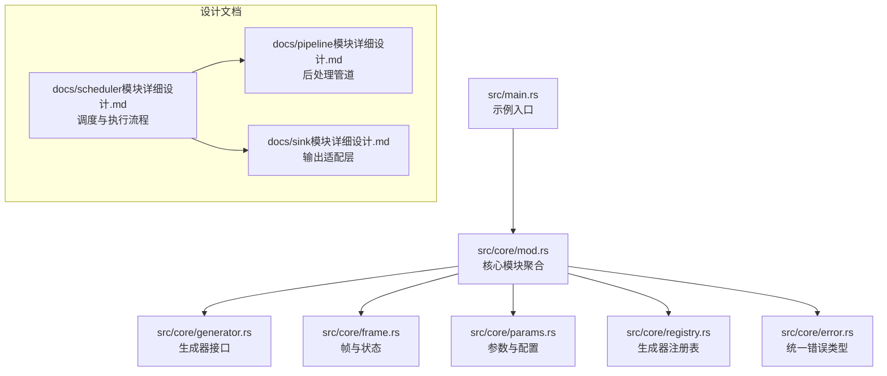
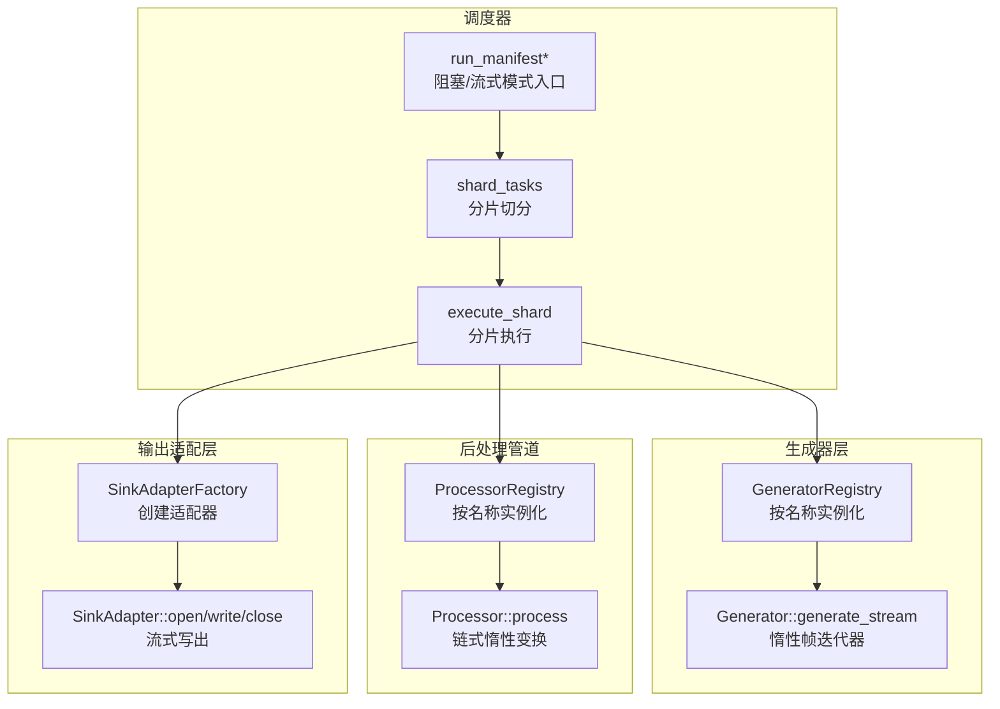
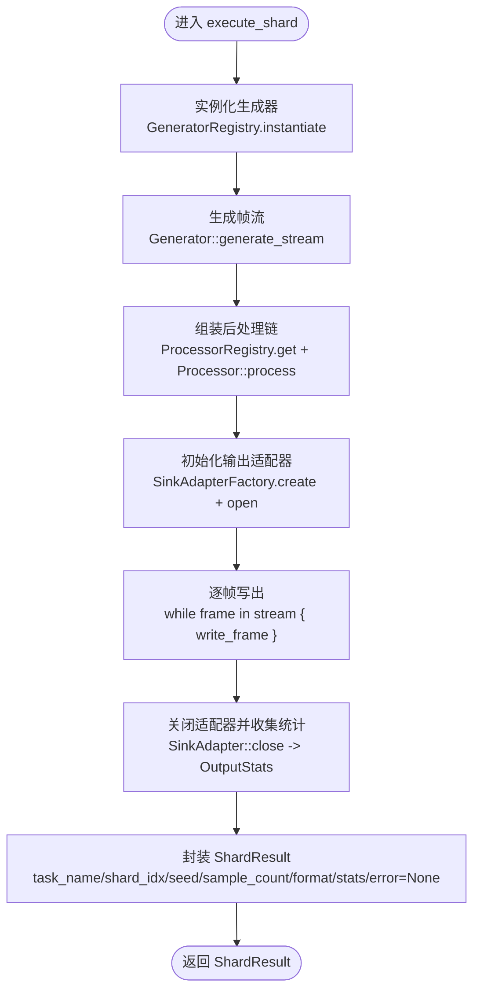
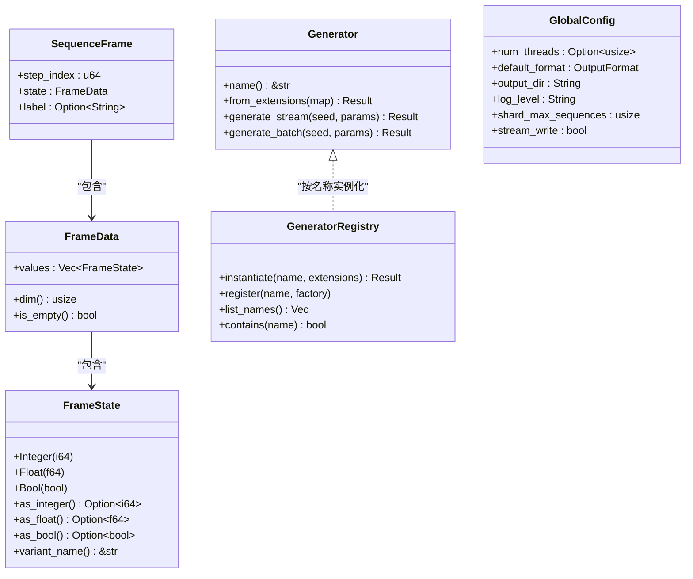
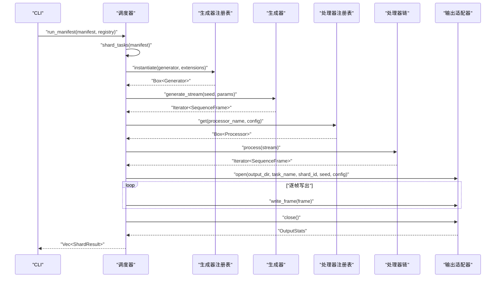

# 并行执行与调度

<cite>
**本文引用的文件**
- [main.rs](file://src/main.rs)
- [mod.rs](file://src/core/mod.rs)
- [generator.rs](file://src/core/generator.rs)
- [frame.rs](file://src/core/frame.rs)
- [error.rs](file://src/core/error.rs)
- [params.rs](file://src/core/params.rs)
- [registry.rs](file://src/core/registry.rs)
- [scheduler模块详细设计.md](file://docs/scheduler模块详细设计.md)
- [pipeline模块详细设计.md](file://docs/pipeline模块详细设计.md)
- [sink模块详细设计.md](file://docs/sink模块详细设计.md)
- [Cargo.toml](file://Cargo.toml)
</cite>

## 目录
1. [简介](#简介)
2. [项目结构](#项目结构)
3. [核心组件](#核心组件)
4. [架构总览](#架构总览)
5. [详细组件分析](#详细组件分析)
6. [依赖分析](#依赖分析)
7. [性能考虑](#性能考虑)
8. [故障排查指南](#故障排查指南)
9. [结论](#结论)
10. [附录](#附录)

## 简介
本文件围绕 StructGen-rs 的并行执行与调度机制，系统阐述 Rayon 线程池的配置与使用、execute_shard 的执行流程、两种执行模式（阻塞收集与流式写出）的差异与适用场景、分片级容错策略，以及性能优化与资源管理建议。文档基于仓库中核心模块与设计文档，结合代码级关系图与流程图，帮助读者从高层到细节全面理解并行流水线。

## 项目结构
仓库采用“核心抽象层 + 设计文档”的组织方式：
- 核心抽象层位于 src/core，定义了生成器、帧、参数、注册表与错误类型等基础契约。
- 设计文档位于 docs，涵盖调度器、后处理管道、输出适配层的详细设计与执行流程。
- 示例入口位于 src/main.rs，当前为空实现，便于后续接入调度器主流程。

图表来源
- [main.rs:1-6](file://src/main.rs#L1-L6)
- [mod.rs:1-16](file://src/core/mod.rs#L1-L16)
- [generator.rs:1-129](file://src/core/generator.rs#L1-L129)
- [frame.rs:1-210](file://src/core/frame.rs#L1-L210)
- [params.rs:1-235](file://src/core/params.rs#L1-L235)
- [registry.rs:1-150](file://src/core/registry.rs#L1-L150)
- [error.rs:1-103](file://src/core/error.rs#L1-L103)
- [scheduler模块详细设计.md:20-469](file://docs/scheduler模块详细设计.md#L20-L469)
- [pipeline模块详细设计.md:1-498](file://docs/pipeline模块详细设计.md#L1-L498)
- [sink模块详细设计.md:1-447](file://docs/sink模块详细设计.md#L1-L447)

章节来源
- [main.rs:1-6](file://src/main.rs#L1-L6)
- [mod.rs:1-16](file://src/core/mod.rs#L1-L16)

## 核心组件
- 生成器接口与实现：定义可并行安全共享的 Generator trait，提供流式生成与批量生成接口，确保在 Rayon 线程池中跨线程传递。
- 帧与状态：统一 FrameState（整数、浮点、布尔）与 SequenceFrame 抽象，支撑后处理与输出。
- 参数与配置：GlobalConfig 提供 num_threads、默认输出格式、分片大小、流式写出开关等关键配置。
- 注册表：GeneratorRegistry 与 ProcessorRegistry 提供按名称查找与实例化能力，屏蔽具体类型细节。
- 统一错误类型：CoreError 汇总各类错误，便于分片级容错与上层汇总。

章节来源
- [generator.rs:10-56](file://src/core/generator.rs#L10-L56)
- [frame.rs:3-118](file://src/core/frame.rs#L3-L118)
- [params.rs:20-66](file://src/core/params.rs#L20-L66)
- [registry.rs:15-64](file://src/core/registry.rs#L15-L64)
- [error.rs:4-49](file://src/core/error.rs#L4-L49)

## 架构总览
下图展示调度器如何利用 Rayon 并行执行多个分片，每个分片内部通过生成器、后处理管道与输出适配器形成端到端的数据流。

图表来源
- [scheduler模块详细设计.md:20-469](file://docs/scheduler模块详细设计.md#L20-L469)
- [generator.rs:12-56](file://src/core/generator.rs#L12-L56)
- [pipeline模块详细设计.md:55-117](file://docs/pipeline模块详细设计.md#L55-L117)
- [sink模块详细设计.md:49-98](file://docs/sink模块详细设计.md#L49-L98)

## 详细组件分析

### Rayon 线程池配置与使用
- 线程池配置
  - GlobalConfig.num_threads：可选设置并行线程数；None 表示自动检测为 CPU 逻辑核心数。
  - 默认流式写出模式（GlobalConfig.stream_write=true），有利于大规模数据的内存友好性。
- 并行执行入口
  - 阻塞收集模式：在调度器入口中，将所有分片放入并行区域，使用并行迭代器 map 并 collect，阻塞等待全部完成。
  - 流式写出模式：与阻塞模式逻辑一致，区别在于分片内部使用 while-let 驱动迭代器，不收集中间结果，直接逐帧写出。
- 负载均衡与分片数量
  - 分片数量通常设置为 CPU 核心数的 2–4 倍，借助 Rayon 工作窃取调度平衡不同生成器的执行时间差异。

章节来源
- [params.rs:22-66](file://src/core/params.rs#L22-L66)
- [scheduler模块详细设计.md:280-303](file://docs/scheduler模块详细设计.md#L280-L303)
- [scheduler模块详细设计.md:223-226](file://docs/scheduler模块详细设计.md#L223-L226)

### execute_shard 执行流程
execute_shard 是分片执行的核心函数，其典型流程如下：

图表来源
- [scheduler模块详细设计.md:230-278](file://docs/scheduler模块详细设计.md#L230-L278)
- [generator.rs:35-55](file://src/core/generator.rs#L35-L55)
- [pipeline模块详细设计.md:55-79](file://docs/pipeline模块详细设计.md#L55-L79)
- [sink模块详细设计.md:55-98](file://docs/sink模块详细设计.md#L55-L98)

章节来源
- [scheduler模块详细设计.md:230-278](file://docs/scheduler模块详细设计.md#L230-L278)

### 两种执行模式对比与适用场景
- 阻塞收集模式（默认，适用于中小规模数据）
  - 特征：并行区域内部执行 execute_shard，随后 collect 收集所有 ShardResult。
  - 优点：上层可统一处理结果与元数据，便于快速验证与小批量实验。
  - 代价：需要在内存中累积所有分片结果，不适合超大规模数据。
- 流式写出模式（适用于 TB 级数据）
  - 特征：execute_shard 仍为惰性处理，区别在于上层不 collect，而是让每个分片直接将数据写入各自文件，避免中间结果累积。
  - 优点：内存占用稳定，适合超大规模数据生产；分片间无锁竞争。
  - 代价：上层无法一次性获得全部结果，需依赖元数据汇总。

章节来源
- [scheduler模块详细设计.md:280-303](file://docs/scheduler模块详细设计.md#L280-L303)
- [params.rs:38-41](file://src/core/params.rs#L38-L41)

### 分片级容错机制
- 错误捕获与隔离
  - execute_shard 内部捕获所有 CoreError，并将错误信息记录在 ShardResult.error 中，不中断其他分片执行。
  - 上层 run_manifest 汇总所有 ShardResult，筛选 error 非空的分片并记录日志，但不中止整体运行。
- 异常处理
  - 设计文档中给出分片级容错伪代码，包含 panic 捕获与错误归一化处理，确保单个分片崩溃不影响全局。
- 失败分片的隔离策略
  - 每个分片拥有私有输出适配器与独立文件，失败分片仅影响其自身输出，不影响其他分片文件。
  - 失败的 ShardResult 保留统计信息与错误描述，便于后续重试或诊断。

章节来源
- [scheduler模块详细设计.md:305-322](file://docs/scheduler模块详细设计.md#L305-L322)
- [sink模块详细设计.md:343-353](file://docs/sink模块详细设计.md#L343-L353)

### 数据结构与契约（代码级关系）

图表来源
- [generator.rs:12-56](file://src/core/generator.rs#L12-L56)
- [frame.rs:90-118](file://src/core/frame.rs#L90-L118)
- [frame.rs:54-87](file://src/core/frame.rs#L54-L87)
- [frame.rs:5-12](file://src/core/frame.rs#L5-L12)
- [registry.rs:43-53](file://src/core/registry.rs#L43-L53)
- [params.rs:22-66](file://src/core/params.rs#L22-L66)

## 依赖分析
- 外部依赖
  - serde/serde_json：用于参数与配置的序列化/反序列化。
  - thiserror：用于统一错误类型与错误传播。
- 内部模块耦合
  - 调度器依赖生成器注册表、后处理注册表与输出适配器工厂，通过 trait 对象解耦具体实现。
  - 生成器与处理器均要求 Send + Sync，确保在 Rayon 线程池中安全使用。
  - 帧与状态作为跨层数据契约，贯穿生成、处理与输出三个阶段。

章节来源
- [Cargo.toml:6-10](file://Cargo.toml#L6-L10)
- [generator.rs:12](file://src/core/generator.rs#L12)
- [pipeline模块详细设计.md:64](file://docs/pipeline模块详细设计.md#L64)
- [sink模块详细设计.md:58](file://docs/sink模块详细设计.md#L58)

## 性能考虑
- Rayon 工作窃取调度
  - 分片数量设为 CPU 核心数的 2–4 倍，提升工作窃取算法的负载均衡效果。
- 避免分片间同步点
  - 每个分片拥有私有输出适配器，写入独立文件，天然无锁竞争。
- 零堆分配的热路径
  - execute_shard 的迭代循环传递栈上的 SequenceFrame，避免在帧级别做堆分配。
- 分片粒度控制
  - 过小的分片导致过多线程调度开销；默认分片大小不应小于 100 个样本。
- 输出适配层优化
  - 所有适配器使用 BufWriter 缓冲，减少系统调用次数；Parquet 使用压缩，BinaryAdapter 零序列化拷贝，提高吞吐。

章节来源
- [scheduler模块详细设计.md:415-418](file://docs/scheduler模块详细设计.md#L415-L418)
- [sink模块详细设计.md:355-361](file://docs/sink模块详细设计.md#L355-L361)

## 故障排查指南
- 常见错误类型与定位
  - 清单解析错误：ManifestError（YAML 格式、字段缺失、值非法）→ 立即返回错误，终止运行。
  - 生成器/参数校验错误：GeneratorNotFound、InvalidParams → 立即返回错误，提示可用生成器列表或具体参数问题。
  - 分片执行错误：GenerationError、IoError、PipelineError → 捕获并记录在 ShardResult.error 中，继续执行其他分片。
- 定位与恢复
  - 查看失败分片的 ShardResult.error 与输出文件名（包含任务名、分片索引与种子），快速定位问题。
  - 对于磁盘空间不足或权限问题，修复后可单独重试对应分片。
- 日志与可观测性
  - 使用 GlobalConfig.log_level 控制日志级别，结合 warn 级别汇总失败分片数量与错误摘要。

章节来源
- [scheduler模块详细设计.md:382-394](file://docs/scheduler模块详细设计.md#L382-L394)
- [sink模块详细设计.md:343-353](file://docs/sink模块详细设计.md#L343-L353)
- [params.rs:32-35](file://src/core/params.rs#L32-L35)

## 结论
StructGen-rs 的并行执行体系以 Rayon 线程池为核心，通过分片切分与确定性种子派生实现完全可复现的并行生成；execute_shard 将生成器、后处理管道与输出适配器无缝串联，既支持阻塞收集模式用于中小规模验证，也支持流式写出模式应对 TB 级数据生产。分片级容错与无锁竞争的输出策略确保系统在失败面前具备强韧性与高吞吐。配合合理的分片粒度与缓冲策略，可在不同规模与硬件条件下取得稳定的性能表现。

## 附录
- 关键流程时序（调度器到输出适配器）

图表来源
- [scheduler模块详细设计.md:337-371](file://docs/scheduler模块详细设计.md#L337-L371)
- [generator.rs:35-55](file://src/core/generator.rs#L35-L55)
- [pipeline模块详细设计.md:55-79](file://docs/pipeline模块详细设计.md#L55-L79)
- [sink模块详细设计.md:55-98](file://docs/sink模块详细设计.md#L55-L98)