# 清单解析与校验

<cite>
**本文档引用的文件**
- [main.rs](file://src/main.rs)
- [core/mod.rs](file://src/core/mod.rs)
- [core/error.rs](file://src/core/error.rs)
- [core/frame.rs](file://src/core/frame.rs)
- [core/generator.rs](file://src/core/generator.rs)
- [core/params.rs](file://src/core/params.rs)
- [core/registry.rs](file://src/core/registry.rs)
- [scheduler模块详细设计.md](file://docs/scheduler模块详细设计.md)
</cite>

## 目录
1. [简介](#简介)
2. [项目结构](#项目结构)
3. [核心组件](#核心组件)
4. [架构概览](#架构概览)
5. [详细组件分析](#详细组件分析)
6. [依赖关系分析](#依赖关系分析)
7. [性能考虑](#性能考虑)
8. [故障排除指南](#故障排除指南)
9. [结论](#结论)
10. [附录](#附录)

## 简介

StructGen-rs 是一个基于 Rust 的结构化数据生成框架，其核心功能之一是清单解析与校验。本文档专注于解释 Manifest 和 TaskSpec 数据结构的设计原理，详细说明 YAML 清单文件的解析流程，以及完整的校验机制。

该项目采用模块化设计，核心功能集中在 `core` 模块中，包括错误处理、数据结构定义、生成器接口等。清单解析功能主要涉及 Manifest 和 TaskSpec 结构体，这些结构体通过 serde 库实现序列化和反序列化。

## 项目结构

项目采用典型的 Rust 项目结构，核心代码位于 `src/core` 目录下，包含以下关键模块：

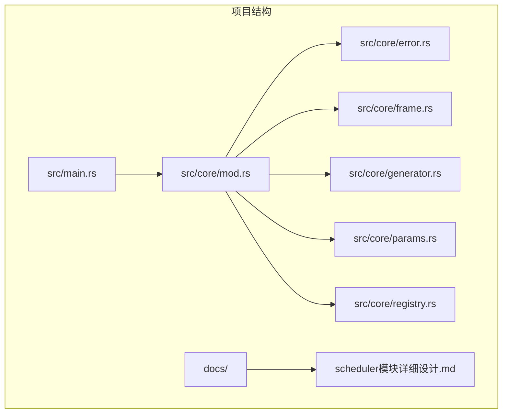

**图表来源**
- [main.rs:1-6](file://src/main.rs#L1-L6)
- [core/mod.rs:1-16](file://src/core/mod.rs#L1-L16)

**章节来源**
- [main.rs:1-6](file://src/main.rs#L1-L6)
- [core/mod.rs:1-16](file://src/core/mod.rs#L1-L16)

## 核心组件

### Manifest 数据结构

Manifest 是整个清单的核心结构，定义了完整的配置信息：

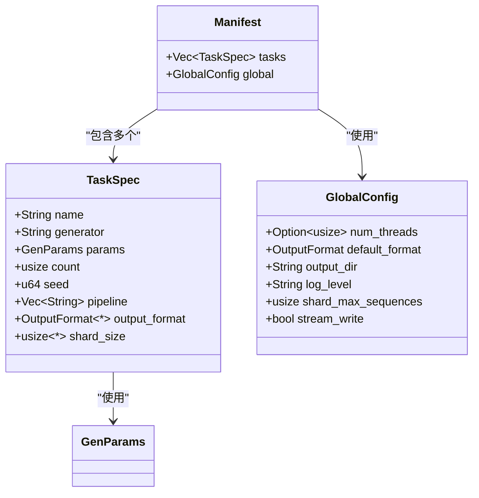

**图表来源**
- [scheduler模块详细设计.md:57-90](file://docs/scheduler模块详细设计.md#L57-L90)
- [core/params.rs:20-66](file://src/core/params.rs#L20-L66)

### TaskSpec 数据结构

TaskSpec 定义了单个任务的完整配置信息：

| 字段名 | 类型 | 必填 | 描述 |
|--------|------|------|------|
| name | String | 是 | 任务名称，用于元数据和日志标识 |
| generator | String | 是 | 生成器名称，必须在 GeneratorRegistry 中注册 |
| params | GenParams | 是 | 通用参数（序列长度、网格、扩展字段） |
| count | usize | 是 | 要生成的样本数量 |
| seed | u64 | 是 | 基础随机种子 |
| pipeline | Vec<String> | 否 | 后处理管道中的处理器名称列表 |
| output_format | Option<OutputFormat> | 否 | 输出格式，未指定则使用全局默认值 |
| shard_size | Option<usize> | 否 | 每个分片包含的最大样本数 |

**章节来源**
- [scheduler模块详细设计.md:67-90](file://docs/scheduler模块详细设计.md#L67-L90)

## 架构概览

StructGen-rs 的清单解析与校验架构采用分层设计，从底层的数据结构定义到上层的解析和校验逻辑：

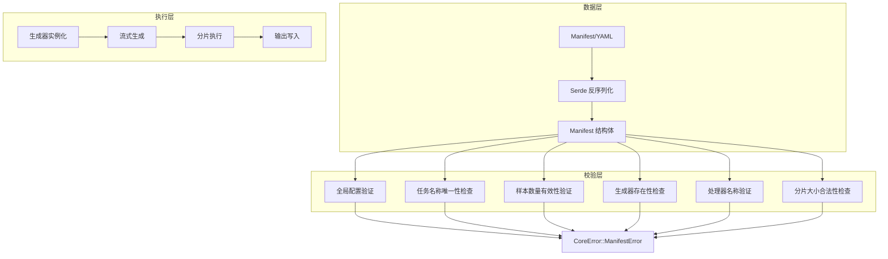

**图表来源**
- [scheduler模块详细设计.md:180-196](file://docs/scheduler模块详细设计.md#L180-L196)

## 详细组件分析

### YAML 解析流程

YAML 清单文件的解析过程遵循标准的 serde 工作流程：

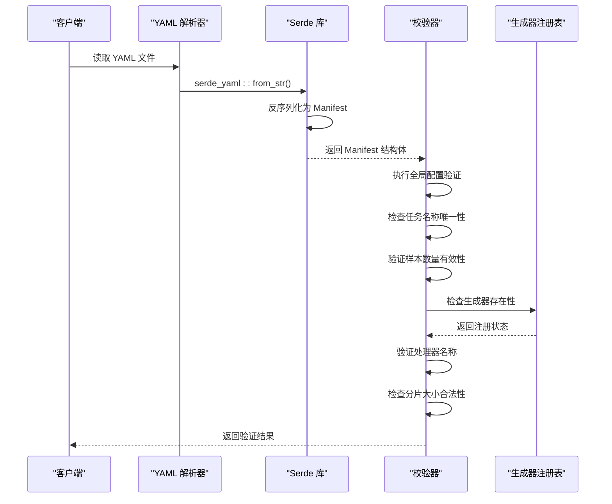

**图表来源**
- [scheduler模块详细设计.md:182-196](file://docs/scheduler模块详细设计.md#L182-L196)

### 校验机制详解

#### 全局配置验证

全局配置验证主要检查输出目录的可写性和基本配置的有效性：

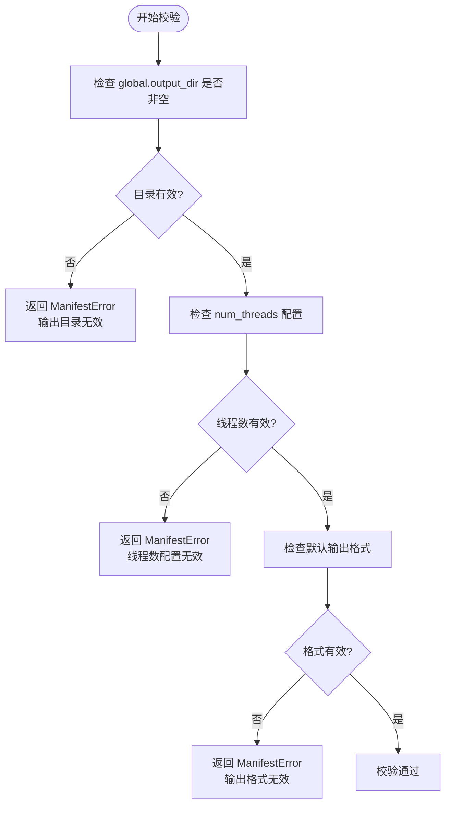

**图表来源**
- [scheduler模块详细设计.md:188-188](file://docs/scheduler模块详细设计.md#L188-L188)

#### 任务名称唯一性检查

系统确保每个任务的名称在整个清单中都是唯一的：

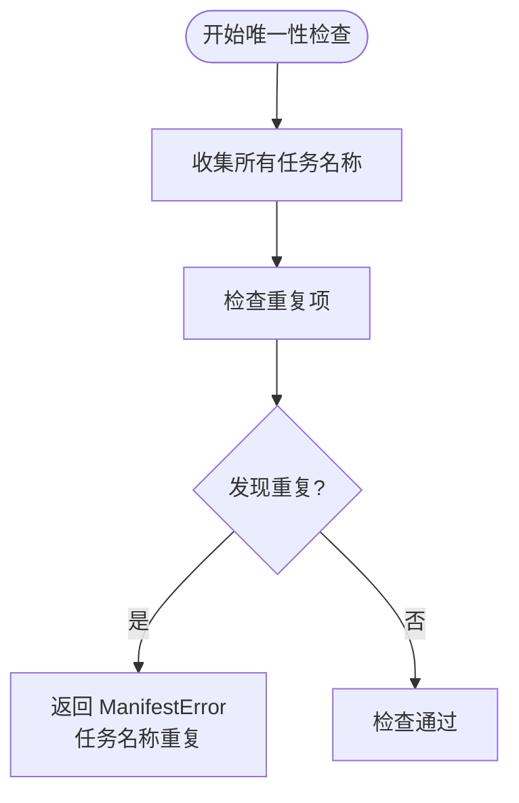

#### 样本数量有效性验证

样本数量验证确保每个任务至少需要生成一个样本：

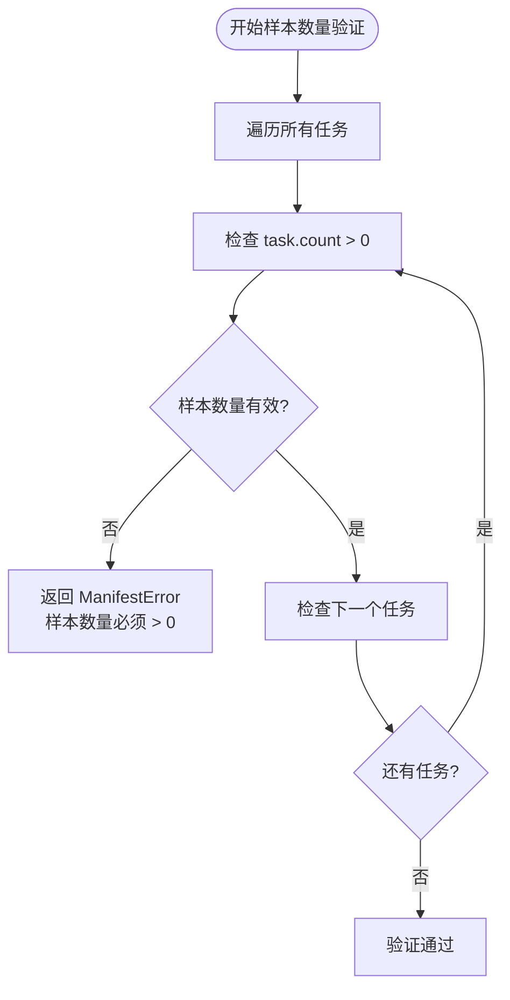

#### 生成器存在性检查

生成器检查确保所有引用的生成器都在注册表中注册：

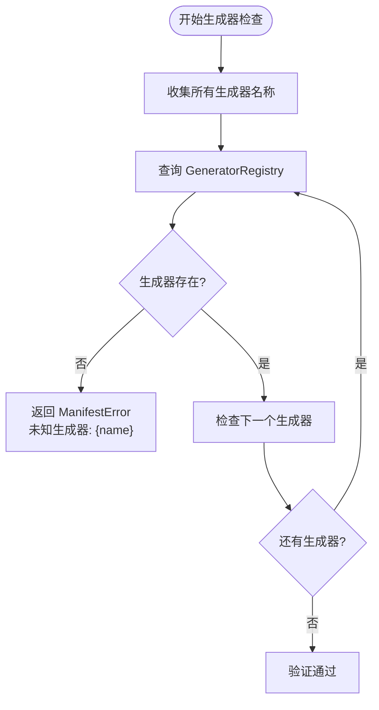

**图表来源**
- [scheduler模块详细设计.md:192-192](file://docs/scheduler模块详细设计.md#L192-L192)

#### 处理器名称验证

处理器验证检查管道中的每个处理器名称都存在于注册表中：

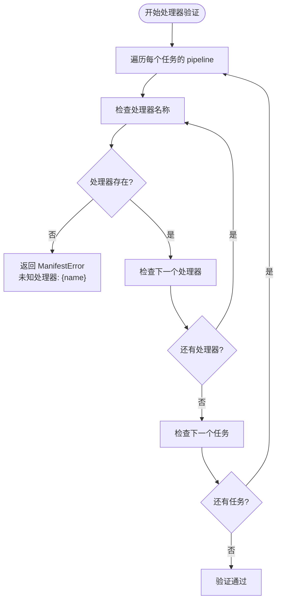

#### 分片大小合法性检查

分片大小验证确保指定的分片大小是正数：

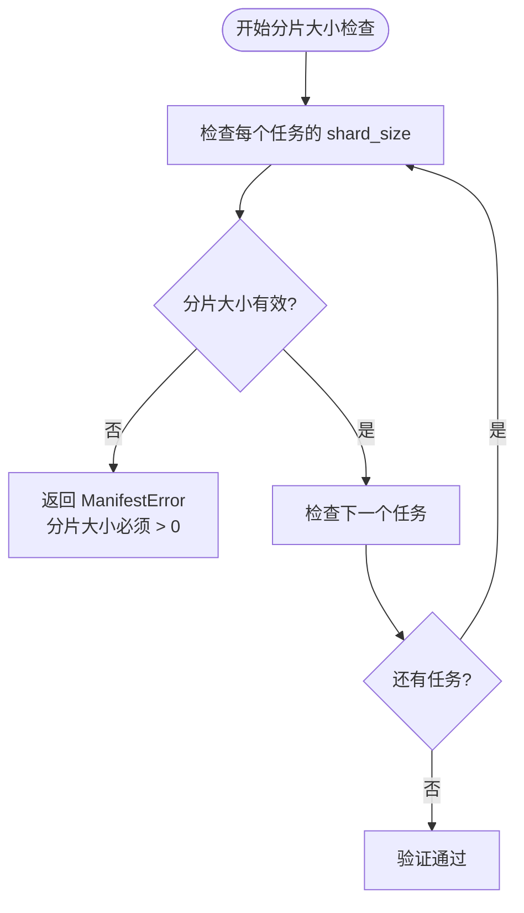

**章节来源**
- [scheduler模块详细设计.md:187-196](file://docs/scheduler模块详细设计.md#L187-L196)

### 错误处理策略

系统使用统一的错误处理机制，所有校验失败都会返回 `CoreError::ManifestError` 类型的错误：

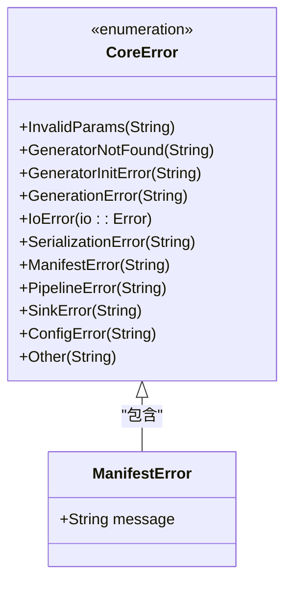

**图表来源**
- [core/error.rs:4-49](file://src/core/error.rs#L4-L49)

**章节来源**
- [core/error.rs:30-32](file://src/core/error.rs#L30-L32)

## 依赖关系分析

StructGen-rs 的依赖关系相对简洁，主要依赖于标准库和第三方 crate：

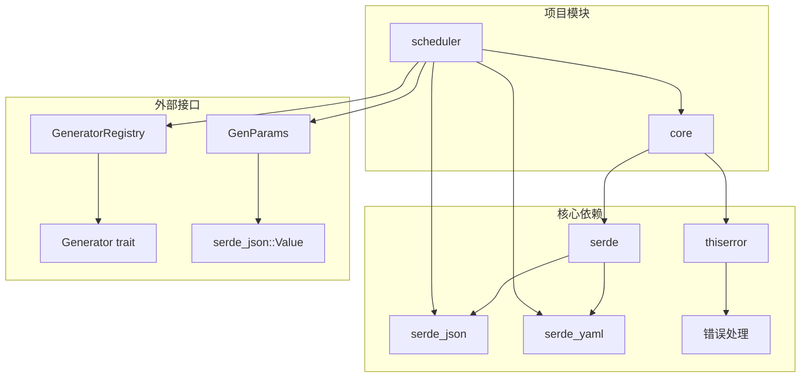

**图表来源**
- [Cargo.lock:54-85](file://Cargo.lock#L54-L85)
- [core/registry.rs:1-150](file://src/core/registry.rs#L1-L150)

**章节来源**
- [Cargo.lock:54-85](file://Cargo.lock#L54-L85)

## 性能考虑

清单解析与校验过程具有以下性能特征：

1. **内存效率**: 使用 serde 的零拷贝反序列化，减少内存分配
2. **并行处理**: 校验过程可以并行化处理多个任务
3. **早期失败**: 发现错误立即停止，避免不必要的后续处理
4. **缓存友好**: 生成器注册表使用 HashMap，提供 O(1) 查找性能

## 故障排除指南

### 常见错误类型及解决方案

| 错误类型 | 错误信息 | 可能原因 | 解决方案 |
|----------|----------|----------|----------|
| ManifestError | 输出目录无效 | output_dir 为空或不可写 | 设置有效的输出目录路径 |
| ManifestError | 任务名称重复 | 多个任务使用相同名称 | 为每个任务分配唯一名称 |
| ManifestError | 样本数量必须 > 0 | count 为 0 | 设置大于 0 的样本数量 |
| ManifestError | 未知生成器: {name} | 生成器未注册 | 确保生成器在启动时正确注册 |
| ManifestError | 未知处理器: {name} | 处理器名称拼写错误 | 检查处理器名称并确保正确注册 |
| ManifestError | 分片大小必须 > 0 | shard_size 为 0 | 设置大于 0 的分片大小 |

### 调试技巧

1. **启用详细日志**: 设置 `log_level` 为 "debug" 获取更多调试信息
2. **逐步验证**: 先验证全局配置，再验证任务配置
3. **单元测试**: 编写针对特定场景的测试用例
4. **配置备份**: 在修改配置前备份原始配置文件

**章节来源**
- [core/error.rs:30-49](file://src/core/error.rs#L30-L49)

## 结论

StructGen-rs 的清单解析与校验系统设计精良，具有以下特点：

1. **类型安全**: 使用 Rust 的强类型系统确保数据完整性
2. **模块化设计**: 清晰的模块分离便于维护和扩展
3. **全面校验**: 多层次的校验机制确保配置的有效性
4. **错误处理**: 统一的错误处理机制提供清晰的错误信息
5. **性能优化**: 高效的算法和数据结构保证良好的性能表现

该系统为结构化数据生成提供了可靠的基础，通过严格的配置验证确保生成过程的稳定性和可预测性。

## 附录

### YAML 配置示例

以下是一个完整的 YAML 配置示例：

```yaml
global:
  num_threads: 4
  default_format: Parquet
  output_dir: ./output
  log_level: info
  shard_max_sequences: 10000
  stream_write: true

tasks:
  - name: cellular_automaton
    generator: cellular_automaton
    params:
      seq_length: 100
      grid_size:
        rows: 10
        cols: 10
      extensions:
        rule: 30
    count: 1000
    seed: 42
    pipeline:
      - normalize
      - filter
    output_format: Parquet
    shard_size: 100
```

### 校验规则总结

1. **全局配置**: output_dir 必须存在且可写，num_threads > 0
2. **任务配置**: name 唯一，count > 0，generator 存在，pipeline 中的处理器存在
3. **分片配置**: shard_size > 0（如果指定）
4. **生成器配置**: generator 必须在 GeneratorRegistry 中注册