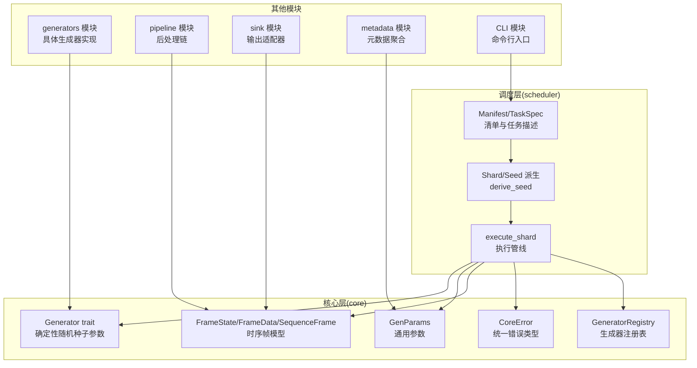
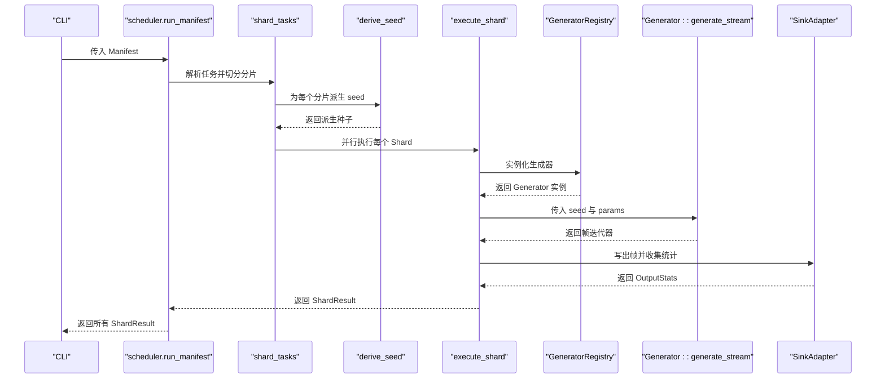
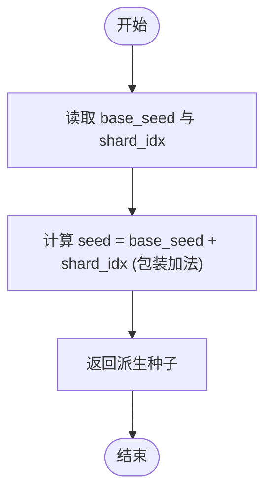
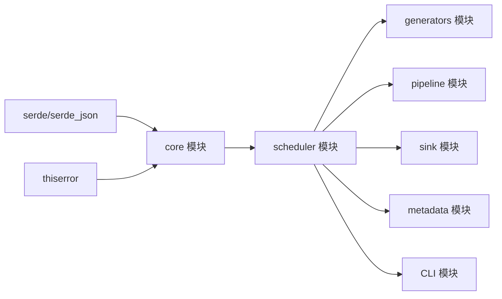

# 种子派生与确定性

<cite>
**本文引用的文件**
- [src/main.rs](file://src/main.rs)
- [src/core/mod.rs](file://src/core/mod.rs)
- [src/core/generator.rs](file://src/core/generator.rs)
- [src/core/params.rs](file://src/core/params.rs)
- [src/core/frame.rs](file://src/core/frame.rs)
- [src/core/error.rs](file://src/core/error.rs)
- [src/core/registry.rs](file://src/core/registry.rs)
- [docs/scheduler模块详细设计.md](file://docs/scheduler模块详细设计.md)
- [docs/core模块详细设计.md](file://docs/core模块详细设计.md)
- [Cargo.toml](file://Cargo.toml)
</cite>

## 目录
1. [简介](#简介)
2. [项目结构](#项目结构)
3. [核心组件](#核心组件)
4. [架构总览](#架构总览)
5. [详细组件分析](#详细组件分析)
6. [依赖分析](#依赖分析)
7. [性能考量](#性能考量)
8. [故障排查指南](#故障排查指南)
9. [结论](#结论)
10. [附录](#附录)

## 简介
本文件聚焦 StructGen-rs 的“种子派生与确定性”机制，围绕调度层提供的确定性种子派生函数 derive_seed 展开，系统阐述其设计思想、数学原理、安全性与冲突规避策略，并结合项目现有实现说明如何通过种子确保结果可重现。同时给出高级派生方案（如基于 SipHash 的哈希方法）与最佳实践、调试技巧，帮助读者在实际工程中可靠地管理种子空间。

## 项目结构
仓库采用模块化分层设计：
- core 模块：定义公共数据类型与核心接口（帧、参数、生成器 trait、错误类型、注册表等），不包含业务逻辑。
- scheduler 模块：负责清单解析、分片切分、并行执行、种子派生与容错。
- 其他模块（generators、pipeline、sink、metadata、CLI）均依赖 core 模块，遵循自底向上的单向依赖。

图表来源
- [docs/core模块详细设计.md:420-433](file://docs/core模块详细设计.md#L420-L433)
- [docs/scheduler模块详细设计.md:326-335](file://docs/scheduler模块详细设计.md#L326-L335)

章节来源
- [src/core/mod.rs:1-16](file://src/core/mod.rs#L1-L16)
- [docs/core模块详细设计.md:1-553](file://docs/core模块详细设计.md#L1-L553)
- [docs/scheduler模块详细设计.md:1-528](file://docs/scheduler模块详细设计.md#L1-L528)

## 核心组件
- 确定性随机种子参数：Generator trait 的 generate_stream(seed, params) 明确要求 seed 为 u64，作为生成器的初始状态与随机性注入来源。
- 种子派生函数：derive_seed(base_seed, shard_idx) 以确定性方式为每个分片派生唯一种子，确保不同分片、不同任务之间不冲突。
- 分片与执行：scheduler 将任务样本按分片策略切分，为每个 Shard 派生 seed，并在 rayon 并行区域中执行 generate_stream(seed, params)。
- 可重现性保障：相同的清单 + 相同二进制 → 逐比特一致的输出，所有随机性仅来自分片种子。

章节来源
- [src/core/generator.rs:32-40](file://src/core/generator.rs#L32-L40)
- [docs/scheduler模块详细设计.md:156-176](file://docs/scheduler模块详细设计.md#L156-L176)
- [docs/scheduler模块详细设计.md:200-226](file://docs/scheduler模块详细设计.md#L200-L226)

## 架构总览
下图展示从清单到分片执行的关键流程，重点标注种子派生与确定性随机性的位置。

图表来源
- [docs/scheduler模块详细设计.md:136-154](file://docs/scheduler模块详细设计.md#L136-L154)
- [docs/scheduler模块详细设计.md:200-226](file://docs/scheduler模块详细设计.md#L200-L226)
- [docs/scheduler模块详细设计.md:230-278](file://docs/scheduler模块详细设计.md#L230-L278)

## 详细组件分析

### 确定性随机性与种子机制
- 概念与重要性
  - 确定性随机性指：在相同输入条件下，每次运行产生完全一致的结果。种子是唯一可变的输入，决定了随机性注入的起点。
  - 在 StructGen-rs 中，种子通过 Generator::generate_stream(seed, params) 传入，确保生成器的初始状态与随机性一致。
- 可重现性保障
  - 相同清单 + 相同二进制 → 逐比特一致输出。随机性来源仅限于分片种子，且种子派生为确定性函数。
- 与分片的关系
  - 每个分片拥有唯一种子，避免不同分片之间的状态相互干扰，同时保证分片间结果可拼接且不冲突。

章节来源
- [docs/scheduler模块详细设计.md:20-27](file://docs/scheduler模块详细设计.md#L20-L27)
- [src/core/generator.rs:32-40](file://src/core/generator.rs#L32-L40)

### derive_seed 函数：实现原理与设计思想
- 函数签名与行为
  - 输入：base_seed（任务基础种子）、shard_idx（分片索引，从 0 开始）
  - 输出：派生后的唯一种子
  - 派生规则：seed = base_seed.wrapping_add(shard_idx as u64)
- 设计思想
  - 简洁确定性：使用包装加法，确保不同分片、不同任务之间的种子不冲突。
  - 无分支逻辑：纯算术运算，易于测试与推理。
  - 可扩展性：当需要更强的冲突规避时，可替换为哈希方法（见下一节）。

图表来源
- [docs/scheduler模块详细设计.md:156-176](file://docs/scheduler模块详细设计.md#L156-L176)

章节来源
- [docs/scheduler模块详细设计.md:156-176](file://docs/scheduler模块详细设计.md#L156-L176)

### 数学原理与安全性：包装加法（wrapping_add）
- 包装加法的性质
  - 对于无符号整数，wrapping_add 在溢出时采用模 2^64 的环形加法，保证结果始终为 64 位无符号整数。
  - 优点：确定性、可逆性（在环内），不会抛异常或返回错误。
  - 安全性考虑
    - 溢出是预期行为，不会导致崩溃或未定义行为。
    - 若两个分片的 shard_idx 差值过大，仍可能产生重复种子（例如 base_seed 与 (base_seed + N) 模 2^64 相等），但概率极低。
    - 更严格的冲突规避建议使用哈希方法（见“高级派生方案”）。

章节来源
- [docs/scheduler模块详细设计.md:159-162](file://docs/scheduler模块详细设计.md#L159-L162)

### 种子冲突避免策略
- 基础策略（当前实现）
  - 使用包装加法，确保相邻分片种子不同；不同任务使用不同 base_seed，进一步降低冲突概率。
- 高级策略（建议）
  - 使用 SipHash 对三元组 (base_seed, task_name, shard_idx) 哈希，得到 u64 种子。该方法具备更强的抗冲突能力，尤其在大量任务与分片场景下更稳健。
  - 注意：替换为哈希方法时，需保持派生函数的确定性与幂等性，并在文档与测试中明确约定。

章节来源
- [docs/scheduler模块详细设计.md:164-165](file://docs/scheduler模块详细设计.md#L164-L165)

### 高级派生方案：SipHash 哈希方法
- 方案说明
  - 对 (base_seed, task_name, shard_idx) 进行哈希，输出 u64 作为种子。
  - 优势：显著降低冲突概率，适合大规模、多任务、多分片场景。
- 实施要点
  - 保持输入元组的稳定性（字符串编码、字节序等）。
  - 在单元测试中固定用例，验证派生结果的确定性与一致性。
  - 文档与注释中明确说明派生算法变更的影响范围。

章节来源
- [docs/scheduler模块详细设计.md:164-165](file://docs/scheduler模块详细设计.md#L164-L165)

### 种子管理最佳实践
- 任务级种子
  - 每个任务设置唯一的 base_seed，避免不同任务之间产生种子重叠。
- 分片级种子
  - 使用 derive_seed 为每个分片派生种子，确保分片间互不影响。
- 可重现性验证
  - 保存清单与二进制，多次运行应得到完全一致的 ShardResult。
- 并发与隔离
  - 每个分片拥有私有输出适配器，写入独立文件，避免锁竞争与 IO 冲突。
- 错误处理
  - 单个分片失败不影响整体运行，失败信息记录在 ShardResult 中，便于定位问题。

章节来源
- [docs/scheduler模块详细设计.md:413-419](file://docs/scheduler模块详细设计.md#L413-L419)
- [docs/scheduler模块详细设计.md:305-322](file://docs/scheduler模块详细设计.md#L305-L322)

### 调试技巧
- 单元测试
  - 验证 derive_seed 的确定性：相同输入始终产生相同输出。
  - 边界测试：最大 u64 值与 0 的组合，确认包装加法行为符合预期。
- 集成测试
  - 使用 mock 生成器（固定产出帧），验证分片数量与样本总数一致。
  - 注入会 panic 的 mock 生成器，验证其他分片正常完成，失败的 ShardResult 记录错误。
  - 流式写出模式：检查分片间输出文件命名与种子的一致性。
- 日志与统计
  - 记录每个 Shard 的 seed、sample_count、输出统计，便于复现与对比。

章节来源
- [docs/scheduler模块详细设计.md:420-470](file://docs/scheduler模块详细设计.md#L420-L470)

## 依赖分析
- 核心依赖
  - core 模块提供 Generator trait、GenParams、FrameState/SequenceFrame、CoreError、GeneratorRegistry 等基础类型与契约。
  - scheduler 模块依赖 core 的接口，实现清单解析、分片切分、种子派生与执行。
- 外部依赖
  - 项目使用 serde、serde_json、thiserror 等基础库，不引入领域特定依赖，保证 core 的纯净性。

图表来源
- [Cargo.toml:6-10](file://Cargo.toml#L6-L10)
- [docs/core模块详细设计.md:435-442](file://docs/core模块详细设计.md#L435-L442)

章节来源
- [Cargo.toml:1-10](file://Cargo.toml#L1-L10)
- [docs/core模块详细设计.md:420-442](file://docs/core模块详细设计.md#L420-L442)

## 性能考量
- 包装加法的零开销：derive_seed 为纯算术运算，无堆分配与锁竞争，热路径性能优异。
- 并行执行：分片数量通常为 CPU 核心数的 2–4 倍，利用 rayon 工作窃取调度平衡负载。
- 零堆分配的热路径：execute_shard 的迭代循环避免在帧级别做堆分配，迭代器传递栈上的 SequenceFrame。
- 分片粒度控制：过小的分片导致过多线程调度开销；默认分片大小不应小于 100 个样本。

章节来源
- [docs/scheduler模块详细设计.md:413-419](file://docs/scheduler模块详细设计.md#L413-L419)

## 故障排查指南
- 清单解析与校验
  - ManifestError：YAML 格式、字段缺失、值非法；立即返回错误，终止运行。
  - GeneratorNotFound：未注册的生成器名；立即返回错误，提示可用生成器列表。
  - InvalidParams：参数越界；立即返回错误，详细指出不合法参数。
- 单个分片执行
  - GenerationError、PipelineError、SinkError：捕获并记录在 ShardResult.error 中，继续执行其他分片。
  - IoError：磁盘满等系统错误；清理资源后报错退出。
- 确认可重现性
  - 相同清单运行两次，ShardResult 完全一致；若不一致，检查 seed 派生与生成器内部随机源是否受外部环境影响。

章节来源
- [docs/scheduler模块详细设计.md:382-394](file://docs/scheduler模块详细设计.md#L382-L394)
- [docs/core模块详细设计.md:455-476](file://docs/core模块详细设计.md#L455-L476)

## 结论
StructGen-rs 通过在 Generator trait 中显式传入 u64 种子，并在调度层以确定性的方式为每个分片派生种子，实现了完全可重现的随机性注入。当前实现采用包装加法，简洁可靠；在更高要求的场景下，可升级为基于 SipHash 的哈希派生方案以进一步降低冲突风险。配合完善的容错与测试策略，种子派生与确定性机制为大规模数据生成提供了坚实基础。

## 附录
- 相关接口与类型
  - Generator::generate_stream(seed, params)：生成器主接口，seed 为确定性随机种子。
  - GenParams：通用参数载体，承载扩展字段与公共配置。
  - SequenceFrame/FrameState：时序帧与状态值模型，统一承载整数、浮点与布尔状态。
  - CoreError：统一错误类型，收敛各模块错误语义。

章节来源
- [src/core/generator.rs:32-40](file://src/core/generator.rs#L32-L40)
- [src/core/params.rs:68-87](file://src/core/params.rs#L68-L87)
- [src/core/frame.rs:3-50](file://src/core/frame.rs#L3-L50)
- [src/core/error.rs:4-49](file://src/core/error.rs#L4-L49)