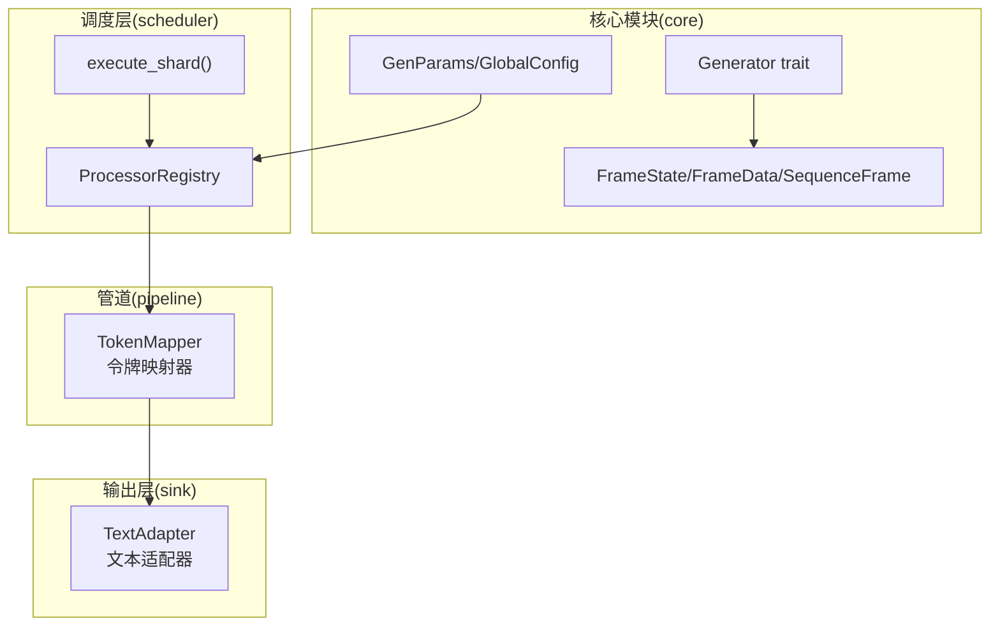
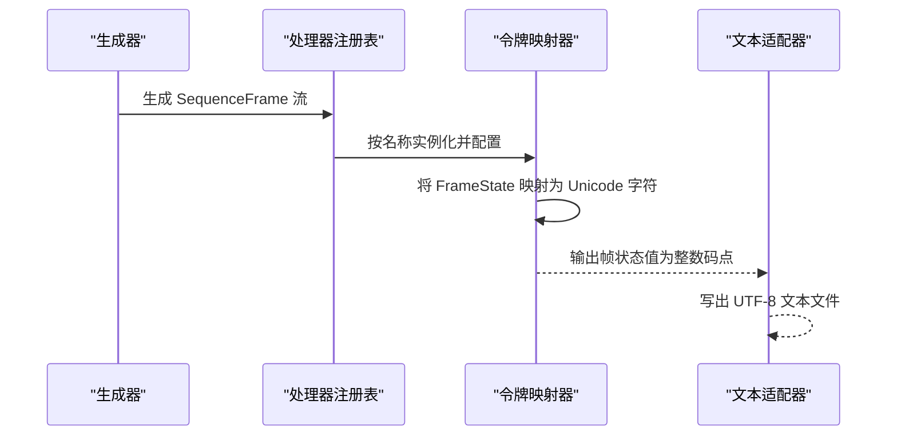
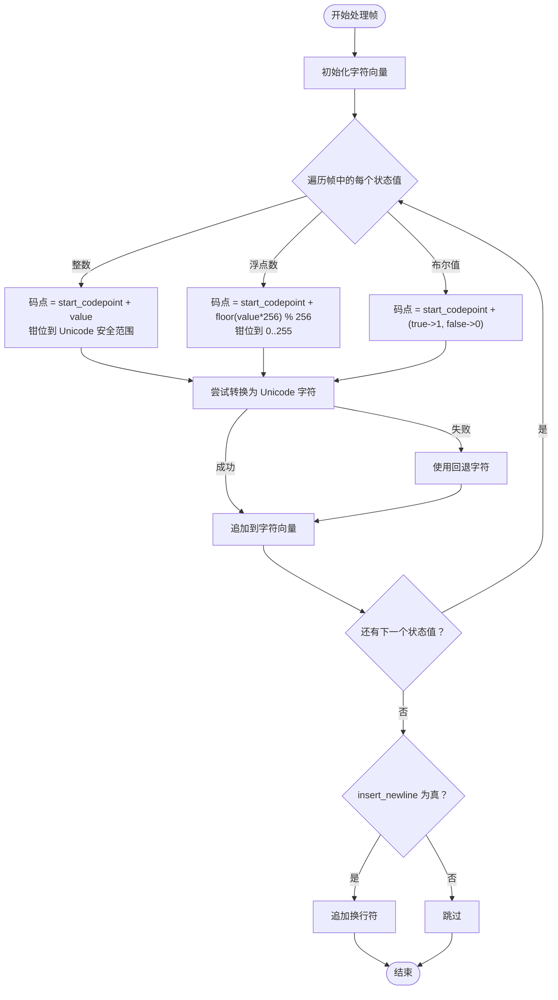
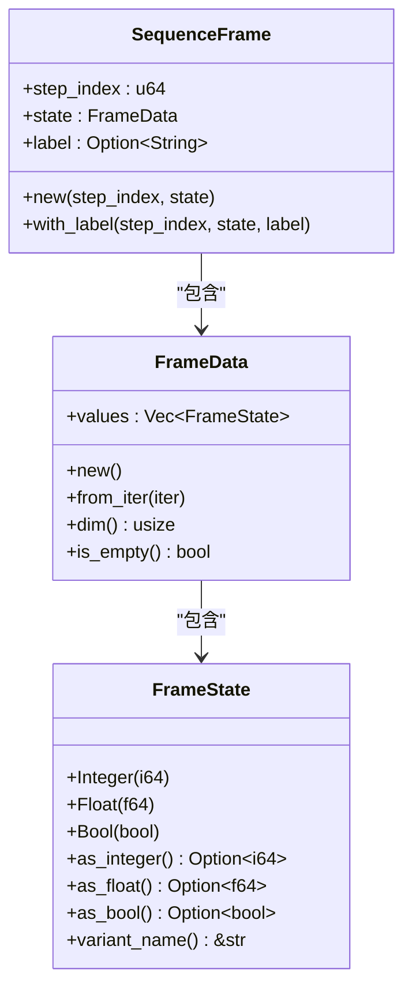
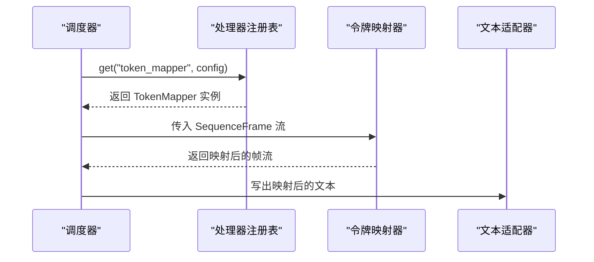
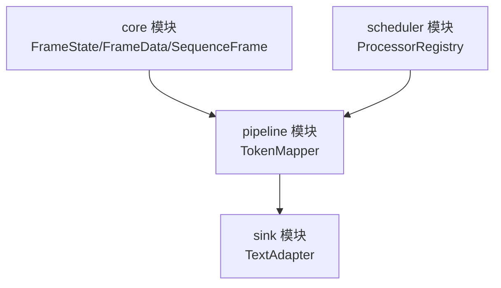

# 令牌映射器

<cite>
**本文档引用的文件**
- [pipeline模块详细设计.md](file://docs/pipeline模块详细设计.md)
- [sink模块详细设计.md](file://docs/sink模块详细设计.md)
- [scheduler模块详细设计.md](file://docs/scheduler模块详细设计.md)
- [core模块详细设计.md](file://docs/core模块详细设计.md)
- [frame.rs](file://src/core/frame.rs)
- [params.rs](file://src/core/params.rs)
- [generator.rs](file://src/core/generator.rs)
- [main.rs](file://src/main.rs)
</cite>

## 目录
1. [简介](#简介)
2. [项目结构](#项目结构)
3. [核心组件](#核心组件)
4. [架构总览](#架构总览)
5. [详细组件分析](#详细组件分析)
6. [依赖分析](#依赖分析)
7. [性能考虑](#性能考虑)
8. [故障排除指南](#故障排除指南)
9. [结论](#结论)
10. [附录](#附录)

## 简介
本文件针对 StructGen-rs 的令牌映射器处理器（TokenMapper）提供系统化、可操作的技术文档。令牌映射器的核心目标是将已离散化的整数值映射为 Unicode 字符，从而让结构化的时间序列数据能够直接作为语言模型的文本输入。文档将深入解释映射算法（包括起始码点设置、整数到 Unicode 码点的转换、浮点数的量化映射、布尔值的二进制映射以及字符钳位机制），并说明配置参数（如 start_codepoint 起始码点、insert_newline 换行符插入选项）的作用。此外，文档还涵盖 Unicode 安全性考虑（码点范围限制与回退字符处理），并提供具体的使用示例，展示如何通过配置不同的起始码点来适配不同的字符集需求。

## 项目结构
令牌映射器属于 StructGen-rs 的后处理管道（pipeline）模块的一部分，位于 docs 目录下的“pipeline模块详细设计”中。其与核心数据结构（SequenceFrame、FrameState）紧密耦合，并与下游的文本输出适配器（TextAdapter）协同工作，将映射后的整数值最终写出为 UTF-8 文本文件。

**图表来源**
- [pipeline模块详细设计.md: 356-375:356-375](file://docs/pipeline模块详细设计.md#L356-L375)
- [sink模块详细设计.md: 292-327:292-327](file://docs/sink模块详细设计.md#L292-L327)
- [frame.rs: 1-210:1-210](file://src/core/frame.rs#L1-L210)
- [params.rs: 68-123:68-123](file://src/core/params.rs#L68-L123)
- [generator.rs: 9-56:9-56](file://src/core/generator.rs#L9-L56)

**章节来源**
- [pipeline模块详细设计.md: 356-375:356-375](file://docs/pipeline模块详细设计.md#L356-L375)
- [sink模块详细设计.md: 292-327:292-327](file://docs/sink模块详细设计.md#L292-L327)
- [frame.rs: 1-210:1-210](file://src/core/frame.rs#L1-L210)
- [params.rs: 68-123:68-123](file://src/core/params.rs#L68-L123)
- [generator.rs: 9-56:9-56](file://src/core/generator.rs#L9-L56)

## 核心组件
- 令牌映射器（TokenMapper）：将帧中的状态值（整数、浮点数、布尔值）映射为 Unicode 字符，支持在每帧末尾插入换行符，并对超出 Unicode 范围的码点进行钳位处理。
- 处理器注册表（ProcessorRegistry）：按名称实例化处理器，令牌映射器通过注册表在调度阶段被动态加载。
- 文本适配器（TextAdapter）：将令牌映射器产生的整数值（作为 Unicode 码点）写出为 UTF-8 文本文件。
- 核心数据结构：FrameState（承载整数、浮点数、布尔值）、FrameData（帧状态集合）、SequenceFrame（时间步快照）。

**章节来源**
- [pipeline模块详细设计.md: 303-325:303-325](file://docs/pipeline模块详细设计.md#L303-L325)
- [sink模块详细设计.md: 192-231:192-231](file://docs/sink模块详细设计.md#L192-L231)
- [frame.rs: 3-50:3-50](file://src/core/frame.rs#L3-L50)

## 架构总览
令牌映射器在 StructGen-rs 的数据流中处于“生成→后处理→写出”的中间环节。生成器产出 SequenceFrame，经由处理器注册表按顺序实例化后处理管道（如标准化、去重、差分编码、令牌映射），最后由文本适配器将映射后的整数值写出为文本文件。

**图表来源**
- [pipeline模块详细设计.md: 364-375:364-375](file://docs/pipeline模块详细设计.md#L364-L375)
- [sink模块详细设计.md: 208-231:208-231](file://docs/sink模块详细设计.md#L208-L231)

**章节来源**
- [pipeline模块详细设计.md: 364-375:364-375](file://docs/pipeline模块详细设计.md#L364-L375)
- [sink模块详细设计.md: 208-231:208-231](file://docs/sink模块详细设计.md#L208-L231)

## 详细组件分析

### 令牌映射器配置与参数
- start_codepoint：映射起始 Unicode 码点，默认值为 CJK 统一汉字起始码点，允许用户根据目标字符集调整起始位置。
- insert_newline：是否在每帧末尾插入换行符，便于语言模型按行读取。

这些配置通过处理器注册表在调度阶段从任务参数中反序列化并传递给令牌映射器。

**章节来源**
- [pipeline模块详细设计.md: 168-177:168-177](file://docs/pipeline模块详细设计.md#L168-L177)
- [pipeline模块详细设计.md: 471-491:471-491](file://docs/pipeline模块详细设计.md#L471-L491)

### 映射算法与数据类型策略
令牌映射器针对不同数据类型采用不同的映射策略：

- 整数（Integer）
  - 算法：将整数值与起始码点相加，得到目标码点；为确保在 Unicode 安全范围内，对码点进行钳位至最大安全范围。
  - 复杂度：O(d)，其中 d 为帧的状态维度。
- 浮点数（Float）
  - 算法：将浮点数缩放到 0-255 的整数范围，再与起始码点相加得到码点；同样进行钳位处理。
  - 复杂度：O(d)。
- 布尔值（Bool）
  - 算法：将布尔值映射为 0 或 1，再与起始码点相加得到码点。
  - 复杂度：O(d)。

字符钳位机制：当计算得到的码点超出 Unicode 安全范围时，使用钳位函数将其约束在有效范围内；若无法转换为有效的 Unicode 字符，则使用回退字符替代。

**图表来源**
- [pipeline模块详细设计.md: 307-325:307-325](file://docs/pipeline模块详细设计.md#L307-L325)

**章节来源**
- [pipeline模块详细设计.md: 307-325:307-325](file://docs/pipeline模块详细设计.md#L307-L325)

### Unicode 安全性与回退字符处理
- 码点范围限制：整数映射时对最终码点进行钳位，确保不超过 Unicode 安全上限；浮点数映射时先将值缩放到 0-255 的范围，再与起始码点相加，避免溢出。
- 回退字符：当无法将码点转换为有效的 Unicode 字符时，使用回退字符替代，保证输出稳定且不会中断。
- 下游适配器一致性：文本适配器在写出时也对无效码点进行钳位处理，确保最终输出为合法 UTF-8 文本。

**章节来源**
- [pipeline模块详细设计.md: 388-394:388-394](file://docs/pipeline模块详细设计.md#L388-L394)
- [sink模块详细设计.md: 343-351:343-351](file://docs/sink模块详细设计.md#L343-L351)

### 与核心数据结构的关系
令牌映射器依赖于核心模块中的 FrameState、FrameData 和 SequenceFrame 数据结构，以统一承载整数、浮点数和布尔值状态，并在单个时间步内进行映射处理。

**图表来源**
- [frame.rs: 3-50:3-50](file://src/core/frame.rs#L3-L50)
- [frame.rs: 52-87:52-87](file://src/core/frame.rs#L52-L87)
- [frame.rs: 89-118:89-118](file://src/core/frame.rs#L89-L118)

**章节来源**
- [frame.rs: 3-50:3-50](file://src/core/frame.rs#L3-L50)
- [frame.rs: 52-87:52-87](file://src/core/frame.rs#L52-L87)
- [frame.rs: 89-118:89-118](file://src/core/frame.rs#L89-L118)

### 与调度器和处理器注册表的集成
令牌映射器通过处理器注册表按名称实例化，配置从任务参数的扩展字段中提取。调度器在执行每个分片时，会按照任务清单中的管道顺序依次应用处理器。

**图表来源**
- [pipeline模块详细设计.md: 85-117:85-117](file://docs/pipeline模块详细设计.md#L85-L117)
- [pipeline模块详细设计.md: 364-375:364-375](file://docs/pipeline模块详细设计.md#L364-L375)

**章节来源**
- [pipeline模块详细设计.md: 85-117:85-117](file://docs/pipeline模块详细设计.md#L85-L117)
- [pipeline模块详细设计.md: 364-375:364-375](file://docs/pipeline模块详细设计.md#L364-L375)

### 使用示例与配置建议
- 配置起始码点以适配不同字符集：
  - CJK 统一汉字：使用默认起始码点，适合中文等东亚文字。
  - 阿拉伯文/希伯来文：可选择相应脚本的起始码点，确保映射后的字符在目标语言环境中可读。
  - 数字与符号：可将起始码点设为数字或标点符号区域，便于构建特定领域的文本表示。
- 插入换行符：启用 insert_newline 可使每帧对应一行，便于语言模型按行训练或评估。
- 示例清单片段（来源于设计文档）展示了如何在任务参数中配置令牌映射器的起始码点。

**章节来源**
- [pipeline模块详细设计.md: 168-177:168-177](file://docs/pipeline模块详细设计.md#L168-L177)
- [pipeline模块详细设计.md: 471-491:471-491](file://docs/pipeline模块详细设计.md#L471-L491)

## 依赖分析
令牌映射器与以下模块存在直接依赖关系：
- 核心模块（core）：依赖 FrameState、FrameData、SequenceFrame 以获取状态值并进行映射。
- 调度层（scheduler）：通过处理器注册表按名称实例化令牌映射器，并在执行分片时驱动处理流程。
- 输出层（sink）：文本适配器负责将映射后的整数值写出为 UTF-8 文本文件，确保最终输出的合法性与稳定性。

**图表来源**
- [frame.rs: 1-210:1-210](file://src/core/frame.rs#L1-L210)
- [pipeline模块详细设计.md: 356-375:356-375](file://docs/pipeline模块详细设计.md#L356-L375)
- [sink模块详细设计.md: 292-327:292-327](file://docs/sink模块详细设计.md#L292-L327)

**章节来源**
- [frame.rs: 1-210:1-210](file://src/core/frame.rs#L1-L210)
- [pipeline模块详细设计.md: 356-375:356-375](file://docs/pipeline模块详细设计.md#L356-L375)
- [sink模块详细设计.md: 292-327:292-327](file://docs/sink模块详细设计.md#L292-L327)

## 性能考虑
- 迭代器零成本抽象：令牌映射器以惰性迭代器形式实现，避免中间收集，降低内存占用。
- 内存局部性：按帧顺序处理，状态值逐一映射，具有良好的缓存局部性。
- Unicode 转换成本：字符转换与钳位操作为常数时间，整体复杂度为 O(d)。
- 下游写出优化：文本适配器使用缓冲写入，减少系统调用次数，提升吞吐量。

**章节来源**
- [pipeline模块详细设计.md: 396-402:396-402](file://docs/pipeline模块详细设计.md#L396-L402)
- [sink模块详细设计.md: 355-361:355-361](file://docs/sink模块详细设计.md#L355-L361)

## 故障排除指南
- 映射后字符不可见或显示为回退字符：
  - 检查起始码点是否与目标字符集匹配；适当调整 start_codepoint。
  - 确认 insert_newline 设置是否符合预期。
- 输出文件包含无效 Unicode：
  - 确保映射后的码点在 Unicode 安全范围内；令牌映射器与文本适配器均具备钳位与回退机制，但仍建议检查上游数据范围。
- 处理器配置反序列化失败：
  - 检查任务参数中扩展字段的 JSON 格式；确保令牌映射器配置键名正确。
- 处理器名称未注册：
  - 在调度阶段由注册表校验处理器名称；确认清单中处理器名称与注册表一致。

**章节来源**
- [pipeline模块详细设计.md: 388-394:388-394](file://docs/pipeline模块详细设计.md#L388-L394)
- [sink模块详细设计.md: 343-351:343-351](file://docs/sink模块详细设计.md#L343-L351)

## 结论
令牌映射器通过将离散化的整数值映射为 Unicode 字符，实现了结构化时间序列数据与语言模型输入格式的无缝对接。其针对整数、浮点数与布尔值的不同映射策略，配合起始码点与换行符的灵活配置，能够适配多种字符集与应用场景。结合调度器的注册表机制与文本适配器的稳健写出策略，令牌映射器在保证性能的同时，确保了输出的合法性与可读性。

## 附录
- 相关模块与文件：
  - 令牌映射器与处理器注册表的设计文档：[pipeline模块详细设计.md](file://docs/pipeline模块详细设计.md)
  - 文本适配器与输出策略：[sink模块详细设计.md](file://docs/sink模块详细设计.md)
  - 调度器与执行流程：[scheduler模块详细设计.md](file://docs/scheduler模块详细设计.md)
  - 核心数据结构定义：[frame.rs](file://src/core/frame.rs)、[params.rs](file://src/core/params.rs)、[generator.rs](file://src/core/generator.rs)
  - 主程序入口：[main.rs](file://src/main.rs)