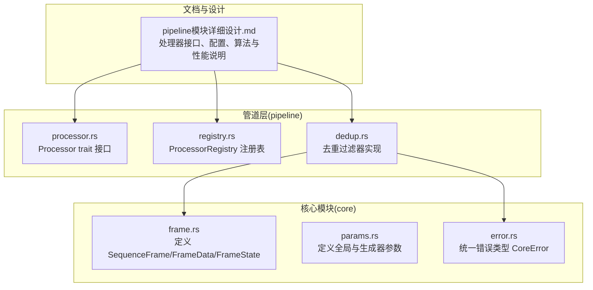
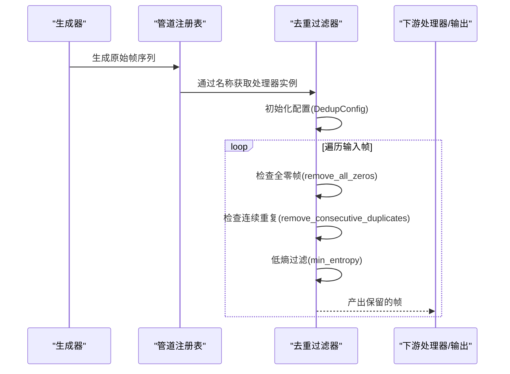
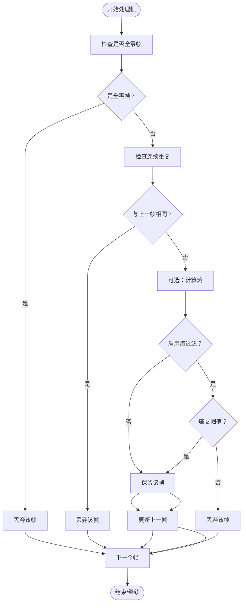
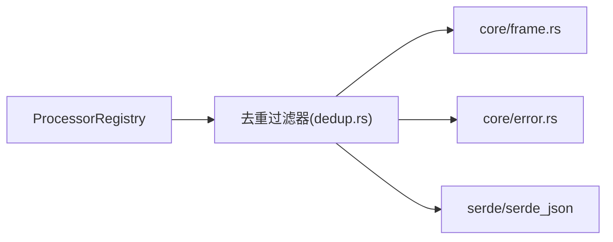

# 去重过滤器

<cite>
**本文档引用的文件**
- [pipeline模块详细设计.md](file://docs/pipeline模块详细设计.md)
- [frame.rs](file://src/core/frame.rs)
- [params.rs](file://src/core/params.rs)
- [Cargo.toml](file://Cargo.toml)
</cite>

## 目录
1. [简介](#简介)
2. [项目结构](#项目结构)
3. [核心组件](#核心组件)
4. [架构总览](#架构总览)
5. [详细组件分析](#详细组件分析)
6. [依赖分析](#依赖分析)
7. [性能考虑](#性能考虑)
8. [故障排除指南](#故障排除指南)
9. [结论](#结论)
10. [附录](#附录)

## 简介
本文件针对 StructGen-rs 的“去重过滤器”处理器进行系统化技术文档整理。该处理器负责在后处理管道中移除冗余帧，包括：
- 连续重复帧（前后帧状态完全相同）
- 全零帧（所有状态值均为零）
- 可选的低熵帧过滤（基于香农熵估计）

文档将详细解释算法实现、配置参数作用、熵估计细节（直方图构建、香农熵计算、归一化）、性能特征（O(1) 内存开销、单帧回溯优化），并提供使用示例与最佳实践。

## 项目结构
去重过滤器属于后处理管道层（pipeline）的一部分，其接口与配置定义位于设计文档中，并依赖 core 模块提供的帧数据结构与错误类型。

图表来源
- [pipeline模块详细设计.md: 35-51:35-51](file://docs/pipeline模块详细设计.md#L35-L51)
- [frame.rs: 52-98:52-98](file://src/core/frame.rs#L52-L98)
- [params.rs: 20-66:20-66](file://src/core/params.rs#L20-L66)

章节来源
- [pipeline模块详细设计.md: 1-L52:1-52](file://docs/pipeline模块详细设计.md#L1-L52)
- [frame.rs: 1-L118:1-118](file://src/core/frame.rs#L1-L118)
- [params.rs: 1-L80:1-80](file://src/core/params.rs#L1-L80)

## 核心组件
- 去重过滤器配置（DedupConfig）
  - remove_consecutive_duplicates：是否移除连续重复帧
  - remove_all_zeros：是否移除全零帧
  - min_entropy：最小熵阈值（0.0 表示不过滤）
- 输入输出约定
  - 输入：SequenceFrame 迭代器
  - 输出：保留的 SequenceFrame 迭代器（惰性、可组合）
- 关键数据结构
  - SequenceFrame：包含 step_index、state（FrameData）、label
  - FrameData：values（FrameState 列表）
  - FrameState：Integer(i64)、Float(f64)、Bool(bool)

章节来源
- [pipeline模块详细设计.md: 146-158:146-158](file://docs/pipeline模块详细设计.md#L146-L158)
- [frame.rs: 52-98:52-98](file://src/core/frame.rs#L52-L98)

## 架构总览
去重过滤器作为管道中的一个处理器，遵循统一的 Processor trait 接口，通过 ProcessorRegistry 按名称实例化。其处理流程为惰性迭代器包装，不物化中间结果，全程流式处理。

图表来源
- [pipeline模块详细设计.md: 55-79:55-79](file://docs/pipeline模块详细设计.md#L55-L79)
- [pipeline模块详细设计.md: 105-117:105-117](file://docs/pipeline模块详细设计.md#L105-L117)
- [pipeline模块详细设计.md: 226-257:226-257](file://docs/pipeline模块详细设计.md#L226-L257)

## 详细组件分析

### 去重过滤器算法与实现要点
- 单帧回溯策略
  - 仅保存上一帧的 FrameData 引用，实现 O(1) 额外内存
  - 比较当前帧与上一帧的 state.values 是否完全相等
- 全零帧检测
  - 遍历当前帧的所有 FrameState，判断是否全部为零（整型 0、浮点 0.0、布尔 false）
- 低熵过滤
  - 仅对 FrameState::Integer 值构建 256-bin 直方图
  - 计算香农熵 H = -Σ p_i * log2(p_i)
  - 归一化到 [0, 1] 区间（熵最大值对应均匀分布）
  - 若熵小于阈值 min_entropy，则丢弃该帧

图表来源
- [pipeline模块详细设计.md: 230-257:230-257](file://docs/pipeline模块详细设计.md#L230-L257)

章节来源
- [pipeline模块详细设计.md: 226-257:226-257](file://docs/pipeline模块详细设计.md#L226-L257)

### 熵估计实现细节
- 直方图构建
  - 仅统计 FrameState::Integer 值
  - bin 数量为 256，覆盖典型离散范围
- 香农熵计算
  - 计算每个 bin 的概率 p_i
  - 应用 H = -Σ p_i * log2(p_i)
  - 对于空直方图或单一值情况，需处理 0*log2(0) 的极限值（通常定义为 0）
- 归一化
  - 将熵归一化到 [0, 1]
  - 最大熵发生在均匀分布，即 log2(N)（N 为 bin 数）
  - 归一化后便于与阈值比较

章节来源
- [pipeline模块详细设计.md: 257](file://docs/pipeline模块详细设计.md#L257)

### 配置参数详解
- remove_consecutive_duplicates（默认：true）
  - 移除与上一帧完全相同的帧，保留状态变化
- remove_all_zeros（默认：true）
  - 移除所有状态值均为零的帧，降低无信息量输出
- min_entropy（默认：0.0）
  - 低熵阈值，0.0 表示关闭该过滤
  - 建议值：根据数据复杂度调整，例如 0.1~0.3

章节来源
- [pipeline模块详细设计.md: 146-158:146-158](file://docs/pipeline模块详细设计.md#L146-L158)

### 使用示例与效果对比
以下示例展示不同配置组合对数据质量的影响（以路径代替具体代码）：

- 示例 1：仅移除连续重复帧
  - 配置：remove_consecutive_duplicates=true, remove_all_zeros=false, min_entropy=0.0
  - 效果：保留全零帧，仅去除连续重复
  - 适用场景：需要保留稳态全零帧的研究
  - 参考路径：[pipeline模块详细设计.md: 423-432:423-432](file://docs/pipeline模块详细设计.md#L423-L432)

- 示例 2：移除全零帧与连续重复帧
  - 配置：remove_consecutive_duplicates=true, remove_all_zeros=true, min_entropy=0.0
  - 效果：显著减少稳态与重复输出
  - 适用场景：大多数序列生成任务

- 示例 3：加入低熵过滤
  - 配置：remove_consecutive_duplicates=true, remove_all_zeros=true, min_entropy=0.2
  - 效果：进一步剔除低信息量的近似常值序列
  - 适用场景：高维、低复杂度状态空间（如某些格子 Automata）

- 示例 4：严格低熵过滤
  - 配置：min_entropy=0.5
  - 效果：仅保留高复杂度、高变化率的帧
  - 适用场景：追求高质量训练样本的任务

章节来源
- [pipeline模块详细设计.md: 423-432:423-432](file://docs/pipeline模块详细设计.md#L423-L432)

### 最佳实践
- 在高维状态空间中，建议开启 remove_all_zeros 与 remove_consecutive_duplicates
- 对于周期性或接近周期性的系统，适当提高 min_entropy 阈值以去除近似常值
- 若需要保留稳态信息，可关闭 remove_all_zeros 或将其阈值设为更高
- 与差分编码器组合使用时，先去重再做差分，可进一步提升压缩比

章节来源
- [pipeline模块详细设计.md: 226-257:226-257](file://docs/pipeline模块详细设计.md#L226-L257)

## 依赖分析
- 对 core 模块的依赖
  - 使用 SequenceFrame/FrameData/FrameState 进行帧处理
  - 使用 CoreError 进行错误传播
- 对 serde 的依赖
  - 通过 serde_json 反序列化配置（DedupConfig）
- 对调度器的集成
  - 通过 ProcessorRegistry::get 按名称实例化处理器
  - 与其它处理器（如标准化器、差分编码器、令牌映射器）可链式组合

图表来源
- [Cargo.toml: 6-9:6-9](file://Cargo.toml#L6-L9)
- [pipeline模块详细设计.md: 55-79:55-79](file://docs/pipeline模块详细设计.md#L55-L79)

章节来源
- [Cargo.toml: 1-L10:1-10](file://Cargo.toml#L1-L10)
- [pipeline模块详细设计.md: 55-L79:55-79](file://docs/pipeline模块详细设计.md#L55-L79)

## 性能考虑
- 时间复杂度
  - 每帧 O(state_dim) 的比较与统计（直方图、熵计算）
- 空间复杂度
  - O(1)：仅保存上一帧的 FrameData 引用
  - 直方图占用固定大小（256 bins）
- 流式处理
  - 惰性迭代器包装，不物化中间结果
  - 适合大规模序列的在线处理

章节来源
- [pipeline模块详细设计.md: 396-403:396-403](file://docs/pipeline模块详细设计.md#L396-L403)

## 故障排除指南
- 配置反序列化失败
  - 现象：ProcessorRegistry::get 抛出配置错误
  - 排查：确认配置 JSON 结构与字段名正确
- 空输入导致的异常
  - 现象：空帧序列处理
  - 处理：去重过滤器会返回空迭代器，不报错
- 熵计算边界条件
  - 现象：全零帧或单一值直方图
  - 处理：按约定将 0*log2(0) 视为 0，不影响整体稳定性

章节来源
- [pipeline模块详细设计.md: 386-394:386-394](file://docs/pipeline模块详细设计.md#L386-L394)

## 结论
去重过滤器通过三类策略有效减少冗余：连续重复帧、全零帧与低熵帧。其实现采用 O(1) 内存与单帧回溯，结合惰性迭代器设计，满足大规模序列的高效处理需求。合理配置三类参数可显著提升数据质量与下游训练效率。

## 附录
- 相关数据结构定义
  - SequenceFrame：包含 step_index、state、label
  - FrameData：values（FrameState 列表）
  - FrameState：Integer/Float/Bool
- 相关配置结构
  - DedupConfig：remove_consecutive_duplicates、remove_all_zeros、min_entropy

章节来源
- [frame.rs: 52-98:52-98](file://src/core/frame.rs#L52-L98)
- [pipeline模块详细设计.md: 146-158:146-158](file://docs/pipeline模块详细设计.md#L146-L158)