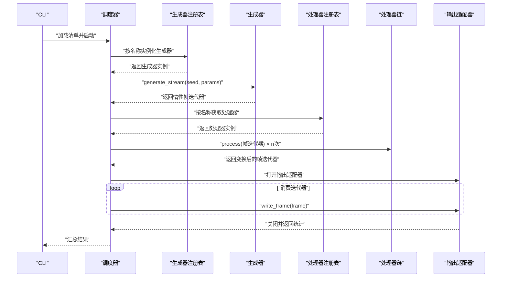
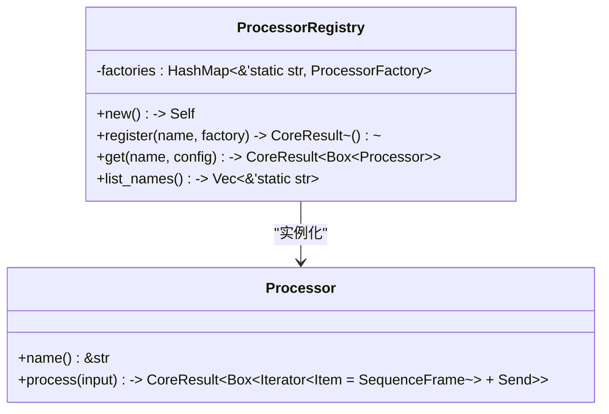
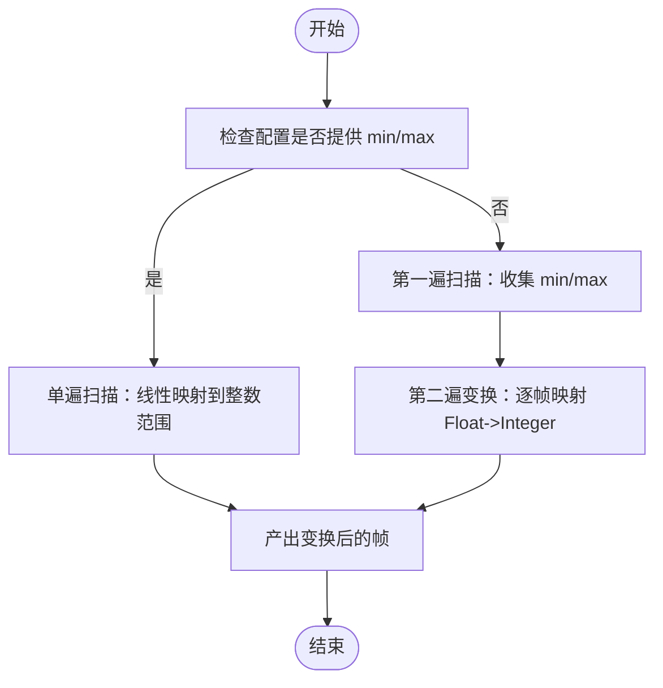
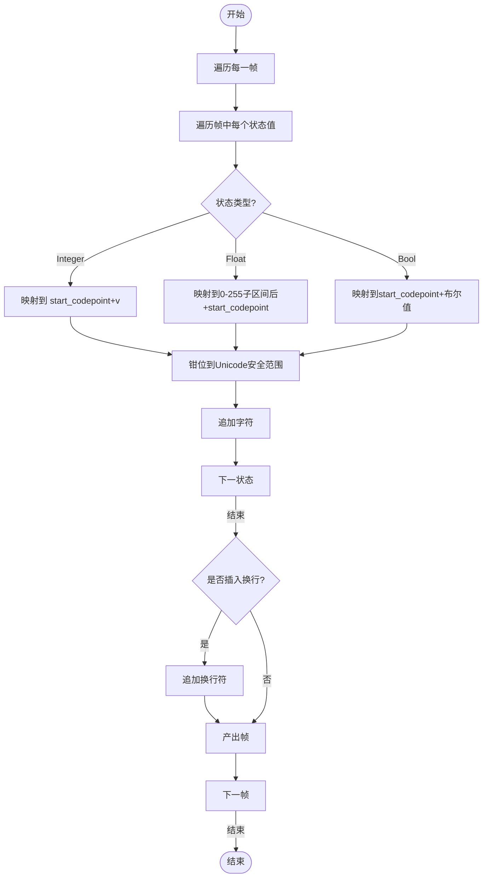
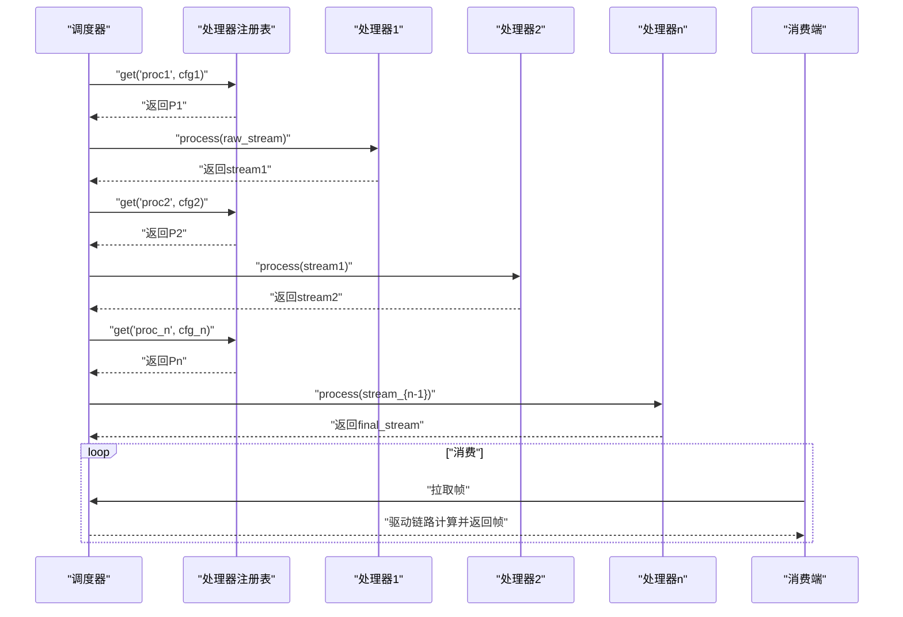
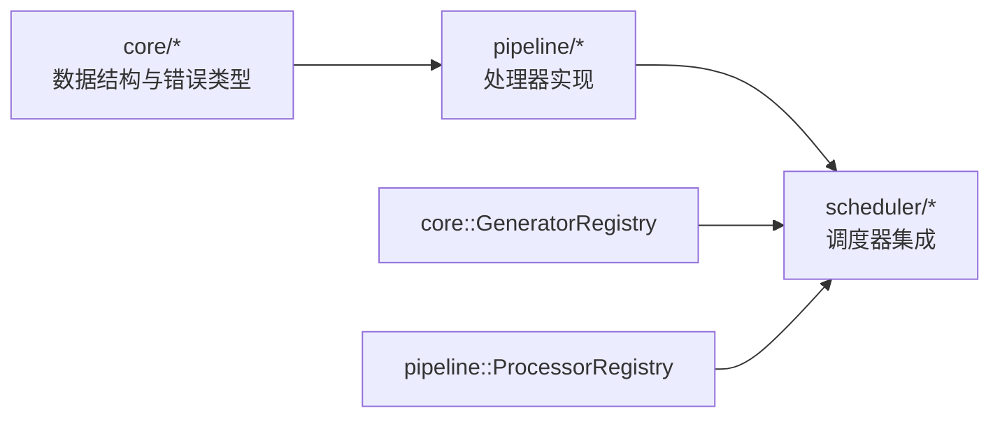

# 后处理管道层

<cite>
**本文档引用的文件**
- [mod.rs](file://src/pipeline/mod.rs)
- [processor.rs](file://src/pipeline/processor.rs)
- [registry.rs](file://src/pipeline/registry.rs)
- [null_proc.rs](file://src/pipeline/null_proc.rs)
- [normalizer.rs](file://src/pipeline/normalizer.rs)
- [dedup.rs](file://src/pipeline/dedup.rs)
- [diff_encoder.rs](file://src/pipeline/diff_encoder.rs)
- [token_mapper.rs](file://src/pipeline/token_mapper.rs)
- [clip_stitcher.rs](file://src/pipeline/clip_stitcher.rs)
- [frame.rs](file://src/core/frame.rs)
- [error.rs](file://src/core/error.rs)
- [mod.rs](file://src/core/mod.rs)
- [pipeline_full.yaml](file://tests/manifests/pipeline_full.yaml)
</cite>

## 目录
1. [简介](#简介)
2. [项目结构](#项目结构)
3. [核心组件](#核心组件)
4. [架构总览](#架构总览)
5. [详细组件分析](#详细组件分析)
6. [依赖关系分析](#依赖关系分析)
7. [性能考量](#性能考量)
8. [故障排查指南](#故障排查指南)
9. [结论](#结论)
10. [附录](#附录)

## 简介
本文档详细介绍 StructGen-rs 的后处理管道层（pipeline），这是一个全新的处理器框架实现，包含标准化器、去重过滤器、差分编码器、令牌映射器、序列截断/拼接器等内置处理器。该框架采用统一的处理器接口设计，支持可组合的惰性处理链，为生成器产出的帧流提供标准化、去重、差分、映射等变换能力，最终输出适配下游语言模型训练的格式。

## 项目结构
管道模块已完全实现，包含以下核心文件：
- `processor.rs`: 定义处理器接口契约
- `registry.rs`: 处理器注册表实现
- `normalizer.rs`: 标准化器实现
- `dedup.rs`: 去重过滤器实现
- `diff_encoder.rs`: 差分编码器实现
- `token_mapper.rs`: 令牌映射器实现
- `clip_stitcher.rs`: 序列截断/拼接器实现
- `null_proc.rs`: 空处理器（透传）
- `mod.rs`: 模块导出和注册

```mermaid
graph TB
subgraph "管道模块结构"
PROCESSOR["processor.rs<br/>处理器接口"]
REGISTRY["registry.rs<br/>处理器注册表"]
NULL_PROC["null_proc.rs<br/>空处理器"]
NORMALIZER["normalizer.rs<br/>标准化器"]
DEDUP["dedup.rs<br/>去重过滤器"]
DIFF["diff_encoder.rs<br/>差分编码器"]
TOKEN["token_mapper.rs<br/>令牌映射器"]
CLIP["clip_stitcher.rs<br/>序列截断拼接器"]
END
PROCESSOR --> REGISTRY
REGISTRY --> NULL_PROC
REGISTRY --> NORMALIZER
REGISTRY --> DEDUP
REGISTRY --> DIFF
REGISTRY --> TOKEN
REGISTRY --> CLIP
```

**图表来源**
- [mod.rs:1-41](file://src/pipeline/mod.rs#L1-L41)
- [processor.rs:1-25](file://src/pipeline/processor.rs#L1-L25)
- [registry.rs:1-132](file://src/pipeline/registry.rs#L1-L132)

**章节来源**
- [mod.rs:1-41](file://src/pipeline/mod.rs#L1-L41)
- [processor.rs:1-25](file://src/pipeline/processor.rs#L1-L25)
- [registry.rs:1-132](file://src/pipeline/registry.rs#L1-L132)

## 核心组件
管道模块的核心组件包括：

### 处理器接口（Processor trait）
- 定义统一的惰性处理契约，接受并返回 `Iterator<Item = SequenceFrame>`
- 实现要求满足 `Send + Sync`，确保在 rayon 线程池中并行使用
- 提供 `name()` 和 `process()` 方法

### 处理器注册表（ProcessorRegistry）
- 维护名称到构造函数的映射
- 支持按名称实例化处理器，提供列表和查询功能
- 包含完整的错误处理机制

### 内置处理器族
- **标准化器（Normalizer）**: 将浮点值映射到有限整数范围
- **去重过滤器（DedupFilter）**: 移除冗余帧和低熵状态
- **差分编码器（DiffEncoder）**: 对相邻帧计算差分
- **令牌映射器（TokenMapper）**: 将离散整数值映射为 Unicode 字符
- **序列截断/拼接器（ClipStitcher）**: 控制序列长度和分隔符
- **空处理器（NullProcessor）**: 透传所有帧，用于测试

**章节来源**
- [processor.rs:6-21](file://src/pipeline/processor.rs#L6-L21)
- [registry.rs:9-57](file://src/pipeline/registry.rs#L9-L57)
- [mod.rs:24-41](file://src/pipeline/mod.rs#L24-L41)

## 架构总览
后处理管道层位于生成器与输出适配器之间，通过可组合的处理器链实现数据变换：



**图表来源**
- [mod.rs:33-41](file://src/pipeline/mod.rs#L33-L41)
- [registry.rs:38-51](file://src/pipeline/registry.rs#L38-L51)

## 详细组件分析

### 处理器接口与注册表
处理器接口定义了统一的处理契约，注册表提供了类型安全的处理器实例化机制。



**图表来源**
- [processor.rs:6-21](file://src/pipeline/processor.rs#L6-L21)
- [registry.rs:10-57](file://src/pipeline/registry.rs#L10-L57)

**章节来源**
- [processor.rs:6-21](file://src/pipeline/processor.rs#L6-L21)
- [registry.rs:15-57](file://src/pipeline/registry.rs#L15-L57)

### 标准化器（Normalizer）
标准化器将浮点值映射到有限整数范围，支持多种标准化方法：

#### 标准化方法
- **线性缩放**: `(v - min) / (max - min) * max_val` 钳位取整
- **对数分桶**: `log2(1 + |v|)` 然后线性缩放
- **均匀分位数**: 按分位数边界映射

#### 双遍历优化
- 若配置中显式提供 min/max，可跳过第一遍扫描
- 支持显式边界指定以避免二次遍历



**图表来源**
- [normalizer.rs:52-184](file://src/pipeline/normalizer.rs#L52-L184)

**章节来源**
- [normalizer.rs:8-50](file://src/pipeline/normalizer.rs#L8-L50)
- [normalizer.rs:52-184](file://src/pipeline/normalizer.rs#L52-L184)

### 去重过滤器（DedupFilter）
去重过滤器提供多重过滤策略：

#### 过滤策略
- **连续去重**: 比较当前帧与上一帧，相等则跳过
- **全零过滤**: 可选移除全零帧
- **低熵过滤**: 按帧中整数值构建直方图，估计熵并过滤低于阈值的帧

#### 内存优化
- 仅回溯一帧，内存开销 O(state_dim)
- 使用 256-bin 直方图估算熵值


**图表来源**
- [dedup.rs:36-161](file://src/pipeline/dedup.rs#L36-L161)

**章节来源**
- [dedup.rs:8-34](file://src/pipeline/dedup.rs#L8-L34)
- [dedup.rs:36-161](file://src/pipeline/dedup.rs#L36-L161)

### 差分编码器（DiffEncoder）
差分编码器对相邻帧计算差分，减少缓慢变化序列的冗余：

#### 差分规则
- **整数**: `Integer(a) - Integer(b)`
- **浮点**: `Float(a) - Float(b)`
- **布尔**: `Bool(a) XOR Bool(b)`
- **类型不匹配**: 产出当前值

#### 首帧处理
- 可选择前置零帧或直接产出首帧
- 与零帧差分使首帧编码为首帧本身


**图表来源**
- [diff_encoder.rs:16-129](file://src/pipeline/diff_encoder.rs#L16-L129)

**章节来源**
- [diff_encoder.rs:8-25](file://src/pipeline/diff_encoder.rs#L8-L25)
- [diff_encoder.rs:16-129](file://src/pipeline/diff_encoder.rs#L16-L129)

### 令牌映射器（TokenMapper）
令牌映射器将离散整数值映射为 Unicode 字符，使数据可直接作为语言模型文本输入：

#### 映射逻辑
- **整数**: `start_codepoint + v` 钳位到 [0, 0x10FFFF]
- **浮点**: `start_codepoint + ((v * 256) as u32).clamp(0, 255)`
- **布尔**: `start_codepoint + (v as u32)`

#### 安全性保障
- 对超出 Unicode 安全范围的值进行钳位
- 保持标签透传，不修改 label 字段



**图表来源**
- [token_mapper.rs:35-124](file://src/pipeline/token_mapper.rs#L35-L124)

**章节来源**
- [token_mapper.rs:11-33](file://src/pipeline/token_mapper.rs#L11-L33)
- [token_mapper.rs:35-124](file://src/pipeline/token_mapper.rs#L35-L124)

### 序列截断/拼接器（ClipStitcher）
序列截断/拼接器控制序列长度和分隔符：

#### 功能特性
- **长度控制**: 达到最大长度时输出当前缓冲作为子序列
- **分隔符**: 可选在子序列间插入分隔帧
- **智能分隔**: 仅在需要时插入分隔符，避免不必要的帧

#### 状态管理
- 使用缓冲区累积帧，空间复杂度 O(max_len × state_dim)
- 维护全局步索引和批次状态


**图表来源**
- [clip_stitcher.rs:23-132](file://src/pipeline/clip_stitcher.rs#L23-L132)

**章节来源**
- [clip_stitcher.rs:11-21](file://src/pipeline/clip_stitcher.rs#L11-L21)
- [clip_stitcher.rs:23-132](file://src/pipeline/clip_stitcher.rs#L23-L132)

### 处理器链组合与惰性求值
处理器链通过注册表按顺序组合，实现惰性求值：

#### 组合机制
- 调度器按任务清单顺序调用 `ProcessorRegistry::get`
- 依次对帧迭代器进行包裹，形成链式调用
- 每个处理器仅在消费端拉取时才触发计算

#### 数据约定
- 输入输出均为 `SequenceFrame` 迭代器
- `step_index` 语义不变，`label` 透传



**图表来源**
- [mod.rs:79-122](file://src/pipeline/mod.rs#L79-L122)

**章节来源**
- [mod.rs:79-122](file://src/pipeline/mod.rs#L79-L122)

## 依赖关系分析
管道模块与核心模块的依赖关系：

### 核心模块依赖
- 处理器接口与注册表依赖 core 的数据结构与错误类型
- 使用 `SequenceFrame`、`FrameData`、`FrameState` 等核心数据类型
- 错误类型继承自 `CoreError`，确保类型一致与错误传播

### 调度器集成
- 调度器通过注册表实例化生成器与处理器
- 处理器链的实例化与组装在调度器中完成
- 管道层不直接参与调度细节



**图表来源**
- [frame.rs:8-150](file://src/core/frame.rs#L8-L150)
- [error.rs:4-49](file://src/core/error.rs#L4-L49)
- [mod.rs:11-15](file://src/core/mod.rs#L11-L15)

**章节来源**
- [frame.rs:8-150](file://src/core/frame.rs#L8-L150)
- [error.rs:4-49](file://src/core/error.rs#L4-L49)
- [mod.rs:11-15](file://src/core/mod.rs#L11-L15)

## 性能考量
管道框架的性能优化策略：

### 迭代器零成本抽象
- 所有处理器实现为自定义迭代器，编译器可内联与展开链式调用
- 减少间接开销，提高处理效率

### 避免中间收集
- 处理器直接包装输入迭代器，不调用 `collect`
- 仅在最终消费端一次性遍历，避免额外内存占用

### 算法优化
- **标准化器**: 显式提供 min/max 可跳过第一遍扫描
- **差分编码器**: 仅缓存上一帧，内存开销与状态维度相关
- **去重过滤器**: 仅回溯一帧，适合长时间序列

### 内存管理
- 使用 `Box<dyn Iterator<Item = SequenceFrame> + Send>` 实现动态分发
- 避免不必要的数据复制和所有权转移
- 合理使用缓冲区管理，控制内存峰值

**章节来源**
- [mod.rs:396-403](file://docs/pipeline模块详细设计.md#L396-L403)

## 故障排查指南
常见问题及解决方案：

### 处理器实例化失败
- **名称未注册**: 在清单校验阶段应报 `CoreError::ManifestError`
- **配置反序列化失败**: `ProcessorRegistry::get` 会立即返回 `CoreError`

### 标准化器边界问题
- **空输入**: 返回空迭代器，不报错
- **边界检查**: 当 min/max 相等时自动调整范围

### 令牌映射器异常
- **Unicode 范围**: 自动钳位到安全范围，避免非法码点
- **负值处理**: 负整数自动钳位到 0

### 错误传播路径
- `Processor::process` 返回 `Err` 时向上抛出至调度器
- 中止当前 Shard，便于快速定位问题

**章节来源**
- [registry.rs:46-51](file://src/pipeline/registry.rs#L46-L51)
- [error.rs:34-49](file://src/core/error.rs#L34-L49)

## 结论
后处理管道层通过全新的处理器框架实现了强大的数据变换能力。标准化器、去重过滤器、差分编码器、令牌映射器、序列截断/拼接器等内置处理器覆盖了从数值规范化到文本映射的关键步骤。框架强调可组合性、惰性求值、线程安全与性能优化，适合在大规模数据场景中稳定运行。通过统一的处理器接口和注册表机制，用户可以轻松扩展新的处理器类型，构建个性化的数据处理流水线。

## 附录

### 处理器配置示例
完整的管道配置示例如下：

```yaml
global:
  output_dir: "tests/output/pipeline_full"
  default_format: "Text"
tasks:
- name: "full_pipeline"
  generator: "ca"
  params:
    seq_length: 30
    extensions:
      rule: 30
  count: 5
  seed: 42
  pipeline: ["normalizer", "dedup", "diff_encoder", "token_mapper"]
  output_format: "Text"
```

### 术语表
- **帧（SequenceFrame）**: 单个时间步的状态快照，包含 `step_index`、`state` 与可选 `label`
- **处理器（Processor）**: 实现惰性变换的迭代器适配器，满足 `Send + Sync`
- **注册表（Registry）**: 维护名称到构造函数的映射，支持按名称实例化

### 参考文件
- 调度器与管道层的调用时序与数据约定详见调度器设计文档
- 处理器测试用例展示了完整的链式处理流程
- 核心数据结构定义了帧的完整语义和约束条件

**章节来源**
- [pipeline_full.yaml:1-15](file://tests/manifests/pipeline_full.yaml#L1-L15)
- [frame.rs:121-150](file://src/core/frame.rs#L121-L150)