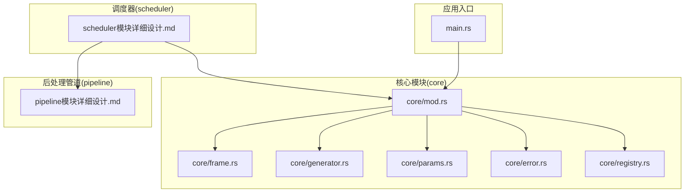
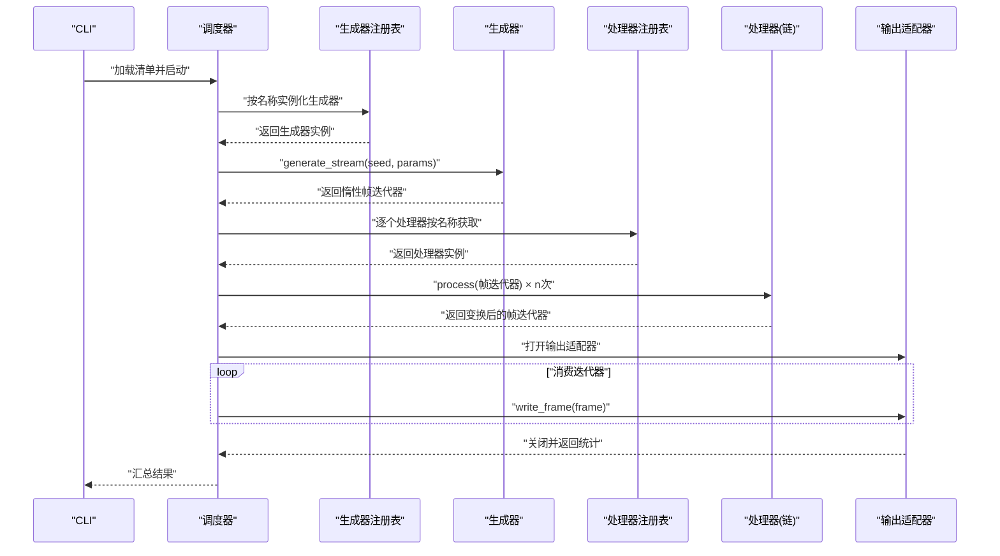
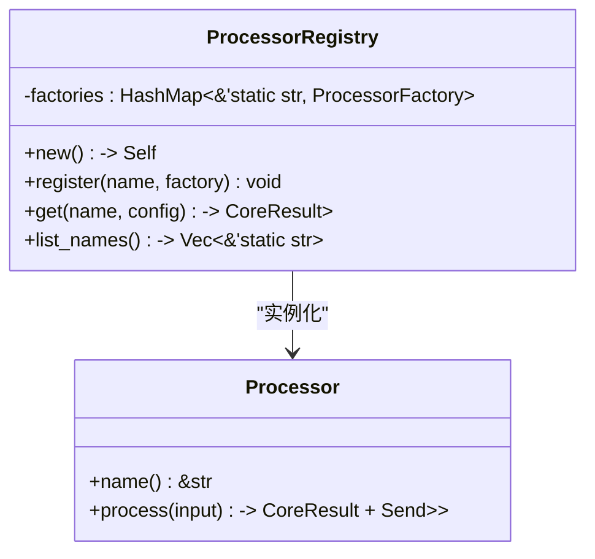
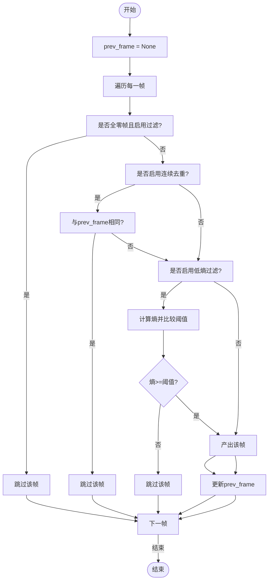
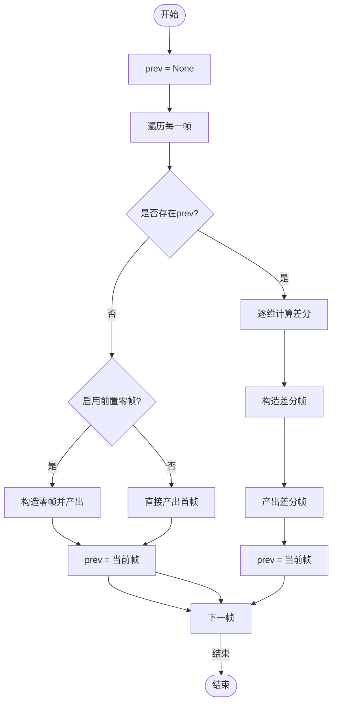
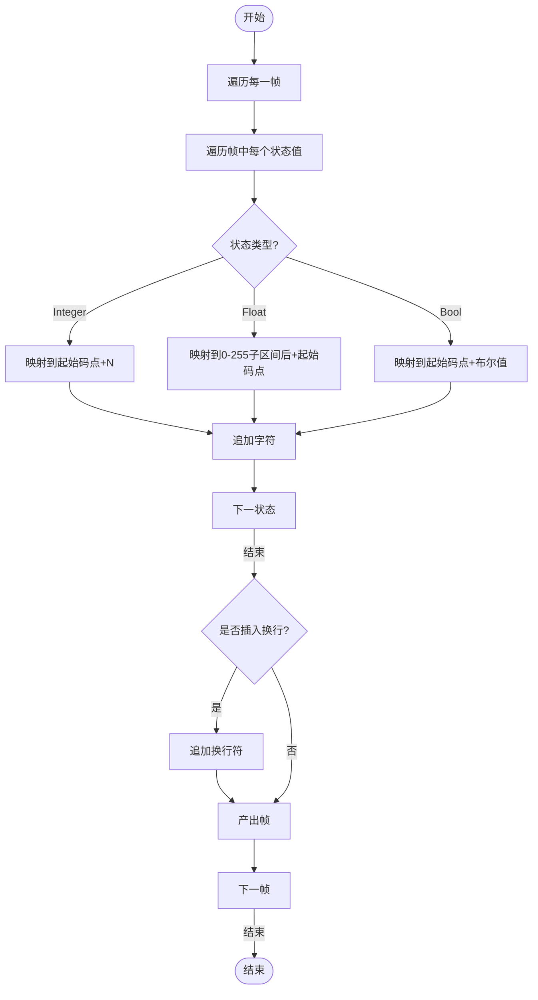
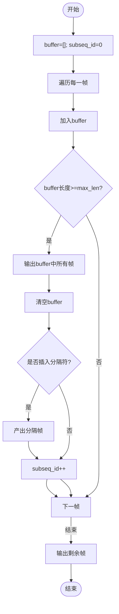
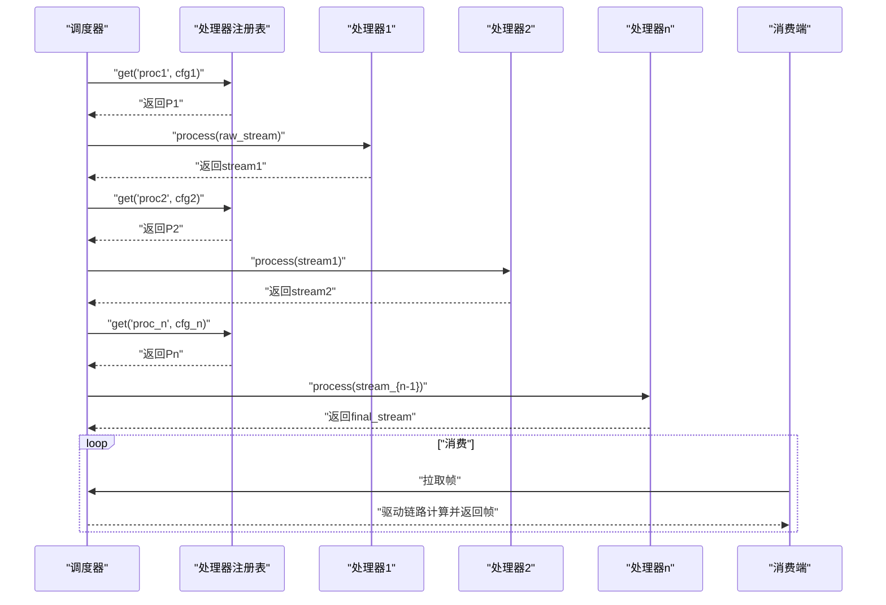
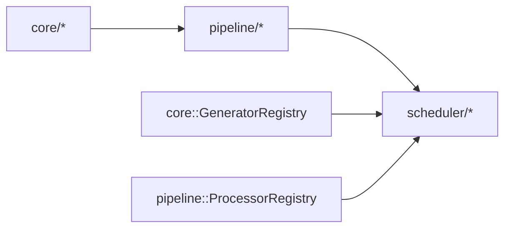

# 后处理管道层

<cite>
**本文档引用的文件**
- [main.rs](file://src/main.rs)
- [Cargo.toml](file://Cargo.toml)
- [core/mod.rs](file://src/core/mod.rs)
- [core/frame.rs](file://src/core/frame.rs)
- [core/generator.rs](file://src/core/generator.rs)
- [core/params.rs](file://src/core/params.rs)
- [core/error.rs](file://src/core/error.rs)
- [core/registry.rs](file://src/core/registry.rs)
- [pipeline模块详细设计.md](file://docs/pipeline模块详细设计.md)
- [scheduler模块详细设计.md](file://docs/scheduler模块详细设计.md)
</cite>

## 目录
1. [简介](#简介)
2. [项目结构](#项目结构)
3. [核心组件](#核心组件)
4. [架构总览](#架构总览)
5. [详细组件分析](#详细组件分析)
6. [依赖关系分析](#依赖关系分析)
7. [性能考量](#性能考量)
8. [故障排查指南](#故障排查指南)
9. [结论](#结论)
10. [附录](#附录)

## 简介
本文件面向 StructGen-rs 的后处理管道层（pipeline），基于现有设计文档与核心模块接口，系统阐述其整体架构、处理器接口设计、处理链组合与惰性求值机制，并结合标准化器、去重过滤器、差分编码器、令牌映射器等内置处理器的实现要点，给出数据处理算法、性能优化策略、内存管理建议、组件交互与数据流路径，以及安全性、监控与调试等横切关注点。

## 项目结构
当前仓库包含核心模块（core）与顶层入口，后处理管道层（pipeline）在设计文档中定义，尚未在源码树中实现。下图展示与后处理管道层相关的模块边界与交互：

图表来源
- [main.rs:1-6](file://src/main.rs#L1-L6)
- [core/mod.rs:1-16](file://src/core/mod.rs#L1-L16)
- [core/frame.rs:1-210](file://src/core/frame.rs#L1-L210)
- [core/generator.rs:1-129](file://src/core/generator.rs#L1-L129)
- [core/params.rs:1-235](file://src/core/params.rs#L1-L235)
- [core/error.rs:1-103](file://src/core/error.rs#L1-L103)
- [core/registry.rs:1-150](file://src/core/registry.rs#L1-L150)
- [scheduler模块详细设计.md:337-371](file://docs/scheduler模块详细设计.md#L337-L371)
- [pipeline模块详细设计.md:1-498](file://docs/pipeline模块详细设计.md#L1-L498)

章节来源
- [main.rs:1-6](file://src/main.rs#L1-L6)
- [Cargo.toml:1-10](file://Cargo.toml#L1-L10)
- [core/mod.rs:1-16](file://src/core/mod.rs#L1-L16)

## 核心组件
- 处理器接口（Processor trait）：定义统一的惰性处理契约，接受并返回 `Iterator<Item = SequenceFrame>`，要求实现为 `Send + Sync`，便于在 rayon 线程池中并行使用。
- 处理器注册表（ProcessorRegistry）：维护名称到构造函数的映射，按名称与配置实例化处理器，支持列出与查询。
- 内置处理器族：标准化器、去重过滤器、差分编码器、令牌映射器、序列截断/拼接器等，均以迭代器适配器形式实现，支持链式组合。
- 与核心模块的耦合：严格依赖 core 的数据结构（SequenceFrame、FrameState、FrameData）与错误类型（CoreError/CoreResult），确保类型安全与错误传播一致性。

章节来源
- [pipeline模块详细设计.md:55-118](file://docs/pipeline模块详细设计.md#L55-L118)
- [core/frame.rs:1-210](file://src/core/frame.rs#L1-L210)
- [core/error.rs:1-103](file://src/core/error.rs#L1-L103)

## 架构总览
后处理管道层位于生成器与输出适配器之间，负责对生成器产出的帧流进行标准化、去重、差分、映射等变换，最终输出适配下游语言模型训练的格式。其关键特征：
- 可组合性：任意多个处理器可按顺序链式串联。
- 惰性求值：处理器均为迭代器适配器，不物化中间结果，仅在消费端拉取时驱动计算。
- 参数化：每个处理器通过 JSON 配置控制行为，不同任务可独立配置。
- 确定性状态：处理器内部状态（如标准化边界）在首次遇到数据时从数据流学习或从配置显式指定，保证可复现性。

图表来源
- [scheduler模块详细设计.md:337-371](file://docs/scheduler模块详细设计.md#L337-L371)
- [pipeline模块详细设计.md:354-385](file://docs/pipeline模块详细设计.md#L354-L385)

## 详细组件分析

### 处理器接口与注册表
- Processor trait
  - 契约：提供 name() 与 process(input)。process 返回惰性迭代器，消费端驱动计算。
  - 线程安全：实现需满足 Send + Sync，支持 rayon 并行。
- ProcessorRegistry
  - 提供 register(name, factory)、get(name, config)、list_names() 等方法。
  - get 在名称未注册或配置反序列化失败时返回 CoreError。

图表来源
- [pipeline模块详细设计.md:55-118](file://docs/pipeline模块详细设计.md#L55-L118)

章节来源
- [pipeline模块详细设计.md:55-118](file://docs/pipeline模块详细设计.md#L55-L118)

### 标准化器（Normalizer）
- 目标：将浮点值映射到有限整数范围，消除浮点噪声，形成固定词汇表。
- 算法要点
  - 线性缩放：先扫描收集 min/max，再对每个 Float 值线性映射到 [0, max_val] 并取整。
  - 双遍历优化：若配置中显式提供 min/max，可跳过第一遍扫描，单遍完成。
  - 其他方法：对数分桶、均匀分位数量化等。
- 数据结构与复杂度
  - 时间复杂度：单遍扫描 O(N) 或双遍 O(2N)，取决于是否显式提供边界。
  - 空间复杂度：O(1)（仅保存 min/max 或分位数表）。
- 性能与内存
  - 推荐在大规模数据场景显式提供边界，避免二次遍历。
  - 对于流式数据，可考虑增量统计（如滑动窗口）以降低内存峰值。

图表来源
- [pipeline模块详细设计.md:195-225](file://docs/pipeline模块详细设计.md#L195-L225)

章节来源
- [pipeline模块详细设计.md:195-225](file://docs/pipeline模块详细设计.md#L195-L225)

### 去重过滤器（DedupFilter）
- 目标：移除冗余帧，保留“有信息量”的状态变化。
- 算法要点
  - 连续去重：比较当前帧与上一帧，相等则跳过。
  - 全零过滤：可选移除全零帧。
  - 低熵过滤：按帧中整数值构建直方图，估计熵并过滤低于阈值的帧。
- 回溯与内存
  - 仅回溯一帧，内存开销 O(state_dim)。
  - 适合长时间稳定序列的降冗余。

图表来源
- [pipeline模块详细设计.md:226-258](file://docs/pipeline模块详细设计.md#L226-L258)

章节来源
- [pipeline模块详细设计.md:226-258](file://docs/pipeline模块详细设计.md#L226-L258)

### 差分编码器（DiffEncoder）
- 目标：对相邻帧计算差分，减少缓慢变化序列的冗余。
- 算法要点
  - 首帧处理：可选择前置零帧或直接产出首帧。
  - 差分计算：对每维状态执行整数差分、浮点差分或布尔异或。
- 内存与性能
  - 仅缓存上一帧的 FrameData，内存开销 O(state_dim)。
  - 适合平滑变化序列，显著降低存储与传输成本。

图表来源
- [pipeline模块详细设计.md:259-302](file://docs/pipeline模块详细设计.md#L259-L302)

章节来源
- [pipeline模块详细设计.md:259-302](file://docs/pipeline模块详细设计.md#L259-L302)

### 令牌映射器（TokenMapper）
- 目标：将离散整数值映射为 Unicode 字符，使数据可直接作为语言模型文本输入。
- 算法要点
  - 整数映射：以起始码点为基础，将 0–N 映射到 Unicode 码点。
  - 浮点映射：将浮点值映射到 0–255 的子区间后与起始码点相加。
  - 可选插入换行符作为帧分隔。
- 安全性与边界
  - 对超出 Unicode 安全范围的值进行钳位，避免非法码点。
  - 保持标签透传，不修改 label 字段。

图表来源
- [pipeline模块详细设计.md:303-326](file://docs/pipeline模块详细设计.md#L303-L326)

章节来源
- [pipeline模块详细设计.md:303-326](file://docs/pipeline模块详细设计.md#L303-L326)

### 序列截断/拼接器（ClipStitcher）
- 目标：将过长序列切分为固定长度片段，或在序列间插入分隔标记。
- 算法要点
  - 缓冲区累积：达到最大长度时输出当前缓冲作为子序列。
  - 分隔符：可选在子序列间插入分隔帧。
- 复杂度与内存
  - 时间复杂度 O(N)；空间复杂度 O(max_len × state_dim)。

图表来源
- [pipeline模块详细设计.md:327-353](file://docs/pipeline模块详细设计.md#L327-L353)

章节来源
- [pipeline模块详细设计.md:327-353](file://docs/pipeline模块详细设计.md#L327-L353)

### 处理器链组合与惰性求值
- 组合方式：调度器按任务清单顺序调用 ProcessorRegistry::get 获取处理器实例，依次对帧迭代器进行包裹，形成链式调用。
- 惰性特性：每个处理器仅在消费端拉取时才触发计算，不物化中间结果，避免额外内存占用。
- 数据约定：输入输出均为 SequenceFrame 迭代器；step_index 语义不变，label 透传。

图表来源
- [pipeline模块详细设计.md:364-375](file://docs/pipeline模块详细设计.md#L364-L375)

章节来源
- [pipeline模块详细设计.md:364-375](file://docs/pipeline模块详细设计.md#L364-L375)

## 依赖关系分析
- 与核心模块的依赖
  - 处理器接口与注册表依赖 core 的数据结构与错误类型，确保类型一致与错误传播。
  - 调度器通过注册表实例化生成器与处理器，形成清晰的模块边界。
- 与调度器的交互
  - 调度器在 rayon 并行区域内调用生成器与处理器，处理器需满足 Send + Sync。
  - 处理器链的实例化与组装在调度器中完成，管道层不直接参与调度细节。

图表来源
- [core/frame.rs:1-210](file://src/core/frame.rs#L1-L210)
- [core/error.rs:1-103](file://src/core/error.rs#L1-L103)
- [core/registry.rs:1-150](file://src/core/registry.rs#L1-L150)
- [pipeline模块详细设计.md:354-385](file://docs/pipeline模块详细设计.md#L354-L385)

章节来源
- [core/frame.rs:1-210](file://src/core/frame.rs#L1-L210)
- [core/error.rs:1-103](file://src/core/error.rs#L1-L103)
- [core/registry.rs:1-150](file://src/core/registry.rs#L1-L150)
- [pipeline模块详细设计.md:354-385](file://docs/pipeline模块详细设计.md#L354-L385)

## 性能考量
- 迭代器零成本抽象：处理器实现为自定义迭代器，编译器可内联与展开链式调用，减少间接开销。
- 避免中间收集：所有处理器直接包装输入迭代器，不调用 collect，仅在最终消费端一次性遍历。
- 标准化器双遍历优化：显式提供 min/max 可跳过第一遍扫描，显著降低延迟。
- 差分编码器内存：仅缓存上一帧，内存开销与序列长度无关，仅与状态维度相关。
- 去重过滤器回溯：仅回溯一帧，无需窗口缓存，适合长时间序列。

章节来源
- [pipeline模块详细设计.md:396-403](file://docs/pipeline模块详细设计.md#L396-L403)

## 故障排查指南
- 处理器实例化失败
  - 名称未注册：在清单校验阶段应报 CoreError::ManifestError，避免运行时错误。
  - 配置反序列化失败：ProcessorRegistry::get 会立即返回 CoreError，需检查 JSON 格式与键名。
- 标准化器边界问题
  - 空输入：返回空迭代器，不报错；可确认上游生成器是否正确产出数据。
- 令牌映射器异常
  - 超出 Unicode 范围：自动钳位到安全范围，不报错；如需严格校验，可在配置中增加边界检查。
- 错误传播路径
  - Processor::process 返回 Err 时向上抛出至调度器，中止当前 Shard，便于快速定位问题。

章节来源
- [pipeline模块详细设计.md:386-395](file://docs/pipeline模块详细设计.md#L386-L395)
- [core/error.rs:1-103](file://src/core/error.rs#L1-L103)

## 结论
后处理管道层通过统一的处理器接口与注册表，实现了可组合、惰性求值的数据变换流水线。标准化器、去重过滤器、差分编码器、令牌映射器等内置处理器覆盖了从数值规范化到文本映射的关键步骤，配合序列截断/拼接器，能够高效地将生成器产出的原始帧转化为下游语言模型可消费的格式。设计强调可复现性、线程安全与性能优化，适合在大规模数据场景中稳定运行。

## 附录
- 术语
  - 帧（SequenceFrame）：单个时间步的状态快照，包含 step_index、state 与可选 label。
  - 处理器（Processor）：实现惰性变换的迭代器适配器，满足 Send + Sync。
  - 注册表（Registry）：维护名称到构造函数的映射，支持按名称实例化。
- 参考
  - 调度器与管道层的调用时序与数据约定详见调度器设计文档。