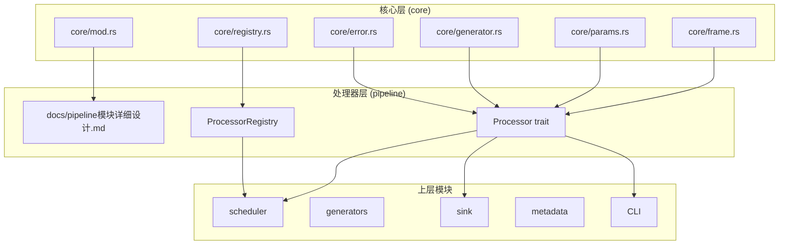
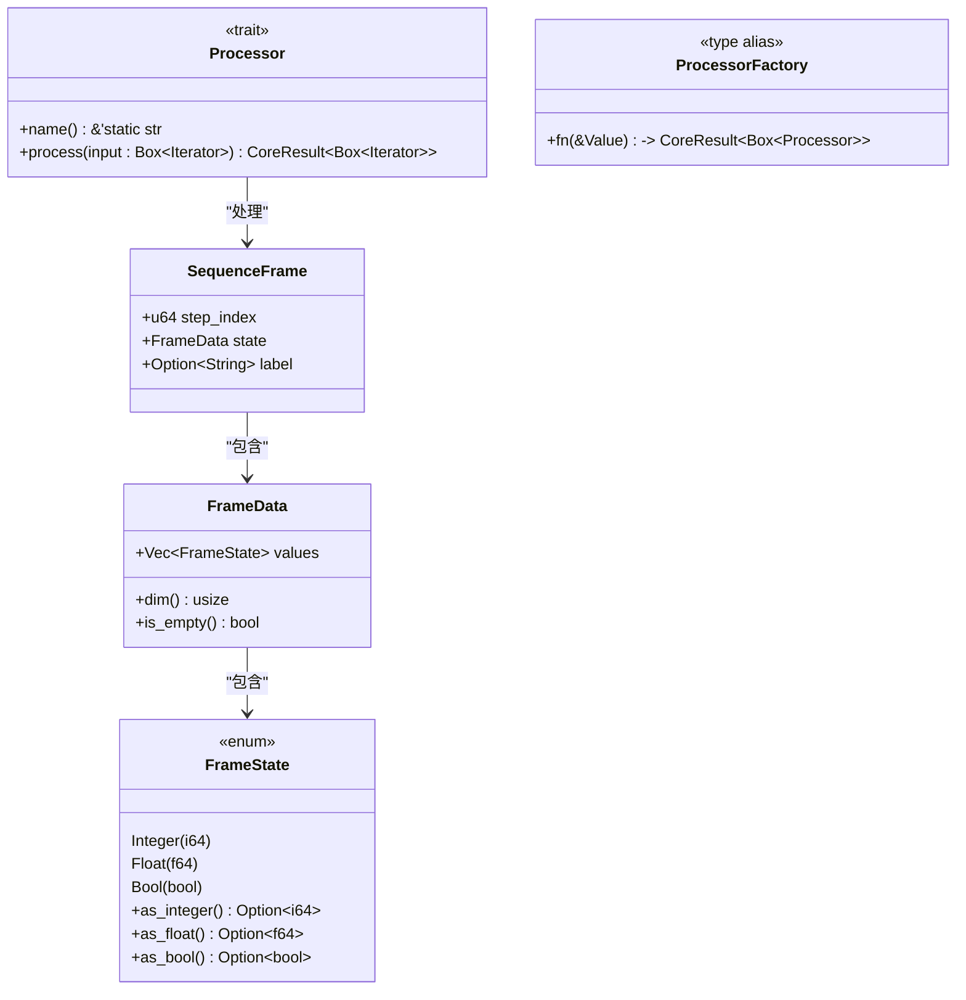
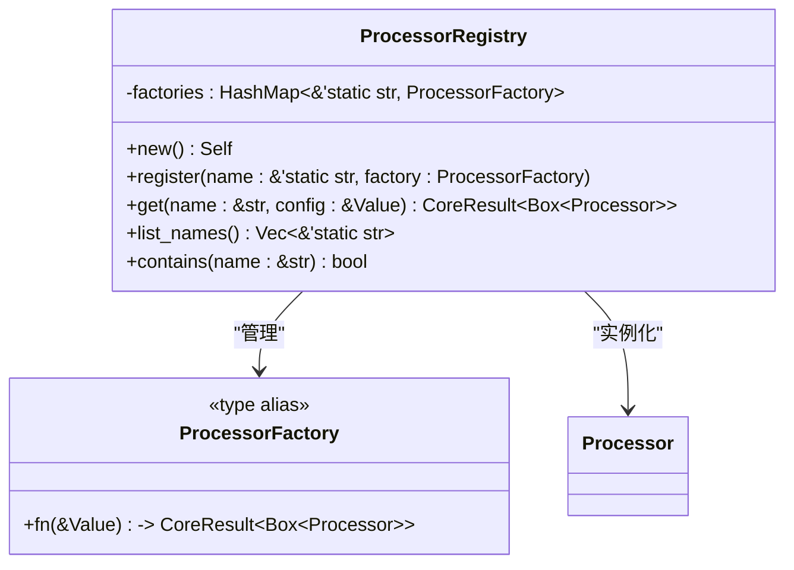
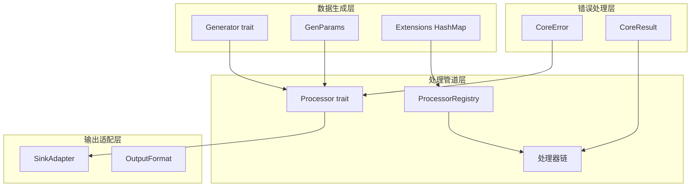
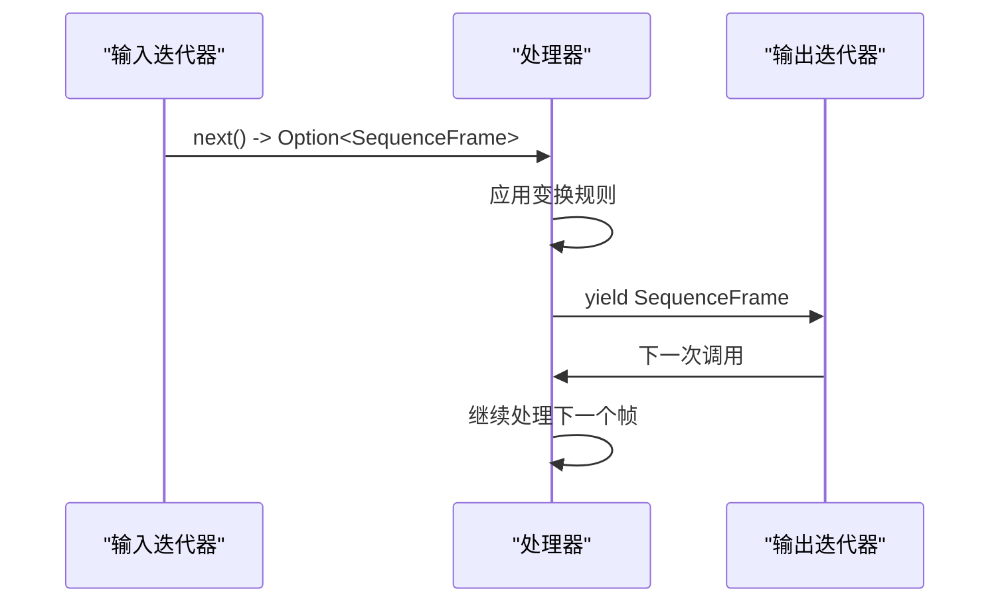
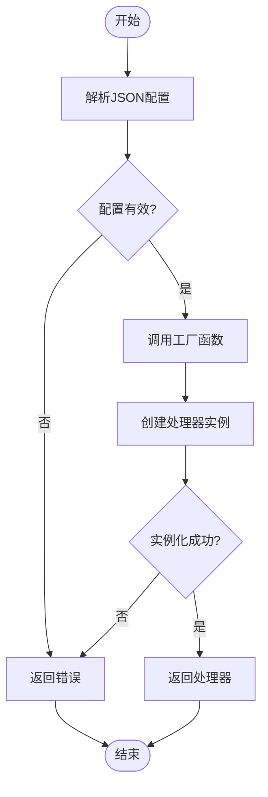
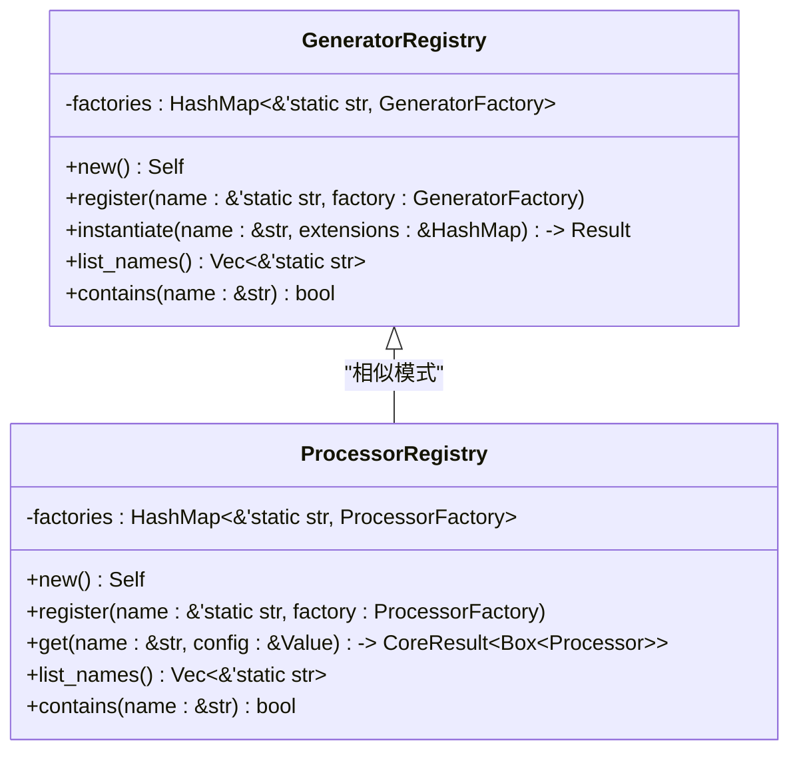
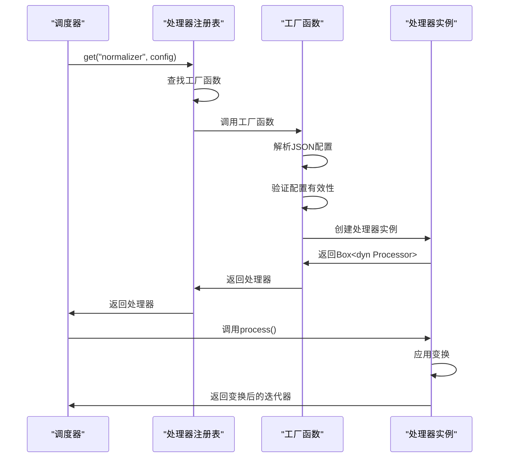
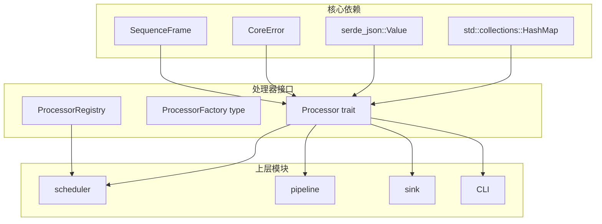
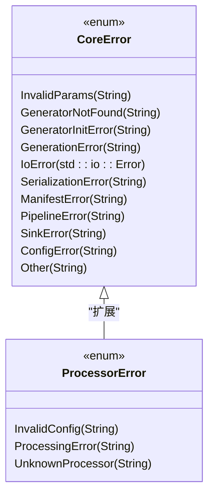

# 处理器接口设计

<cite>
**本文档引用的文件**
- [processor.rs](file://docs/pipeline模块详细设计.md)
- [registry.rs](file://src/core/registry.rs)
- [generator.rs](file://src/core/generator.rs)
- [frame.rs](file://src/core/frame.rs)
- [params.rs](file://src/core/params.rs)
- [error.rs](file://src/core/error.rs)
- [core模块详细设计.md](file://docs/core模块详细设计.md)
- [pipeline模块详细设计.md](file://docs/pipeline模块详细设计.md)
</cite>

## 目录
1. [简介](#简介)
2. [项目结构](#项目结构)
3. [核心组件](#核心组件)
4. [架构概览](#架构概览)
5. [详细组件分析](#详细组件分析)
6. [依赖关系分析](#依赖关系分析)
7. [性能考虑](#性能考虑)
8. [故障排除指南](#故障排除指南)
9. [结论](#结论)

## 简介

StructGen-rs 的处理器接口设计是整个系统数据处理管道的核心抽象层。该设计实现了基于迭代器适配器模式的惰性求值机制，为生成器产出的原始帧数据提供可组合、可配置的数据变换能力。

处理器接口设计遵循以下核心原则：
- **迭代器优先**：所有处理器都是惰性迭代器适配器
- **可组合性**：多个处理器可以链式串联形成处理管道
- **类型安全**：通过泛型和 trait bound 确保类型安全
- **线程安全**：所有处理器实现都满足 Send + Sync 约束
- **配置驱动**：通过 JSON 配置实现参数化控制

## 项目结构

StructGen-rs 采用分层架构设计，核心抽象层位于 `src/core` 目录，处理器接口位于 `docs/pipeline模块详细设计.md` 文档中定义。

**图表来源**
- [core模块详细设计.md: 422-433:422-433](file://docs/core模块详细设计.md#L422-L433)
- [pipeline模块详细设计.md: 29-41:29-41](file://docs/pipeline模块详细设计.md#L29-L41)

**章节来源**
- [core模块详细设计.md: 29-53:29-53](file://docs/core模块详细设计.md#L29-L53)
- [pipeline模块详细设计.md: 27-52:27-52](file://docs/pipeline模块详细设计.md#L27-L52)

## 核心组件

### 处理器接口 (Processor Trait)

处理器接口是后处理管道的核心抽象，定义了数据变换的标准契约。

**图表来源**
- [processor.rs: 55-79:55-79](file://docs/pipeline模块详细设计.md#L55-L79)
- [frame.rs: 89-118:89-118](file://src/core/frame.rs#L89-L118)
- [frame.rs: 52-87:52-87](file://src/core/frame.rs#L52-L87)
- [frame.rs: 3-12:3-12](file://src/core/frame.rs#L3-L12)

处理器接口的关键特性：

1. **惰性求值**：`process` 方法返回惰性迭代器，直到被消费时才执行变换
2. **迭代器适配器模式**：接受输入迭代器并返回变换后的迭代器
3. **类型安全**：使用 `Box<dyn Iterator<Item = SequenceFrame> + Send>` 确保类型安全
4. **错误处理**：返回 `CoreResult` 类型，统一错误处理机制

**章节来源**
- [processor.rs: 55-79:55-79](file://docs/pipeline模块详细设计.md#L55-L79)
- [frame.rs: 89-118:89-118](file://src/core/frame.rs#L89-L118)

### 处理器注册表 (ProcessorRegistry)

处理器注册表实现了工厂模式，提供按名称查找和实例化处理器的能力。

**图表来源**
- [pipeline模块详细设计.md: 85-118:85-118](file://docs/pipeline模块详细设计.md#L85-L118)

处理器注册表的设计特点：

1. **静态字符串键**：使用 `'static str` 作为处理器名称，确保生命周期安全
2. **工厂函数模式**：通过工厂函数创建处理器实例
3. **配置参数传递**：工厂函数接受 JSON 配置参数
4. **类型安全实例化**：返回 `Box<dyn Processor>` 确保类型统一

**章节来源**
- [pipeline模块详细设计.md: 85-118:85-118](file://docs/pipeline模块详细设计.md#L85-L118)

## 架构概览

处理器接口设计在整个系统架构中的位置和作用：

**图表来源**
- [core模块详细设计.md: 422-433:422-433](file://docs/core模块详细设计.md#L422-L433)
- [pipeline模块详细设计.md: 356-362:356-362](file://docs/pipeline模块详细设计.md#L356-L362)

## 详细组件分析

### 处理器接口设计原理

处理器接口的设计遵循了以下设计原则：

#### 1. 迭代器适配器模式

处理器实现迭代器适配器模式，这是函数式编程中的经典设计模式：

**图表来源**
- [processor.rs: 68-78:68-78](file://docs/pipeline模块详细设计.md#L68-L78)

#### 2. 惰性求值机制

惰性求值是处理器设计的核心特性，它提供了以下优势：

- **内存效率**：不需要物化中间结果，内存占用恒定
- **性能优化**：只有在需要时才执行计算
- **流式处理**：支持大数据集的流式处理

#### 3. Send + Sync 约束

所有处理器实现都必须满足 `Send + Sync` 约束，确保：

- **线程安全**：处理器可以在多线程环境中安全使用
- **Rayon 集成**：可以无缝集成到 Rayon 线程池中
- **并发安全**：多个线程可以同时访问处理器实例

**章节来源**
- [processor.rs: 63-64:63-64](file://docs/pipeline模块详细设计.md#L63-L64)

### 处理器工厂模式实现

处理器工厂模式提供了灵活的实例化机制：

**图表来源**
- [pipeline模块详细设计.md: 105-113:105-113](file://docs/pipeline模块详细设计.md#L105-L113)

工厂模式的优势：

1. **解耦**：处理器创建逻辑与使用逻辑分离
2. **可扩展**：新的处理器类型只需实现工厂函数
3. **配置驱动**：通过 JSON 配置控制处理器行为
4. **类型安全**：编译时类型检查确保正确性

**章节来源**
- [pipeline模块详细设计.md: 81-83:81-83](file://docs/pipeline模块详细设计.md#L81-L83)

### 处理器注册表实现细节

处理器注册表实现了名称到工厂函数的映射：

**图表来源**
- [registry.rs: 15-64:15-64](file://src/core/registry.rs#L15-L64)
- [pipeline模块详细设计.md: 88-117:88-117](file://docs/pipeline模块详细设计.md#L88-L117)

注册表的关键特性：

1. **静态生命周期**：使用 `'static str` 作为键，确保生命周期安全
2. **不可重复注册**：防止重复注册同一名称的处理器
3. **类型安全映射**：通过工厂函数确保返回正确的处理器类型
4. **查询优化**：使用 HashMap 实现 O(1) 查找复杂度

**章节来源**
- [registry.rs: 15-64:15-64](file://src/core/registry.rs#L15-L64)

### 类型安全的实例化机制

类型安全的实例化机制确保了编译时的类型检查：

**图表来源**
- [pipeline模块详细设计.md: 105-113:105-113](file://docs/pipeline模块详细设计.md#L105-L113)

类型安全机制包括：

1. **泛型约束**：通过 `Box<dyn Processor>` 确保返回类型统一
2. **错误类型收敛**：所有错误都转换为 `CoreError` 枚举
3. **配置验证**：在工厂函数中验证配置的有效性
4. **生命周期管理**：使用 `'static str` 确保名称的生命周期安全

**章节来源**
- [pipeline模块详细设计.md: 81-83:81-83](file://docs/pipeline模块详细设计.md#L81-L83)

## 依赖关系分析

处理器接口设计的依赖关系体现了清晰的分层架构：

**图表来源**
- [core模块详细设计.md: 437-442:437-442](file://docs/core模块详细设计.md#L437-L442)
- [pipeline模块详细设计.md: 356-362:356-362](file://docs/pipeline模块详细设计.md#L356-L362)

依赖关系分析：

1. **向下依赖**：处理器接口依赖核心抽象层（core）
2. **向上依赖**：核心抽象层不依赖任何业务模块
3. **横向通信**：上层模块通过接口与核心层交互
4. **单向依赖**：形成纯粹的自底向上的依赖关系

**章节来源**
- [core模块详细设计.md: 435-443:435-443](file://docs/core模块详细设计.md#L435-L443)

## 性能考虑

处理器接口设计在性能方面采用了多项优化策略：

### 1. 迭代器零成本抽象

处理器实现为自定义的 `impl Iterator` 结构体，编译器可以将链式调用展开为紧凑的内联循环，避免函数调用开销。

### 2. 内存效率优化

- **惰性求值**：不物化中间结果，内存占用恒定
- **零拷贝传递**：处理器直接包装输入迭代器，避免不必要的数据复制
- **最小状态**：处理器仅保存必要的状态信息

### 3. 并发性能

- **Send + Sync 约束**：确保处理器可以在多线程环境中安全使用
- **Rayon 集成**：可以无缝集成到 Rayon 线程池中
- **无锁设计**：处理器实例通常是无状态的，天然支持并发访问

### 4. 配置解析优化

- **延迟解析**：处理器配置在需要时才进行解析
- **类型安全**：编译时类型检查避免运行时类型转换开销
- **缓存机制**：处理器实例可以缓存解析后的配置信息

## 故障排除指南

### 常见错误类型

处理器接口设计提供了完善的错误处理机制：

**图表来源**
- [error.rs: 4-49:4-49](file://src/core/error.rs#L4-L49)

### 错误处理策略

1. **参数验证**：在工厂函数中验证配置参数的有效性
2. **类型转换**：使用 `?` 操作符传播错误
3. **错误收敛**：所有错误最终转换为 `CoreError` 枚举
4. **上下文信息**：错误消息包含足够的调试信息

### 调试技巧

1. **配置验证**：在注册处理器之前验证配置的 JSON 结构
2. **单元测试**：为每个处理器编写单元测试，验证边界条件
3. **性能监控**：监控处理器的内存使用和处理速度
4. **日志记录**：在关键路径添加适当的日志记录

**章节来源**
- [error.rs: 4-49:4-49](file://src/core/error.rs#L4-L49)

## 结论

StructGen-rs 的处理器接口设计展现了现代 Rust 系统设计的最佳实践。通过迭代器适配器模式、工厂模式和注册表模式的有机结合，实现了高度可组合、类型安全、性能优异的数据处理管道。

### 主要优势

1. **设计优雅**：简洁的接口设计体现了函数式编程的优雅
2. **性能优异**：惰性求值和零成本抽象确保了高性能
3. **类型安全**：编译时类型检查确保了运行时安全
4. **可扩展性强**：工厂模式和注册表模式支持轻松扩展
5. **并发友好**：Send + Sync 约束确保了多线程安全

### 应用建议

1. **遵循接口契约**：实现处理器时严格遵守 `Processor` trait 的契约
2. **配置驱动开发**：通过 JSON 配置控制处理器行为
3. **错误处理优先**：在工厂函数中进行充分的配置验证
4. **性能测试**：定期进行性能基准测试，确保处理效率
5. **文档完善**：为每个处理器提供详细的使用文档和配置说明

这个设计为 StructGen-rs 系统提供了坚实的基础，支持未来更多的处理器扩展和功能增强。