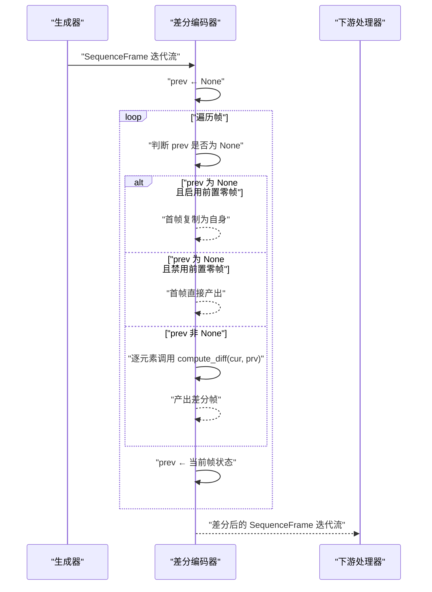
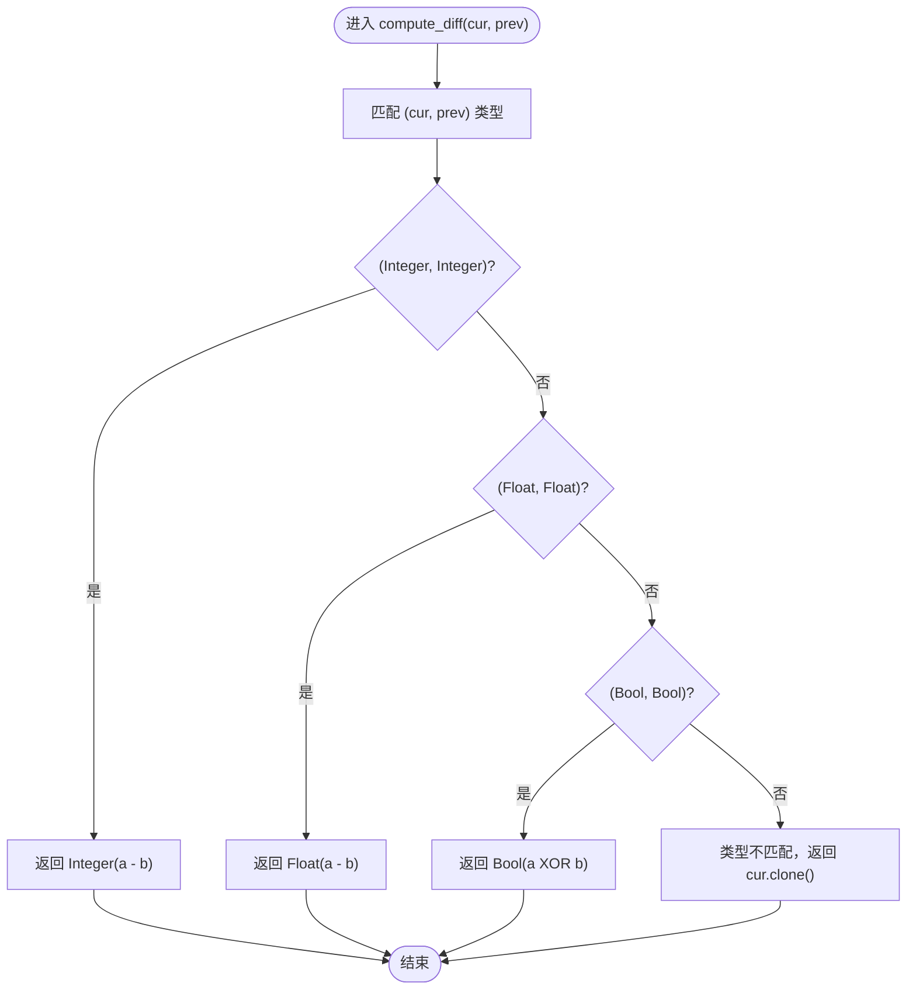
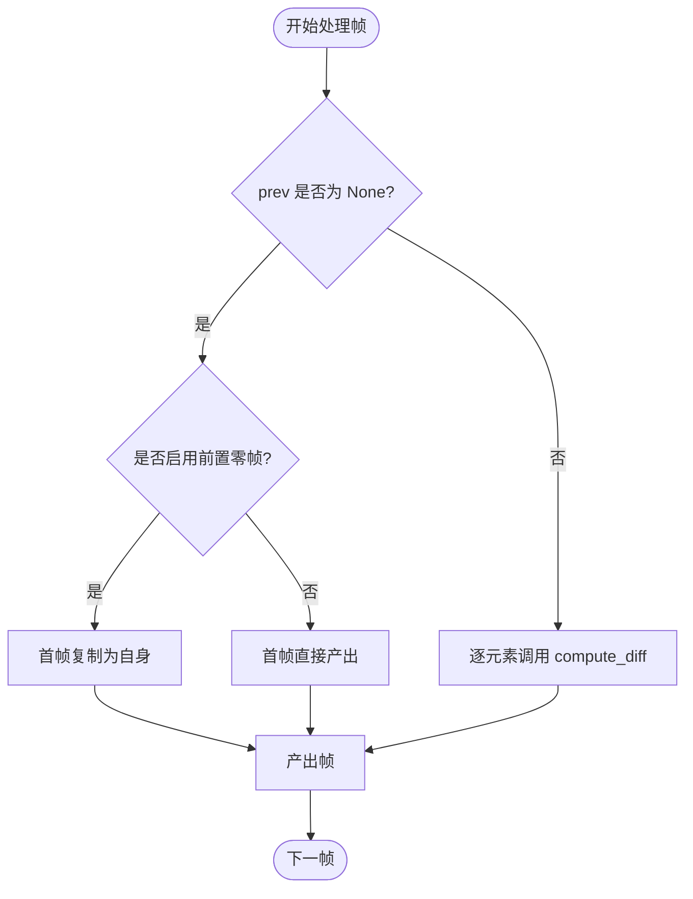
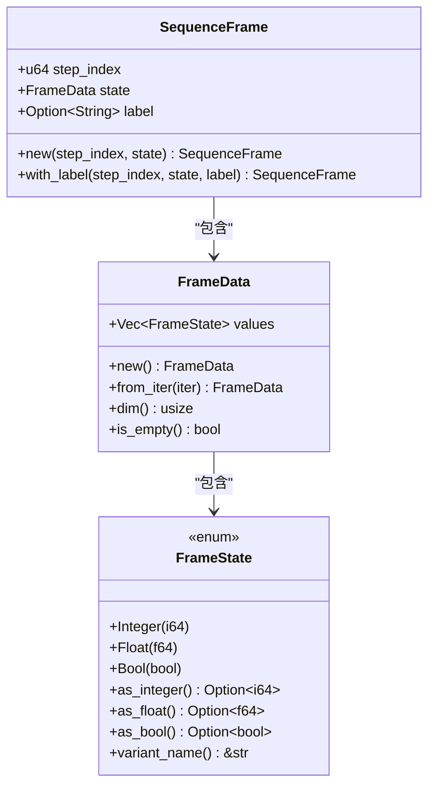
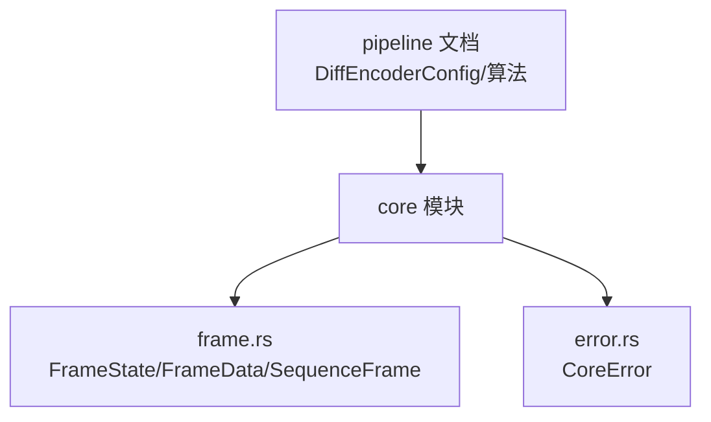

# 差分编码器

<cite>
**本文档引用的文件**
- [frame.rs](file://src/core/frame.rs)
- [params.rs](file://src/core/params.rs)
- [error.rs](file://src/core/error.rs)
- [registry.rs](file://src/core/registry.rs)
- [pipeline模块详细设计.md](file://docs/pipeline模块详细设计.md)
</cite>

## 目录
1. [简介](#简介)
2. [项目结构](#项目结构)
3. [核心组件](#核心组件)
4. [架构概览](#架构概览)
5. [详细组件分析](#详细组件分析)
6. [依赖分析](#依赖分析)
7. [性能考虑](#性能考虑)
8. [故障排除指南](#故障排除指南)
9. [结论](#结论)
10. [附录](#附录)

## 简介
本文件为 StructGen-rs 差分编码器处理器的权威技术文档。该处理器位于后处理管道层（pipeline），负责对相邻帧计算差分，显著减少缓慢变化序列的冗余，提升后续压缩与传输效率。文档涵盖以下关键主题：
- 差分编码的核心功能与算法原理
- 整数、浮点数、布尔值的差分规则
- 首帧处理策略（零帧前置与直接输出）
- compute_diff 函数的实现细节（类型匹配、XOR 操作、类型不匹配处理）
- 内存优化分析（O(state_dim) 状态缓存）
- 压缩率与重建复杂度的权衡
- 具体代码示例路径（以源码定位代替直接代码）

## 项目结构
差分编码器属于 pipeline 模块的内置处理器之一，与标准化器、去重过滤器、令牌映射器、序列截断拼接器共同构成可组合的后处理流水线。

**图表来源**
- [frame.rs:3-118](file://src/core/frame.rs#L3-L118)
- [pipeline模块详细设计.md:30-51](file://docs/pipeline模块详细设计.md#L30-L51)

**章节来源**
- [pipeline模块详细设计.md:3-51](file://docs/pipeline模块详细设计.md#L3-L51)
- [frame.rs:3-118](file://src/core/frame.rs#L3-L118)

## 核心组件
- FrameState：统一承载整数（i64）、浮点（f64）、布尔（bool）三类状态值，支持类型间的安全转换查询。
- FrameData：一帧中所有状态值的集合，维度为 values 的长度。
- SequenceFrame：包含时间步索引、状态数据与可选语义标签。
- DiffEncoderConfig：差分编码器配置，包含是否在首帧前插入零帧的选项。
- DiffEncoder：差分编码器处理器，实现相邻帧差分计算与首帧策略。

**章节来源**
- [frame.rs:3-118](file://src/core/frame.rs#L3-L118)
- [pipeline模块详细设计.md:160-166](file://docs/pipeline模块详细设计.md#L160-L166)

## 架构概览
差分编码器在管道中的位置与职责如下：
- 输入：Generator 产出的 SequenceFrame 迭代流
- 处理：对相邻帧逐元素计算差分，首帧可选择直接输出或前置零帧
- 输出：变换后的 SequenceFrame 迭代流，供下游处理器（如令牌映射器）进一步处理

**图表来源**
- [pipeline模块详细设计.md:265-294](file://docs/pipeline模块详细设计.md#L265-L294)

## 详细组件分析

### 差分计算算法与规则
差分编码器的核心算法基于相邻帧的逐元素对比，遵循以下规则：
- 整数差分：(Integer(a), Integer(b)) → Integer(a - b)
- 浮点差分：(Float(a), Float(b)) → Float(a - b)
- 布尔差分：(Bool(a), Bool(b)) → Bool(a XOR b)
- 类型不匹配：当当前帧与上一帧对应元素类型不一致时，产出原值（cur.clone()）

**图表来源**
- [pipeline模块详细设计.md:295-301](file://docs/pipeline模块详细设计.md#L295-L301)

**章节来源**
- [pipeline模块详细设计.md:295-301](file://docs/pipeline模块详细设计.md#L295-L301)

### 首帧处理策略
差分编码器提供两种首帧处理模式：
- 启用前置零帧（prepend_zero_frame = true）：首帧编码为自身（与零帧的差分即自身），便于后续重建。
- 禁用前置零帧（prepend_zero_frame = false）：首帧直接产出，不做差分。

**图表来源**
- [pipeline模块详细设计.md:266-293](file://docs/pipeline模块详细设计.md#L266-L293)

**章节来源**
- [pipeline模块详细设计.md:266-293](file://docs/pipeline模块详细设计.md#L266-L293)

### compute_diff 函数实现要点
- 类型匹配：严格要求当前帧与上一帧对应元素类型一致，否则视为类型不匹配。
- XOR 操作：布尔差分采用异或（XOR），符合布尔代数的差分语义。
- 类型不匹配处理：返回原值，确保数据完整性与兼容性。
- 与 FrameState 的协作：compute_diff 不关心 FrameState 的内部表示，仅依据类型进行分支。

**章节来源**
- [pipeline模块详细设计.md:295-301](file://docs/pipeline模块详细设计.md#L295-L301)

### 数据模型与类型系统
FrameState 作为统一的标记联合体，支持多种类型间的安全转换查询，为差分计算提供基础。

**图表来源**
- [frame.rs:3-118](file://src/core/frame.rs#L3-L118)

**章节来源**
- [frame.rs:3-118](file://src/core/frame.rs#L3-L118)

### 代码示例路径
以下示例展示了差分编码对不同数据类型的效果与使用方式（以源码定位代替直接代码）：
- 整数差分示例：[pipeline模块详细设计.md:434-443](file://docs/pipeline模块详细设计.md#L434-L443)
- 浮点差分示例：[pipeline模块详细设计.md:434-443](file://docs/pipeline模块详细设计.md#L434-L443)
- 布尔差分示例：[pipeline模块详细设计.md:299](file://docs/pipeline模块详细设计.md#L299)
- 类型不匹配处理示例：[pipeline模块详细设计.md:300](file://docs/pipeline模块详细设计.md#L300)

**章节来源**
- [pipeline模块详细设计.md:434-443](file://docs/pipeline模块详细设计.md#L434-L443)
- [pipeline模块详细设计.md:299](file://docs/pipeline模块详细设计.md#L299)
- [pipeline模块详细设计.md:300](file://docs/pipeline模块详细设计.md#L300)

## 依赖分析
差分编码器依赖于核心层的数据模型与错误类型，同时通过管道层的 Processor 接口与注册表集成到整体流水线中。

**图表来源**
- [frame.rs:3-118](file://src/core/frame.rs#L3-L118)
- [error.rs:4-49](file://src/core/error.rs#L4-L49)
- [pipeline模块详细设计.md:160-166](file://docs/pipeline模块详细设计.md#L160-L166)

**章节来源**
- [frame.rs:3-118](file://src/core/frame.rs#L3-L118)
- [error.rs:4-49](file://src/core/error.rs#L4-L49)
- [pipeline模块详细设计.md:160-166](file://docs/pipeline模块详细设计.md#L160-L166)

## 性能考虑
- 内存开销：差分编码器仅缓存上一帧的 FrameData，内存占用为 O(state_dim)，与序列长度无关，满足流式处理需求。
- 时间复杂度：对每帧执行一次 O(state_dim) 的逐元素差分计算，整体为 O(N × state_dim)。
- 压缩率与重建复杂度权衡：
  - 压缩率：对缓慢变化序列，差分通常产生大量接近零的小幅度值，有利于后续压缩（如熵编码、游程编码）。
  - 重建复杂度：需要按顺序恢复，每帧需加上一帧的累积差分，重建成本与差分序列长度线性相关。
  - 适用场景：适合状态变化平滑、局部稳定的数据序列（如物理仿真、时间序列）。

**章节来源**
- [pipeline模块详细设计.md:401](file://docs/pipeline模块详细设计.md#L401)

## 故障排除指南
- 类型不匹配导致的异常：当相邻帧对应元素类型不一致时，compute_diff 返回原值，不会抛出异常。若出现数据语义错误，应检查上游处理器（如标准化器）的类型一致性。
- 零帧前置策略：启用 prepend_zero_frame 可确保首帧被编码为首帧本身，便于重建；禁用则首帧直接输出，适合已有参考帧的场景。
- 错误传播：管道层的错误类型统一为 CoreError，差分编码器在处理过程中若遇到配置或参数问题，会通过 CoreError 向上传播。

**章节来源**
- [pipeline模块详细设计.md:386-394](file://docs/pipeline模块详细设计.md#L386-L394)
- [error.rs:4-49](file://src/core/error.rs#L4-L49)

## 结论
差分编码器通过相邻帧差分有效减少了缓慢变化序列的冗余，结合 O(state_dim) 的内存开销与惰性迭代器实现，满足大规模流式处理需求。其针对整数、浮点、布尔的差异化规则与类型不匹配的稳健处理，确保了在多样化数据类型下的可用性与可靠性。配合标准化器与令牌映射器，可进一步提升压缩效率与下游建模效果。

## 附录
- 相关配置项：DiffEncoderConfig.prepend_zero_frame
- 相关数据类型：FrameState、FrameData、SequenceFrame
- 相关错误类型：CoreError

**章节来源**
- [pipeline模块详细设计.md:160-166](file://docs/pipeline模块详细设计.md#L160-L166)
- [frame.rs:3-118](file://src/core/frame.rs#L3-L118)
- [error.rs:4-49](file://src/core/error.rs#L4-L49)