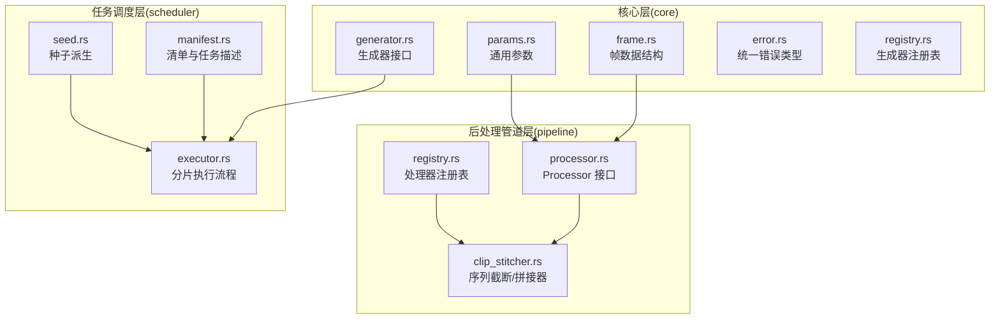
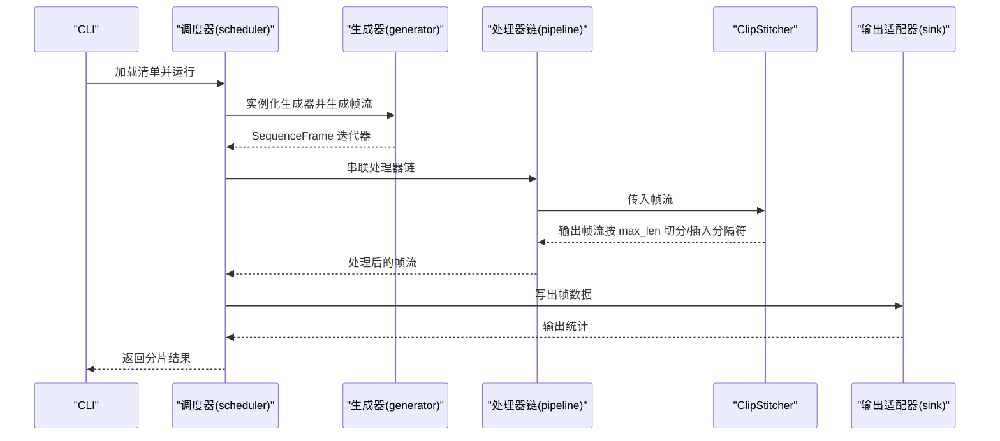
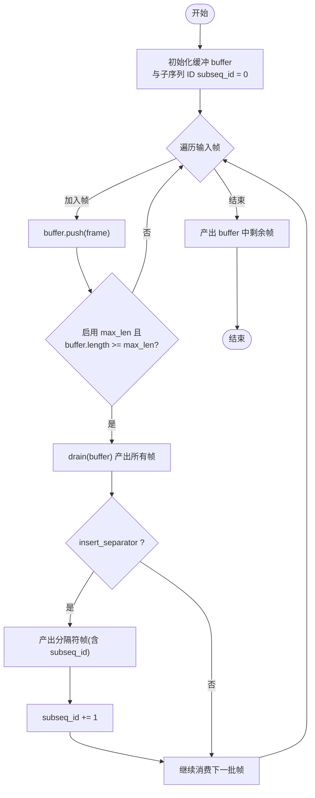
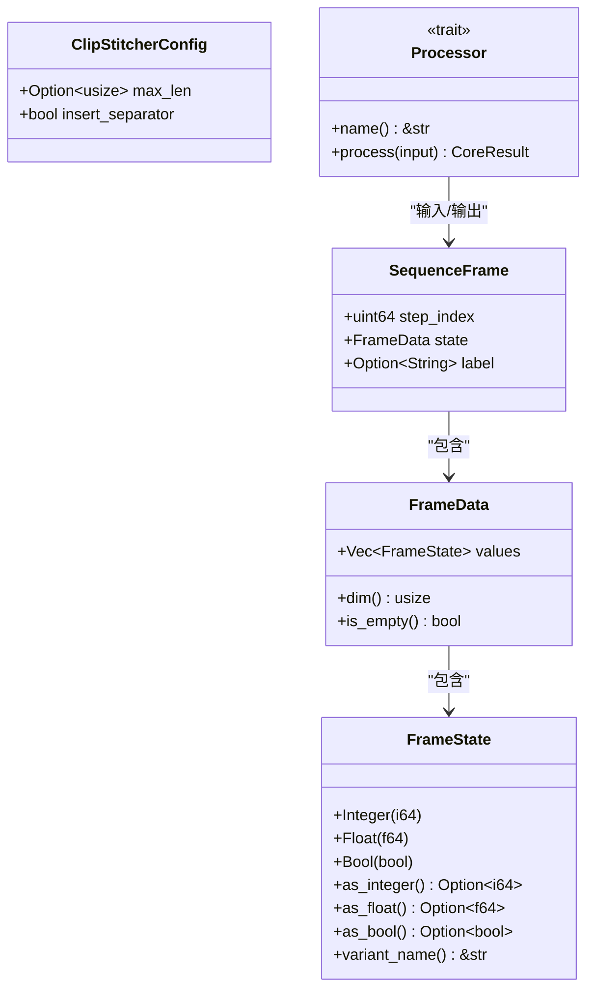
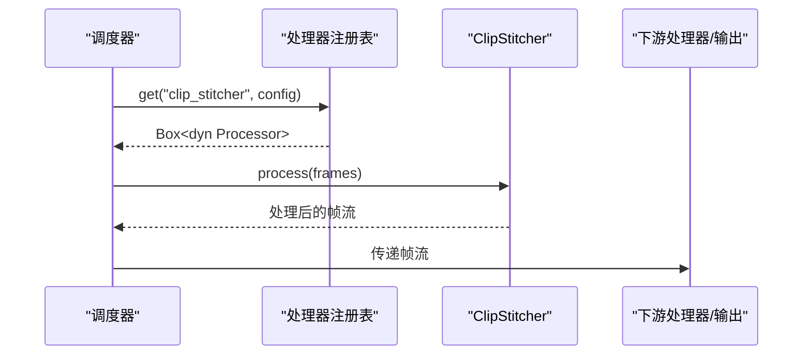
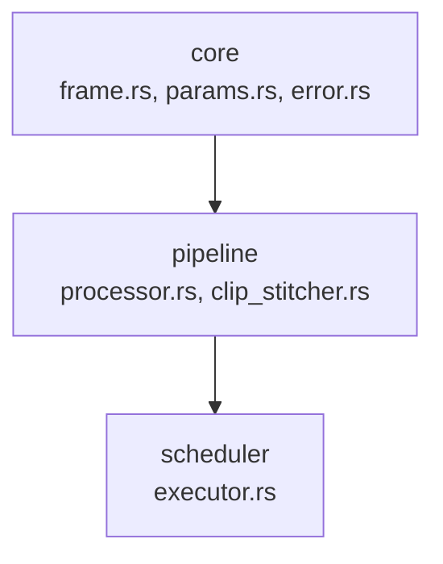

# 序列截断/拼接器

<cite>
**本文档引用的文件**
- [core模块详细设计.md](file://docs/core模块详细设计.md)
- [pipeline模块详细设计.md](file://docs/pipeline模块详细设计.md)
- [scheduler模块详细设计.md](file://docs/scheduler模块详细设计.md)
- [frame.rs](file://src/core/frame.rs)
- [params.rs](file://src/core/params.rs)
- [generator.rs](file://src/core/generator.rs)
- [error.rs](file://src/core/error.rs)
- [registry.rs](file://src/core/registry.rs)
- [main.rs](file://src/main.rs)
</cite>

## 目录
1. [简介](#简介)
2. [项目结构](#项目结构)
3. [核心组件](#核心组件)
4. [架构概览](#架构概览)
5. [详细组件分析](#详细组件分析)
6. [依赖分析](#依赖分析)
7. [性能考虑](#性能考虑)
8. [故障排查指南](#故障排查指南)
9. [结论](#结论)
10. [附录](#附录)

## 简介
本文件针对 StructGen-rs 的“序列截断/拼接器”（ClipStitcher）处理器进行系统化技术文档编写。该处理器位于后处理管道层，负责将过长的单序列切分为多个固定长度的子序列，或在序列间插入分隔标记帧，以便适配下游模型的输入长度限制。文档将从架构定位、数据结构、算法实现、配置参数、内存管理、使用示例与最佳实践等维度进行全面阐述。

## 项目结构
StructGen-rs 采用分层架构，核心抽象层（core）定义统一的数据类型与接口契约，后处理管道层（pipeline）在此基础上实现可组合的处理器链。ClipStitcher 属于 pipeline 的内置处理器之一，其配置结构体与算法逻辑在 pipeline 文档中给出。

**图表来源**
- [core模块详细设计.md:422-433](file://docs/core模块详细设计.md#L422-L433)
- [pipeline模块详细设计.md:30-40](file://docs/pipeline模块详细设计.md#L30-L40)
- [scheduler模块详细设计.md:30-37](file://docs/scheduler模块详细设计.md#L30-L37)

**章节来源**
- [core模块详细设计.md:422-433](file://docs/core模块详细设计.md#L422-L433)
- [pipeline模块详细设计.md:30-40](file://docs/pipeline模块详细设计.md#L30-L40)
- [scheduler模块详细设计.md:30-37](file://docs/scheduler模块详细设计.md#L30-L37)

## 核心组件
- 处理器接口与注册表
  - Processor trait 定义了处理器的统一行为：接收帧迭代器并返回变换后的帧迭代器，要求实现 Send + Sync，保证多线程安全。
  - ProcessorRegistry 维护名称到构造函数的映射，支持按名称查找与实例化处理器。
- ClipStitcher 配置
  - ClipStitcherConfig 包含两个关键参数：
    - max_len：最大序列长度（帧数），None 表示禁用截断。
    - insert_separator：是否在序列之间插入分隔标记帧。
- 帧数据结构
  - SequenceFrame、FrameData、FrameState 为处理器提供统一的数据载体，确保在管道中进行无语义改变的表示变换。

**章节来源**
- [pipeline模块详细设计.md:55-83](file://docs/pipeline模块详细设计.md#L55-L83)
- [pipeline模块详细设计.md:181-190](file://docs/pipeline模块详细设计.md#L181-L190)
- [core模块详细设计.md:110-131](file://docs/core模块详细设计.md#L110-L131)

## 架构概览
ClipStitcher 作为 pipeline 的一个处理器，遵循以下调用链路：调度器（scheduler）实例化生成器并获取帧迭代器，随后按任务清单中的 pipeline 列表依次组装处理器链，最后由输出适配器写出。ClipStitcher 在该链路中负责缓冲与切分，必要时插入分隔帧。

**图表来源**
- [scheduler模块详细设计.md:230-278](file://docs/scheduler模块详细设计.md#L230-L278)
- [pipeline模块详细设计.md:364-375](file://docs/pipeline模块详细设计.md#L364-L375)

**章节来源**
- [scheduler模块详细设计.md:230-278](file://docs/scheduler模块详细设计.md#L230-L278)
- [pipeline模块详细设计.md:364-375](file://docs/pipeline模块详细设计.md#L364-L375)

## 详细组件分析

### 组件：序列截断/拼接器（ClipStitcher）
- 功能定位
  - 将过长的单序列切分为多个固定长度子序列，或在序列间插入分隔标记帧，便于下游模型按固定上下文长度处理。
- 算法实现（基于文档伪代码）
  - 维护一个缓冲区 buffer，逐帧加入。
  - 当启用 max_len 且缓冲长度达到或超过 max_len 时：
    - 将缓冲区中的帧全部产出（drain 清空）。
    - 若启用 insert_separator，则产出一个分隔符帧（包含子序列 ID）。
    - 子序列 ID 自增。
  - 遍历结束后，产出剩余缓冲中的帧。
- 缓冲区管理
  - 使用 Vec<SequenceFrame> 作为缓冲，按需增长；当满足截断条件时通过 drain 清空，避免复制与频繁扩容。
- 分隔符帧与子序列 ID
  - 分隔符帧用于标记子序列边界；子序列 ID 从 0 开始递增，确保不同子序列可区分。
- 配置参数
  - max_len：最大序列长度（帧数），None 表示不截断。
  - insert_separator：是否插入分隔符帧。
- 与上游/下游的交互
  - 输入：SequenceFrame 迭代器。
  - 输出：按 max_len 切分后的 SequenceFrame 迭代器，必要时插入分隔符帧。
  - 语义：不新增帧、不改变 step_index 的语义，仅改变序列的物理边界。

**图表来源**
- [pipeline模块详细设计.md:331-352](file://docs/pipeline模块详细设计.md#L331-L352)

**章节来源**
- [pipeline模块详细设计.md:327-352](file://docs/pipeline模块详细设计.md#L327-L352)

### 数据结构与类型契约
- SequenceFrame、FrameData、FrameState
  - 作为处理器的输入/输出载体，确保在管道中进行无语义改变的表示变换。
- ClipStitcherConfig
  - max_len：Option<usize>，None 表示禁用截断。
  - insert_separator：bool。
- 处理器接口与注册表
  - Processor trait：process(input) -> Result<Box<dyn Iterator<Item = SequenceFrame> + Send>>。
  - ProcessorRegistry：按名称查找并实例化处理器。

**图表来源**
- [frame.rs:90-118](file://src/core/frame.rs#L90-L118)
- [frame.rs:52-81](file://src/core/frame.rs#L52-L81)
- [frame.rs:3-12](file://src/core/frame.rs#L3-L12)
- [pipeline模块详细设计.md:181-190](file://docs/pipeline模块详细设计.md#L181-L190)
- [pipeline模块详细设计.md:55-79](file://docs/pipeline模块详细设计.md#L55-L79)

**章节来源**
- [frame.rs:3-12](file://src/core/frame.rs#L3-L12)
- [frame.rs:52-81](file://src/core/frame.rs#L52-L81)
- [frame.rs:90-118](file://src/core/frame.rs#L90-L118)
- [pipeline模块详细设计.md:181-190](file://docs/pipeline模块详细设计.md#L181-L190)
- [pipeline模块详细设计.md:55-79](file://docs/pipeline模块详细设计.md#L55-L79)

### 处理器调用序列（端到端）
- 调度器按任务清单组装处理器链，ClipStitcher 作为其中一环参与数据变换。
- 生成器产出帧流，经 ClipStitcher 截断/拼接后，交由下游处理器或输出适配器。

**图表来源**
- [scheduler模块详细设计.md:244-254](file://docs/scheduler模块详细设计.md#L244-L254)
- [pipeline模块详细设计.md:85-118](file://docs/pipeline模块详细设计.md#L85-L118)

**章节来源**
- [scheduler模块详细设计.md:244-254](file://docs/scheduler模块详细设计.md#L244-L254)
- [pipeline模块详细设计.md:85-118](file://docs/pipeline模块详细设计.md#L85-L118)

## 依赖分析
- 与核心层的依赖
  - ClipStitcher 依赖 core 的 SequenceFrame、FrameData、FrameState 等类型，确保在管道中进行无语义改变的表示变换。
- 与调度层的依赖
  - 调度器通过 ProcessorRegistry 按名称实例化 ClipStitcher，并将其串联到处理器链中。
- 与错误处理的依赖
  - 处理器 process 返回 CoreResult，错误向上游传播，由调度器统一处理。

**图表来源**
- [core模块详细设计.md:422-433](file://docs/core模块详细设计.md#L422-L433)
- [pipeline模块详细设计.md:356-362](file://docs/pipeline模块详细设计.md#L356-L362)
- [scheduler模块详细设计.md:324-335](file://docs/scheduler模块详细设计.md#L324-L335)

**章节来源**
- [core模块详细设计.md:422-433](file://docs/core模块详细设计.md#L422-L433)
- [pipeline模块详细设计.md:356-362](file://docs/pipeline模块详细设计.md#L356-L362)
- [scheduler模块详细设计.md:324-335](file://docs/scheduler模块详细设计.md#L324-L335)

## 性能考虑
- 迭代器零成本抽象
  - ClipStitcher 以惰性迭代器适配器形式实现，不物化中间结果，避免额外内存开销。
- 缓冲区增长与回收
  - 使用 Vec<SequenceFrame> 作为缓冲，按需增长；满足截断条件时通过 drain 清空，避免复制与频繁扩容。
- 内存峰值控制
  - 缓冲区最大长度受 max_len 控制，内存峰值约为 max_len × 单帧字节数。
- 并发与线程安全
  - 处理器实现为 Send + Sync，可在 rayon 线程池中使用，提升吞吐。

**章节来源**
- [pipeline模块详细设计.md:396-402](file://docs/pipeline模块详细设计.md#L396-L402)
- [core模块详细设计.md:477-482](file://docs/core模块详细设计.md#L477-L482)

## 故障排查指南
- 常见问题
  - 处理器名称未注册：在清单中引用了未注册的处理器名称，将在实例化阶段报错。
  - 配置 JSON 反序列化失败：处理器配置 JSON 不合法，会在 ProcessorRegistry::get 中立即报错。
  - 生成过程错误：生成器抛出错误，由调度器捕获并记录到 ShardResult。
- 建议排查步骤
  - 确认清单中 pipeline 列表的处理器名称存在于注册表。
  - 检查 ClipStitcherConfig 的 max_len 与 insert_separator 设置是否符合预期。
  - 在流式写出模式下，确认下游 sink 能正确处理分隔符帧与子序列边界。

**章节来源**
- [pipeline模块详细设计.md:386-394](file://docs/pipeline模块详细设计.md#L386-L394)
- [scheduler模块详细设计.md:382-394](file://docs/scheduler模块详细设计.md#L382-L394)
- [error.rs:310-356](file://src/core/error.rs#L310-L356)

## 结论
ClipStitcher 作为 StructGen-rs 管道层的重要处理器，通过简单的缓冲与截断策略，有效解决了长序列适配下游模型输入长度限制的问题。其惰性迭代器实现与可配置的分隔符插入机制，使其在保证性能的同时具备良好的可组合性与可复现性。结合调度器的确定性种子派生与并行分片策略，可稳定地支撑大规模数据生产。

## 附录

### 配置参数说明
- ClipStitcherConfig
  - max_len：最大序列长度（帧数），None 表示不截断。
  - insert_separator：是否在序列之间插入分隔标记帧。
- GenParams 与扩展字段
  - 通过 GenParams.extensions 传递处理器配置，支持不同任务使用同一处理器的不同配置。

**章节来源**
- [pipeline模块详细设计.md:181-190](file://docs/pipeline模块详细设计.md#L181-L190)
- [params.rs:68-123](file://src/core/params.rs#L68-L123)

### 使用示例与最佳实践
- 示例场景
  - 将长度为 1000 的序列按 max_len=256 切分为 4 个子序列，并在序列间插入分隔符帧，便于下游模型分段处理。
- 最佳实践
  - 根据下游模型的最大上下文长度设置 max_len，确保每个子序列不超过限制。
  - 启用 insert_separator 以明确子序列边界，便于后续解析与统计。
  - 在大规模数据生产中，结合调度器的并行分片策略，提升整体吞吐。

**章节来源**
- [pipeline模块详细设计.md:327-352](file://docs/pipeline模块详细设计.md#L327-L352)
- [scheduler模块详细设计.md:280-303](file://docs/scheduler模块详细设计.md#L280-L303)