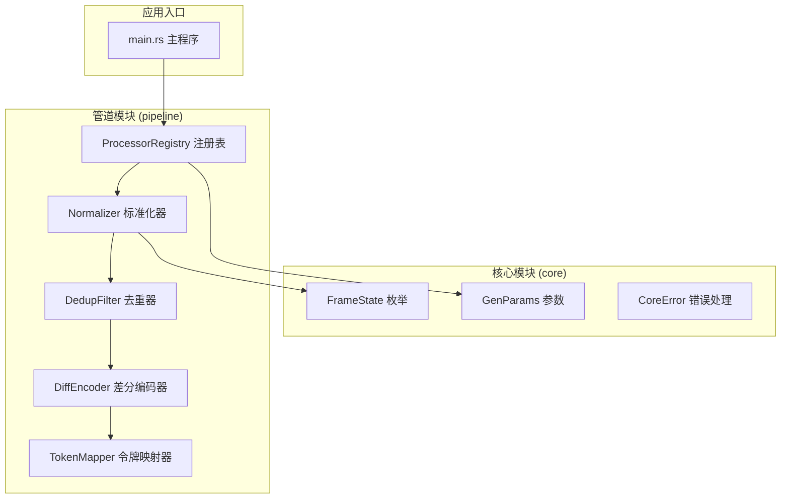
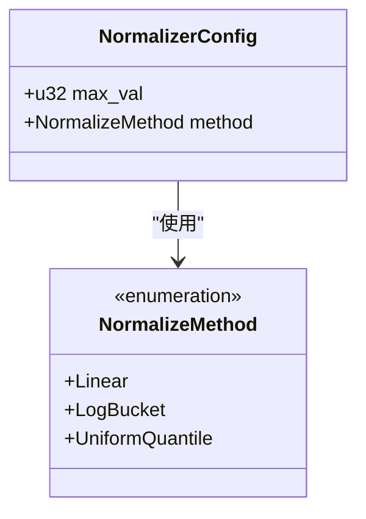
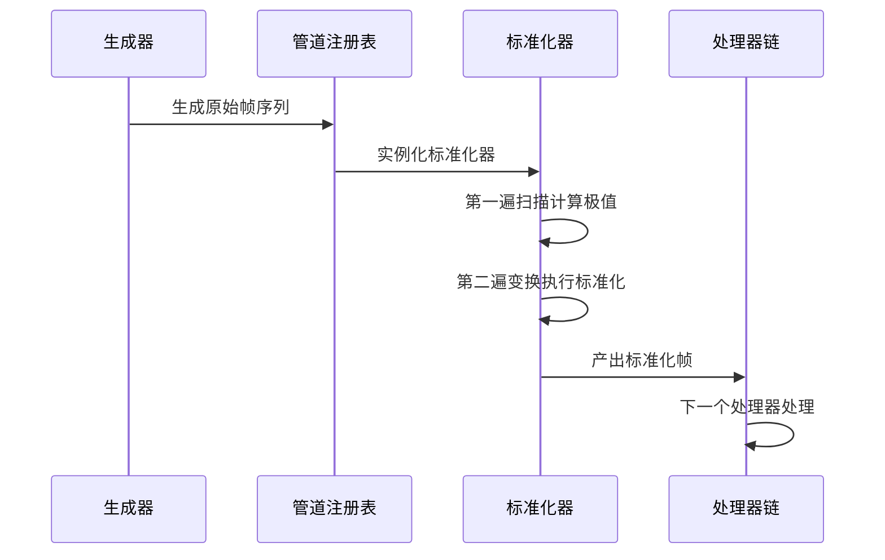
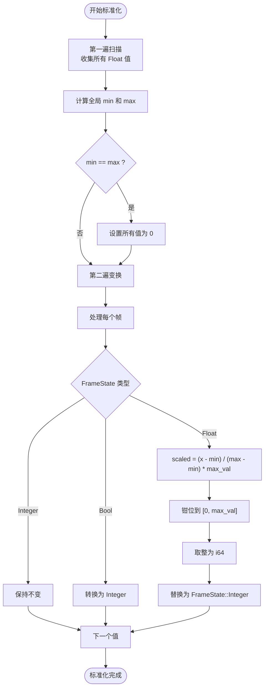
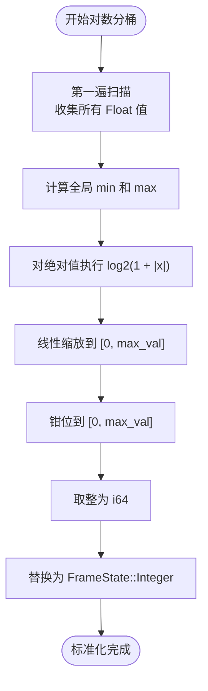
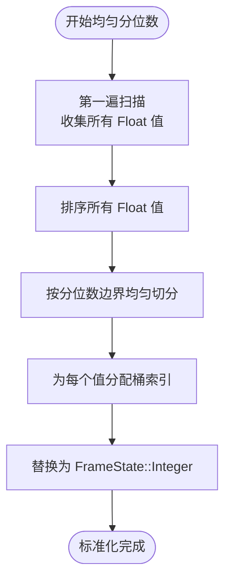
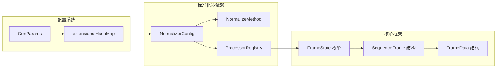
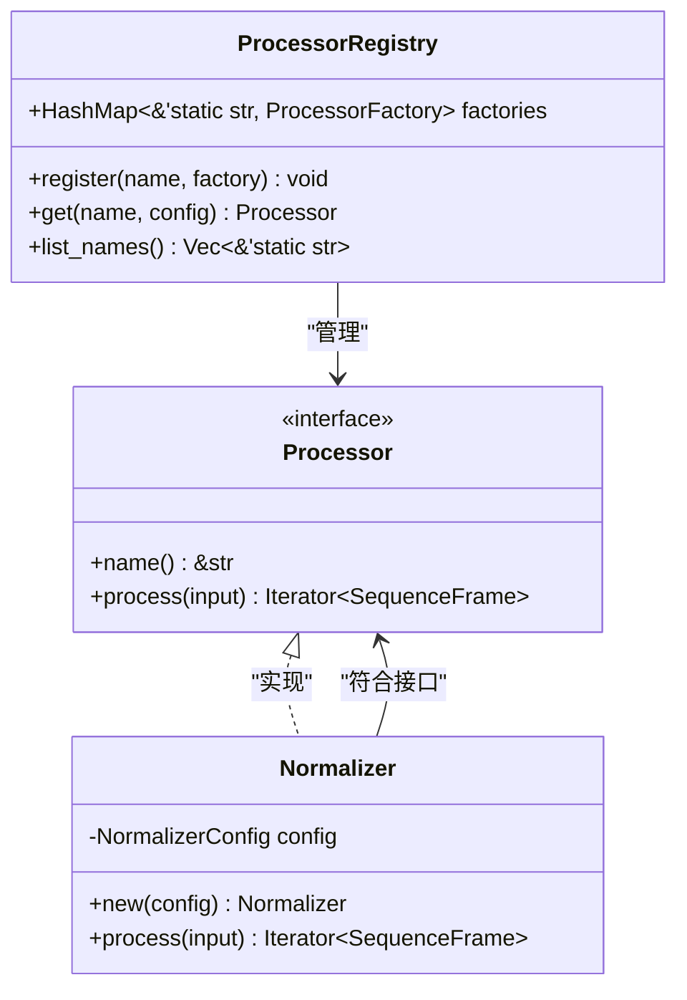
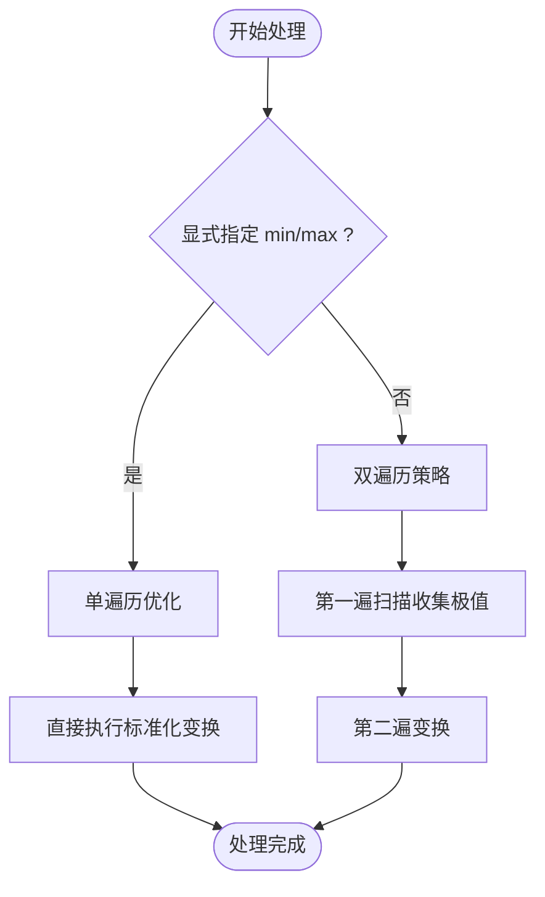

# 标准化器

<cite>
**本文档引用的文件**
- [pipeline模块详细设计.md](file://docs/pipeline模块详细设计.md)
- [frame.rs](file://src/core/frame.rs)
- [params.rs](file://src/core/params.rs)
- [main.rs](file://src/main.rs)
</cite>

## 目录
1. [简介](#简介)
2. [项目结构](#项目结构)
3. [核心组件](#核心组件)
4. [架构概览](#架构概览)
5. [详细组件分析](#详细组件分析)
6. [依赖分析](#依赖分析)
7. [性能考虑](#性能考虑)
8. [故障排除指南](#故障排除指南)
9. [结论](#结论)
10. [附录](#附录)

## 简介

标准化器是 StructGen-rs 后处理管道层中的核心组件，负责将连续浮点值映射到有限整数范围，消除浮点精度噪声并形成固定大小词汇表。该处理器实现了三种标准化方法：线性缩放、对数分桶和均匀分位数量化，为下游语言模型训练提供规范化的数据格式。

## 项目结构

StructGen-rs 采用模块化架构设计，标准化器作为 pipeline 模块的重要组成部分，与核心框架紧密集成：

**图表来源**
- [main.rs:1-6](file://src/main.rs#L1-L6)
- [frame.rs:1-210](file://src/core/frame.rs#L1-L210)
- [params.rs:1-235](file://src/core/params.rs#L1-L235)

**章节来源**
- [main.rs:1-6](file://src/main.rs#L1-L6)
- [frame.rs:1-210](file://src/core/frame.rs#L1-L210)
- [params.rs:1-235](file://src/core/params.rs#L1-L235)

## 核心组件

### 标准化器配置结构

标准化器通过 `NormalizerConfig` 结构体进行配置，包含以下关键参数：

| 参数名称 | 类型 | 默认值 | 描述 |
|---------|------|--------|------|
| `max_val` | u32 | 255 | 目标整数范围上限（含），如 255 表示映射到 [0, 255] |
| `method` | NormalizeMethod | Linear | 标准化方法选择 |

### 标准化方法枚举

**图表来源**
- [pipeline模块详细设计.md:123-144](file://docs/pipeline模块详细设计.md#L123-L144)

**章节来源**
- [pipeline模块详细设计.md:123-144](file://docs/pipeline模块详细设计.md#L123-L144)

## 架构概览

标准化器在 StructGen-rs 系统中的位置和作用：

**图表来源**
- [pipeline模块详细设计.md:195-224](file://docs/pipeline模块详细设计.md#L195-L224)

标准化器作为管道层的第一个处理器，负责将浮点值转换为整数，为后续的去重、差分编码和令牌映射提供统一的数据格式。

## 详细组件分析

### 线性标准化算法

线性标准化是最直观的方法，通过仿射变换将输入范围映射到目标整数范围：

**图表来源**
- [pipeline模块详细设计.md:199-222](file://docs/pipeline模块详细设计.md#L199-L222)

### 对数分桶标准化

对数分桶方法特别适用于具有宽范围动态特性的浮点数据：

**图表来源**
- [pipeline模块详细设计.md:219-221](file://docs/pipeline模块详细设计.md#L219-L221)

### 均匀分位数量化

均匀分位数量化确保每个整数值对应相等概率范围的输入值：

**图表来源**
- [pipeline模块详细设计.md:221](file://docs/pipeline模块详细设计.md#L221)

### 数据类型处理策略

标准化器对不同数据类型的处理遵循以下策略：

| FrameState 类型 | 处理方式 | 示例 |
|----------------|----------|------|
| Float | 标准化变换 | 3.14 → 150 |
| Integer | 保持不变 | 42 → 42 |
| Bool | 转换为 Integer | true → 1, false → 0 |

**章节来源**
- [pipeline模块详细设计.md:208-216](file://docs/pipeline模块详细设计.md#L208-L216)
- [frame.rs:14-50](file://src/core/frame.rs#L14-L50)

## 依赖分析

标准化器与系统其他组件的依赖关系：

**图表来源**
- [pipeline模块详细设计.md:123-144](file://docs/pipeline模块详细设计.md#L123-L144)
- [frame.rs:1-210](file://src/core/frame.rs#L1-L210)
- [params.rs:68-123](file://src/core/params.rs#L68-L123)

### 处理器注册机制

标准化器通过 `ProcessorRegistry` 进行注册和实例化：

**图表来源**
- [pipeline模块详细设计.md:85-118](file://docs/pipeline模块详细设计.md#L85-L118)
- [pipeline模块详细设计.md:55-83](file://docs/pipeline模块详细设计.md#L55-L83)

**章节来源**
- [pipeline模块详细设计.md:85-118](file://docs/pipeline模块详细设计.md#L85-L118)
- [pipeline模块详细设计.md:55-83](file://docs/pipeline模块详细设计.md#L55-L83)

## 性能考虑

### 双遍历策略优化

标准化器采用经典的双遍历策略以确保准确的全局极值计算：

1. **第一遍扫描**：遍历所有帧，收集所有 `FrameState::Float` 值，计算全局最小值和最大值
2. **第二遍变换**：对每帧执行标准化变换

这种策略确保了变换的一致性和可复现性。

### 单遍历优化

当显式指定 `min` 和 `max` 边界时，标准化器可以跳过第一遍扫描，直接进行单遍历优化：

**图表来源**
- [pipeline模块详细设计.md:400](file://docs/pipeline模块详细设计.md#L400)

### 内存和计算优化

- **惰性求值**：标准化器实现为惰性迭代器，不产生中间缓冲区
- **流式处理**：支持大数据集的流式处理，内存占用与序列长度无关
- **类型安全**：利用 Rust 的类型系统确保数据转换的安全性

**章节来源**
- [pipeline模块详细设计.md:396-402](file://docs/pipeline模块详细设计.md#L396-L402)

## 故障排除指南

### 常见问题和解决方案

| 问题类型 | 症状 | 可能原因 | 解决方案 |
|----------|------|----------|----------|
| 空输入 | 标准化器返回空迭代器 | 输入数据为空或只有非 Float 值 | 检查上游生成器输出 |
| 极值相等 | 所有值映射为 0 | min == max，数据无变化 | 调整数据源或使用其他方法 |
| 数值溢出 | 整数转换错误 | 浮点值超出 i64 范围 | 检查数据预处理 |
| 配置错误 | 处理器实例化失败 | JSON 配置格式不正确 | 验证配置文件格式 |

### 调试建议

1. **验证数据类型**：确保输入数据包含足够的 `FrameState::Float` 值
2. **检查配置参数**：确认 `max_val` 和 `method` 设置合理
3. **监控内存使用**：标准化器应保持稳定的内存占用
4. **测试小数据集**：先在小规模数据上验证算法正确性

**章节来源**
- [pipeline模块详细设计.md:386-394](file://docs/pipeline模块详细设计.md#L386-L394)

## 结论

标准化器作为 StructGen-rs 系统的关键组件，通过将连续浮点值映射到有限整数范围，为下游处理提供了统一、规范的数据格式。其支持的三种标准化方法各有特点，适用于不同的数据分布和应用场景。

通过双遍历策略确保了变换的准确性，同时提供了单遍历优化以适应大规模数据处理需求。结合惰性求值和流式处理特性，标准化器能够在保证性能的同时提供灵活的配置选项。

## 附录

### 使用场景示例

1. **科学模拟数据**：对连续物理量进行离散化处理
2. **金融时间序列**：将价格变动映射到固定精度的整数
3. **生物信息学**：标准化基因表达水平等连续测量值
4. **图像处理**：将像素强度值量化到标准范围

### 配置最佳实践

- **Linear 方法**：适用于均匀分布的数据
- **LogBucket 方法**：适用于具有宽范围动态特性的数据
- **UniformQuantile 方法**：适用于需要等概率分布的场景
- **max_val 选择**：根据下游模型的词汇表大小和精度要求确定