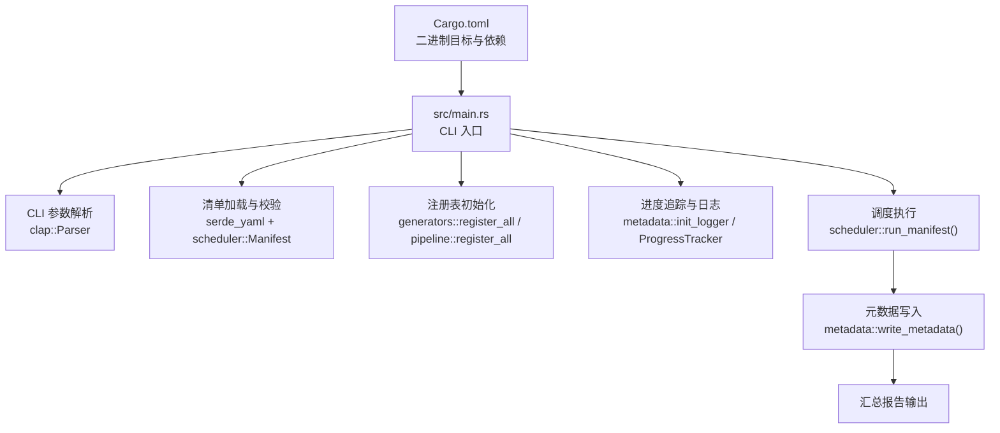
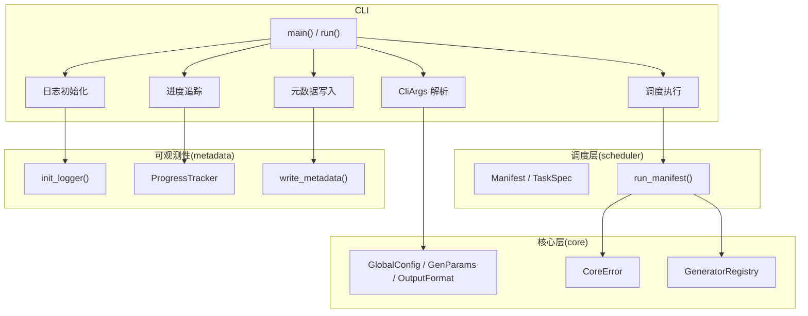
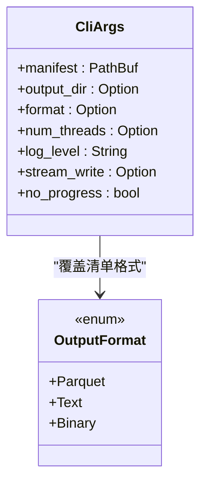
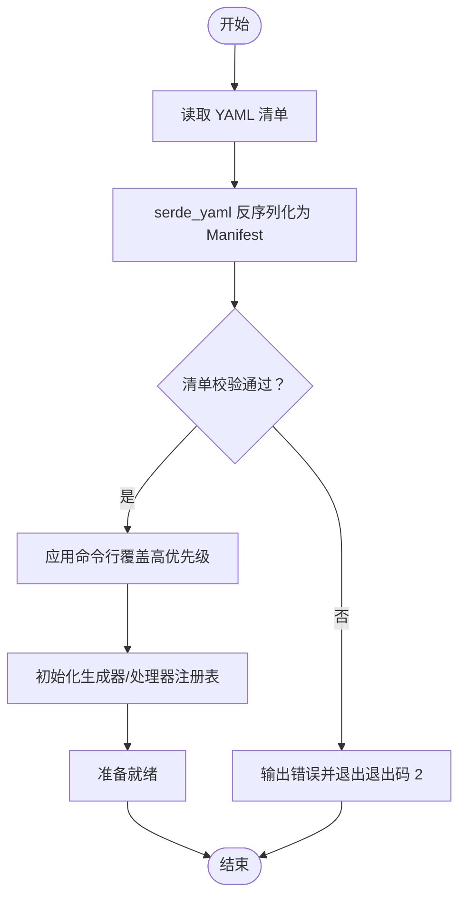
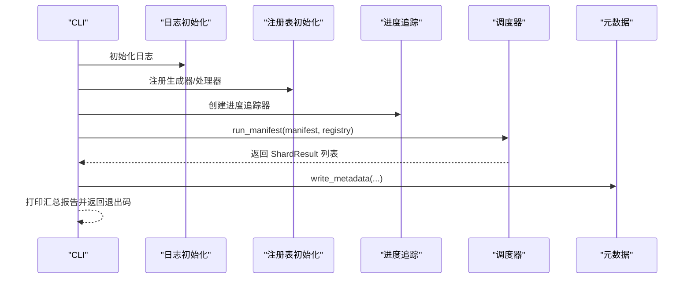
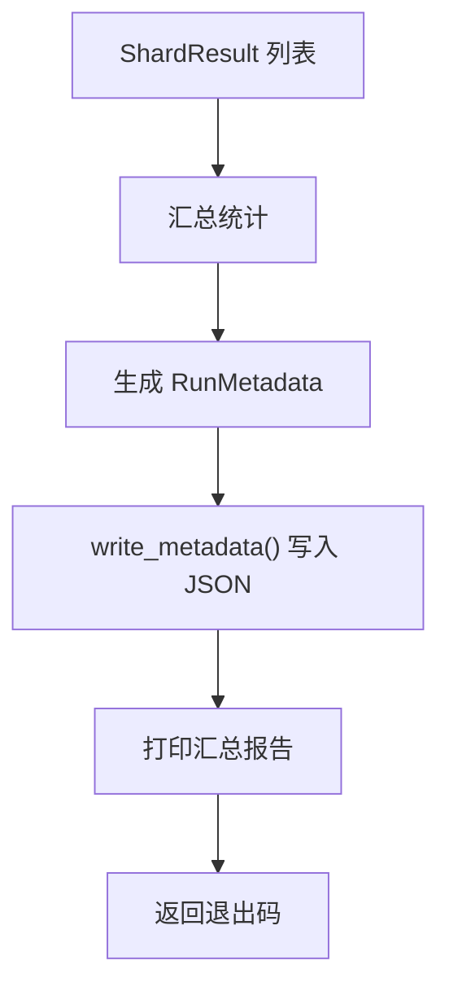
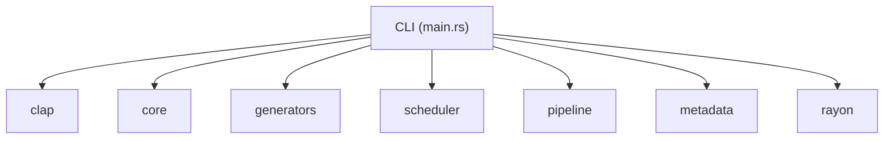

# 命令行接口

<cite>
**本文引用的文件**
- [main.rs](file://src/main.rs)
- [Cargo.toml](file://Cargo.toml)
- [CLI模块详细设计.md](file://docs/CLI模块详细设计.md)
- [core模块详细设计.md](file://docs/core模块详细设计.md)
- [scheduler模块详细设计.md](file://docs/scheduler模块详细设计.md)
- [pipeline模块详细设计.md](file://docs/pipeline模块详细设计.md)
- [开发规划.md](file://docs/开发规划.md)
- [params.rs](file://src/core/params.rs)
- [error.rs](file://src/core/error.rs)
- [generator.rs](file://src/core/generator.rs)
- [frame.rs](file://src/core/frame.rs)
- [registry.rs](file://src/core/registry.rs)
</cite>

## 目录
1. [简介](#简介)
2. [项目结构](#项目结构)
3. [核心组件](#核心组件)
4. [架构总览](#架构总览)
5. [详细组件分析](#详细组件分析)
6. [依赖分析](#依赖分析)
7. [性能考量](#性能考量)
8. [故障排除指南](#故障排除指南)
9. [结论](#结论)
10. [附录](#附录)

## 简介
本文件面向 StructGen-rs 的命令行接口（CLI），系统化阐述命令行参数解析、配置文件处理、帮助信息生成、任务执行流程、清单加载与解析、结果输出与报告生成机制，并提供实用的命令行使用示例与常见用法模式。CLI 作为系统的唯一入口，负责参数解析、日志初始化、清单加载与校验、注册表初始化、进度追踪、调度执行、元数据写入与汇总报告输出，并根据执行结果返回合适的退出码。

## 项目结构
- CLI 二进制入口位于 src/main.rs，当前仓库中该文件仅为占位，实际 CLI 的参数定义与运行流程在设计文档中详细描述。
- Cargo.toml 定义了二进制目标与依赖，其中 CLI 依赖 clap 进行参数解析。
- 核心抽象层（core 模块）提供参数与配置数据结构（GlobalConfig、GenParams、OutputFormat 等），这些类型被 CLI 与调度层共同使用。
- 设计文档详细描述了 CLI 的参数、覆盖策略、执行流程、错误处理与退出码。

**图表来源**
- [Cargo.toml:1-10](file://Cargo.toml#L1-L10)
- [main.rs:1-6](file://src/main.rs#L1-L6)
- [CLI模块详细设计.md:277-304](file://docs/CLI模块详细设计.md#L277-L304)

**章节来源**
- [Cargo.toml:1-10](file://Cargo.toml#L1-L10)
- [main.rs:1-6](file://src/main.rs#L1-L6)
- [CLI模块详细设计.md:1-459](file://docs/CLI模块详细设计.md#L1-L459)

## 核心组件
- 命令行参数定义与解析
  - 使用 clap::Parser 定义 CliArgs，包含 --manifest、--output-dir、--format、--num-threads、--log-level、--stream-write、--no-progress 等参数。
  - 参数解析失败时由 clap 自动生成帮助信息并退出。
- 配置文件处理
  - 通过 serde_yaml 读取并解析 YAML 清单为 Manifest，随后进行清单校验（生成器/处理器名称存在性、任务计数、分片大小等）。
  - 命令行参数具有最高优先级，覆盖清单中的 global 字段。
- 任务执行流程
  - 初始化日志、设置 rayon 线程池、注册生成器与处理器、创建输出目录、启动进度显示线程、调用调度器执行、停止进度、写入元数据、打印汇总报告、返回退出码。
- 结果输出与报告
  - 生成 metadata.json 并输出汇总报告，包含任务统计、耗时、文件数量与数据体积等信息。
- 错误处理与调试
  - 明确的错误分类与退出码策略；panic 时通过自定义 hook 输出结构化日志；提供详尽的错误信息与修复建议。

**章节来源**
- [CLI模块详细设计.md:45-121](file://docs/CLI模块详细设计.md#L45-L121)
- [CLI模块详细设计.md:123-217](file://docs/CLI模块详细设计.md#L123-L217)
- [CLI模块详细设计.md:306-333](file://docs/CLI模块详细设计.md#L306-L333)
- [scheduler模块详细设计.md:180-196](file://docs/scheduler模块详细设计.md#L180-L196)

## 架构总览
CLI 作为系统唯一入口，负责编排各子系统：解析参数、加载清单、初始化注册表、设置线程池、启动进度追踪、调用调度器执行、写入元数据并打印汇总报告。其依赖关系如下：

**图表来源**
- [CLI模块详细设计.md:277-304](file://docs/CLI模块详细设计.md#L277-L304)
- [scheduler模块详细设计.md:130-154](file://docs/scheduler模块详细设计.md#L130-L154)
- [core模块详细设计.md:539-553](file://docs/core模块详细设计.md#L539-L553)

## 详细组件分析

### 命令行参数定义与解析
- 参数定义
  - --manifest（必需）：任务清单 YAML 文件路径。
  - --output-dir：覆盖清单中的 global.output_dir。
  - --format：覆盖清单中的 global.default_format，支持 parquet、text、binary。
  - --num-threads：覆盖清单中的 global.num_threads，默认为 CPU 逻辑核心数。
  - --log-level：覆盖清单中的 global.log_level，默认 info。
  - --stream-write：覆盖清单中的 global.stream_write。
  - --no-progress：禁用进度条（CI/重定向场景）。
- 解析与验证
  - 使用 clap::Parser 进行解析；缺少 --manifest 时由 clap 输出帮助并退出。
  - 参数解析失败时输出人类可读错误与修复建议。
- 覆盖策略
  - 命令行参数 > 清单 global 字段 > 清单任务级字段 > 硬编码默认值。

**图表来源**
- [CLI模块详细设计.md:49-87](file://docs/CLI模块详细设计.md#L49-L87)
- [params.rs:8-18](file://src/core/params.rs#L8-L18)

**章节来源**
- [CLI模块详细设计.md:45-87](file://docs/CLI模块详细设计.md#L45-L87)
- [CLI模块详细设计.md:219-236](file://docs/CLI模块详细设计.md#L219-L236)

### 配置文件处理与清单加载
- 清单加载
  - 读取 YAML 文件并使用 serde_yaml 反序列化为 Manifest。
  - 清单校验：global.output_dir 可写、任务名称唯一、任务计数 > 0、处理器与生成器名称均已在注册表中注册、分片大小 > 0。
- 覆盖与应用
  - 命令行参数覆盖清单 global 字段，随后应用到调度器与各子系统。
- 生成器与处理器注册
  - 初始化生成器注册表与处理器注册表，确保清单中引用的名称均已注册。

**图表来源**
- [CLI模块详细设计.md:139-175](file://docs/CLI模块详细设计.md#L139-L175)
- [scheduler模块详细设计.md:180-196](file://docs/scheduler模块详细设计.md#L180-L196)

**章节来源**
- [CLI模块详细设计.md:139-175](file://docs/CLI模块详细设计.md#L139-L175)
- [scheduler模块详细设计.md:180-196](file://docs/scheduler模块详细设计.md#L180-L196)

### 任务执行流程与调度
- 执行流程
  - 初始化日志与进度追踪器。
  - 设置 rayon 线程池大小。
  - 调用 scheduler::run_manifest() 执行任务。
  - 停止进度显示线程，写入元数据，打印汇总报告。
- 调度器职责
  - 将任务切分为分片，派生种子，串联生成器、处理器与输出适配器，收集统计并返回 ShardResult。
- 并发与容错
  - 使用 rayon 并行执行分片；单个分片失败不影响其他分片，失败记录在元数据中。

**图表来源**
- [CLI模块详细设计.md:125-217](file://docs/CLI模块详细设计.md#L125-L217)
- [scheduler模块详细设计.md:130-154](file://docs/scheduler模块详细设计.md#L130-L154)

**章节来源**
- [CLI模块详细设计.md:125-217](file://docs/CLI模块详细设计.md#L125-L217)
- [scheduler模块详细设计.md:228-322](file://docs/scheduler模块详细设计.md#L228-L322)

### 结果输出与报告生成
- 元数据写入
  - 将运行期间的统计信息汇总为 RunMetadata 并写入 metadata.json。
- 汇总报告
  - 输出包含任务统计、总样本数、总帧数、总数据体积、文件数量、耗时与退出码等信息。
- 退出码
  - 0：全部成功；1：部分失败；2：完全失败。

**图表来源**
- [CLI模块详细设计.md:200-217](file://docs/CLI模块详细设计.md#L200-L217)

**章节来源**
- [CLI模块详细设计.md:200-217](file://docs/CLI模块详细设计.md#L200-L217)

### 帮助信息与用户交互
- 帮助输出
  - --help 或参数解析失败时，clap 自动生成帮助信息，包含所有参数说明。
- 交互模式
  - 进度条通过标准错误输出实时刷新；在非 TTY 环境（如 CI/重定向）降级为周期性日志输出。
  - --no-progress 禁用进度条，适用于 CI 或需要纯文本输出的场景。

**章节来源**
- [CLI模块详细设计.md:237-251](file://docs/CLI模块详细设计.md#L237-L251)
- [CLI模块详细设计.md:382-410](file://docs/CLI模块详细设计.md#L382-L410)

## 依赖分析
- CLI 依赖
  - clap：命令行参数解析。
  - core：CliArgs、OutputFormat、GeneratorRegistry、CoreError 等。
  - generators：register_all(&mut GeneratorRegistry)。
  - scheduler：run_manifest()。
  - pipeline：register_all(&mut ProcessorRegistry)。
  - metadata：init_logger()、ProgressTracker、write_metadata()。
  - rayon：设置线程池。
- 模块耦合
  - CLI 仅负责编排，不包含业务逻辑；所有领域知识由各子模块承载。
  - 通过注册表与清单实现松耦合，新增生成器/处理器无需修改 CLI。

**图表来源**
- [CLI模块详细设计.md:277-290](file://docs/CLI模块详细设计.md#L277-L290)

**章节来源**
- [CLI模块详细设计.md:277-290](file://docs/CLI模块详细设计.md#L277-L290)
- [开发规划.md:9-50](file://docs/开发规划.md#L9-L50)

## 性能考量
- CLI 层零开销：全部工作委托给子模块，CLI 仅负责启动与收尾。
- 线程池单次初始化：在程序入口一次性设置 rayon 线程池，避免重复创建。
- 进度条刷新频率：200ms 周期，兼顾感知度与 CPU 开销。
- 建议：可考虑启用 jemalloc 以降低多线程分配开销（在 Cargo.toml 中配置）。

**章节来源**
- [CLI模块详细设计.md:335-341](file://docs/CLI模块详细设计.md#L335-L341)
- [开发规划.md:300-336](file://docs/开发规划.md#L300-L336)

## 故障排除指南
- 常见错误与处理
  - 缺少 --manifest：clap 自动输出帮助并退出（退出码 2）。
  - 清单文件不存在/不可读：输出“清单文件未找到”并退出（退出码 2）。
  - YAML 解析失败：输出“YAML 解析错误（含行列号）”并退出（退出码 2）。
  - 输出目录无法创建：输出“无法创建输出目录”并退出（退出码 2）。
  - 生成器/处理器未注册：输出“未找到生成器/处理器”及可用列表并退出（退出码 2）。
  - 线程数设为 0：输出“num_threads 必须 >= 1”并退出（退出码 2）。
  - 运行时部分分片失败：记录详细错误，进度继续，最终返回部分失败（退出码 1）。
  - metadata.json 写入失败：输出警告，不影响已生成数据，返回部分失败（退出码 1）。
- 调试技巧
  - 使用 --log-level 调整日志级别（trace/debug/info/warn/error）。
  - 在 CI 环境使用 --no-progress 与 --format text 以获得稳定输出。
  - 通过 --num-threads 控制并行度，定位资源瓶颈。
  - 使用 --version 查看版本信息，确认环境一致性。

**章节来源**
- [CLI模块详细设计.md:306-333](file://docs/CLI模块详细设计.md#L306-L333)
- [CLI模块详细设计.md:426-443](file://docs/CLI模块详细设计.md#L426-L443)

## 结论
StructGen-rs 的 CLI 以简洁、鲁棒的方式将用户意图转换为可执行的生成流水线。通过严格的参数解析、清单校验与覆盖策略、完善的错误处理与退出码机制，CLI 为用户提供清晰的交互体验与可靠的运行保障。其编排式设计确保了与各子模块的松耦合与高可维护性，便于后续扩展与迭代。

## 附录

### 命令行使用示例与常见用法
- 最简调用
  - structgen-rs --manifest tasks.yaml
- 指定输出目录与格式
  - structgen-rs --manifest tasks.yaml --output-dir ./data --format parquet
- 限制线程数，启用详细日志
  - structgen-rs -m tasks.yaml -t 4 -l debug
- CI 环境（无进度条，输出到文本格式）
  - structgen-rs -m tasks.yaml -f text --no-progress
- 查看版本
  - structgen-rs --version

**章节来源**
- [CLI模块详细设计.md:426-443](file://docs/CLI模块详细设计.md#L426-L443)

### CLI 与核心数据类型的关联
- GlobalConfig：CLI 解析命令行参数后覆盖清单 global 字段，随后被调度器与各子系统使用。
- OutputFormat：CLI 的 --format 参数覆盖清单中的默认格式。
- GenParams：由 YAML 清单中的任务定义生成，包含序列长度、网格尺寸与扩展参数。

**章节来源**
- [core模块详细设计.md:539-553](file://docs/core模块详细设计.md#L539-L553)
- [params.rs:20-66](file://src/core/params.rs#L20-L66)
- [params.rs:68-123](file://src/core/params.rs#L68-L123)