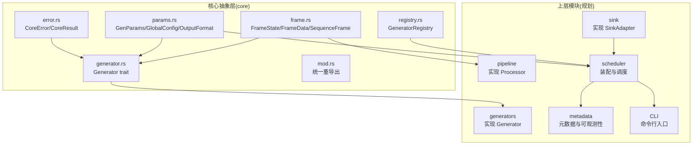
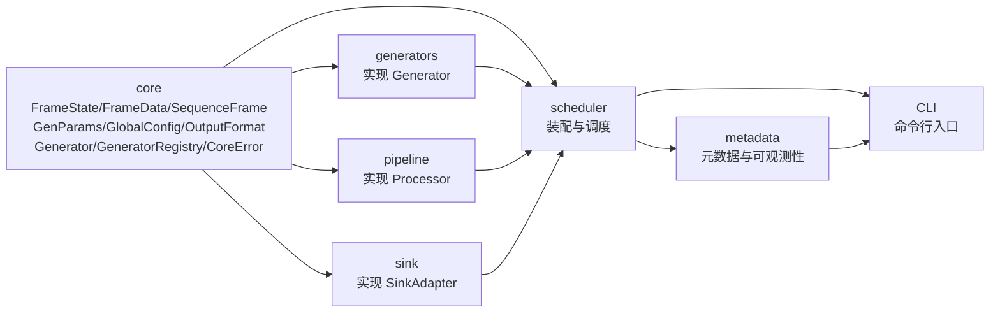
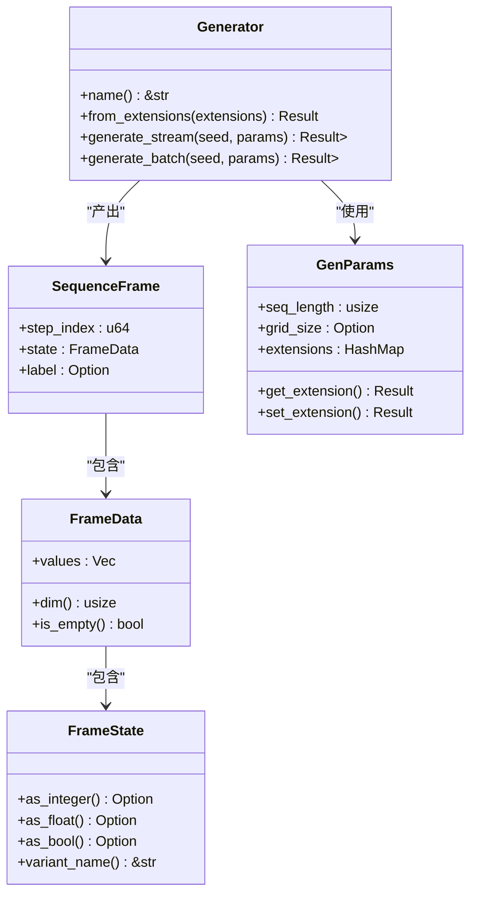
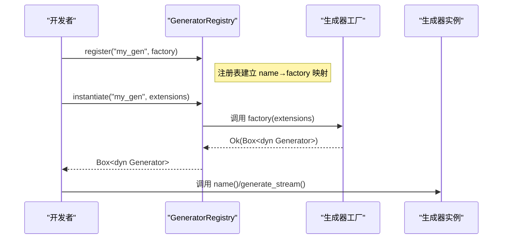
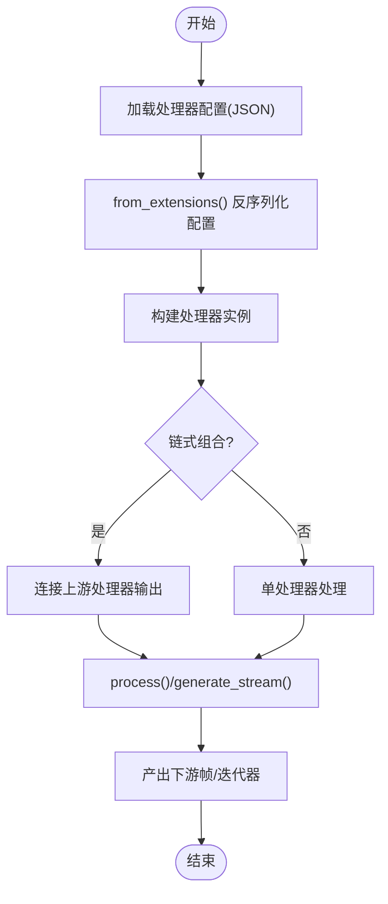
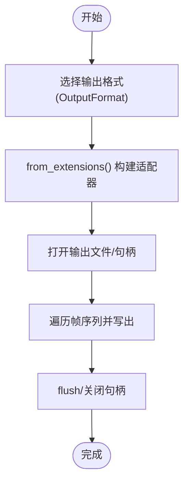
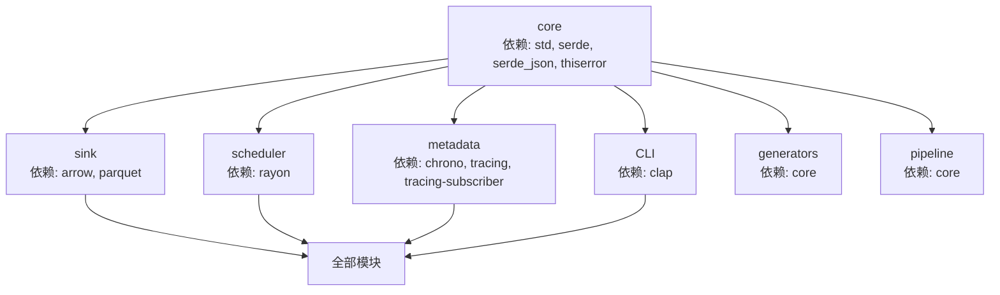

# 开发指南

<cite>
**本文引用的文件列表**
- [src/main.rs](file://src/main.rs)
- [src/core/mod.rs](file://src/core/mod.rs)
- [src/core/generator.rs](file://src/core/generator.rs)
- [src/core/registry.rs](file://src/core/registry.rs)
- [src/core/frame.rs](file://src/core/frame.rs)
- [src/core/params.rs](file://src/core/params.rs)
- [src/core/error.rs](file://src/core/error.rs)
- [Cargo.toml](file://Cargo.toml)
- [docs/core模块详细设计.md](file://docs/core模块详细设计.md)
- [docs/开发规划.md](file://docs/开发规划.md)
- [docs/生成器详细设计.md](file://docs/生成器详细设计.md)
</cite>

## 目录
1. [简介](#简介)
2. [项目结构](#项目结构)
3. [核心组件](#核心组件)
4. [架构总览](#架构总览)
5. [详细组件分析](#详细组件分析)
6. [依赖分析](#依赖分析)
7. [性能考虑](#性能考虑)
8. [故障排查指南](#故障排查指南)
9. [结论](#结论)
10. [附录](#附录)

## 简介
本开发指南面向希望为 StructGen-rs 扩展功能的贡献者，聚焦于如何新增生成器、新增处理器（后处理管道）与新增输出格式。文档基于仓库现有核心抽象层（core 模块）与设计文档，系统阐述 Generator trait 与 Processor trait 的实现方法、注册机制、测试策略、开发环境与调试技巧、性能优化建议、代码规范与持续集成流程，并解释项目的扩展点与插件架构设计。

## 项目结构
当前仓库处于基础设施阶段（core 模块），核心抽象层定义了统一的数据结构、接口契约与错误类型，为后续的生成器、后处理管道、输出适配层、调度器、元数据与 CLI 提供基础。

图表来源
- [src/core/frame.rs:1-210](file://src/core/frame.rs#L1-L210)
- [src/core/params.rs:1-235](file://src/core/params.rs#L1-L235)
- [src/core/generator.rs:1-129](file://src/core/generator.rs#L1-L129)
- [src/core/registry.rs:1-150](file://src/core/registry.rs#L1-L150)
- [src/core/error.rs:1-103](file://src/core/error.rs#L1-L103)
- [docs/开发规划.md:1-370](file://docs/开发规划.md#L1-L370)

章节来源
- [src/core/mod.rs:1-16](file://src/core/mod.rs#L1-L16)
- [docs/core模块详细设计.md:1-553](file://docs/core模块详细设计.md#L1-L553)
- [docs/开发规划.md:1-370](file://docs/开发规划.md#L1-L370)

## 核心组件
- 数据模型
  - FrameState：统一承载整数、浮点、布尔状态值，提供类型安全的转换方法。
  - FrameData：一帧中所有状态值的集合，提供维度与空帧判断。
  - SequenceFrame：带时间步索引与可选语义标签的完整帧快照。
- 参数与配置
  - GenParams：通用参数载体，包含序列长度、网格尺寸与动态扩展字段。
  - GlobalConfig：全局配置，包含并行线程数、默认输出格式、输出目录、日志级别、分片阈值与写出模式。
  - OutputFormat：输出格式枚举（Parquet、Text、Binary）。
- 接口契约
  - Generator：生成器抽象接口，要求实现 Send + Sync，提供名称、从扩展字段构造实例、流式生成与批量生成。
  - GeneratorRegistry：生成器注册表，提供名称→构造函数映射、实例化与查询。
- 错误体系
  - CoreError：统一错误类型，涵盖参数、生成、I/O、序列化、清单、管道、适配器、配置等错误类别。

章节来源
- [src/core/frame.rs:1-210](file://src/core/frame.rs#L1-L210)
- [src/core/params.rs:1-235](file://src/core/params.rs#L1-L235)
- [src/core/generator.rs:1-129](file://src/core/generator.rs#L1-L129)
- [src/core/registry.rs:1-150](file://src/core/registry.rs#L1-L150)
- [src/core/error.rs:1-103](file://src/core/error.rs#L1-L103)

## 架构总览
core 模块自底向上定义类型与接口，其余模块仅依赖 core，形成清晰的单向依赖图。生成器模块实现 Generator trait 并注册到注册表；调度器通过注册表按名称实例化生成器，组装后处理管道与输出适配器；元数据模块汇总统计信息；CLI 装配并启动整个流水线。

图表来源
- [docs/开发规划.md:1-370](file://docs/开发规划.md#L1-L370)
- [docs/core模块详细设计.md:420-454](file://docs/core模块详细设计.md#L420-L454)

## 详细组件分析

### Generator trait 与实现指南
- 关键点
  - 名称与构造：实现 name() 与 from_extensions()，后者从 GenParams.extensions 反序列化生成器特有配置。
  - 流式生成：generate_stream(seed, params) 返回惰性迭代器，按时间步产出 SequenceFrame；当 seq_length==0 时无限产出，由调用方控制消费数量。
  - 批量生成：generate_batch() 为 generate_stream() 的同步糖，适用于中小规模数据。
  - 线程安全：Generator 必须满足 Send + Sync，以便在 rayon 线程池中跨线程安全共享。
- 新生成器开发步骤
  1) 定义生成器特有配置结构体，并在清单的 extensions 中以 JSON 形式提供。
  2) 实现 Generator trait：name() 返回静态字符串标识；from_extensions() 从 extensions 中反序列化配置；generate_stream() 产出迭代器。
  3) 在生成器模块初始化时注册到全局注册表（见“注册机制”）。
  4) 编写单元测试与确定性回归测试（固定种子与参数，比对前若干帧的二进制哈希）。
- 最佳实践
  - 使用确定性 PRNG，严格避免系统熵源。
  - 对参数进行合法性校验，非法参数立即报错。
  - 控制内存峰值，优先流式生成；仅在必要时使用批量接口。
  - 为重要事件附加语义标签，便于下游筛选与文本融合。

图表来源
- [src/core/generator.rs:1-129](file://src/core/generator.rs#L1-L129)
- [src/core/frame.rs:1-210](file://src/core/frame.rs#L1-L210)
- [src/core/params.rs:1-235](file://src/core/params.rs#L1-L235)

章节来源
- [src/core/generator.rs:1-129](file://src/core/generator.rs#L1-L129)
- [docs/生成器详细设计.md:1-154](file://docs/生成器详细设计.md#L1-L154)

### 注册机制与扩展点
- GeneratorRegistry
  - 类型别名：GeneratorFactory = fn(&HashMap<String, Value>) -> Result<Box<dyn Generator>, CoreError>。
  - 提供 register(name, factory)、instantiate(name, extensions)、list_names()、contains(name) 等方法。
  - 注册时 panic 防止重复覆盖；实例化失败返回 CoreError::GeneratorNotFound。
- 扩展点
  - 新生成器只需在模块初始化时调用 register("your_gen", your_factory)。
  - 新处理器（后处理管道）与新输出格式（sink）遵循类似的注册与发现机制（见“处理器与输出格式扩展”）。
- 并发与线程安全
  - 注册表为 HashMap<&'static str, GeneratorFactory>，查找 O(1)；注册表本身不共享可变状态，适合并发只读访问。

图表来源
- [src/core/registry.rs:1-150](file://src/core/registry.rs#L1-L150)

章节来源
- [src/core/registry.rs:1-150](file://src/core/registry.rs#L1-L150)

### 处理器（后处理管道）扩展指南
- 设计目标
  - Processor trait：定义统一的后处理接口，消费/产出 SequenceFrame 迭代器，支持链式组合。
  - ProcessorRegistry：处理器注册表，按名称注册与实例化处理器。
- 实现步骤
  1) 定义处理器特有配置结构体，并在清单中以 JSON 形式提供。
  2) 实现 Processor trait：name() 与 from_extensions()；实现 process() 或 generate_stream() 等核心处理逻辑。
  3) 在处理器模块初始化时注册到 ProcessorRegistry。
  4) 编写单元测试与端到端链式组合测试。
- 常见处理器类型
  - 标准化器（Normalizer）、去重器（DedupFilter）、差分编码器（DiffEncoder）、令牌映射器（TokenMapper）、片段拼接器（ClipStitcher）等。

图表来源
- [docs/开发规划.md:126-153](file://docs/开发规划.md#L126-L153)

章节来源
- [docs/开发规划.md:126-153](file://docs/开发规划.md#L126-L153)

### 输出格式扩展指南
- 设计目标
  - SinkAdapter trait：定义统一的输出适配接口，按 OutputFormat 将 SequenceFrame 持久化。
  - 支持 Parquet、Text、Binary 三种格式；未来可扩展更多格式。
- 实现步骤
  1) 定义输出适配器特有配置结构体（如 Parquet 的 schema、压缩参数等）。
  2) 实现 SinkAdapter trait：name() 与 from_extensions()；实现 write() 或 flush() 等写出逻辑。
  3) 在 sink 模块初始化时注册到 SinkAdapterFactory。
  4) 编写往返一致性测试（写入→读取）与原子写入测试。
- 最佳实践
  - 原子写入：成功后再删除临时文件，避免残留。
  - 文件命名唯一性：避免覆盖与冲突。
  - 压缩与分片：合理设置分片阈值，平衡 I/O 与并发。

图表来源
- [src/core/params.rs:8-18](file://src/core/params.rs#L8-L18)
- [docs/开发规划.md:102-125](file://docs/开发规划.md#L102-L125)

章节来源
- [src/core/params.rs:8-18](file://src/core/params.rs#L8-L18)
- [docs/开发规划.md:102-125](file://docs/开发规划.md#L102-L125)

### 测试策略与最佳实践
- 单元测试
  - 使用 #[cfg(test)] 模块，覆盖核心类型转换、序列化/反序列化、注册表行为、错误传播等。
  - 生成器：固定种子与参数，比对前若干帧的二进制哈希，确保确定性与回归稳定性。
- 集成测试
  - 使用 mock 生成器验证 core → scheduler 类型通路。
  - 验证注册表并发安全性（多线程同时读取）。
- 端到端测试
  - 最小 YAML 清单 → 产出数据文件 + metadata.json。
  - 验证退出码与日志输出。
- 覆盖率与质量门禁
  - 目标：core 与 scheduler ≥ 90%，generators ≥ 80%。

章节来源
- [docs/core模块详细设计.md:484-538](file://docs/core模块详细设计.md#L484-L538)
- [docs/开发规划.md:351-358](file://docs/开发规划.md#L351-L358)

## 依赖分析
- 依赖关系
  - core 模块仅依赖标准库与 serde/serde_json/thiserror，不引入领域特定库。
  - 上层模块（generators、pipeline、sink、scheduler、metadata、CLI）均依赖 core。
- 版本与特性
  - serde/serde_json/serde_yaml/thiserror 为 core 依赖。
  - sink 依赖 arrow/parquet。
  - scheduler 依赖 rayon。
  - metadata 依赖 chrono/tracing/tracing-subscriber。
  - CLI 依赖 clap。

图表来源
- [Cargo.toml:1-10](file://Cargo.toml#L1-L10)
- [docs/开发规划.md:300-336](file://docs/开发规划.md#L300-L336)

章节来源
- [Cargo.toml:1-10](file://Cargo.toml#L1-L10)
- [docs/开发规划.md:300-336](file://docs/开发规划.md#L300-L336)

## 性能考虑
- 内存与迭代器
  - FrameState 为 16 字节，对百万级帧序列内存占用可控。
  - 生成器主推 generate_stream，按需惰性产出，避免一次性物化全部序列。
- 注册表与扩展字段
  - 注册表查找 O(1)，扩展字段采用惰性解析策略，仅在实例化时反序列化生成器特有配置。
- 线程与并行
  - 生成器满足 Send + Sync，适合 rayon 并行执行；注意避免共享可变状态。
- I/O 与写出
  - 原子写入与分片阈值控制，平衡吞吐与可靠性。

章节来源
- [docs/core模块详细设计.md:477-483](file://docs/core模块详细设计.md#L477-L483)

## 故障排查指南
- 常见错误与定位
  - 无效参数：检查 GenParams.extensions 中的键与类型，确保 get_extension<T>() 反序列化成功。
  - 未找到生成器：确认名称拼写与注册表中是否存在；使用 list_names() 列出可用名称。
  - I/O 错误：检查输出目录权限与磁盘空间；确保原子写入成功。
  - 序列化/反序列化错误：检查 JSON 结构与字段类型一致性。
- 调试技巧
  - 使用最小 YAML 清单快速复现问题。
  - 固定种子与参数，输出前若干帧到日志或临时文件，便于对比。
  - 在生成器内部加入轻量级日志（谨慎使用，避免污染数据流）。
- 错误传播与恢复
  - 生成器内部错误统一包装为 CoreError::GenerationError，由调度器捕获并记录到元数据，决定跳过分片或终止运行。

章节来源
- [src/core/error.rs:1-103](file://src/core/error.rs#L1-L103)
- [src/core/registry.rs:39-53](file://src/core/registry.rs#L39-L53)

## 结论
StructGen-rs 通过 core 模块的强类型抽象与统一接口契约，为生成器、处理器、输出适配层提供了清晰的扩展点。遵循本文档的实现指南、注册机制、测试策略与性能建议，贡献者可以高效地新增生成器、处理器与输出格式，并与现有模块无缝集成。建议在完成基础设施阶段后，按“独立模块并行开发”的路线推进，逐步完善调度、可观测性与 CLI 集成。

## 附录

### 开发环境搭建
- Rust 工具链
  - 使用 rustup 安装最新稳定版。
- 项目依赖
  - core 模块依赖：serde、serde_json、thiserror。
  - 后续模块依赖：arrow、parquet、rayon、chrono、tracing、clap（详见 Cargo.toml 与开发规划）。
- IDE/编辑器
  - VS Code + rust-analyzer 或 IntelliJ IDEA + Rust 插件。
- 代码风格与工具
  - 使用 rustfmt 与 clippy；遵循 Rust 社区风格指南。
- 运行与测试
  - cargo build 与 cargo test；为 CLI 二进制配置 [[bin]] 目标。

章节来源
- [Cargo.toml:1-10](file://Cargo.toml#L1-L10)
- [docs/开发规划.md:300-336](file://docs/开发规划.md#L300-L336)

### 调试技巧与最佳实践
- 确定性调试
  - 固定种子与参数，输出前 N 帧到日志或临时文件，便于对比。
- 轻量日志
  - 在开发阶段使用 tracing::debug!，避免在生产路径中引入噪声。
- 并发与线程池
  - 合理设置 rayon 线程数，避免过度竞争；确保生成器满足 Send + Sync。
- 原子写入与分片
  - 写入前先写临时文件，成功后再重命名为正式文件；根据 shard_max_sequences 控制分片大小。

章节来源
- [docs/core模块详细设计.md:477-483](file://docs/core模块详细设计.md#L477-L483)
- [docs/开发规划.md:200-207](file://docs/开发规划.md#L200-L207)

### 持续集成流程建议
- 分阶段构建与测试
  - 阶段一：core 模块编译与单元测试。
  - 阶段二：sink/pipeline/generators（P1）并行构建与核心测试。
  - 阶段三：scheduler 集成测试（mock 生成器）。
  - 阶段四：metadata 写入与进度追踪测试。
  - 阶段五：CLI 端到端测试与退出码校验。
- 覆盖率与质量门禁
  - 设置最低覆盖率阈值，失败则阻断合并。
- 平台与兼容性
  - 在 x86_64 与 aarch64 上分别运行关键测试，记录平台差异。

章节来源
- [docs/开发规划.md:340-358](file://docs/开发规划.md#L340-L358)