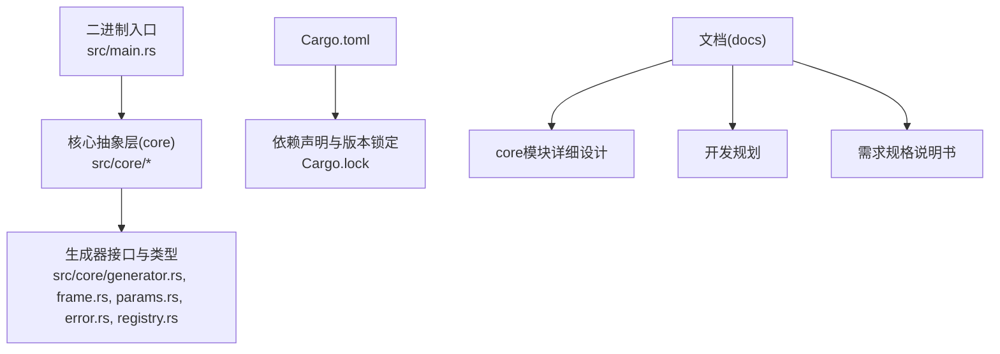
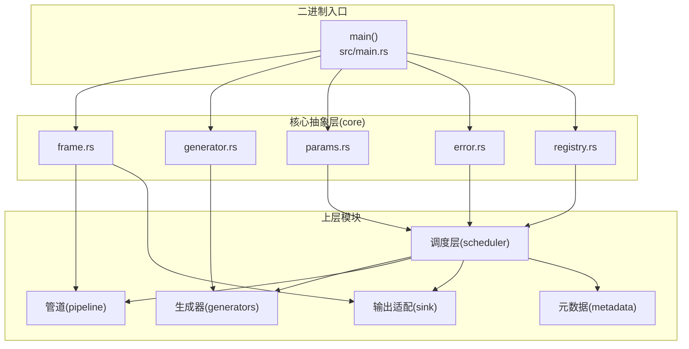
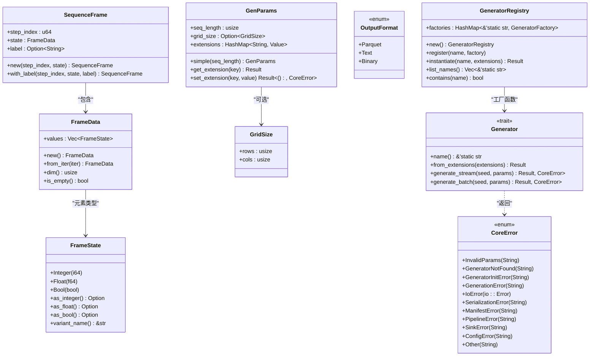
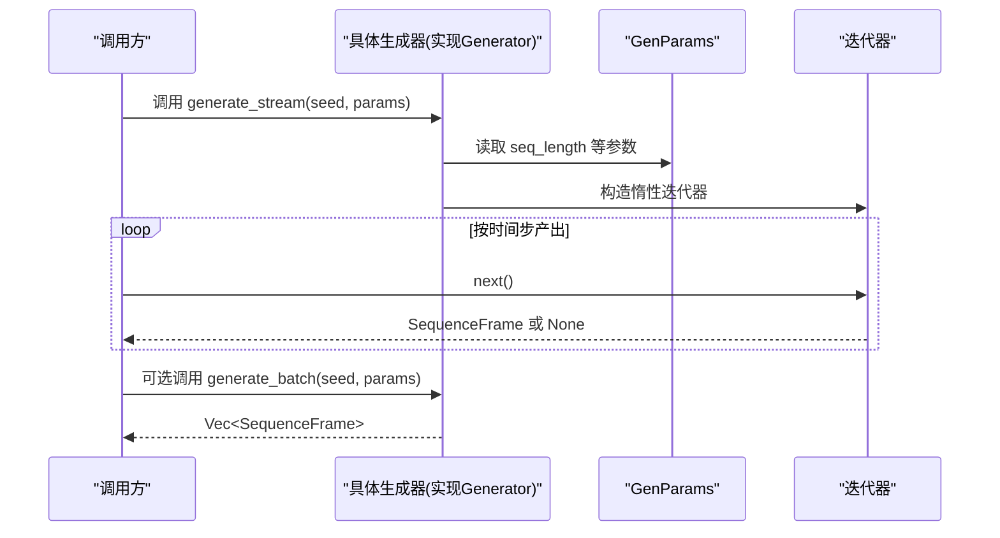
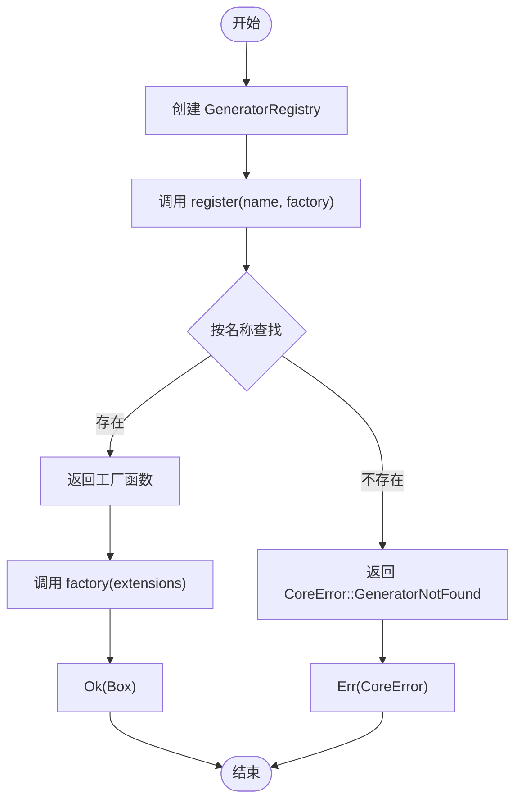
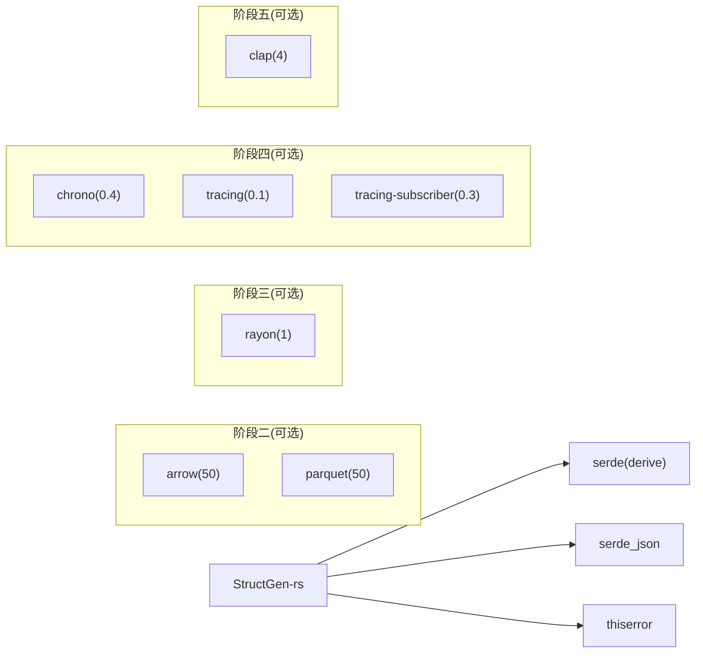

# 开发环境搭建

<cite>
**本文引用的文件**
- [Cargo.toml](file://Cargo.toml)
- [Cargo.lock](file://Cargo.lock)
- [src/main.rs](file://src/main.rs)
- [src/core/mod.rs](file://src/core/mod.rs)
- [src/core/generator.rs](file://src/core/generator.rs)
- [src/core/frame.rs](file://src/core/frame.rs)
- [src/core/params.rs](file://src/core/params.rs)
- [src/core/error.rs](file://src/core/error.rs)
- [src/core/registry.rs](file://src/core/registry.rs)
- [docs/core模块详细设计.md](file://docs/core模块详细设计.md)
- [docs/开发规划.md](file://docs/开发规划.md)
- [docs/需求规格说明书.md](file://docs/需求规格说明书.md)
</cite>

## 目录
1. [简介](#简介)
2. [项目结构](#项目结构)
3. [核心组件](#核心组件)
4. [架构总览](#架构总览)
5. [详细组件分析](#详细组件分析)
6. [依赖分析](#依赖分析)
7. [性能考虑](#性能考虑)
8. [故障排除指南](#故障排除指南)
9. [结论](#结论)
10. [附录](#附录)

## 简介
本指南面向首次参与 StructGen-rs 项目的开发者，提供从零搭建开发环境的完整步骤，涵盖 Rust 工具链安装与配置、项目依赖安装、IDE 与调试工具设置、代码格式化与检查工具、克隆与初始化、运行基本测试，以及常见问题排查。文中所有技术要点均来自仓库内的实际文件与设计文档，确保可操作性与准确性。

## 项目结构
该项目采用“二进制可执行 + 多功能库”的分层组织方式：
- 二进制入口位于 src/main.rs，负责命令行参数解析与工作流装配。
- 核心抽象层 core 定义了统一的数据类型、接口与错误体系，是所有上层模块的依赖基础。
- 文档目录 docs 下包含各模块的详细设计与开发规划，为理解系统架构与依赖关系提供依据。

图表来源
- [src/main.rs:1-6](file://src/main.rs#L1-L6)
- [src/core/mod.rs:1-16](file://src/core/mod.rs#L1-L16)
- [Cargo.toml:1-10](file://Cargo.toml#L1-L10)
- [Cargo.lock:1-129](file://Cargo.lock#L1-L129)
- [docs/core模块详细设计.md:1-553](file://docs/core模块详细设计.md#L1-L553)
- [docs/开发规划.md:1-370](file://docs/开发规划.md#L1-L370)
- [docs/需求规格说明书.md:1-215](file://docs/需求规格说明书.md#L1-L215)

章节来源
- [src/main.rs:1-6](file://src/main.rs#L1-L6)
- [src/core/mod.rs:1-16](file://src/core/mod.rs#L1-L16)
- [Cargo.toml:1-10](file://Cargo.toml#L1-L10)
- [Cargo.lock:1-129](file://Cargo.lock#L1-L129)
- [docs/core模块详细设计.md:1-553](file://docs/core模块详细设计.md#L1-L553)
- [docs/开发规划.md:1-370](file://docs/开发规划.md#L1-L370)
- [docs/需求规格说明书.md:1-215](file://docs/需求规格说明书.md#L1-L215)

## 核心组件
- 二进制入口：定义 main 函数，作为程序启动点。
- 核心抽象层(core)：包含帧数据结构、生成器接口、参数与配置、错误类型、注册表等，是系统的基础契约层。

章节来源
- [src/main.rs:1-6](file://src/main.rs#L1-L6)
- [src/core/mod.rs:1-16](file://src/core/mod.rs#L1-L16)

## 架构总览
系统采用分层架构，核心抽象层位于最底层，向上依次为生成器层、调度层、后处理管道层、输出适配层与元数据监控层。二进制入口负责装配与启动整个流水线。

图表来源
- [src/main.rs:1-6](file://src/main.rs#L1-L6)
- [src/core/frame.rs:1-210](file://src/core/frame.rs#L1-L210)
- [src/core/generator.rs:1-129](file://src/core/generator.rs#L1-L129)
- [src/core/params.rs:1-235](file://src/core/params.rs#L1-L235)
- [src/core/error.rs:1-103](file://src/core/error.rs#L1-L103)
- [src/core/registry.rs:1-150](file://src/core/registry.rs#L1-L150)
- [docs/需求规格说明书.md:23-48](file://docs/需求规格说明书.md#L23-L48)

## 详细组件分析

### 组件A：核心抽象层(core) 类关系图

图表来源
- [src/core/frame.rs:1-210](file://src/core/frame.rs#L1-L210)
- [src/core/params.rs:1-235](file://src/core/params.rs#L1-L235)
- [src/core/error.rs:1-103](file://src/core/error.rs#L1-L103)
- [src/core/generator.rs:1-129](file://src/core/generator.rs#L1-L129)
- [src/core/registry.rs:1-150](file://src/core/registry.rs#L1-L150)

章节来源
- [src/core/frame.rs:1-210](file://src/core/frame.rs#L1-L210)
- [src/core/params.rs:1-235](file://src/core/params.rs#L1-L235)
- [src/core/error.rs:1-103](file://src/core/error.rs#L1-L103)
- [src/core/generator.rs:1-129](file://src/core/generator.rs#L1-L129)
- [src/core/registry.rs:1-150](file://src/core/registry.rs#L1-L150)

### 组件B：生成器接口与流式生成序列图

图表来源
- [src/core/generator.rs:35-55](file://src/core/generator.rs#L35-L55)
- [src/core/params.rs:68-123](file://src/core/params.rs#L68-L123)

章节来源
- [src/core/generator.rs:1-129](file://src/core/generator.rs#L1-L129)
- [src/core/params.rs:1-235](file://src/core/params.rs#L1-L235)

### 组件C：注册表注册与实例化流程图

图表来源
- [src/core/registry.rs:20-64](file://src/core/registry.rs#L20-L64)
- [src/core/error.rs:10-48](file://src/core/error.rs#L10-L48)

章节来源
- [src/core/registry.rs:1-150](file://src/core/registry.rs#L1-L150)
- [src/core/error.rs:1-103](file://src/core/error.rs#L1-L103)

## 依赖分析
- Cargo.toml 声明了项目依赖：Serde（含 derive 特性）、Serde JSON、Thiserror。
- Cargo.lock 展示了上述依赖及其子依赖的锁定版本，确保可复现构建。
- 设计文档的“开发规划”章节给出了分阶段依赖规划，包括 sink（Arrow/Parquet）、scheduler（Rayon）、metadata（Chrono/Tracing）、CLI（Clap）等，可用于后续扩展。

图表来源
- [Cargo.toml:6-10](file://Cargo.toml#L6-L10)
- [Cargo.lock:5-129](file://Cargo.lock#L5-L129)
- [docs/开发规划.md:300-336](file://docs/开发规划.md#L300-L336)

章节来源
- [Cargo.toml:1-10](file://Cargo.toml#L1-L10)
- [Cargo.lock:1-129](file://Cargo.lock#L1-L129)
- [docs/开发规划.md:1-370](file://docs/开发规划.md#L1-L370)

## 性能考虑
- 核心抽象层采用标记联合体 FrameState 与惰性迭代器，兼顾内存效率与可扩展性。
- 生成器接口要求 Send + Sync，便于在 Rayon 线程池中并行执行。
- 设计文档对内存占用、零拷贝传递与注册表查找复杂度进行了评估，有助于指导后续优化。

章节来源
- [docs/core模块详细设计.md:477-482](file://docs/core模块详细设计.md#L477-L482)
- [src/core/generator.rs:12-12](file://src/core/generator.rs#L12-L12)

## 故障排除指南
- 版本与工具链
  - Rust 工具链：使用 Cargo 默认的稳定通道即可满足当前依赖；若后续引入阶段二/三/四/五的特性，再按开发规划逐步添加依赖。
  - 版本锁定：通过 Cargo.lock 确保依赖版本一致，避免环境差异导致的问题。
- 依赖安装失败
  - 若网络受限，可配置 Cargo 使用镜像源或代理，再执行 cargo build。
  - 如出现版本冲突，优先遵循 Cargo.lock 中的版本，避免手动升级关键依赖。
- 编译与测试
  - 使用 cargo build 与 cargo test 验证本地构建与测试通过。
  - 若出现 clippy 警告，可按提示修复或暂时忽略（当前 core 模块无 clippy 警告的要求）。
- 运行时问题
  - 若遇到 I/O 或序列化错误，检查输出目录权限与磁盘空间。
  - 若生成器未找到，确认已在相应模块中完成注册，并在调度阶段正确加载注册表。

章节来源
- [Cargo.lock:1-129](file://Cargo.lock#L1-L129)
- [src/core/error.rs:22-48](file://src/core/error.rs#L22-L48)
- [src/core/registry.rs:43-53](file://src/core/registry.rs#L43-L53)

## 结论
本指南基于仓库内的实际文件与设计文档，提供了从工具链安装到项目初始化、依赖安装、基本测试运行与常见问题排查的全流程指引。当前核心模块仅依赖标准库与少量基础 crate，具备良好的可移植性与可维护性。随着后续阶段的推进，可按开发规划逐步引入 Arrow/Parquet、Rayon、Tracing、Clap 等依赖，完善系统的数据处理、并行执行、可观测性与命令行接口能力。

## 附录

### A. Rust 工具链安装与配置要求
- 安装 Rust：使用官方安装器安装稳定版工具链，确保 rustc 与 cargo 版本满足当前项目需求。
- 配置首选编辑器：VS Code + Rust Analyzer 或 IntelliJ IDEA + Rust 插件。
- 代码格式化与检查：安装 rustfmt 与 clippy，配合 pre-commit 钩子或编辑器自动保存时格式化。

章节来源
- [Cargo.toml:1-10](file://Cargo.toml#L1-L10)
- [Cargo.lock:1-129](file://Cargo.lock#L1-L129)

### B. 项目依赖安装步骤
- 核心依赖（已内置）：Serde（含 derive）、Serde JSON、Thiserror。
- 后续阶段依赖（可选）：按开发规划逐步添加 Arrow/Parquet、Rayon、Chrono/Tracing、Clap。
- 依赖锁定：使用 Cargo.lock 保持版本一致。

章节来源
- [Cargo.toml:6-10](file://Cargo.toml#L6-L10)
- [Cargo.lock:5-129](file://Cargo.lock#L5-L129)
- [docs/开发规划.md:300-336](file://docs/开发规划.md#L300-L336)

### C. IDE 设置与调试工具配置
- VS Code：安装 Rust Analyzer、C/C++、Even Better TOML 等扩展，启用 rust-analyzer.cargo.loadOutDirsFromCheck 与 rust-analyzer.procMacro.enable。
- IntelliJ IDEA：安装 Rust 插件，配置 Cargo 工作目录与运行配置。
- 调试：使用 Cargo run 或 IDE 断点调试；为二进制入口设置启动参数（如 --manifest）。

章节来源
- [src/main.rs:1-6](file://src/main.rs#L1-L6)
- [docs/开发规划.md:240-274](file://docs/开发规划.md#L240-L274)

### D. 代码格式化与检查工具
- rustfmt：统一代码风格，建议在提交前执行 cargo fmt。
- clippy：静态检查，建议在 PR 前执行 cargo clippy 并修复警告。

章节来源
- [docs/core模块详细设计.md:88-92](file://docs/core模块详细设计.md#L88-L92)

### E. 克隆、初始化与运行基本测试
- 克隆仓库：使用 Git 克隆项目至本地。
- 初始化：执行 cargo build，确保依赖下载与编译通过。
- 运行测试：执行 cargo test，验证核心模块单元测试通过。
- 运行二进制：执行 cargo run（如已配置 CLI），或直接运行生成的可执行文件。

章节来源
- [src/main.rs:1-6](file://src/main.rs#L1-L6)
- [Cargo.toml:1-10](file://Cargo.toml#L1-L10)