# 新处理器开发

<cite>
**本文档引用的文件**
- [main.rs](file://src/main.rs)
- [core模块](file://src/core/mod.rs)
- [generator.rs](file://src/core/generator.rs)
- [registry.rs](file://src/core/registry.rs)
- [frame.rs](file://src/core/frame.rs)
- [params.rs](file://src/core/params.rs)
- [error.rs](file://src/core/error.rs)
- [core模块详细设计.md](file://docs/core模块详细设计.md)
- [pipeline模块详细设计.md](file://docs/pipeline模块详细设计.md)
- [Cargo.toml](file://Cargo.toml)
</cite>

## 目录
1. [简介](#简介)
2. [项目结构](#项目结构)
3. [核心组件](#核心组件)
4. [架构概览](#架构概览)
5. [详细组件分析](#详细组件分析)
6. [处理器开发指南](#处理器开发指南)
7. [处理器注册机制](#处理器注册机制)
8. [处理器链构建](#处理器链构建)
9. [数据流转与状态管理](#数据流转与状态管理)
10. [惰性求值与内存优化](#惰性求值与内存优化)
11. [具体处理器实现示例](#具体处理器实现示例)
12. [测试方法](#测试方法)
13. [性能基准测试策略](#性能基准测试策略)
14. [处理器与管道系统集成](#处理器与管道系统集成)
15. [故障排除指南](#故障排除指南)
16. [结论](#结论)

## 简介

StructGen-rs 是一个基于 Rust 的结构化数据生成系统，专门用于生成各种数学和物理系统的时序数据。本文档面向新处理器开发者，详细说明如何在 StructGen-rs 管道系统中开发新的处理器组件。

该系统的核心设计理念包括：
- **强类型抽象**：使用 Rust 的枚举标记联合体统一表示不同类型的帧状态值
- **惰性求值**：通过迭代器适配器实现流式处理，避免中间缓冲
- **可组合性**：处理器可以像乐高积木一样链式组合
- **Send + Sync**：确保在多线程环境中的安全使用
- **参数化配置**：通过 JSON 配置控制处理器行为

## 项目结构

StructGen-rs 采用模块化设计，核心模块位于 `src/core/` 目录下，包含以下关键组件：

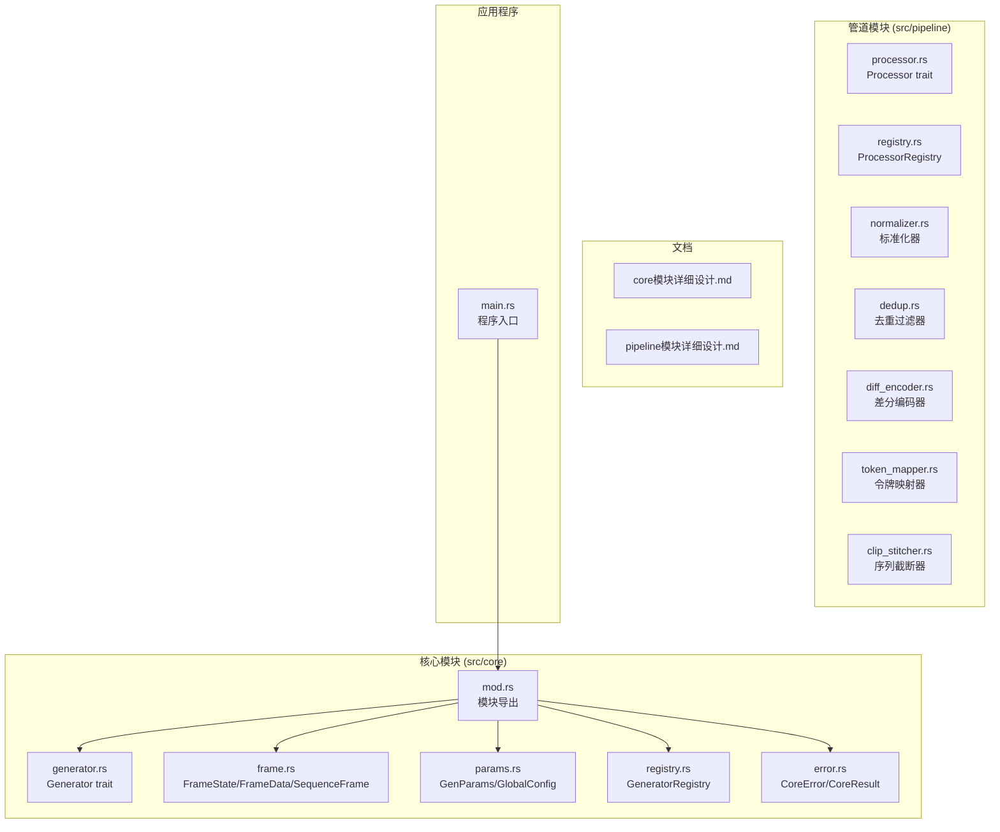

**图表来源**
- [core模块:1-16](file://src/core/mod.rs#L1-L16)
- [pipeline模块详细设计.md:29-40](file://docs/pipeline模块详细设计.md#L29-L40)

**章节来源**
- [main.rs:1-6](file://src/main.rs#L1-L6)
- [core模块:1-16](file://src/core/mod.rs#L1-L16)

## 核心组件

### FrameState 数据模型

FrameState 是系统中最基础的数据类型，使用枚举标记联合体统一承载整型、浮点型和布尔型数据：

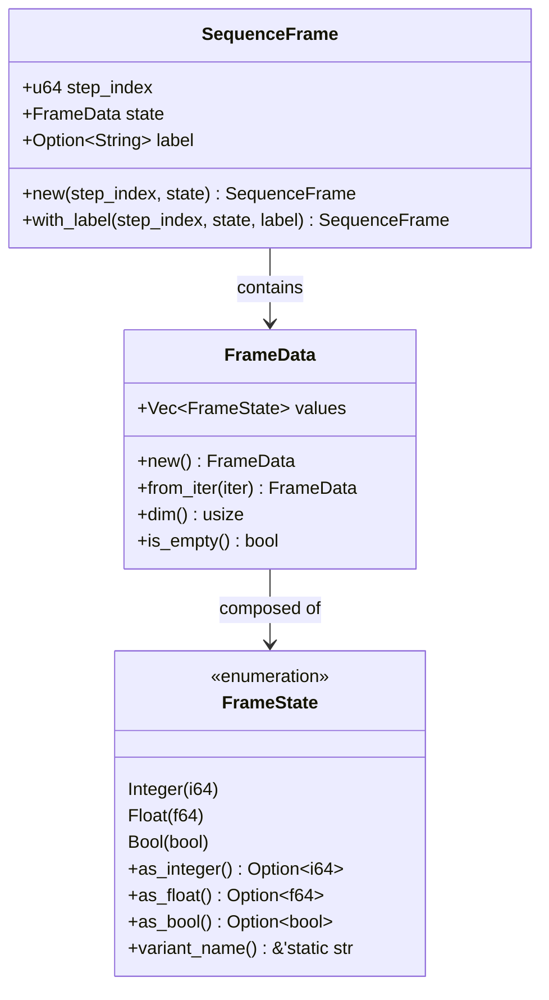

**图表来源**
- [frame.rs:3-118](file://src/core/frame.rs#L3-L118)

### Generator 接口设计

Generator trait 定义了生成器的核心接口，要求实现者具备 Send + Sync 特征，确保线程安全：

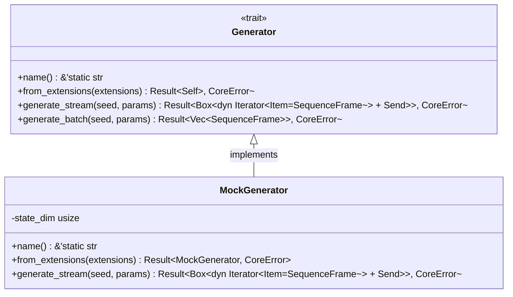

**图表来源**
- [generator.rs:9-56](file://src/core/generator.rs#L9-L56)

**章节来源**
- [frame.rs:1-210](file://src/core/frame.rs#L1-L210)
- [generator.rs:1-129](file://src/core/generator.rs#L1-L129)

## 架构概览

StructGen-rs 的整体架构遵循分层设计原则，核心抽象层为核心，向上支撑调度器、生成器、管道、数据汇等模块：

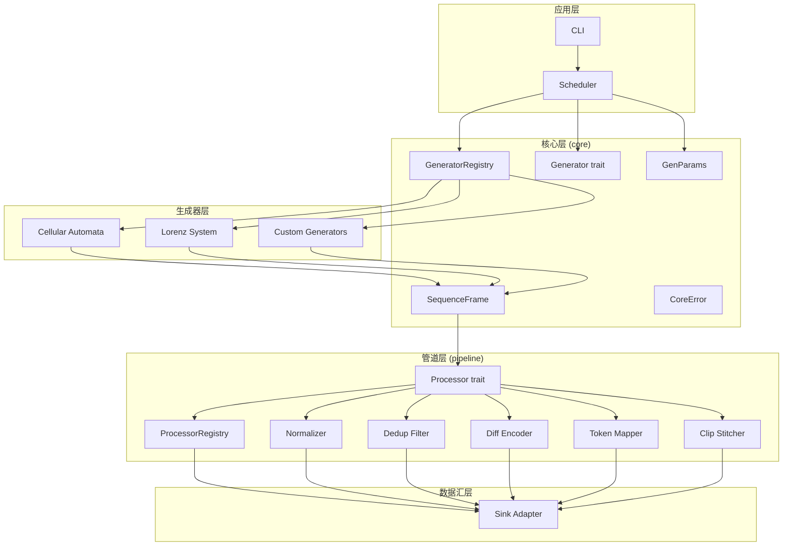

**图表来源**
- [core模块详细设计.md:422-433](file://docs/core模块详细设计.md#L422-L433)
- [pipeline模块详细设计.md:356-362](file://docs/pipeline模块详细设计.md#L356-L362)

## 详细组件分析

### GeneratorRegistry 注册机制

GeneratorRegistry 提供了生成器的全局注册表功能，采用名称到构造函数的静态映射：

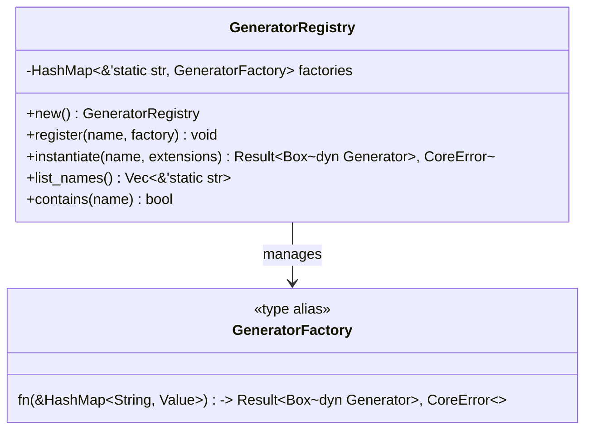

**图表来源**
- [registry.rs:8-64](file://src/core/registry.rs#L8-L64)

### 错误处理体系

CoreError 提供了统一的错误类型体系，涵盖系统各个层面可能出现的错误：

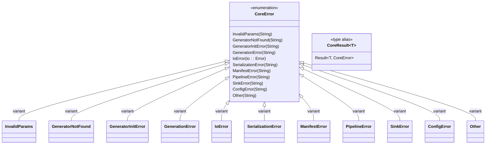

**图表来源**
- [error.rs:4-52](file://src/core/error.rs#L4-L52)

**章节来源**
- [registry.rs:1-150](file://src/core/registry.rs#L1-L150)
- [error.rs:1-103](file://src/core/error.rs#L1-L103)

## 处理器开发指南

### Processor Trait 设计原理

根据管道模块详细设计，Processor trait 是后处理管道的核心接口：

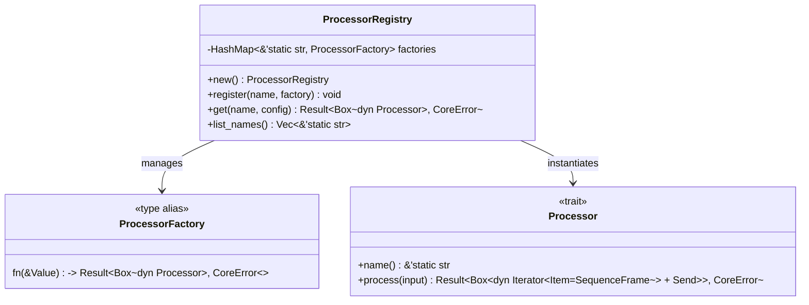

**图表来源**
- [pipeline模块详细设计.md:55-118](file://docs/pipeline模块详细设计.md#L55-L118)

### 处理器实现要求

开发新处理器需要满足以下要求：

1. **类型特征**：实现 `Send + Sync` 特征，确保线程安全
2. **接口实现**：实现 `Processor` trait 的两个核心方法
3. **惰性求值**：返回惰性迭代器，不物化中间结果
4. **参数化**：通过配置结构体控制行为
5. **错误处理**：使用 `CoreResult` 类型返回错误信息

**章节来源**
- [pipeline模块详细设计.md:55-83](file://docs/pipeline模块详细设计.md#L55-L83)

## 处理器注册机制

### 注册表工作原理

处理器注册表采用名称到构造函数的映射，提供线程安全的注册和实例化功能：

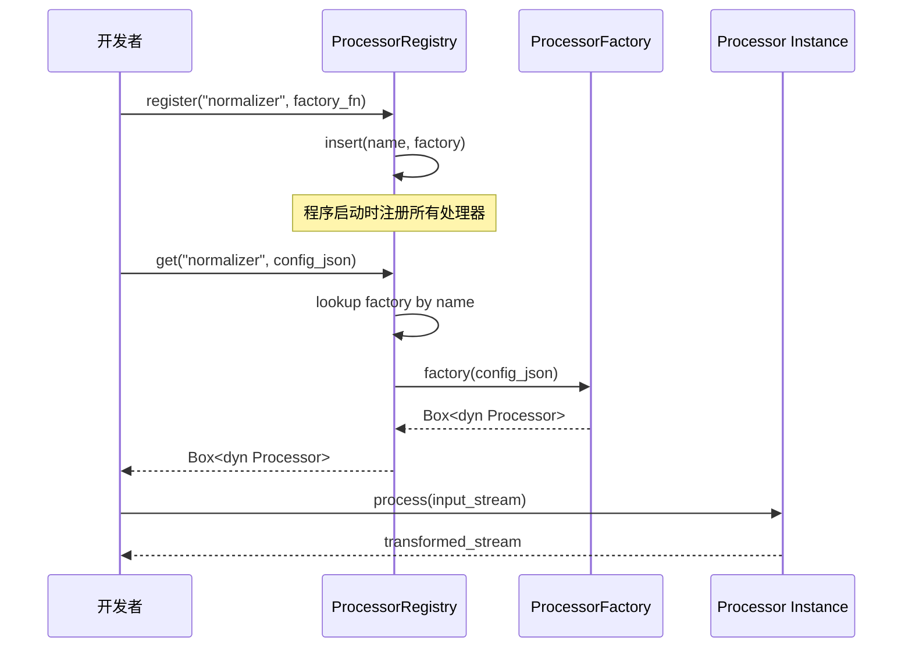

**图表来源**
- [registry.rs:28-53](file://src/core/registry.rs#L28-L53)

### 注册流程最佳实践

1. **命名规范**：使用有意义的静态字符串作为处理器名称
2. **工厂函数**：实现构造函数，负责从 JSON 配置创建处理器实例
3. **错误处理**：在工厂函数中验证配置的有效性
4. **线程安全**：确保注册表操作的原子性和一致性

**章节来源**
- [registry.rs:20-64](file://src/core/registry.rs#L20-L64)

## 处理器链构建

### 链式调用机制

处理器链通过迭代器适配器模式实现，每个处理器包装输入流并返回变换后的流：

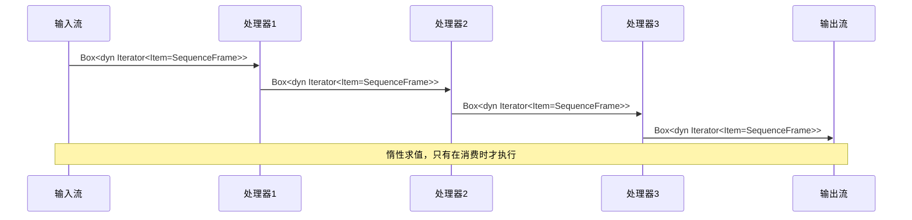

**图表来源**
- [pipeline模块详细设计.md:366-375](file://docs/pipeline模块详细设计.md#L366-L375)

### 处理器链配置

处理器链的配置通过 YAML 清单文件指定：

```yaml
tasks:
  - name: "ca_with_processing"
    generator: "cellular_automaton"
    params:
      seq_length: 1000
      extensions:
        ca:
          rule: 110
        pipeline_config:
          normalizer: { max_val: 255, method: "linear" }
          dedup: { remove_consecutive_duplicates: true }
          token_mapper: { start_codepoint: 0x4E00 }
    pipeline: ["normalizer", "dedup", "token_mapper"]
```

**章节来源**
- [pipeline模块详细设计.md:471-491](file://docs/pipeline模块详细设计.md#L471-L491)

## 数据流转与状态管理

### 帧数据流转

处理器在处理过程中保持帧数据的完整性，只改变状态值的表示形式：

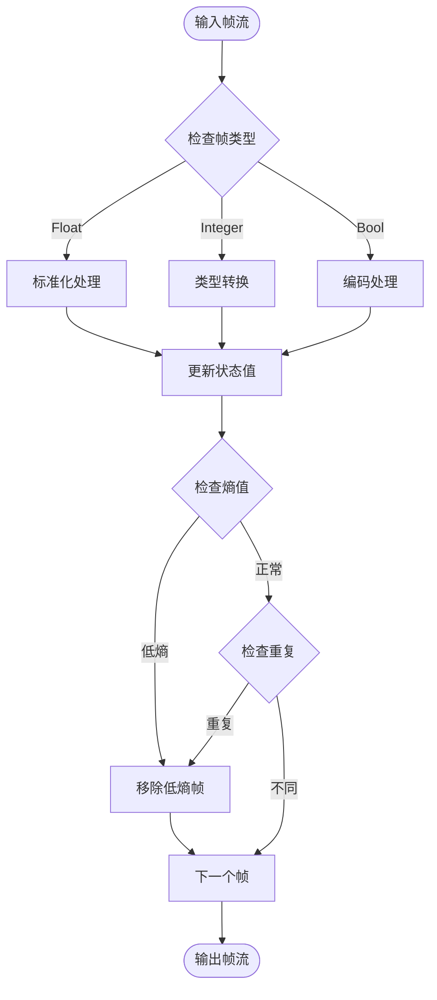

**图表来源**
- [pipeline模块详细设计.md:226-258](file://docs/pipeline模块详细设计.md#L226-L258)

### 状态管理策略

1. **无状态处理器**：不保存任何状态，完全基于输入数据进行处理
2. **确定性状态处理器**：状态在首次遇到数据时从数据流中计算确定
3. **配置驱动状态**：状态从配置中显式指定，保证可复现性

**章节来源**
- [pipeline模块详细设计.md:19-25](file://docs/pipeline模块详细设计.md#L19-L25)

## 惰性求值与内存优化

### 惰性求值实现

处理器采用迭代器适配器模式，实现真正的惰性求值：

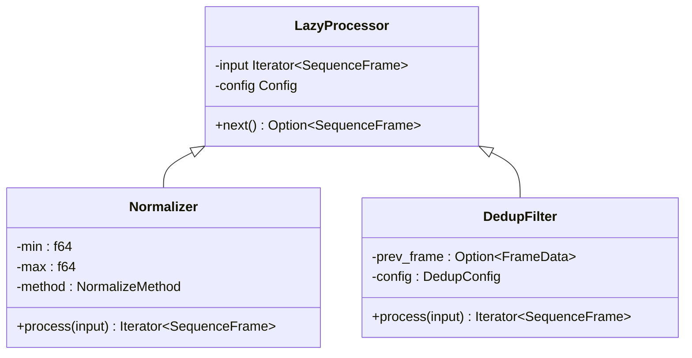

**图表来源**
- [pipeline模块详细设计.md:19-25](file://docs/pipeline模块详细设计.md#L19-L25)

### 内存优化策略

1. **零拷贝传递**：处理器直接包装输入迭代器，避免不必要的数据复制
2. **最小状态缓存**：只缓存必要的状态信息（如上一帧数据）
3. **流式处理**：不收集中间结果，直到最终消费端一次性遍历
4. **配置预计算**：允许在配置中预计算处理器所需的统计信息

**章节来源**
- [pipeline模块详细设计.md:396-403](file://docs/pipeline模块详细设计.md#L396-L403)

## 具体处理器实现示例

### 标准化器实现要点

标准化器负责将浮点值映射到整数范围：

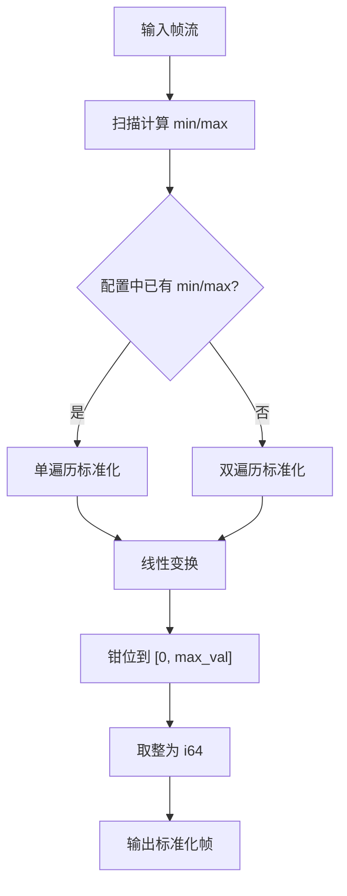

**图表来源**
- [pipeline模块详细设计.md:195-224](file://docs/pipeline模块详细设计.md#L195-L224)

### 去重过滤器实现要点

去重过滤器移除冗余帧：

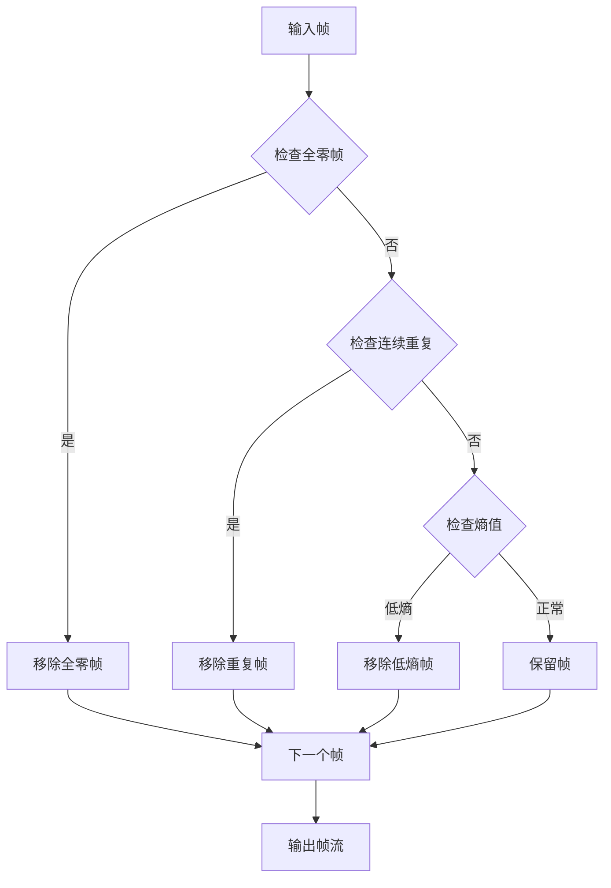

**图表来源**
- [pipeline模块详细设计.md:226-258](file://docs/pipeline模块详细设计.md#L226-L258)

### 差分编码器实现要点

差分编码器计算相邻帧的差分：

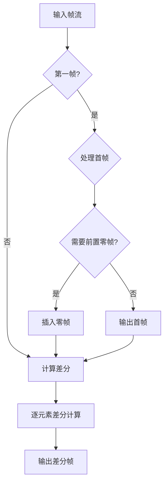

**图表来源**
- [pipeline模块详细设计.md:259-301](file://docs/pipeline模块详细设计.md#L259-L301)

**章节来源**
- [pipeline模块详细设计.md:193-353](file://docs/pipeline模块详细设计.md#L193-L353)

## 测试方法

### 单元测试策略

针对处理器的测试应该包括：

1. **功能测试**：验证处理器的核心功能正确性
2. **边界测试**：测试极端输入情况
3. **性能测试**：验证处理效率
4. **内存测试**：确保没有内存泄漏

### 测试框架建议

```rust
#[cfg(test)]
mod tests {
    use super::*;
    
    fn make_test_frames() -> Vec<SequenceFrame> {
        // 构造测试数据
    }
    
    #[test]
    fn test_processor_name() {
        let processor = MyProcessor::new(&Default::default());
        assert_eq!(processor.name(), "my_processor");
    }
    
    #[test]
    fn test_processor_transforms_correctly() {
        let frames = make_test_frames();
        let processor = MyProcessor::new(&config);
        let result: Vec<_> = processor.process(stream_from(frames)).unwrap().collect();
        // 验证处理结果
    }
    
    #[test]
    fn test_processor_handles_edge_cases() {
        // 测试边界情况
    }
}
```

**章节来源**
- [pipeline模块详细设计.md:404-469](file://docs/pipeline模块详细设计.md#L404-L469)

## 性能基准测试策略

### 基准测试指标

1. **吞吐量**：每秒处理的帧数
2. **延迟**：从输入到输出的平均延迟
3. **内存使用**：峰值内存占用
4. **CPU 利用率**：处理器的 CPU 使用情况

### 基准测试实现

```rust
#[cfg(test)]
mod benchmarks {
    use test::Bencher;
    
    #[bench]
    fn bench_processor_performance(b: &mut Bencher) {
        let frames = generate_large_dataset();
        let processor = create_processor();
        
        b.iter(|| {
            let result: Vec<_> = processor.process(stream_from(frames.clone())).unwrap().collect();
            result
        });
    }
    
    #[bench]
    fn bench_memory_usage(b: &mut Bencher) {
        let frames = generate_memory_intensive_dataset();
        let processor = create_processor();
        
        b.iter(|| {
            let mut total_size = 0;
            for frame in processor.process(stream_from(frames.clone())).unwrap() {
                total_size += calculate_frame_size(&frame);
            }
            total_size
        });
    }
}
```

**章节来源**
- [pipeline模块详细设计.md:396-403](file://docs/pipeline模块详细设计.md#L396-L403)

## 处理器与管道系统集成

### 集成点说明

处理器通过以下方式与管道系统集成：

1. **注册机制**：在程序启动时注册到 `ProcessorRegistry`
2. **配置解析**：从 YAML 清单中解析处理器配置
3. **链式调用**：在调度器中按顺序调用处理器
4. **错误传播**：错误在处理器链中正确传播

### 扩展点设计

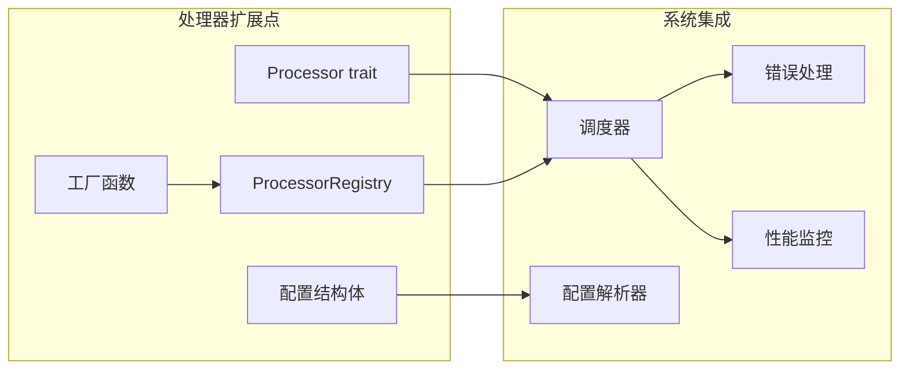

**图表来源**
- [pipeline模块详细设计.md:354-362](file://docs/pipeline模块详细设计.md#L354-L362)

**章节来源**
- [pipeline模块详细设计.md:354-385](file://docs/pipeline模块详细设计.md#L354-L385)

## 故障排除指南

### 常见问题及解决方案

1. **处理器未注册**：检查 `ProcessorRegistry::register` 调用
2. **配置解析失败**：验证 YAML 配置格式和字段名称
3. **内存不足**：检查处理器是否正确实现惰性求值
4. **性能问题**：分析处理器链的执行路径

### 错误诊断流程

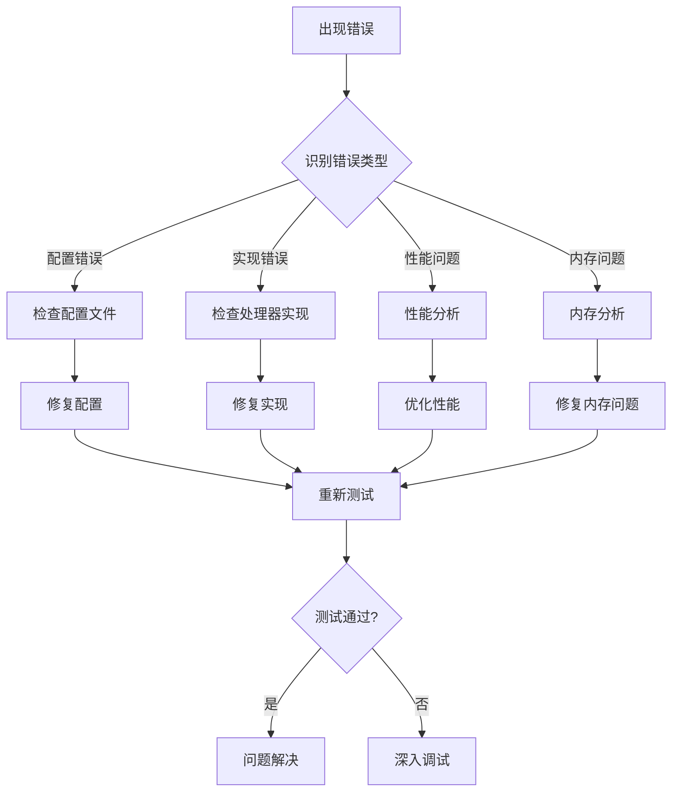

**图表来源**
- [core模块详细设计.md:455-476](file://docs/core模块详细设计.md#L455-L476)

**章节来源**
- [core模块详细设计.md:455-476](file://docs/core模块详细设计.md#L455-L476)

## 结论

新处理器开发在 StructGen-rs 系统中是一个相对简单的任务，主要基于以下关键原则：

1. **接口简洁**：Processor trait 只定义两个核心方法，易于实现
2. **类型安全**：利用 Rust 的类型系统确保编译时安全
3. **性能优化**：通过惰性求值和迭代器适配器实现高效处理
4. **可测试性**：提供清晰的测试接口和基准测试工具
5. **可扩展性**：通过注册表机制轻松扩展新的处理器类型

开发新处理器的关键在于理解数据流转机制、正确实现惰性求值、合理处理状态管理和错误传播。通过遵循本文档的指导原则和最佳实践，开发者可以快速实现高质量的处理器组件，为 StructGen-rs 系统提供强大的数据处理能力。