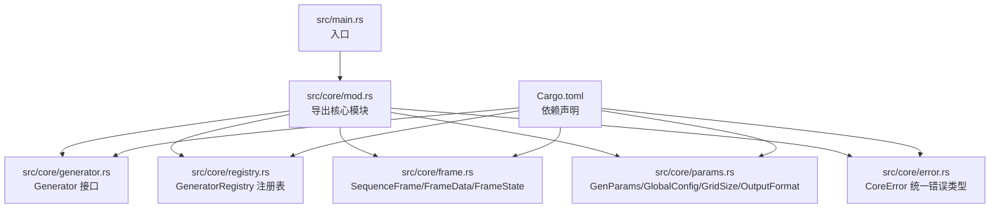
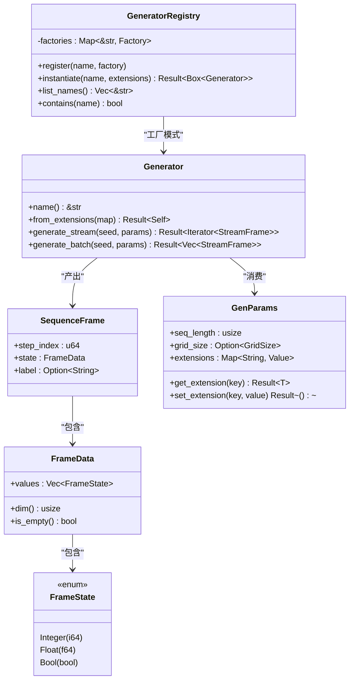
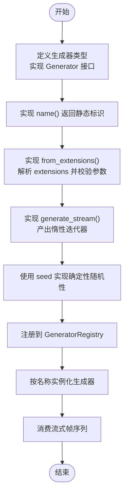
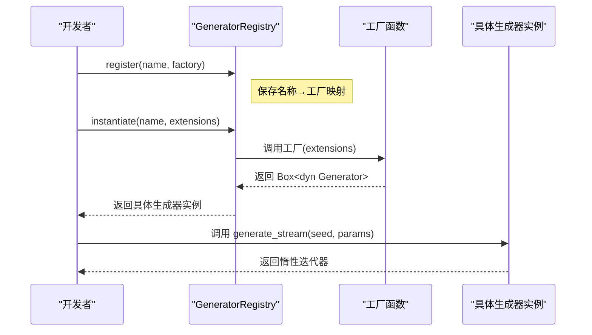
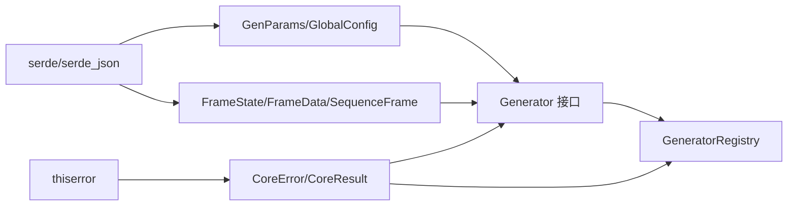

# 新生成器开发

<cite>
**本文档引用的文件**
- [src/core/generator.rs](file://src/core/generator.rs)
- [src/core/registry.rs](file://src/core/registry.rs)
- [src/core/frame.rs](file://src/core/frame.rs)
- [src/core/params.rs](file://src/core/params.rs)
- [src/core/error.rs](file://src/core/error.rs)
- [src/core/mod.rs](file://src/core/mod.rs)
- [src/main.rs](file://src/main.rs)
- [Cargo.toml](file://Cargo.toml)
</cite>

## 目录
1. [简介](#简介)
2. [项目结构](#项目结构)
3. [核心组件](#核心组件)
4. [架构总览](#架构总览)
5. [详细组件分析](#详细组件分析)
6. [依赖分析](#依赖分析)
7. [性能考虑](#性能考虑)
8. [故障排除指南](#故障排除指南)
9. [结论](#结论)
10. [附录](#附录)

## 简介
本指南面向希望在 StructGen-rs 核心框架上开发“新生成器”的工程师，系统讲解以下内容：
- Generator trait 的实现要求：name()、from_extensions()、generate_stream() 的职责与约束
- 生成器注册机制：GeneratorRegistry 的使用与类型安全的工厂模式
- 完整的开发流程：从配置解析到流式数据生成再到错误处理
- 确定性随机性的实现与种子管理策略
- 测试策略与性能优化建议
- 与核心框架的集成方式与最佳实践

## 项目结构
该项目采用模块化组织，核心抽象位于 core 模块，对外暴露统一的数据模型与接口契约。顶层入口为 main.rs，当前仅用于占位。

图表来源
- [src/core/mod.rs:1-16](file://src/core/mod.rs#L1-L16)
- [src/core/generator.rs:1-129](file://src/core/generator.rs#L1-L129)
- [src/core/registry.rs:1-150](file://src/core/registry.rs#L1-L150)
- [src/core/frame.rs:1-210](file://src/core/frame.rs#L1-L210)
- [src/core/params.rs:1-235](file://src/core/params.rs#L1-L235)
- [src/core/error.rs:1-103](file://src/core/error.rs#L1-L103)
- [Cargo.toml:1-10](file://Cargo.toml#L1-L10)

章节来源
- [src/core/mod.rs:1-16](file://src/core/mod.rs#L1-L16)
- [src/main.rs:1-6](file://src/main.rs#L1-L6)
- [Cargo.toml:1-10](file://Cargo.toml#L1-L10)

## 核心组件
本节聚焦于生成器开发所需的关键构件：Generator 接口、注册表、数据帧模型、参数与错误类型。

- Generator 接口：定义生成器的最小契约，包括名称、从扩展配置构造实例、流式生成与批量生成。
- GeneratorRegistry：全局注册表，提供类型安全的工厂模式，按名称查找并实例化生成器。
- SequenceFrame/FrameData/FrameState：统一的状态容器，支持整型、浮点、布尔三类值，便于不同生成器复用。
- GenParams/GlobalConfig：通用参数与全局配置，支持扩展字段的序列化/反序列化。
- CoreError：统一错误类型，便于传播与处理。

章节来源
- [src/core/generator.rs:9-56](file://src/core/generator.rs#L9-L56)
- [src/core/registry.rs:8-64](file://src/core/registry.rs#L8-L64)
- [src/core/frame.rs:3-118](file://src/core/frame.rs#L3-L118)
- [src/core/params.rs:68-123](file://src/core/params.rs#L68-L123)
- [src/core/error.rs:4-49](file://src/core/error.rs#L4-L49)

## 架构总览
下图展示了生成器开发与运行时的交互关系：开发者实现 Generator，通过注册表注册，调度器按名称实例化并调用 generate_stream() 产出 SequenceFrame 流。

图表来源
- [src/core/generator.rs:12-56](file://src/core/generator.rs#L12-L56)
- [src/core/registry.rs:15-64](file://src/core/registry.rs#L15-L64)
- [src/core/frame.rs:90-118](file://src/core/frame.rs#L90-L118)
- [src/core/frame.rs:52-87](file://src/core/frame.rs#L52-L87)
- [src/core/frame.rs:4-12](file://src/core/frame.rs#L4-L12)
- [src/core/params.rs:68-123](file://src/core/params.rs#L68-L123)

## 详细组件分析

### Generator 接口详解
- name()：返回生成器的静态字符串标识，用于注册表与日志识别。
- from_extensions()：从 GenParams.extensions 中解析生成器特有配置，返回具体实现类型。若配置缺失或非法，应返回 CoreError::InvalidParams。
- generate_stream(seed, params)：流式生成接口，返回惰性迭代器。当 params.seq_length 为 0 时表示无限制，由调用方控制消费数量；否则最多产出 seq_length 个帧。
- generate_batch(seed, params)：同步批处理接口，内部调用 generate_stream 并收集为 Vec。适用于中小规模数据；大规模请使用流式接口。

实现要点
- 确保实现类型满足 Send + Sync，以便在多线程环境中安全共享。
- 在 generate_stream 中正确处理 seed，保证确定性随机性。
- 在 from_extensions 中进行严格的参数校验与错误传播。

章节来源
- [src/core/generator.rs:9-56](file://src/core/generator.rs#L9-L56)

### GeneratorRegistry 注册表与工厂模式
- GeneratorFactory 类型：接受扩展映射，返回 Box<dyn Generator>，实现类型无关的工厂。
- 注册：register(name, factory) 将名称与工厂绑定，重复注册会 panic，避免运行时静默覆盖。
- 实例化：instantiate(name, extensions) 按名称查找工厂并调用，返回具体生成器实例；未找到则返回 CoreError::GeneratorNotFound。
- 辅助：list_names() 与 contains() 提供查询能力。

类型安全与并发
- 使用静态字符串键确保名称唯一性与编译期检查。
- 工厂函数返回 trait 对象，屏蔽具体实现细节，实现真正的多态。

章节来源
- [src/core/registry.rs:8-64](file://src/core/registry.rs#L8-L64)

### 数据模型：SequenceFrame/FrameData/FrameState
- FrameState：统一承载整型、浮点、布尔三类值，提供类型转换辅助方法与变体名称。
- FrameData：一帧中的状态集合，提供维度、空帧判断与构建工具。
- SequenceFrame：包含时间步索引、状态数据与可选标签，支持无标签与带标签两种构造方式。

序列化支持
- 三者均实现 serde 的序列化/反序列化，便于配置持久化与跨进程传递。

章节来源
- [src/core/frame.rs:3-118](file://src/core/frame.rs#L3-L118)

### 参数与配置：GenParams/GlobalConfig
- GenParams：包含 seq_length、可选网格尺寸 grid_size 与动态扩展字段 extensions。提供 get_extension()/set_extension() 支持生成器特有参数的读写。
- GlobalConfig：全局运行配置，如线程数、默认输出格式、输出目录、日志级别、分片大小与流式写出开关等。
- OutputFormat：输出格式枚举，默认 Parquet，支持 Text 与 Binary。

章节来源
- [src/core/params.rs:68-123](file://src/core/params.rs#L68-L123)
- [src/core/params.rs:20-66](file://src/core/params.rs#L20-L66)

### 错误处理：CoreError
- 统一错误类型，涵盖无效参数、生成器未找到、初始化失败、生成错误、I/O、序列化、清单、管道、数据汇、配置及其他错误。
- 提供 CoreResult 类型别名，简化返回类型声明。
- 通过 thiserror 实现易读的错误消息与自动转换（如 std::io::Error）。

章节来源
- [src/core/error.rs:4-49](file://src/core/error.rs#L4-L49)

### 生成器开发流程与示例路径
以下流程图展示了从实现到使用的完整步骤，并标注了关键实现位置：

图表来源
- [src/core/generator.rs:12-56](file://src/core/generator.rs#L12-L56)
- [src/core/registry.rs:20-53](file://src/core/registry.rs#L20-L53)

章节来源
- [src/core/generator.rs:12-56](file://src/core/generator.rs#L12-L56)
- [src/core/registry.rs:20-53](file://src/core/registry.rs#L20-L53)

### 确定性随机性与种子管理
- 种子来源：generate_stream(seed, params) 的 seed 参数作为确定性随机性的唯一来源。
- 实践建议：
  - 将 seed 作为 PRNG 的初始状态，确保每次相同 seed 产生相同序列。
  - 若生成器涉及多源随机（如多个状态维度），建议使用派生种子或状态向量，避免不同维度间的相关性。
  - 在 from_extensions 中记录 seed 的来源与用途，便于调试与重现。
- 注意：本仓库未内置随机数库依赖，需在具体生成器实现中自行引入（例如 rand 或其它确定性 RNG）。

章节来源
- [src/core/generator.rs:35-39](file://src/core/generator.rs#L35-L39)

### 配置解析与扩展字段
- 通过 GenParams.extensions 存放生成器特有参数，使用 get_extension()/set_extension() 进行序列化/反序列化。
- 错误处理：当扩展键不存在或类型不匹配时，返回 CoreError::InvalidParams 或 CoreError::SerializationError。
- 示例路径：
  - [src/core/params.rs:99-122](file://src/core/params.rs#L99-L122)

章节来源
- [src/core/params.rs:99-122](file://src/core/params.rs#L99-L122)

### 流式生成与批量生成
- generate_stream：推荐模式，惰性迭代，内存友好，适合大规模数据。
- generate_batch：同步批处理，内部调用 generate_stream 并 collect，适用于中小规模。
- 示例路径：
  - [src/core/generator.rs:48-55](file://src/core/generator.rs#L48-L55)

章节来源
- [src/core/generator.rs:48-55](file://src/core/generator.rs#L48-L55)

### 注册与实例化序列
下图展示了注册与实例化的调用序列，映射到实际代码：

图表来源
- [src/core/registry.rs:32-53](file://src/core/registry.rs#L32-L53)

章节来源
- [src/core/registry.rs:32-53](file://src/core/registry.rs#L32-L53)

## 依赖分析
- 核心依赖
  - serde/serde_json：序列化/反序列化，支撑 GenParams/GlobalConfig/Frame* 的持久化与传输。
  - thiserror：统一错误类型与易读错误消息。
- 项目内依赖关系
  - core 模块内部相互依赖：generator 依赖 frame、params、error；registry 依赖 generator、error；frame/params/error 相互独立。
  - main.rs 仅导入 core 模块，保持入口简洁。

图表来源
- [Cargo.toml:6-9](file://Cargo.toml#L6-L9)
- [src/core/params.rs:1-7](file://src/core/params.rs#L1-L7)
- [src/core/frame.rs:1-2](file://src/core/frame.rs#L1-L2)
- [src/core/error.rs:1](file://src/core/error.rs#L1)
- [src/core/generator.rs:3-7](file://src/core/generator.rs#L3-L7)

章节来源
- [Cargo.toml:6-9](file://Cargo.toml#L6-L9)
- [src/core/params.rs:1-7](file://src/core/params.rs#L1-L7)
- [src/core/frame.rs:1-2](file://src/core/frame.rs#L1-L2)
- [src/core/error.rs:1](file://src/core/error.rs#L1)
- [src/core/generator.rs:3-7](file://src/core/generator.rs#L3-L7)

## 性能考虑
- 优先使用 generate_stream：惰性迭代器避免一次性分配大量内存，适合大规模数据。
- 控制消费速率：当 params.seq_length 为 0 时，调用方可按需消费，避免过度缓存。
- 扩展字段访问：get_extension/set_extension 会进行序列化/反序列化，建议在初始化阶段完成，避免在热路径重复调用。
- 并行与线程：核心接口未强制并行，但 Generator 要求 Send + Sync，可结合外部并行库（如 rayon）在实现层进行并行化。
- I/O 与写出：GlobalConfig 提供 stream_write 选项，建议启用流式写出以降低内存峰值。

## 故障排除指南
常见问题与定位思路
- 生成器未找到：检查注册表是否包含该名称，或名称拼写是否正确。
  - 参考：[src/core/registry.rs:43-53](file://src/core/registry.rs#L43-L53)
- 无效参数：from_extensions 中的扩展字段缺失或类型不匹配，返回 CoreError::InvalidParams 或 CoreError::SerializationError。
  - 参考：[src/core/params.rs:99-122](file://src/core/params.rs#L99-L122)
- I/O 错误：底层 I/O 失败会被转换为 CoreError::IoError，检查文件权限与路径。
  - 参考：[src/core/error.rs:22-24](file://src/core/error.rs#L22-L24)
- 确定性随机性不一致：确认 seed 传递与使用的一致性，避免在生成过程中修改 seed。
  - 参考：[src/core/generator.rs:35-39](file://src/core/generator.rs#L35-L39)

章节来源
- [src/core/registry.rs:43-53](file://src/core/registry.rs#L43-L53)
- [src/core/params.rs:99-122](file://src/core/params.rs#L99-L122)
- [src/core/error.rs:22-24](file://src/core/error.rs#L22-L24)
- [src/core/generator.rs:35-39](file://src/core/generator.rs#L35-L39)

## 结论
通过遵循 Generator 接口契约、使用 GeneratorRegistry 的工厂模式、利用 GenParams 的扩展字段与 CoreError 的统一错误处理，开发者可以快速、安全地实现新的生成器。配合流式生成、确定性随机性与合理的性能优化策略，能够在大规模数据场景下保持良好的可维护性与可扩展性。

## 附录

### 开发步骤清单
- 定义生成器类型并实现 Generator 接口
- 在 from_extensions 中解析扩展配置并校验参数
- 在 generate_stream 中实现惰性迭代与确定性随机性
- 在注册表中注册生成器工厂
- 编写单元测试覆盖关键分支与边界条件
- 在 main.rs 或更高层模块中按名称实例化并消费生成器

### 关键实现位置速查
- Generator 接口定义与默认实现：[src/core/generator.rs:12-56](file://src/core/generator.rs#L12-L56)
- 注册表与工厂模式：[src/core/registry.rs:15-64](file://src/core/registry.rs#L15-L64)
- 数据帧模型：[src/core/frame.rs:3-118](file://src/core/frame.rs#L3-L118)
- 参数与配置：[src/core/params.rs:68-123](file://src/core/params.rs#L68-L123)
- 统一错误类型：[src/core/error.rs:4-49](file://src/core/error.rs#L4-L49)