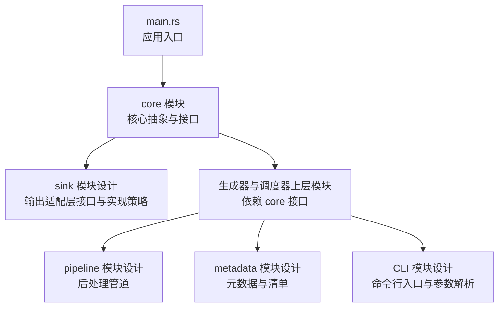
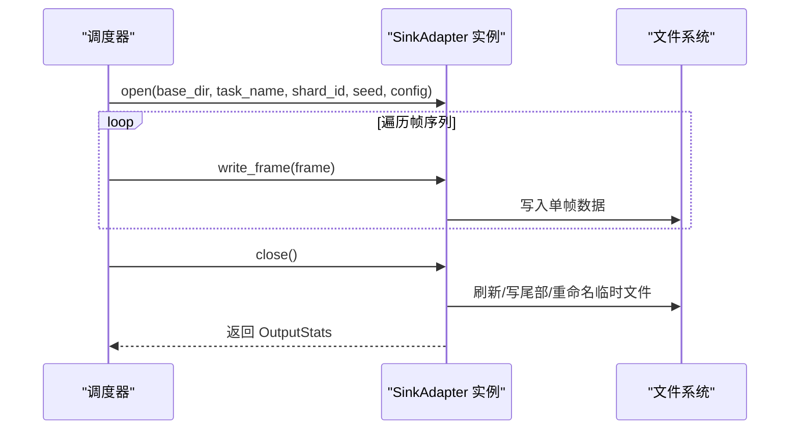
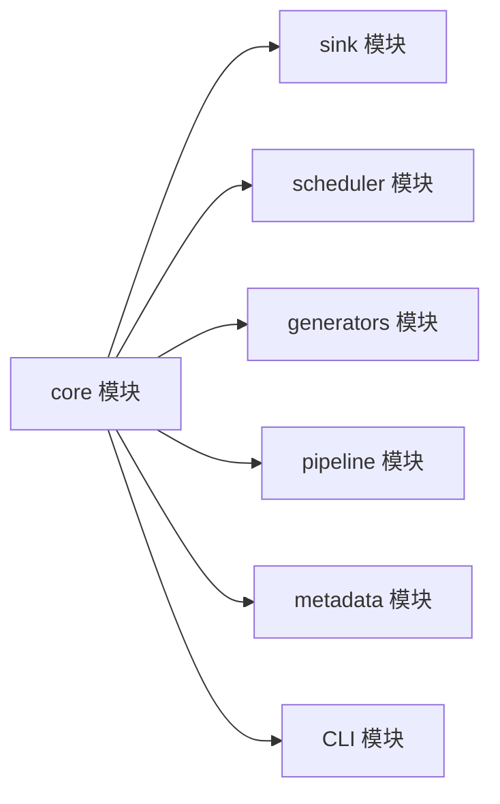

# 新输出格式开发

<cite>
**本文引用的文件**
- [main.rs](file://src/main.rs)
- [core 模块设计.md](file://docs/core模块详细设计.md)
- [sink 模块设计.md](file://docs/sink模块详细设计.md)
- [core 模块源码：mod.rs](file://src/core/mod.rs)
- [core 模块源码：generator.rs](file://src/core/generator.rs)
- [core 模块源码：frame.rs](file://src/core/frame.rs)
- [core 模块源码：params.rs](file://src/core/params.rs)
- [core 模块源码：error.rs](file://src/core/error.rs)
- [core 模块源码：registry.rs](file://src/core/registry.rs)
- [Cargo.toml](file://Cargo.toml)
</cite>

## 目录
1. [简介](#简介)
2. [项目结构](#项目结构)
3. [核心组件](#核心组件)
4. [架构总览](#架构总览)
5. [详细组件分析](#详细组件分析)
6. [依赖分析](#依赖分析)
7. [性能考虑](#性能考虑)
8. [故障排查指南](#故障排查指南)
9. [结论](#结论)
10. [附录](#附录)

## 简介
本指南面向希望在 StructGen-rs 中新增输出格式的开发者，系统讲解输出适配器接口的设计原理、SinkAdapter trait 的实现要求、不同输出格式（Parquet、文本、二进制）的实现策略与差异，并提供可操作的步骤与最佳实践，帮助你快速实现自定义输出适配器，涵盖数据转换、文件写入、错误处理、Arrow Schema 设计、配置管理与性能优化，以及与核心框架的集成与扩展机制。

## 项目结构
当前仓库包含核心抽象层（core）与输出适配层（sink）的设计文档，以及少量核心源码。输出适配层的实现文件在设计文档中已规划，但尚未在仓库中出现；本指南基于现有设计文档与核心源码进行说明，便于你对照实现。

图表来源
- [main.rs:1-6](file://src/main.rs#L1-L6)
- [core 模块设计.md:422-433](file://docs/core模块详细设计.md#L422-L433)
- [sink 模块设计.md:29-47](file://docs/sink模块详细设计.md#L29-L47)

章节来源
- [main.rs:1-6](file://src/main.rs#L1-L6)
- [core 模块设计.md:29-53](file://docs/core模块详细设计.md#L29-L53)
- [sink 模块设计.md:27-47](file://docs/sink模块详细设计.md#L27-L47)

## 核心组件
- 核心数据结构与接口
  - FrameState、FrameData、SequenceFrame：统一承载整数、浮点、布尔三类状态值，支持序列化与变体安全转换。
  - Generator trait：定义生成器的流式/批量接口，要求 Send + Sync，确保线程安全。
  - OutputFormat：输出格式枚举（Parquet、Text、Binary），配合全局配置与任务配置使用。
  - CoreError：统一错误类型，收敛参数、I/O、序列化、生成、管道、适配器等错误类别。
  - GeneratorRegistry：生成器注册表，按名称查找构造函数并实例化生成器。
- 输出适配层接口
  - SinkAdapter trait：定义 open/write/close 生命周期，支持单帧与批量写入，返回 OutputStats 与文件统计信息。
  - OutputConfig：输出配置（压缩级别、分片大小/帧数上限、是否计算哈希）。
  - OutputStats：写入统计（帧数、字节数、输出路径、可选文件哈希）。

章节来源
- [core 模块源码：frame.rs:1-210](file://src/core/frame.rs#L1-L210)
- [core 模块源码：generator.rs:1-129](file://src/core/generator.rs#L1-L129)
- [core 模块源码：params.rs:1-235](file://src/core/params.rs#L1-L235)
- [core 模块源码：error.rs:1-103](file://src/core/error.rs#L1-L103)
- [core 模块源码：registry.rs:1-150](file://src/core/registry.rs#L1-L150)
- [sink 模块设计.md:49-149](file://docs/sink模块详细设计.md#L49-L149)

## 架构总览
输出适配层位于核心抽象层之上，接收来自后处理管道的 SequenceFrame 序列，按指定格式写出到磁盘，同时管理分片、命名与统计。调度器通过 SinkAdapter trait 对象透明选择输出格式，无需感知底层实现。

图表来源
- [sink 模块设计.md:300-327](file://docs/sink模块详细设计.md#L300-L327)
- [sink 模块设计.md:55-98](file://docs/sink模块详细设计.md#L55-L98)

## 详细组件分析

### SinkAdapter trait 设计与实现要求
- 生命周期
  - open：准备输出环境（创建临时文件、构造最终文件名、初始化写入器、保存路径等）。
  - write_frame：逐帧写入，保持流式特性，避免内存累积。
  - write_batch：默认逐帧调用，子类可覆盖以优化批量写入。
  - close：刷新缓冲、写入文件尾部、原子重命名、返回 OutputStats。
- 返回值与错误
  - 所有方法返回 CoreResult，遵循统一错误传播。
  - close 返回 OutputStats，包含帧数、字节数、输出路径、可选哈希。
- 并发与原子性
  - 不同分片写入不同文件，天然无锁；若需写入同一文件，使用互斥或消息队列。
  - 采用“写临时文件→重命名”的原子写入策略，避免残留 .tmp 文件。

章节来源
- [sink 模块设计.md:55-98](file://docs/sink模块详细设计.md#L55-L98)
- [sink 模块设计.md:343-354](file://docs/sink模块详细设计.md#L343-L354)

### 输出格式实现策略与差异

#### ParquetAdapter（列式存储）
- 设计要点
  - Arrow Schema：包含 step_index、state_dim、state_values（FrameState 序列化为 9 字节元组）、label。
  - 写入流程：逐帧转换为 Arrow RecordBatch，写入 Parquet 文件，关闭时写入 footer 并重命名。
  - 压缩：默认 Snappy/Gzip，结合列式存储提升压缩比与查询效率。
- 数据转换
  - FrameState 序列化为 [type_tag:u8][payload:8bytes] 的定长元组，便于列式存储与随机访问。
- 性能优化
  - 使用 BufWriter 减少系统调用；合理设置压缩级别平衡速度与体积。
  - 列式存储天然适合状态向量的压缩与投影查询。

章节来源
- [sink 模块设计.md:153-190](file://docs/sink模块详细设计.md#L153-L190)

#### TextAdapter（纯文本）
- 设计要点
  - 输出格式：每行一个帧的所有状态值映射为 Unicode 字符，末尾换行。
  - 编码：UTF-8，确保可被语言模型 DataLoader 直接加载。
- 数据转换
  - 整数：映射为 u32 码点后转换为 Unicode 字符；超出范围钳位到有效范围。
  - 浮点：映射到 0–255 区间后再映射为字符；布尔：映射为 '0'/'1'。
- 性能优化
  - 使用 BufWriter（64KB–256KB 缓冲）降低系统调用次数；逐帧写入避免内存峰值。

章节来源
- [sink 模块设计.md:192-231](file://docs/sink模块详细设计.md#L192-L231)

#### BinaryAdapter（二进制 + 内存映射）
- 设计要点
  - 文件头：魔数（SGEN）、版本、帧数占位、状态维度；每帧包含 step_index、FrameState 序列（零拷贝布局）、label 长度与字节。
  - 写入流程：open 写入头部占位，write_frame 顺序写入，close 回填帧数并重命名。
- 数据转换
  - FrameState 二进制布局与内存一致，写入时直接 as_bytes() 拷贝，零序列化开销。
  - 固定帧头 + 确定偏移，支持 mmap 随机访问单帧。
- 性能优化
  - 64KB 内部缓冲区批量写出，避免频繁小 IO；零拷贝写入。

章节来源
- [sink 模块设计.md:233-286](file://docs/sink模块详细设计.md#L233-L286)

### Arrow Schema 设计与列式存储优化
- Schema 组成
  - step_index：INT64（必填），时间步索引。
  - state_dim：INT32（必填），状态维度。
  - state_values：BYTE_ARRAY（必填），FrameState 列表的序列化形式（每项 9 字节：1 字节类型标签 + 8 字节数据）。
  - label：BYTE_ARRAY（可选），语义标签文本。
- 优化策略
  - 列式存储：便于投影、过滤与聚合，适合大规模数据分析。
  - 压缩：Snappy/Gzip 压缩显著降低存储体积；Parquet 支持页级压缩与字典编码。
  - 定长元组：9 字节元组简化解析与随机访问。

章节来源
- [sink 模块设计.md:157-166](file://docs/sink模块详细设计.md#L157-L166)

### 自定义输出适配器实现步骤
- 步骤概览
  - 定义适配器类型：实现 SinkAdapter trait，包含 open/write_frame/write_batch/close。
  - 数据转换：将 SequenceFrame 转换为目标格式的字节/行/记录。
  - 文件写入：使用 BufWriter/Arrow Writer/自定义二进制写入器，逐帧写入。
  - 原子写入：写临时文件，close 时重命名为最终文件名。
  - 统计返回：更新帧数、字节数，返回 OutputStats。
  - 错误处理：遵循 CoreError 语义，传播 I/O、序列化等错误。
- 参考实现位置
  - SinkAdapter 接口定义与生命周期：[sink 模块设计.md:55-98](file://docs/sink模块详细设计.md#L55-L98)
  - Parquet 写入流程与 Schema：[sink 模块设计.md:153-190](file://docs/sink模块详细设计.md#L153-L190)
  - 文本写入流程与字符映射：[sink 模块设计.md:192-231](file://docs/sink模块详细设计.md#L192-L231)
  - 二进制写入流程与文件头：[sink 模块设计.md:233-286](file://docs/sink模块详细设计.md#L233-L286)

章节来源
- [sink 模块设计.md:55-98](file://docs/sink模块详细设计.md#L55-L98)
- [sink 模块设计.md:153-190](file://docs/sink模块详细设计.md#L153-L190)
- [sink 模块设计.md:192-231](file://docs/sink模块详细设计.md#L192-L231)
- [sink 模块设计.md:233-286](file://docs/sink模块详细设计.md#L233-L286)

### 与核心框架的集成与扩展机制
- 与 core 的耦合
  - 仅依赖 core 的公共类型（SequenceFrame、OutputFormat、CoreError 等），不引入业务模块依赖。
- 与调度器的交互
  - 调度器通过 OutputFormat 选择适配器实例，open→write_frame→close 的生命周期透明。
- 扩展机制
  - 新增输出格式：实现 SinkAdapter trait，按需在工厂或调度器中注册。
  - 配置扩展：通过 OutputConfig 控制压缩、分片大小与哈希计算。

章节来源
- [core 模块设计.md:422-433](file://docs/core模块详细设计.md#L422-L433)
- [sink 模块设计.md:300-327](file://docs/sink模块详细设计.md#L300-L327)

## 依赖分析
- 依赖关系
  - core 模块不依赖任何业务模块，仅依赖标准库与 serde/thiserror。
  - 上层模块（scheduler、generators、pipeline、sink、metadata、CLI）均依赖 core 的公共接口。
- 适配器依赖
  - SinkAdapter 依赖 core 的 SequenceFrame、OutputFormat、CoreError。
  - 不引入业务模块依赖，保持接口纯净。

图表来源
- [core 模块设计.md:422-433](file://docs/core模块详细设计.md#L422-L433)

章节来源
- [core 模块设计.md:422-433](file://docs/core模块详细设计.md#L422-L433)
- [Cargo.toml:6-10](file://Cargo.toml#L6-L10)

## 性能考虑
- 缓冲策略
  - 所有适配器使用 BufWriter，缓冲区大小 64KB–256KB，减少系统调用次数。
- 压缩与存储
  - Parquet 默认 Snappy/Gzip 压缩，列式存储天然适合状态向量压缩。
- 写入优化
  - BinaryAdapter 使用 64KB 内部缓冲区批量写出，避免逐帧小 IO。
  - 零序列化开销：FrameState 二进制布局与内存一致，直接 as_bytes() 拷贝。
- 并发与原子性
  - 不同分片写入不同文件，天然无锁；原子写入避免残留 .tmp 文件。

章节来源
- [sink 模块设计.md:355-362](file://docs/sink模块详细设计.md#L355-L362)

## 故障排查指南
- 常见错误与处理
  - 输出目录不存在/无权限：open 返回 CoreError::IoError，调度器记录并终止当前分片。
  - 写入期间磁盘满：write_frame 返回 CoreError::IoError，分片失败。
  - 临时文件重命名失败：close 返回 CoreError::IoError，保留 .tmp 文件便于调试。
  - Unicode 码点无效：TextAdapter 钳位到有效范围，不报错。
  - Parquet schema 不匹配：开发阶段通过静态断言预防。
- 原子写入保障
  - 成功后 .tmp 文件应消失，仅剩最终文件；失败保留 .tmp 文件便于定位问题。

章节来源
- [sink 模块设计.md:343-354](file://docs/sink模块详细设计.md#L343-L354)

## 结论
通过 SinkAdapter trait 的统一抽象，StructGen-rs 实现了输出格式的透明切换与高效落地。基于设计文档与核心源码，你可以快速实现自定义输出适配器：遵循 open/write/close 生命周期、实现数据转换与文件写入、采用原子写入策略、利用缓冲与压缩优化性能，并通过 OutputConfig 精细控制分片与校验行为。与 core 的低耦合设计确保了扩展的灵活性与稳定性。

## 附录

### 输出格式配置与参数
- OutputConfig
  - compression_level：压缩级别（0=不压缩，9=最大压缩；Parquet 使用 Snappy 时不适用）。
  - max_file_bytes：单文件最大字节数，None 表示不限制。
  - max_frames_per_file：单文件最大帧数，None 表示不限制。
  - compute_hash：关闭时是否计算 SHA-256。
- GlobalConfig
  - num_threads：并行线程数，None 表示自动检测。
  - default_format：默认输出格式（可被任务级覆盖）。
  - output_dir：输出根目录。
  - log_level：日志级别。
  - shard_max_sequences：每个输出分片文件的最大序列数。
  - stream_write：流式写出模式（true）vs 阻塞收集模式（false）。

章节来源
- [core 模块源码：params.rs:20-66](file://src/core/params.rs#L20-L66)
- [core 模块源码：params.rs:89-123](file://src/core/params.rs#L89-L123)
- [sink 模块设计.md:433-442](file://docs/sink模块详细设计.md#L433-L442)