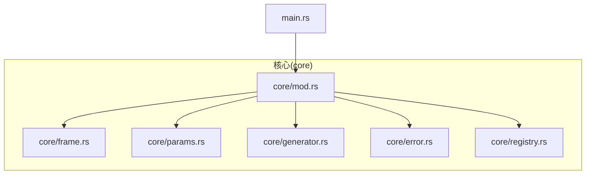
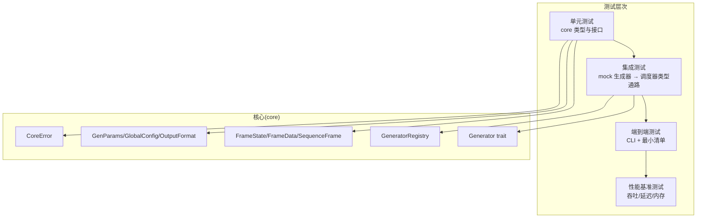
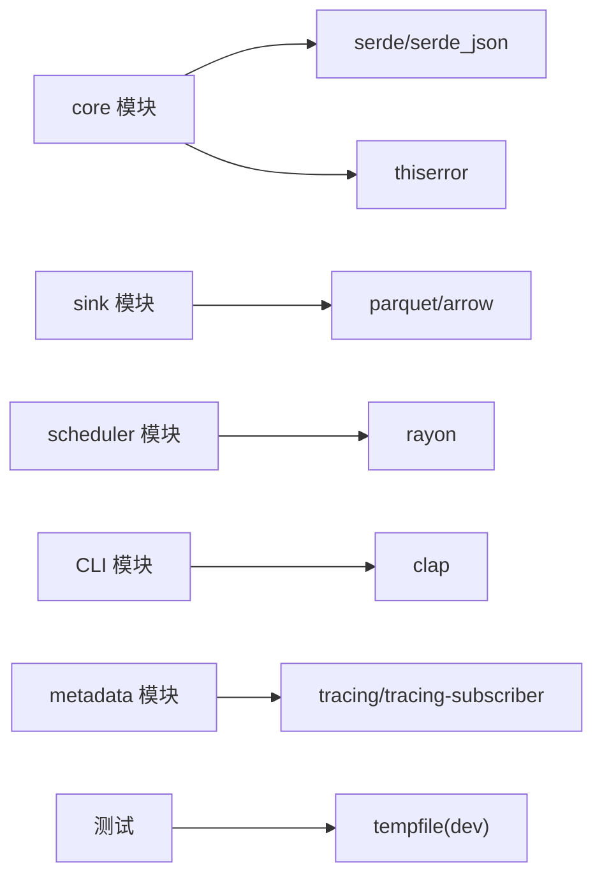

# 测试策略

<cite>
**本文引用的文件**
- [src/main.rs](file://src/main.rs)
- [src/core/mod.rs](file://src/core/mod.rs)
- [src/core/generator.rs](file://src/core/generator.rs)
- [src/core/frame.rs](file://src/core/frame.rs)
- [src/core/error.rs](file://src/core/error.rs)
- [src/core/params.rs](file://src/core/params.rs)
- [src/core/registry.rs](file://src/core/registry.rs)
- [Cargo.toml](file://Cargo.toml)
- [docs/开发规划.md](file://docs/开发规划.md)
- [docs/core模块详细设计.md](file://docs/core模块详细设计.md)
- [docs/pipeline模块详细设计.md](file://docs/pipeline模块详细设计.md)
- [docs/sink模块详细设计.md](file://docs/sink模块详细设计.md)
</cite>

## 目录
1. [简介](#简介)
2. [项目结构](#项目结构)
3. [核心组件](#核心组件)
4. [架构总览](#架构总览)
5. [详细组件分析](#详细组件分析)
6. [依赖分析](#依赖分析)
7. [性能考虑](#性能考虑)
8. [故障排查指南](#故障排查指南)
9. [结论](#结论)
10. [附录](#附录)

## 简介
本指南面向 StructGen-rs 的测试工作，围绕单元测试、接口契约测试、边界条件测试、集成测试（含端到端与性能基准）、测试数据生成与验证、覆盖率与持续集成、模拟对象与测试环境搭建、性能与压力测试最佳实践等方面，提供系统化、可操作的策略与实施路径。文档以仓库现有代码与设计文档为基础，结合 Rust 生态的测试工具链与实践，帮助团队建立高质量、可维护的测试体系。

## 项目结构
- 核心模块位于 src/core，定义了帧数据、参数、生成器接口、错误类型与注册表等基础契约。
- CLI 入口位于 src/main.rs，负责参数解析与运行装配。
- Cargo.toml 定义了基础依赖（serde、serde_json、thiserror），以及后续阶段的可选依赖（如 parquet、rayon、clap 等）。
- 文档目录 docs 提供了模块详细设计与开发规划，明确了测试重点与阶段性目标。

图表来源
- [src/core/mod.rs:1-16](file://src/core/mod.rs#L1-L16)
- [src/core/generator.rs:1-129](file://src/core/generator.rs#L1-L129)
- [src/core/frame.rs:1-210](file://src/core/frame.rs#L1-L210)
- [src/core/error.rs:1-103](file://src/core/error.rs#L1-L103)
- [src/core/params.rs:1-235](file://src/core/params.rs#L1-L235)
- [src/core/registry.rs:1-150](file://src/core/registry.rs#L1-L150)
- [src/main.rs:1-6](file://src/main.rs#L1-L6)

章节来源
- [src/core/mod.rs:1-16](file://src/core/mod.rs#L1-L16)
- [src/main.rs:1-6](file://src/main.rs#L1-L6)
- [Cargo.toml:1-10](file://Cargo.toml#L1-L10)

## 核心组件
- 帧与状态模型：FrameState、FrameData、SequenceFrame，用于承载时序状态数据，支持序列化与转换。
- 通用参数与配置：GenParams（含扩展字段 extensions）、GlobalConfig、OutputFormat，支撑生成器与调度器的参数化。
- 生成器接口：Generator trait，定义流式与批量生成能力，并要求 Send + Sync。
- 错误体系：CoreError，统一错误类型，便于测试中断言错误分支。
- 注册表：GeneratorRegistry，名称→工厂函数映射，用于调度器按名称实例化生成器。

章节来源
- [src/core/frame.rs:1-210](file://src/core/frame.rs#L1-L210)
- [src/core/params.rs:1-235](file://src/core/params.rs#L1-L235)
- [src/core/generator.rs:1-129](file://src/core/generator.rs#L1-L129)
- [src/core/error.rs:1-103](file://src/core/error.rs#L1-L103)
- [src/core/registry.rs:1-150](file://src/core/registry.rs#L1-L150)

## 架构总览
下图展示了测试策略与核心模块的关系：单元测试覆盖 core 的关键类型与接口；集成测试以 mock 生成器验证从 core 到调度器的类型通路；端到端测试在 CLI 层验证最小清单的运行；性能基准测试可结合后续模块（如 pipeline、sink）进行。

图表来源
- [docs/开发规划.md:351-357](file://docs/开发规划.md#L351-L357)
- [docs/core模块详细设计.md:484-537](file://docs/core模块详细设计.md#L484-L537)

## 详细组件分析

### 单元测试：核心模块测试
- 帧状态与转换
  - 断言 FrameState 的 as_integer/as_float/as_bool 行为，覆盖整数、浮点、布尔之间的安全转换与不可转换分支。
  - 断言 variant_name 返回正确的变体名。
  - 断言序列化/反序列化往返一致性。
- 帧数据与帧
  - 断言空帧、默认帧、维度与判空行为。
  - 断言帧构造与标签设置。
- 通用参数与配置
  - 断言扩展字段 set/get 往返，类型不匹配时的错误分支。
  - 断言全局配置默认值与反序列化行为。
- 错误类型
  - 断言错误显示字符串与自动转换（如 IoError）。
- 生成器接口
  - 断言名称、流式生成长度控制（seq_length=0 的默认上限）、批量生成的收集行为。
- 注册表
  - 断言注册、查找、重复注册 panic、列表与包含判断、未找到的错误类型。

章节来源
- [src/core/frame.rs:120-210](file://src/core/frame.rs#L120-L210)
- [src/core/params.rs:125-235](file://src/core/params.rs#L125-L235)
- [src/core/error.rs:54-103](file://src/core/error.rs#L54-L103)
- [src/core/generator.rs:58-129](file://src/core/generator.rs#L58-L129)
- [src/core/registry.rs:66-150](file://src/core/registry.rs#L66-L150)

### 接口契约测试：Generator 与 Registry
- Generator 契约
  - 通过 mock 实现 Generator，验证 name、from_extensions、generate_stream/generate_batch 的契约满足。
  - 验证流式生成的长度边界（seq_length=0 时的默认上限）。
- Registry 契约
  - 注册同名 panic、实例化未注册名称的错误类型、列表与包含判断。
- 并发安全
  - 设计要点：注册表在运行时只读查找，读取路径天然并发安全；可通过多线程读取测试其稳定性（在后续模块中结合 rayon 验证）。

章节来源
- [src/core/generator.rs:9-56](file://src/core/generator.rs#L9-L56)
- [src/core/registry.rs:20-64](file://src/core/registry.rs#L20-L64)
- [docs/core模块详细设计.md:484-537](file://docs/core模块详细设计.md#L484-L537)

### 边界条件测试
- 帧状态
  - 浮点→整数不自动转换的边界；布尔→整数的 0/1 映射。
- 参数扩展
  - 不存在的扩展键、类型不匹配的扩展键。
- 生成长度
  - seq_length=0 的默认上限行为；批量生成的上限与流式生成的上限一致性。
- 错误传播
  - IoError 的自动转换与传播路径。

章节来源
- [src/core/frame.rs:14-50](file://src/core/frame.rs#L14-L50)
- [src/core/params.rs:99-123](file://src/core/params.rs#L99-L123)
- [src/core/generator.rs:76-127](file://src/core/generator.rs#L76-L127)
- [src/core/error.rs:65-80](file://src/core/error.rs#L65-L80)

### 集成测试：mock 生成器到调度器类型通路
- 目标：验证 core 类型与接口在调度器装配路径上的正确性。
- 方法：在测试中构造 mock 生成器，使用 GeneratorRegistry 注册并实例化，随后以 GenParams 驱动 generate_stream，验证产出帧的结构与长度。
- 并发：结合 rayon 线程池，验证多线程读取注册表的安全性。

章节来源
- [docs/开发规划.md:351-357](file://docs/开发规划.md#L351-L357)
- [src/core/registry.rs:43-63](file://src/core/registry.rs#L43-L63)
- [src/core/generator.rs:35-55](file://src/core/generator.rs#L35-L55)

### 端到端测试：CLI 与最小清单
- 目标：验证 CLI 正确解析参数、加载清单、装配流水线并产出数据与元数据。
- 方法：准备最小 YAML 清单，运行 CLI，断言输出文件存在、元数据 JSON 合法、退出码符合预期。
- 验证点：缺少 --manifest、YAML 解析失败、--help 包含所有参数、端到端产物完整性。

章节来源
- [docs/开发规划.md:247-274](file://docs/开发规划.md#L247-L274)
- [src/main.rs:1-6](file://src/main.rs#L1-L6)

### 性能基准测试：生成器、处理器与输出适配器
- 生成器
  - 固定种子确定性输出校验（前 N 帧二进制哈希比对），评估吞吐与内存峰值。
- 处理器
  - 线性归一化、去重、差分编码、令牌映射等链式处理的吞吐与延迟。
- 输出适配器
  - Parquet 写入/读取往返、Text 输出合法性、Binary 文件头校验、原子写入与文件名唯一性。
- 基准指标
  - 序列数/秒、平均帧时延、内存峰值、磁盘 I/O、CPU 利用率、线程池效率。

章节来源
- [docs/开发规划.md:175-181](file://docs/开发规划.md#L175-L181)
- [docs/pipeline模块详细设计.md:404-469](file://docs/pipeline模块详细设计.md#L404-L469)
- [docs/sink模块详细设计.md:363-431](file://docs/sink模块详细设计.md#L363-L431)

### 测试数据生成与验证
- 生成策略
  - 使用 core 类型构造测试帧（FrameState、FrameData、SequenceFrame），确保覆盖整数/浮点/布尔三类状态。
  - 使用 GenParams 的 extensions 插入生成器特有参数，验证序列化/反序列化往返。
- 验证方法
  - 序列化/反序列化往返一致性。
  - 帧维度、空帧判定、标签设置。
  - 错误类型断言（如 GeneratorNotFound、InvalidParams）。

章节来源
- [src/core/frame.rs:120-210](file://src/core/frame.rs#L120-L210)
- [src/core/params.rs:125-235](file://src/core/params.rs#L125-L235)
- [src/core/error.rs:54-103](file://src/core/error.rs#L54-L103)

### 测试覆盖率与持续集成
- 覆盖率目标
  - core 与 scheduler 模块 ≥ 90%，generators 的确定性测试覆盖所有生成器类型 ≥ 80%。
- CI 流程建议
  - 基础检查：cargo test、clippy、fmt。
  - 并发与平台：在 x86_64 与 aarch64 上运行集成测试，验证跨平台确定性。
  - 性能回归：基准测试纳入 CI，记录指标并报警。
  - 端到端：最小清单运行与产物校验。

章节来源
- [docs/开发规划.md:351-357](file://docs/开发规划.md#L351-L357)

### 模拟对象与测试环境
- 模拟对象
  - mock 生成器：实现 Generator trait，产出固定序列的帧，便于断言长度与状态。
  - mock 工厂：GeneratorRegistry 的工厂函数，用于注册与实例化。
- 测试环境
  - 临时目录：使用 tempfile 在测试中创建临时输出目录，验证原子写入与文件名格式。
  - 日志与进度：在 metadata 模块中初始化日志与进度追踪器，确保测试可观察性。

章节来源
- [src/core/generator.rs:62-95](file://src/core/generator.rs#L62-L95)
- [src/core/registry.rs:70-100](file://src/core/registry.rs#L70-L100)
- [docs/sink模块详细设计.md:363-431](file://docs/sink模块详细设计.md#L363-L431)

## 依赖分析
- 核心依赖
  - serde/serde_json：序列化/反序列化。
  - thiserror：错误派生宏。
- 后续阶段依赖（在 Cargo.toml 中规划）
  - parquet/arrow：输出适配器。
  - rayon：调度器并行。
  - clap：CLI 参数解析。
  - tracing/tracing-subscriber：可观测性。
  - tempfile：测试临时目录。

图表来源
- [Cargo.toml:6-10](file://Cargo.toml#L6-L10)
- [docs/开发规划.md:300-336](file://docs/开发规划.md#L300-L336)

章节来源
- [Cargo.toml:1-10](file://Cargo.toml#L1-L10)
- [docs/开发规划.md:300-336](file://docs/开发规划.md#L300-L336)

## 性能考虑
- 生成器接口优先流式迭代，避免一次性收集导致内存峰值过高。
- 注册表查找为 O(1)，减少调度开销。
- 扩展字段惰性解析，避免无效解析成本。
- 确定性种子派生与分片切分，保证可重复性与可扩展性。

章节来源
- [docs/core模块详细设计.md:477-483](file://docs/core模块详细设计.md#L477-L483)
- [docs/开发规划.md:200-206](file://docs/开发规划.md#L200-L206)

## 故障排查指南
- 常见错误类型断言
  - GeneratorNotFound：未注册名称实例化。
  - InvalidParams：扩展字段缺失或类型不匹配。
  - IoError：文件权限、磁盘空间等系统错误。
- 日志与进度
  - 初始化日志与进度追踪器，确保测试期间可观测。
- 原子写入与文件名
  - 验证成功后无 .tmp 残留文件，文件名格式唯一。

章节来源
- [src/core/error.rs:54-103](file://src/core/error.rs#L54-L103)
- [src/core/registry.rs:114-130](file://src/core/registry.rs#L114-L130)
- [docs/sink模块详细设计.md:414-430](file://docs/sink模块详细设计.md#L414-L430)

## 结论
本测试策略以 core 模块为核心，通过单元测试覆盖关键类型与接口、接口契约测试验证 Generator 与 Registry 的行为、边界条件测试确保鲁棒性，并以 mock 生成器驱动集成测试与端到端测试。配合覆盖率目标与 CI 流程，以及性能基准测试与压力测试最佳实践，可有效保障 StructGen-rs 的质量与可维护性。

## 附录
- 测试代码示例路径（不展示具体代码内容）
  - 生成器单元测试：[src/core/generator.rs:58-129](file://src/core/generator.rs#L58-L129)
  - 帧状态与帧单元测试：[src/core/frame.rs:120-210](file://src/core/frame.rs#L120-L210)
  - 参数扩展单元测试：[src/core/params.rs:125-235](file://src/core/params.rs#L125-L235)
  - 错误类型单元测试：[src/core/error.rs:54-103](file://src/core/error.rs#L54-L103)
  - 注册表单元测试：[src/core/registry.rs:66-150](file://src/core/registry.rs#L66-L150)
  - 端到端测试重点：[docs/开发规划.md:247-274](file://docs/开发规划.md#L247-L274)
  - 处理器链式处理测试重点：[docs/pipeline模块详细设计.md:404-469](file://docs/pipeline模块详细设计.md#L404-L469)
  - 输出适配器测试重点：[docs/sink模块详细设计.md:363-431](file://docs/sink模块详细设计.md#L363-L431)