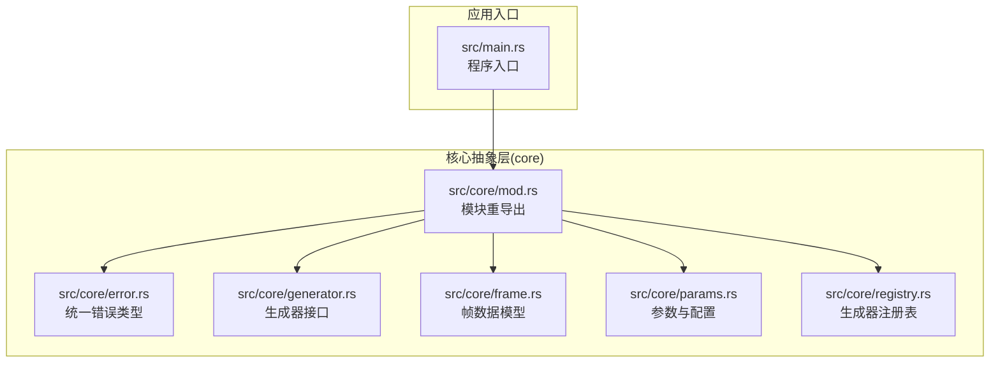
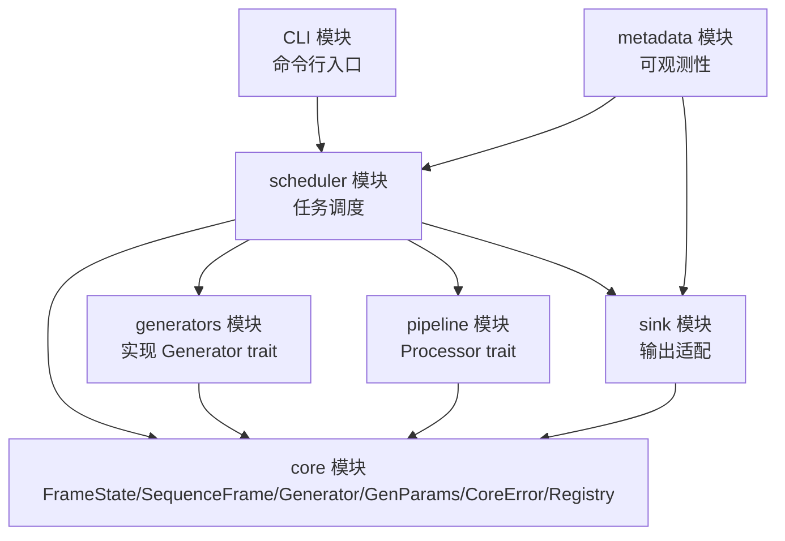
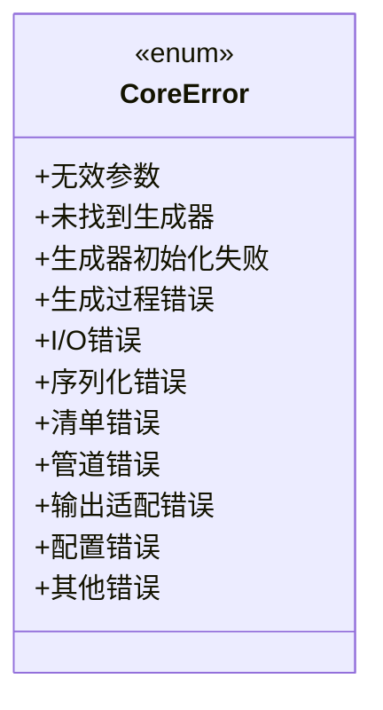
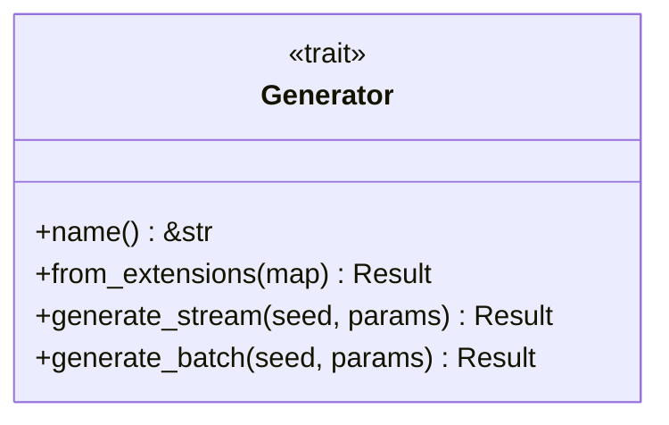
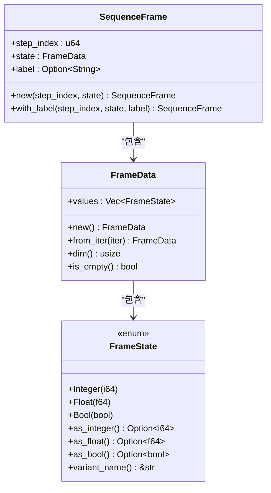
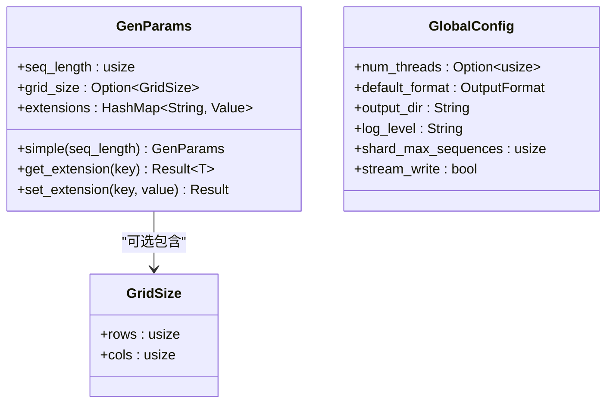
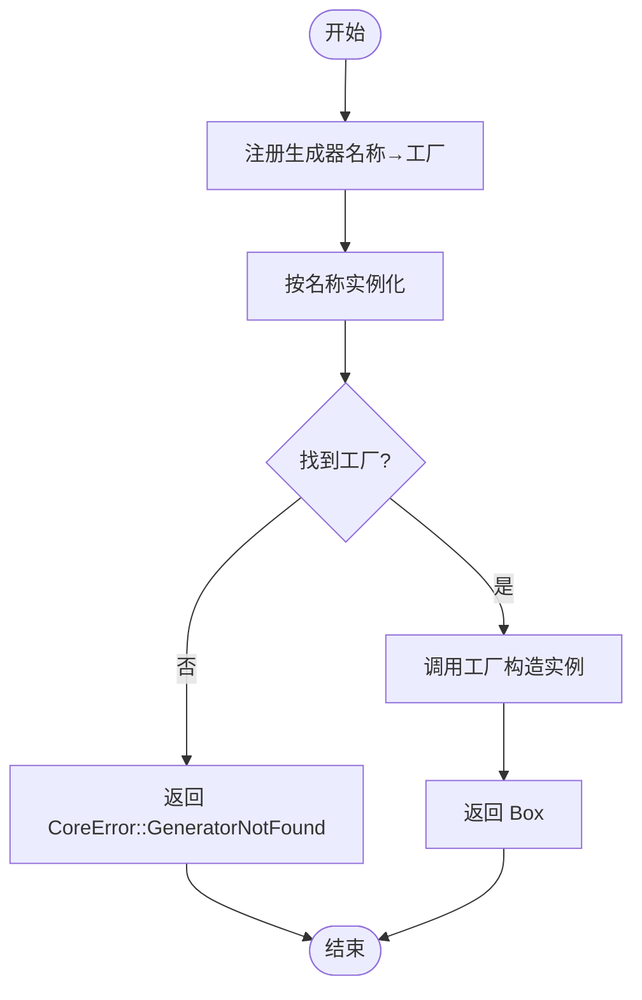
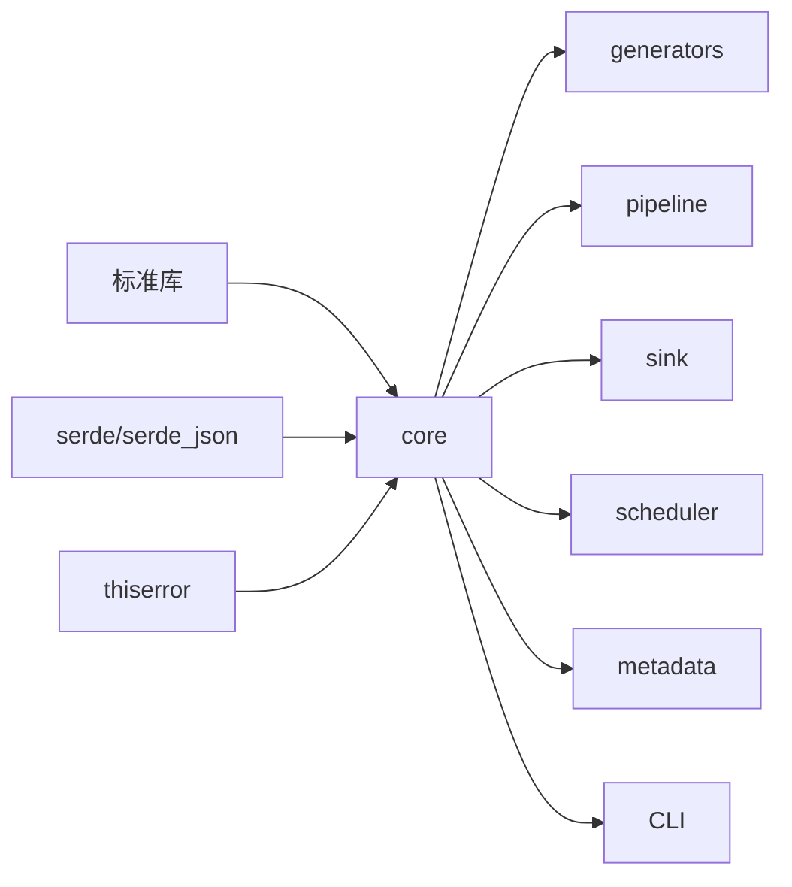

# 调试和性能分析

<cite>
**本文档引用的文件**
- [src/main.rs](file://src/main.rs)
- [Cargo.toml](file://Cargo.toml)
- [src/core/mod.rs](file://src/core/mod.rs)
- [src/core/error.rs](file://src/core/error.rs)
- [src/core/generator.rs](file://src/core/generator.rs)
- [src/core/frame.rs](file://src/core/frame.rs)
- [src/core/params.rs](file://src/core/params.rs)
- [src/core/registry.rs](file://src/core/registry.rs)
- [docs/core模块详细设计.md](file://docs/core模块详细设计.md)
- [.trae/specs/implement-core-module/tasks.md](file://.trae/specs/implement-core-module/tasks.md)
- [.trae/specs/implement-core-module/checklist.md](file://.trae/specs/implement-core-module/checklist.md)
- [docs/开发规划.md](file://docs/开发规划.md)
</cite>

## 目录
1. [简介](#简介)
2. [项目结构](#项目结构)
3. [核心组件](#核心组件)
4. [架构总览](#架构总览)
5. [详细组件分析](#详细组件分析)
6. [依赖分析](#依赖分析)
7. [性能考虑](#性能考虑)
8. [故障排除指南](#故障排除指南)
9. [结论](#结论)
10. [附录](#附录)

## 简介
本指南面向 StructGen-rs 项目的开发者与运维人员，聚焦“调试与性能分析”主题，涵盖以下内容：
- 如何配置与使用调试工具：日志配置、断点调试、变量检查
- 性能分析方法与工具：CPU 分析、内存分析、I/O 性能监控
- Rust 性能分析工具链：perf、valgrind、cargo flamegraph、cargo-asm、perf-map 等
- 内存泄漏检测与优化建议
- 运行时性能与资源使用监控
- 性能瓶颈识别与优化最佳实践

本指南以仓库现有代码为基础，结合设计文档与实现清单，提供可操作的步骤与可视化图示。

## 项目结构
项目采用“自底向上”的模块化分层设计，核心抽象层（core）定义统一的数据类型、接口与错误体系，其余模块（generators、pipeline、sink、scheduler、metadata、CLI）均依赖 core 层。

**图表来源**
- [src/main.rs:1-6](file://src/main.rs#L1-L6)
- [src/core/mod.rs:1-16](file://src/core/mod.rs#L1-L16)
- [src/core/error.rs:1-103](file://src/core/error.rs#L1-L103)
- [src/core/generator.rs:1-129](file://src/core/generator.rs#L1-L129)
- [src/core/frame.rs:1-210](file://src/core/frame.rs#L1-L210)
- [src/core/params.rs:1-235](file://src/core/params.rs#L1-L235)
- [src/core/registry.rs:1-150](file://src/core/registry.rs#L1-L150)

**章节来源**
- [src/main.rs:1-6](file://src/main.rs#L1-L6)
- [src/core/mod.rs:1-16](file://src/core/mod.rs#L1-L16)
- [docs/开发规划.md:9-50](file://docs/开发规划.md#L9-L50)

## 核心组件
- 统一错误类型：CoreError 提供系统级错误收敛，便于调试定位与用户提示
- 生成器接口：Generator trait 定义流式生成与批量生成的契约，支持并行与惰性求值
- 帧数据模型：FrameState/FrameData/SequenceFrame 统一承载状态数据，支持序列化与跨模块传递
- 参数与配置：GenParams 承载通用参数，GlobalConfig 提供全局运行配置（含日志级别）
- 生成器注册表：GeneratorRegistry 提供名称→构造函数映射，支持并发安全查找

**章节来源**
- [src/core/error.rs:1-103](file://src/core/error.rs#L1-L103)
- [src/core/generator.rs:1-129](file://src/core/generator.rs#L1-L129)
- [src/core/frame.rs:1-210](file://src/core/frame.rs#L1-L210)
- [src/core/params.rs:1-235](file://src/core/params.rs#L1-L235)
- [src/core/registry.rs:1-150](file://src/core/registry.rs#L1-L150)
- [docs/core模块详细设计.md:477-483](file://docs/core模块详细设计.md#L477-L483)

## 架构总览
下图展示 core 模块在系统中的定位及其与上层模块的依赖关系。

**图表来源**
- [docs/开发规划.md:9-50](file://docs/development_planning.md#L9-L50)
- [docs/开发规划.md:422-433](file://docs/开发规划.md#L422-L433)

## 详细组件分析

### 组件 A：统一错误类型 CoreError
- 设计要点：错误收敛到单一枚举，便于统一处理与调试
- 关键能力：I/O 错误自动转换、序列化/反序列化错误、配置错误、生成器相关错误等
- 调试价值：通过错误消息快速定位问题来源（参数、配置、I/O、生成过程）

**图表来源**
- [src/core/error.rs:4-49](file://src/core/error.rs#L4-L49)

**章节来源**
- [src/core/error.rs:1-103](file://src/core/error.rs#L1-L103)
- [docs/core模块详细设计.md:455-476](file://docs/core模块详细设计.md#L455-L476)

### 组件 B：生成器接口 Generator
- 设计要点：Send + Sync 确保线程安全；流式生成优先，批量生成为语法糖
- 关键方法：name/from_extensions/generate_stream/generate_batch
- 调试价值：通过 generate_stream 的迭代器逐帧检查状态变化；批量接口便于小规模验证

**图表来源**
- [src/core/generator.rs:12-56](file://src/core/generator.rs#L12-L56)

**章节来源**
- [src/core/generator.rs:1-129](file://src/core/generator.rs#L1-L129)
- [docs/core模块详细设计.md:200-253](file://docs/core模块详细设计.md#L200-L253)

### 组件 C：帧数据模型 FrameState/FrameData/SequenceFrame
- 设计要点：FrameState 为标记联合体，统一承载整型、浮点型、布尔型；序列化友好
- 关键方法：as_integer/as_float/as_bool/variant_name；FrameData.dim/is_empty/new/from_iter
- 调试价值：通过 variant_name 与 as_* 方法快速判断状态类型与转换结果；序列化用于跨模块数据校验

**图表来源**
- [src/core/frame.rs:4-118](file://src/core/frame.rs#L4-L118)

**章节来源**
- [src/core/frame.rs:1-210](file://src/core/frame.rs#L1-L210)
- [docs/core模块详细设计.md:56-131](file://docs/core模块详细设计.md#L56-L131)

### 组件 D：参数与配置 GenParams/GlobalConfig
- 设计要点：GenParams 支持动态扩展字段（extensions），通过 JSON 中间表示；GlobalConfig 提供日志级别等全局设置
- 调试价值：通过 extensions 插入/读取生成器特有参数；日志级别影响调试输出粒度

**图表来源**
- [src/core/params.rs:69-67](file://src/core/params.rs#L69-L67)

**章节来源**
- [src/core/params.rs:1-235](file://src/core/params.rs#L1-L235)
- [docs/core模块详细设计.md:133-198](file://docs/core模块详细设计.md#L133-L198)

### 组件 E：生成器注册表 GeneratorRegistry
- 设计要点：名称→构造函数映射；注册时重复 panic；实例化失败返回统一错误
- 调试价值：通过 list_names/contains 快速确认注册状态；实例化错误帮助定位清单配置

**图表来源**
- [src/core/registry.rs:43-53](file://src/core/registry.rs#L43-L53)

**章节来源**
- [src/core/registry.rs:1-150](file://src/core/registry.rs#L1-L150)
- [docs/core模块详细设计.md:385-398](file://docs/core模块详细设计.md#L385-L398)

## 依赖分析
- 核心依赖：core 仅依赖标准库与 serde/thiserror，保持纯净性
- 上层依赖：generators/pipeline/sink/scheduler/metadata/CLI 依次依赖 core
- 关键耦合点：GeneratorRegistry 为调度器与生成器模块的桥接

**图表来源**
- [docs/开发规划.md:54-63](file://docs/开发规划.md#L54-L63)
- [Cargo.toml:6-10](file://Cargo.toml#L6-L10)

**章节来源**
- [docs/开发规划.md:9-50](file://docs/开发规划.md#L9-L50)
- [Cargo.toml:1-10](file://Cargo.toml#L1-L10)

## 性能考虑
- 内存布局：FrameState 为 16 字节（16B 对齐），适合大规模序列；零拷贝传递减少复制开销
- 查找复杂度：注册表使用静态字符串键的 HashMap，查找 O(1)
- 惰性解析：扩展字段仅在实例化时解析，避免无效开销
- 并行与线程池：scheduler 使用 rayon 并行执行，需合理设置线程数

**章节来源**
- [docs/core模块详细设计.md:477-483](file://docs/core模块详细设计.md#L477-L483)
- [docs/开发规划.md:323-325](file://docs/开发规划.md#L323-L325)

## 故障排除指南

### 日志配置与调试
- 日志级别：GlobalConfig.log_level 控制日志粒度（trace/debug/info/warn/error）
- 建议：在本地开发时使用 debug 或 trace，生产环境使用 info
- 检查点：确认日志输出路径与格式，排查 I/O 错误（CoreError::IoError）

**章节来源**
- [src/core/params.rs:32-34](file://src/core/params.rs#L32-L34)
- [src/core/error.rs:22-24](file://src/core/error.rs#L22-L24)

### 断点调试与变量检查
- 断点位置建议：
  - 生成器实例化：GeneratorRegistry.instantiate
  - 流式生成：Generator.generate_stream 的迭代器内部
  - 参数解析：GenParams.extensions 的 get/set 扩展字段
- 变量检查要点：
  - SequenceFrame 的 step_index 与 label
  - FrameState 的 variant_name 与 as_* 转换结果
  - GenParams 的 seq_length 与 grid_size

**章节来源**
- [src/core/registry.rs:43-53](file://src/core/registry.rs#L43-L53)
- [src/core/generator.rs:35-39](file://src/core/generator.rs#L35-L39)
- [src/core/frame.rs:14-50](file://src/core/frame.rs#L14-L50)
- [src/core/params.rs:99-122](file://src/core/params.rs#L99-L122)

### 常见错误诊断
- 生成器未注册：CoreError::GeneratorNotFound → 检查注册表注册与名称拼写
- 参数不合法：CoreError::InvalidParams → 检查 GenParams.extensions 的键与类型
- I/O 错误：CoreError::IoError → 检查文件路径、权限与磁盘空间
- 配置错误：CoreError::ConfigError → 检查 GlobalConfig 的线程数与输出目录

**章节来源**
- [src/core/error.rs:6-48](file://src/core/error.rs#L6-L48)
- [src/core/registry.rs:48-52](file://src/core/registry.rs#L48-L52)

### 内存泄漏检测与优化
- 工具链建议：
  - valgrind/cgdb：Linux 下进行内存与断点调试
  - cargo leaks（macOS）：检测堆泄漏
  - AddressSanitizer（asan）：启用内存错误检测
- 优化建议：
  - 使用惰性迭代器（generate_stream）避免一次性收集
  - 控制序列长度（seq_length）与分片大小（shard_max_sequences）
  - 避免不必要的克隆（FrameData/SequenceFrame 的 move 语义）

**章节来源**
- [src/core/generator.rs:48-55](file://src/core/generator.rs#L48-L55)
- [src/core/params.rs:37-38](file://src/core/params.rs#L37-L38)

### CPU 与 I/O 性能分析
- CPU 分析：
  - perf（Linux）：采集火焰图，定位热点函数
  - cargo flamegraph：生成 SVG 火焰图，结合生成器与管道处理
- I/O 监控：
  - iostat/iotop：观察磁盘与进程 I/O
  - strace（Linux）：跟踪系统调用，定位阻塞点
- Rust 工具：
  - cargo asm：查看关键函数的汇编，辅助优化
  - perf-map-agent（JIT）：配合 perf 显示 JIT 符号

**章节来源**
- [docs/开发规划.md:327-329](file://docs/开发规划.md#L327-L329)

### 运行时性能与资源监控
- 监控指标：CPU 使用率、内存占用、磁盘吞吐、线程数
- 建议做法：
  - 使用操作系统自带工具（htop/top/vmstat/iostat）
  - 在关键路径埋点（如 generate_stream 的每帧耗时）
  - 通过 GlobalConfig.num_threads 与 stream_write 调优

**章节来源**
- [src/core/params.rs:23-41](file://src/core/params.rs#L23-L41)

## 结论
本指南基于 core 模块的类型与接口，提供了调试与性能分析的系统化方法。通过统一错误类型、流式生成接口与注册表机制，开发者能够快速定位问题并优化性能。建议在开发流程中：
- 使用合理的日志级别与输出格式
- 以断点与变量检查结合单元测试验证关键路径
- 借助 perf/flamegraph/valgrind 等工具进行 CPU 与内存分析
- 通过惰性迭代与分片策略降低内存峰值与提升吞吐

## 附录

### A. 调试与性能分析工具清单
- 日志与可观测性：tracing/tracing-subscriber（在 metadata 模块中使用）
- CPU 分析：perf、cargo flamegraph
- 内存分析：valgrind、cargo leaks、AddressSanitizer
- I/O 分析：iostat、strace
- 汇编与 JIT：cargo asm、perf-map-agent

**章节来源**
- [docs/开发规划.md:327-329](file://docs/开发规划.md#L327-L329)

### B. 实现清单与测试验证参考
- core 模块实现任务与测试通过项，可作为调试与回归测试的基线

**章节来源**
- [.trae/specs/implement-core-module/tasks.md:1-58](file://.trae/specs/implement-core-module/tasks.md#L1-L58)
- [.trae/specs/implement-core-module/checklist.md:30-48](file://.trae/specs/implement-core-module/checklist.md#L30-L48)