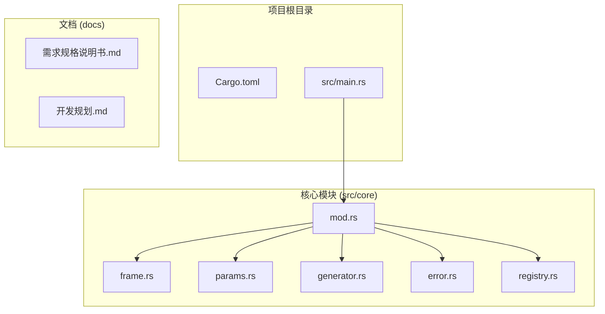
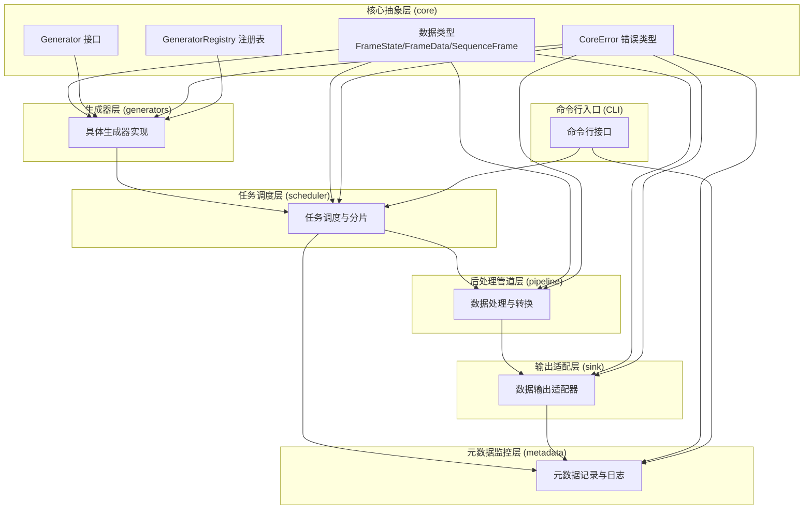
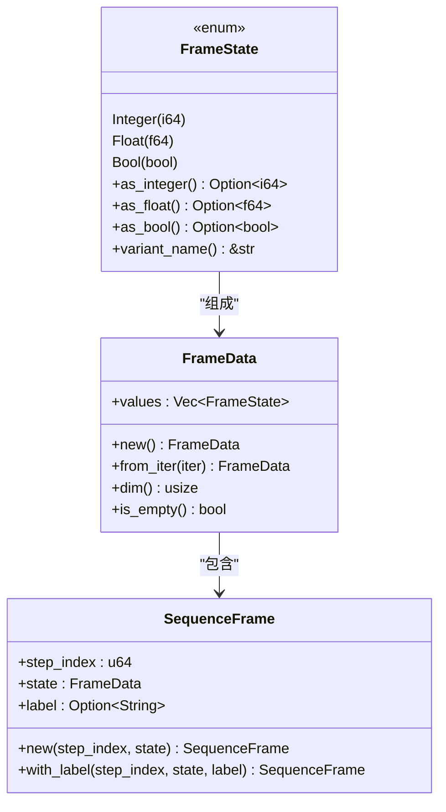
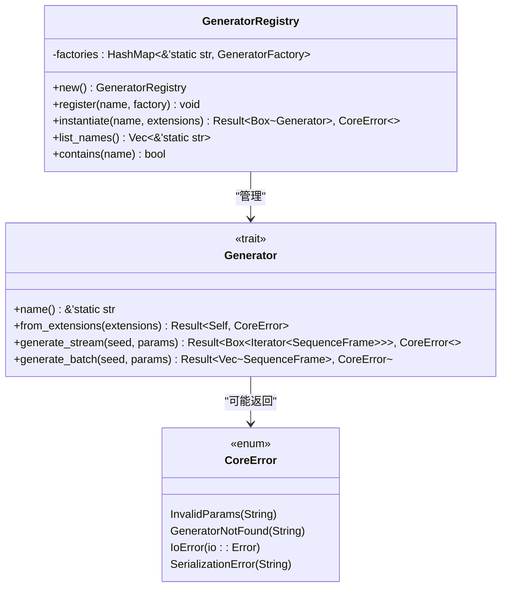
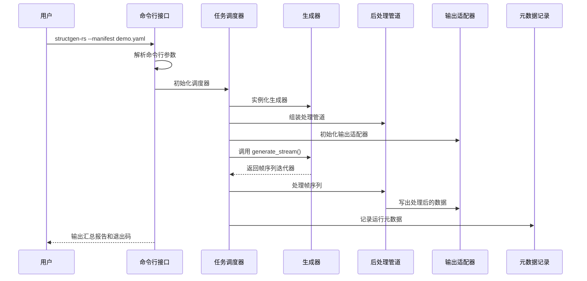
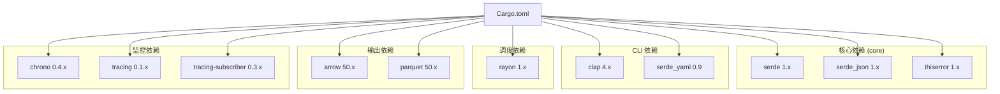

# 快速开始

<cite>
**本文引用的文件**
- [Cargo.toml](file://Cargo.toml)
- [src/main.rs](file://src/main.rs)
- [src/core/mod.rs](file://src/core/mod.rs)
- [src/core/frame.rs](file://src/core/frame.rs)
- [src/core/params.rs](file://src/core/params.rs)
- [src/core/generator.rs](file://src/core/generator.rs)
- [src/core/error.rs](file://src/core/error.rs)
- [src/core/registry.rs](file://src/core/registry.rs)
- [docs/需求规格说明书.md](file://docs/需求规格说明书.md)
- [docs/开发规划.md](file://docs/开发规划.md)
</cite>

## 目录
1. [简介](#简介)
2. [项目结构](#项目结构)
3. [核心组件](#核心组件)
4. [架构概览](#架构概览)
5. [详细组件分析](#详细组件分析)
6. [依赖分析](#依赖分析)
7. [性能考虑](#性能考虑)
8. [故障排除指南](#故障排除指南)
9. [结论](#结论)
10. [附录](#附录)

## 简介
StructGen-rs 是一个用 Rust 实现的高性能、可扩展的程序化数据生成器，专注于生成"非语言、富结构"的训练语料。该项目采用分层架构，包含核心抽象层、生成器层、任务调度层、后处理管道层、输出适配层和元数据监控层。系统支持多种生成器（如元胞自动机、连续动力系统、物理模拟、算法轨迹等），并通过统一的接口和注册机制实现高度可扩展性。

## 项目结构
该项目采用模块化设计，主要包含以下核心目录和文件：

**图表来源**
- [Cargo.toml:1-10](file://Cargo.toml#L1-L10)
- [src/main.rs:1-6](file://src/main.rs#L1-L6)
- [src/core/mod.rs:1-16](file://src/core/mod.rs#L1-L16)

**章节来源**
- [Cargo.toml:1-10](file://Cargo.toml#L1-L10)
- [src/main.rs:1-6](file://src/main.rs#L1-L6)
- [src/core/mod.rs:1-16](file://src/core/mod.rs#L1-L16)

## 核心组件
项目的核心组件围绕数据结构和接口设计，提供了统一的抽象层：

### 数据类型体系
- **FrameState**: 统一枚举类型，支持整型(i64)、浮点型(f64)和布尔型(bool)三种状态值
- **FrameData**: 单个时间步的状态数据集合，支持多种数值类型的统一存储
- **SequenceFrame**: 完整的时间步帧，包含步索引、状态数据和可选标签

### 核心接口
- **Generator trait**: 统一的生成器接口，定义了名称识别、批量生成和流式生成的能力
- **GeneratorRegistry**: 生成器注册表，实现名称到构造函数的映射
- **CoreError**: 统一的错误类型定义，涵盖参数、I/O、序列化等各类错误

**章节来源**
- [src/core/frame.rs:1-210](file://src/core/frame.rs#L1-L210)
- [src/core/params.rs:1-235](file://src/core/params.rs#L1-L235)
- [src/core/generator.rs:1-129](file://src/core/generator.rs#L1-L129)
- [src/core/error.rs:1-103](file://src/core/error.rs#L1-L103)
- [src/core/registry.rs:1-150](file://src/core/registry.rs#L1-L150)

## 架构概览
StructGen-rs 采用分层架构设计，从底层到上层的依赖关系如下：

**图表来源**
- [docs/需求规格说明书.md:23-48](file://docs/需求规格说明书.md#L23-L48)
- [docs/开发规划.md:9-50](file://docs/开发规划.md#L9-L50)

## 详细组件分析

### 核心数据结构分析
核心数据结构采用 Rust 的枚举和结构体设计，实现了类型安全和高效的内存布局：

**图表来源**
- [src/core/frame.rs:3-50](file://src/core/frame.rs#L3-L50)
- [src/core/frame.rs:52-87](file://src/core/frame.rs#L52-L87)
- [src/core/frame.rs:89-118](file://src/core/frame.rs#L89-L118)

### 生成器接口设计
Generator trait 定义了统一的生成器接口，支持流式和批量两种生成模式：

**图表来源**
- [src/core/generator.rs:9-56](file://src/core/generator.rs#L9-L56)
- [src/core/registry.rs:8-64](file://src/core/registry.rs#L8-L64)
- [src/core/error.rs:3-49](file://src/core/error.rs#L3-L49)

### 命令行使用流程
系统提供简洁的命令行接口，通过单一配置文件驱动整个生成流程：

**图表来源**
- [docs/需求规格说明书.md:173-187](file://docs/需求规格说明书.md#L173-L187)
- [docs/开发规划.md:247-266](file://docs/开发规划.md#L247-L266)

**章节来源**
- [src/core/generator.rs:1-129](file://src/core/generator.rs#L1-L129)
- [src/core/registry.rs:1-150](file://src/core/registry.rs#L1-L150)
- [docs/需求规格说明书.md:173-187](file://docs/需求规格说明书.md#L173-L187)
- [docs/开发规划.md:247-266](file://docs/开发规划.md#L247-L266)

## 依赖分析
项目采用 Cargo 管理依赖，核心依赖关系如下：

**图表来源**
- [Cargo.toml:6-10](file://Cargo.toml#L6-L10)
- [docs/开发规划.md:300-336](file://docs/开发规划.md#L300-L336)

**章节来源**
- [Cargo.toml:1-10](file://Cargo.toml#L1-L10)
- [docs/开发规划.md:300-336](file://docs/开发规划.md#L300-L336)

## 性能考虑
StructGen-rs 在设计时充分考虑了性能优化：

### 内存管理
- 使用标记联合体(FrameState)实现类型安全的多态存储
- 采用惰性迭代器(generate_stream)支持流式处理，避免内存峰值
- 支持流式写出模式，保持恒定内存占用

### 并行处理
- 利用 rayon 线程池实现数据并行
- 任务分片机制确保负载均衡
- 确定性种子派生保证可复现性

### I/O 优化
- 支持多种输出格式(Parquet、Text、Binary)
- Parquet 格式提供压缩和列式存储优势
- 原子写入确保数据完整性

## 故障排除指南

### 环境搭建问题
1. **Rust 工具链安装失败**
   - 确保安装了最新稳定版 Rust
   - 检查网络连接，必要时使用国内镜像源
   - 验证 PATH 环境变量包含 Rust 工具链路径

2. **依赖下载超时**
   - 使用 cargo vendor 离线安装
   - 配置 Cargo registry 镜像
   - 检查防火墙设置

### 编译错误解决
1. **特征标志相关错误**
   - 确保 serde 版本满足 features 要求
   - 检查依赖版本兼容性

2. **模块导入错误**
   - 验证 mod.rs 中的重导出配置
   - 检查文件路径和模块名称一致性

### 运行时问题
1. **命令行参数错误**
   - 使用 `--help` 查看可用参数
   - 验证清单文件格式和路径

2. **生成器注册失败**
   - 检查生成器名称是否正确
   - 确认生成器已正确注册

**章节来源**
- [src/core/error.rs:1-103](file://src/core/error.rs#L1-L103)
- [src/core/registry.rs:1-150](file://src/core/registry.rs#L1-L150)

## 结论
StructGen-rs 提供了一个完整、可扩展的程序化数据生成解决方案。通过清晰的分层架构、统一的接口设计和丰富的生成器实现，系统能够高效地生成各种类型的结构化数据。对于初学者来说，建议从核心模块开始，逐步理解数据结构和接口设计，然后通过命令行示例验证系统的功能。

## 附录

### 基本命令行使用
- 查看帮助信息：`cargo run -- --help`
- 运行示例：`cargo run -- --manifest demo.yaml`

### 环境要求
- Rust 1.70+ (推荐使用稳定版)
- Cargo 包管理器
- Git 版本控制系统

### 开发工具建议
- VS Code + rust-analyzer 插件
- Cargo clippy 代码检查
- Cargo fmt 代码格式化
- Rust 完整工具链