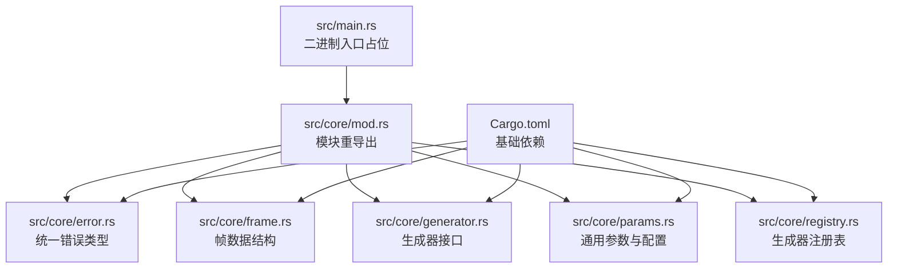
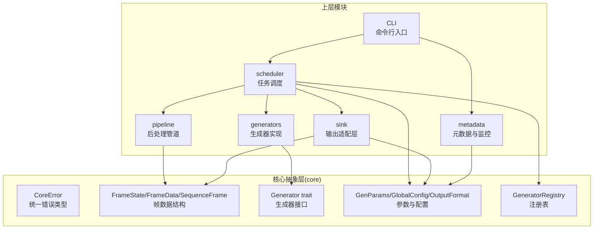
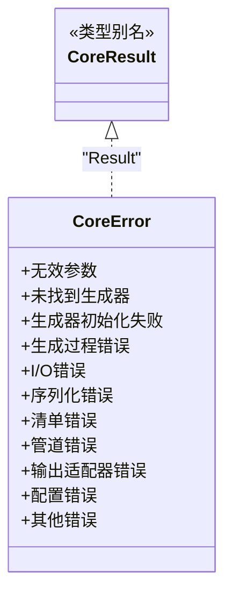
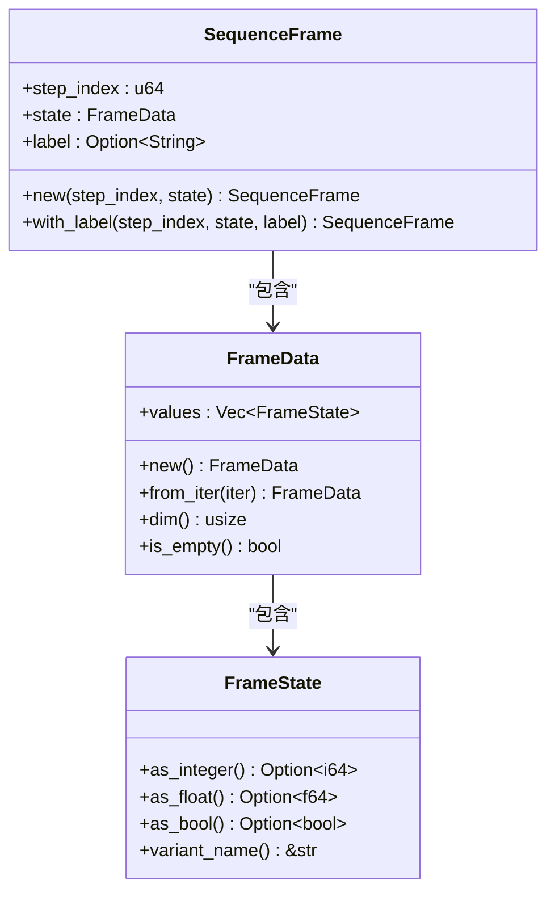
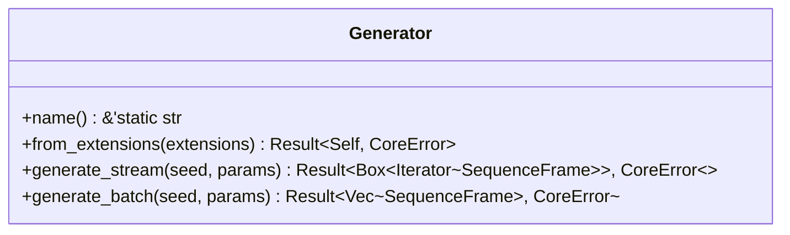
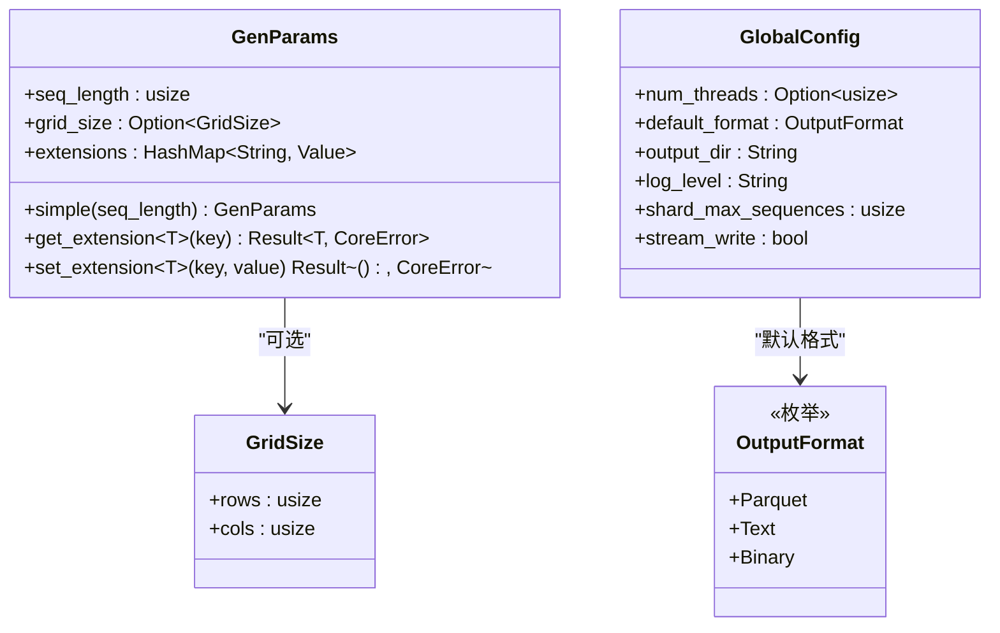
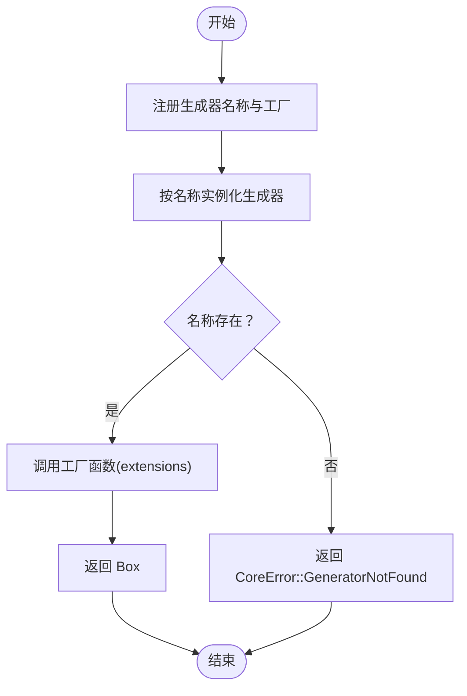
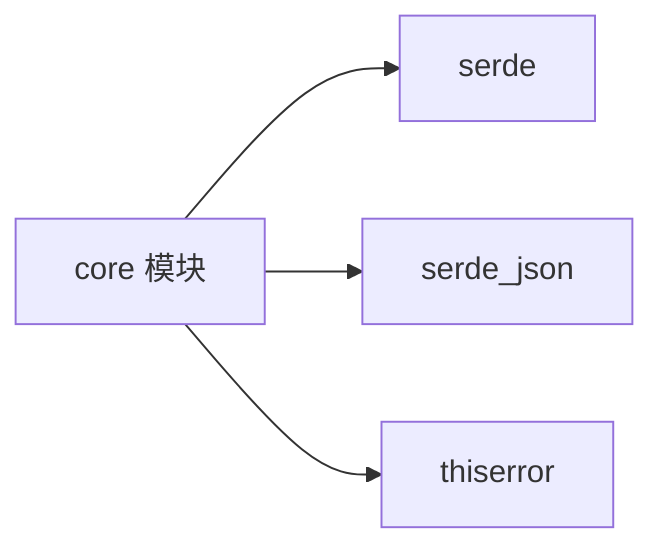

# 故障排除

<cite>
**本文引用的文件**
- [src/main.rs](file://src/main.rs)
- [src/core/mod.rs](file://src/core/mod.rs)
- [src/core/error.rs](file://src/core/error.rs)
- [src/core/generator.rs](file://src/core/generator.rs)
- [src/core/frame.rs](file://src/core/frame.rs)
- [src/core/params.rs](file://src/core/params.rs)
- [src/core/registry.rs](file://src/core/registry.rs)
- [Cargo.toml](file://Cargo.toml)
- [docs/core模块详细设计.md](file://docs/core模块详细设计.md)
- [docs/开发规划.md](file://docs/开发规划.md)
- [docs/需求规格说明书.md](file://docs/需求规格说明书.md)
</cite>

## 目录
1. [简介](#简介)
2. [项目结构](#项目结构)
3. [核心组件](#核心组件)
4. [架构总览](#架构总览)
5. [详细组件分析](#详细组件分析)
6. [依赖分析](#依赖分析)
7. [性能考虑](#性能考虑)
8. [故障排除指南](#故障排除指南)
9. [结论](#结论)
10. [附录](#附录)

## 简介
本故障排除文档面向 StructGen-rs 的使用者与维护者，聚焦于在实际使用与开发过程中可能遇到的编译错误、运行时错误、性能问题与并发问题。文档基于仓库中的核心模块与设计文档，提供系统化的诊断方法、日志分析技巧、调试配置与性能分析工具使用建议，并给出错误代码对照表与修复步骤。同时涵盖内存泄漏检测、死锁排查、版本兼容性与迁移注意事项，以及社区支持与问题反馈流程。

## 项目结构
当前仓库包含核心抽象层（core）与少量示例/占位文件。核心模块位于 src/core 下，定义了统一的帧数据结构、生成器接口、参数与配置、错误类型与注册表。Cargo.toml 描述了基础依赖，docs 目录包含系统设计与开发规划文档。

图表来源
- [src/main.rs:1-6](file://src/main.rs#L1-L6)
- [src/core/mod.rs:1-16](file://src/core/mod.rs#L1-L16)
- [src/core/error.rs:1-103](file://src/core/error.rs#L1-L103)
- [src/core/frame.rs:1-210](file://src/core/frame.rs#L1-L210)
- [src/core/generator.rs:1-129](file://src/core/generator.rs#L1-L129)
- [src/core/params.rs:1-235](file://src/core/params.rs#L1-L235)
- [src/core/registry.rs:1-150](file://src/core/registry.rs#L1-L150)
- [Cargo.toml:1-10](file://Cargo.toml#L1-L10)

章节来源
- [src/main.rs:1-6](file://src/main.rs#L1-L6)
- [src/core/mod.rs:1-16](file://src/core/mod.rs#L1-L16)
- [Cargo.toml:1-10](file://Cargo.toml#L1-L10)

## 核心组件
- 统一错误类型与结果别名：集中定义错误类别，便于传播与处理。
- 帧数据结构：FrameState、FrameData、SequenceFrame，承载状态值与时间步信息。
- 生成器接口：Generator trait，定义流式与批量生成方法，要求 Send + Sync。
- 通用参数与配置：GenParams、GlobalConfig、OutputFormat，支持扩展字段与默认值。
- 生成器注册表：GeneratorRegistry，名称→构造函数映射，支持实例化与查询。

章节来源
- [src/core/error.rs:1-103](file://src/core/error.rs#L1-L103)
- [src/core/frame.rs:1-210](file://src/core/frame.rs#L1-L210)
- [src/core/generator.rs:1-129](file://src/core/generator.rs#L1-L129)
- [src/core/params.rs:1-235](file://src/core/params.rs#L1-L235)
- [src/core/registry.rs:1-150](file://src/core/registry.rs#L1-L150)

## 架构总览
系统采用分层架构，核心抽象层（core）定义公共类型与接口，其余模块（scheduler、generators、pipeline、sink、metadata、CLI）依赖 core。运行时数据以流式通过生成器、管道与输出适配器，支持并行执行与分片。

图表来源
- [docs/需求规格说明书.md:23-48](file://docs/需求规格说明书.md#L23-L48)
- [docs/开发规划.md:9-50](file://docs/开发规划.md#L9-L50)
- [src/core/error.rs:1-103](file://src/core/error.rs#L1-L103)
- [src/core/frame.rs:1-210](file://src/core/frame.rs#L1-L210)
- [src/core/generator.rs:1-129](file://src/core/generator.rs#L1-L129)
- [src/core/params.rs:1-235](file://src/core/params.rs#L1-L235)
- [src/core/registry.rs:1-150](file://src/core/registry.rs#L1-L150)

## 详细组件分析

### 统一错误类型与传播
- 错误类别覆盖参数校验、生成器初始化、生成过程、I/O、序列化、清单、管道、输出适配器、配置与未分类错误。
- 通过 thiserror 派生宏，支持 from 转换与错误链传播。
- 建议在上层模块中将具体错误包装为 CoreError 的变体，保持错误语义一致。

图表来源
- [src/core/error.rs:1-103](file://src/core/error.rs#L1-L103)

章节来源
- [src/core/error.rs:1-103](file://src/core/error.rs#L1-L103)
- [docs/core模块详细设计.md:455-476](file://docs/core模块详细设计.md#L455-L476)

### 帧数据结构与序列化
- FrameState 以标记联合体承载整型、浮点型与布尔型，提供类型转换辅助方法。
- FrameData 为状态值向量，提供维度、空帧判断与构造方法。
- SequenceFrame 包含步索引、状态数据与可选标签，支持序列化与反序列化。
- 建议在序列化/反序列化失败时检查字段类型与 JSON 结构一致性。

图表来源
- [src/core/frame.rs:1-210](file://src/core/frame.rs#L1-L210)

章节来源
- [src/core/frame.rs:1-210](file://src/core/frame.rs#L1-L210)
- [docs/core模块详细设计.md:56-131](file://docs/core模块详细设计.md#L56-L131)

### 生成器接口与流式生成
- Generator trait 要求 Send + Sync，定义 name、from_extensions、generate_stream 与 generate_batch。
- generate_stream 返回惰性迭代器，推荐用于大规模数据；generate_batch 为批量收集的语法糖。
- 扩展字段通过 JSON Value 存储，生成器在 from_extensions 中反序列化自身配置。

图表来源
- [src/core/generator.rs:1-129](file://src/core/generator.rs#L1-L129)

章节来源
- [src/core/generator.rs:1-129](file://src/core/generator.rs#L1-L129)
- [docs/core模块详细设计.md:200-253](file://docs/core模块详细设计.md#L200-L253)

### 通用参数与配置
- GenParams：包含 seq_length、grid_size 与动态扩展字段 extensions。
- GlobalConfig：包含 num_threads、default_format、output_dir、log_level、shard_max_sequences、stream_write 等默认值。
- 扩展字段支持序列化/反序列化，get_extension/set_extension 提供类型安全访问。

图表来源
- [src/core/params.rs:1-235](file://src/core/params.rs#L1-L235)

章节来源
- [src/core/params.rs:1-235](file://src/core/params.rs#L1-L235)
- [docs/core模块详细设计.md:133-198](file://docs/core模块详细设计.md#L133-L198)

### 生成器注册表
- GeneratorRegistry 维护名称→构造函数映射，支持注册、实例化、查询与列举。
- 注册时若名称已存在会 panic，避免运行时静默覆盖。
- 实例化失败返回 CoreError::GeneratorNotFound。

图表来源
- [src/core/registry.rs:1-150](file://src/core/registry.rs#L1-L150)

章节来源
- [src/core/registry.rs:1-150](file://src/core/registry.rs#L1-L150)
- [docs/core模块详细设计.md:385-398](file://docs/core模块详细设计.md#L385-L398)

## 依赖分析
- Cargo.toml 声明了 core 模块所需的依赖：serde、serde_json、thiserror。
- 上层模块（scheduler、sink、pipeline、metadata、CLI）在开发规划中定义了各自的依赖，当前仓库尚未包含这些模块源码。

图表来源
- [Cargo.toml:6-10](file://Cargo.toml#L6-L10)

章节来源
- [Cargo.toml:1-10](file://Cargo.toml#L1-L10)
- [docs/开发规划.md:300-337](file://docs/开发规划.md#L300-L337)

## 性能考虑
- FrameState 内存布局为 16 字节，对百万级帧序列内存占用可控。
- generate_stream 返回的迭代器按值产出 SequenceFrame，避免额外克隆。
- 注册表查找为 O(1)，扩展字段解析采用惰性策略，减少无效解析开销。
- 建议在大规模生成时使用流式写出模式，避免阻塞收集导致内存峰值上升。

章节来源
- [docs/core模块详细设计.md:477-483](file://docs/core模块详细设计.md#L477-L483)

## 故障排除指南

### 编译错误
常见编译错误与定位方法：
- 未实现 Generator trait：检查是否实现了 name、from_extensions、generate_stream 等方法，并满足 Send + Sync。
- 扩展字段类型不匹配：在 from_extensions 中使用 get_extension 时，确保 JSON 值与目标类型一致。
- 未找到生成器：确认已在程序启动时通过 register 注册名称与工厂函数。
- 错误类型不匹配：确保上层模块返回的错误为 CoreError 的变体，避免类型不一致。

修复步骤
- 按照生成器接口定义补齐缺失方法与约束。
- 使用 get_extension/set_extension 进行类型安全的扩展字段访问。
- 在 main 或模块初始化处调用 register，确保名称唯一。
- 在上层模块中将具体错误包装为 CoreError 的对应变体。

章节来源
- [src/core/generator.rs:12-56](file://src/core/generator.rs#L12-L56)
- [src/core/registry.rs:28-53](file://src/core/registry.rs#L28-L53)
- [src/core/params.rs:99-122](file://src/core/params.rs#L99-L122)

### 运行时错误
常见运行时错误与诊断：
- 无效参数（InvalidParams）：检查 GenParams 的 seq_length、grid_size 与 extensions 是否符合预期。
- 未找到生成器（GeneratorNotFound）：确认清单或调用处使用的生成器名称与注册表一致。
- 生成器初始化失败（GeneratorInitError）：检查 from_extensions 中的 JSON 反序列化与参数校验。
- 生成过程错误（GenerationError）：在 generate_stream 中捕获内部错误并转换为 CoreError。
- I/O 错误（IoError）：检查输出目录权限、磁盘空间与文件句柄。
- 序列化/反序列化错误（SerializationError）：检查 extensions 的 JSON 结构与类型。
- 清单错误（ManifestError）：检查 YAML 清单格式与字段类型。
- 管道错误（PipelineError）：检查后处理链中各处理器的输入输出一致性。
- 输出适配器错误（SinkError）：检查输出格式与文件写出流程。
- 配置错误（ConfigError）：检查 GlobalConfig 的 log_level、num_threads 等配置项。

修复步骤
- 在调用处捕获 CoreError 并打印详细信息，结合日志级别定位问题。
- 对于 I/O 错误，优先检查路径与权限；对于序列化错误，打印 JSON 结构与字段名。
- 对于清单错误，使用最小化清单验证解析流程。

章节来源
- [src/core/error.rs:4-49](file://src/core/error.rs#L4-L49)
- [docs/core模块详细设计.md:455-476](file://docs/core模块详细设计.md#L455-L476)

### 性能问题
症状与诊断
- 内存占用过高：确认是否使用 generate_batch 导致一次性收集大量帧；改用 generate_stream 并及时消费。
- 吞吐量不足：检查 num_threads 设置与 CPU 利用率；确认是否启用了流式写出。
- 写出延迟：检查输出格式与缓冲策略；Parquet 写出通常较慢但压缩效果好。

优化建议
- 优先使用 generate_stream，避免 generate_batch。
- 合理设置 GlobalConfig 的 shard_max_sequences 与 stream_write。
- 对于大规模数据，使用流式写出模式并适当调整分片大小。

章节来源
- [src/core/generator.rs:41-55](file://src/core/generator.rs#L41-L55)
- [src/core/params.rs:20-66](file://src/core/params.rs#L20-L66)
- [docs/core模块详细设计.md:477-483](file://docs/core模块详细设计.md#L477-L483)

### 并发与线程安全
- Generator trait 要求 Send + Sync，确保在 rayon 线程池中安全共享。
- 注册表为 HashMap<&'static str, GeneratorFactory>，查找为 O(1)；注意注册阶段的 panic 防止重复注册。
- 建议在多线程环境下避免共享可变状态，使用只读配置与不可变迭代器。

章节来源
- [src/core/generator.rs:12-12](file://src/core/generator.rs#L12-L12)
- [src/core/registry.rs:15-64](file://src/core/registry.rs#L15-L64)

### 内存泄漏与资源管理
- 使用标准库的智能指针与作用域管理资源，避免循环引用。
- 对于大对象（如 Vec<SequenceFrame>），及时释放不再使用的帧。
- 在 I/O 写出时确保文件句柄正确关闭，避免句柄泄露。

章节来源
- [src/core/frame.rs:52-118](file://src/core/frame.rs#L52-L118)
- [src/core/error.rs:22-24](file://src/core/error.rs#L22-L24)

### 死锁与竞态条件
- 避免在生成器内部持有锁；如需同步写出，使用无锁通道或专用写入线程。
- 在多线程环境中，尽量使用不可变共享状态与原子操作。
- 对于注册表等全局状态，确保只在初始化阶段写入，运行时只读。

章节来源
- [src/core/registry.rs:28-53](file://src/core/registry.rs#L28-L53)

### 错误日志分析与调试技巧
- 日志级别：GlobalConfig.log_level 支持 trace、debug、info、warn、error，默认为 info。
- 建议在开发阶段使用 debug 或 trace，生产环境使用 info 或 warn。
- 对于 I/O 与序列化错误，打印具体文件路径与 JSON 结构以便定位。

章节来源
- [src/core/params.rs:20-66](file://src/core/params.rs#L20-L66)
- [docs/core模块详细设计.md:182-198](file://docs/core模块详细设计.md#L182-L198)

### 性能分析工具使用
- 使用火焰图工具（如 perf、cargo-flamegraph）分析热点函数。
- 对于 I/O 密集场景，关注写出延迟与磁盘吞吐。
- 对于 CPU 密集场景，关注生成器计算与后处理链的并行度。

章节来源
- [docs/开发规划.md:340-357](file://docs/开发规划.md#L340-L357)

### 调试配置与监控指标
- 调试配置：通过 GlobalConfig 调整 num_threads、log_level、stream_write 等。
- 监控指标：建议记录样本数、帧数、写出速率、错误数与耗时，便于性能评估。

章节来源
- [src/core/params.rs:20-66](file://src/core/params.rs#L20-L66)

### 社区支持与问题反馈流程
- 仓库未提供官方社区渠道与问题模板，建议在 GitHub Issues 中提交问题。
- 提交问题时请包含：环境信息（Rust 版本、操作系统）、最小可复现示例、错误日志与期望行为。

章节来源
- [docs/开发规划.md:340-357](file://docs/development_planning.md#L340-L357)

### 版本兼容性与迁移注意事项
- 依赖版本：当前依赖 serde、serde_json、thiserror；后续模块会引入 arrow、parquet、rayon、tracing、clap 等。
- 迁移建议：锁定关键依赖主版本，逐步升级；在每次升级后运行集成测试，确保兼容性。
- 清单格式演进：建议在清单中增加 version 字段，支持未来格式迁移。

章节来源
- [Cargo.toml:6-10](file://Cargo.toml#L6-L10)
- [docs/开发规划.md:300-337](file://docs/开发规划.md#L300-L337)
- [docs/开发规划.md:344-349](file://docs/开发规划.md#L344-L349)

## 结论
本故障排除文档基于 core 模块与设计文档，总结了编译、运行时、性能与并发方面的常见问题与解决思路。建议在开发与使用过程中遵循统一错误类型、流式生成与合理配置的原则，配合日志与性能分析工具，快速定位并解决问题。随着上层模块的逐步完善，建议持续补充相应的故障排除与监控方案。

## 附录

### 错误代码对照表（CoreError）
- 无效参数：InvalidParams
- 未找到生成器：GeneratorNotFound
- 生成器初始化失败：GeneratorInitError
- 生成过程错误：GenerationError
- I/O 错误：IoError
- 序列化/反序列化错误：SerializationError
- 清单错误：ManifestError
- 管道错误：PipelineError
- 输出适配器错误：SinkError
- 配置错误：ConfigError
- 其他错误：Other

章节来源
- [src/core/error.rs:4-49](file://src/core/error.rs#L4-L49)