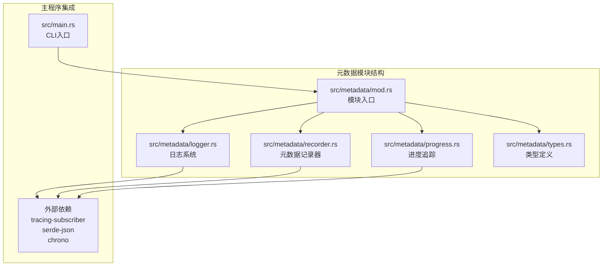
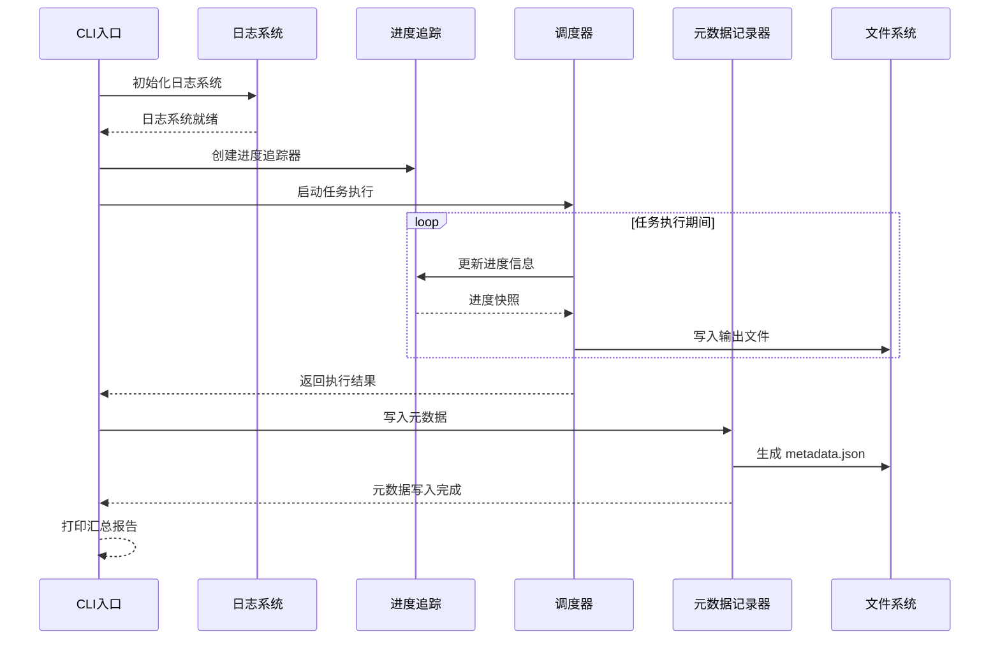
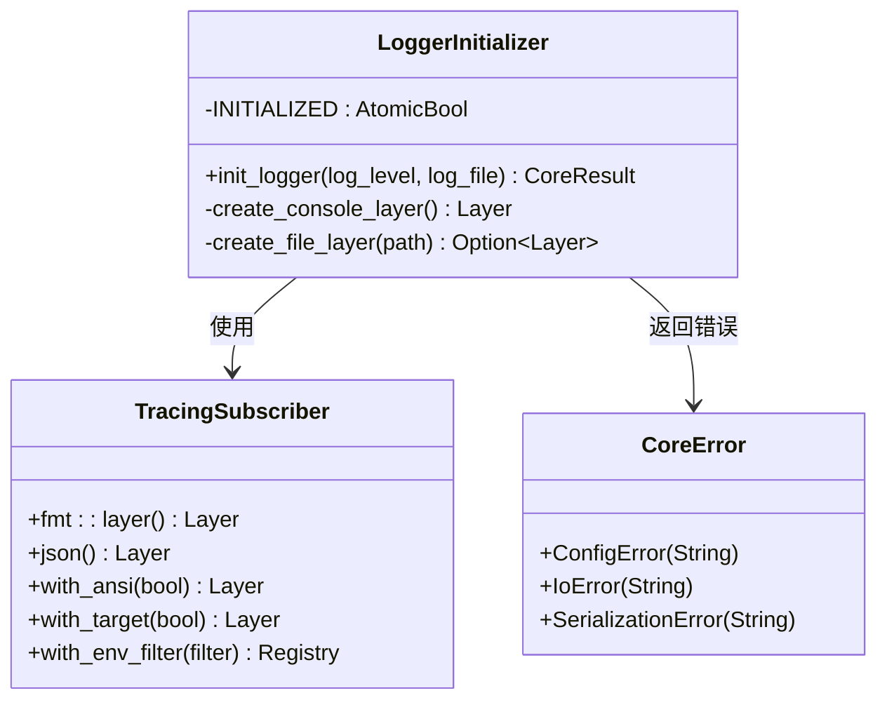
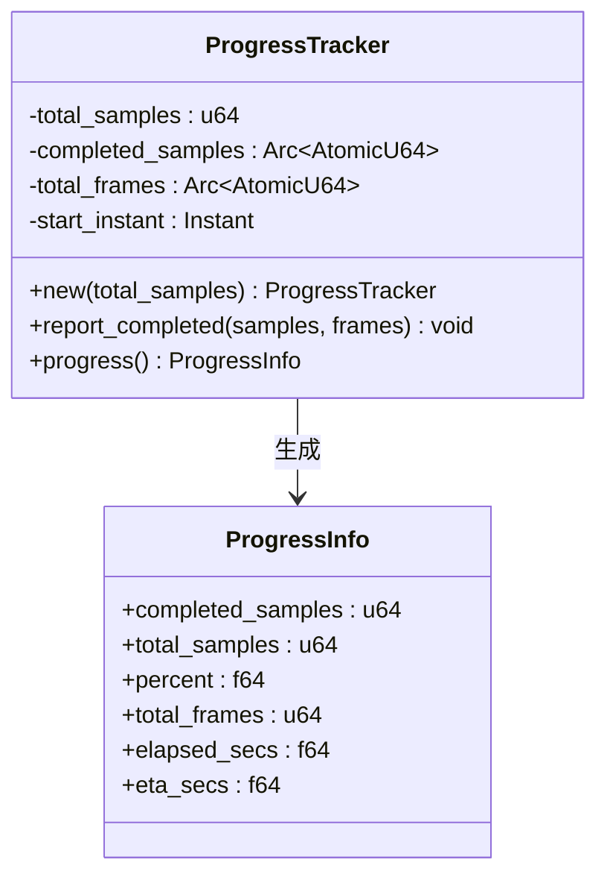
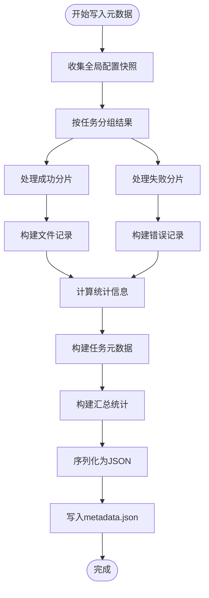
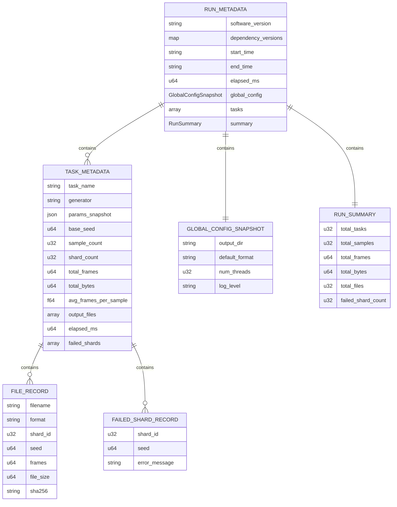
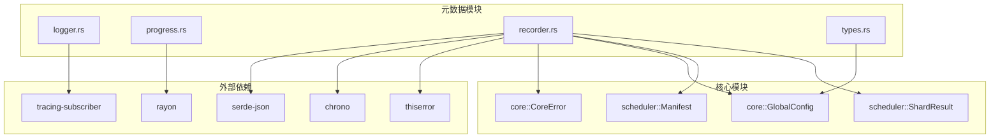

# 元数据和监控模块

<cite>
**本文档引用的文件**
- [src/metadata/mod.rs](file://src/metadata/mod.rs)
- [src/metadata/logger.rs](file://src/metadata/logger.rs)
- [src/metadata/progress.rs](file://src/metadata/progress.rs)
- [src/metadata/recorder.rs](file://src/metadata/recorder.rs)
- [src/metadata/types.rs](file://src/metadata/types.rs)
- [src/main.rs](file://src/main.rs)
- [Cargo.toml](file://Cargo.toml)
- [tests/manifests/gen_ca.yaml](file://tests/manifests/gen_ca.yaml)
- [tests/manifests/pipeline_full.yaml](file://tests/manifests/pipeline_full.yaml)
</cite>

## 目录
1. [简介](#简介)
2. [项目结构](#项目结构)
3. [核心组件](#核心组件)
4. [架构概览](#架构概览)
5. [详细组件分析](#详细组件分析)
6. [依赖关系分析](#依赖关系分析)
7. [性能考虑](#性能考虑)
8. [故障排除指南](#故障排除指南)
9. [结论](#结论)

## 简介

元数据和监控模块是 StructGen-rs 系统的重要组成部分，负责提供运行时元数据记录、进度追踪和日志系统初始化功能。该模块确保系统能够完整记录生成过程的详细信息，包括任务执行状态、输出文件信息、性能统计数据等，为系统监控和调试提供全面的数据支持。

该模块采用模块化设计，包含四个核心子模块：
- **日志系统模块**：基于 tracing-subscriber 实现控制台与可选文件双输出的日志系统
- **进度追踪模块**：提供线程安全的生成进度追踪功能
- **元数据记录器模块**：负责收集和生成 metadata.json 文件
- **类型定义模块**：定义所有元数据相关的数据结构

## 项目结构

元数据模块位于 `src/metadata/` 目录下，采用清晰的模块化组织：

**图表来源**
- [src/metadata/mod.rs:1-14](file://src/metadata/mod.rs#L1-L14)
- [src/main.rs:29](file://src/main.rs#L29)

**章节来源**
- [src/metadata/mod.rs:1-14](file://src/metadata/mod.rs#L1-L14)
- [src/metadata/logger.rs:1-131](file://src/metadata/logger.rs#L1-L131)
- [src/metadata/progress.rs:1-190](file://src/metadata/progress.rs#L1-L190)
- [src/metadata/recorder.rs:1-336](file://src/metadata/recorder.rs#L1-L336)
- [src/metadata/types.rs:1-454](file://src/metadata/types.rs#L1-L454)

## 核心组件

元数据和监控模块包含以下核心组件：

### 1. 日志系统初始化器
- 基于 `tracing-subscriber` 实现
- 支持控制台彩色紧凑格式输出
- 可选的 JSON 文件输出功能
- 线程安全的初始化机制

### 2. 进度追踪器
- 线程安全的原子操作实现
- 实时计算完成百分比和 ETA
- 支持多线程并发访问
- 提供详细的进度信息快照

### 3. 元数据记录器
- 收集所有分片执行结果
- 生成格式化的 metadata.json 文件
- 汇总统计信息和错误详情
- 支持多种输出格式的记录

### 4. 数据类型定义
- 完整的元数据结构体系
- 支持 JSON 序列化和反序列化
- 包含运行时配置快照
- 记录输出文件和错误信息

**章节来源**
- [src/metadata/logger.rs:14-97](file://src/metadata/logger.rs#L14-L97)
- [src/metadata/progress.rs:24-90](file://src/metadata/progress.rs#L24-L90)
- [src/metadata/recorder.rs:41-176](file://src/metadata/recorder.rs#L41-L176)
- [src/metadata/types.rs:12-134](file://src/metadata/types.rs#L12-L134)

## 架构概览

元数据模块在整个系统架构中扮演着关键的监控和记录角色：

**图表来源**
- [src/main.rs:157-333](file://src/main.rs#L157-L333)
- [src/metadata/recorder.rs:52-176](file://src/metadata/recorder.rs#L52-L176)

## 详细组件分析

### 日志系统模块分析

日志系统模块提供了强大的日志管理功能，基于现代 Rust 日志生态系统构建：

**图表来源**
- [src/metadata/logger.rs:26-97](file://src/metadata/logger.rs#L26-L97)

#### 核心特性
- **双重输出支持**：同时输出到控制台和可选文件
- **线程安全初始化**：使用原子布尔值防止重复初始化
- **环境变量过滤**：支持通过环境变量控制日志级别
- **错误处理机制**：优雅处理文件创建失败等异常情况

**章节来源**
- [src/metadata/logger.rs:14-97](file://src/metadata/logger.rs#L14-L97)

### 进度追踪模块分析

进度追踪模块实现了高效的多线程进度监控系统：

**图表来源**
- [src/metadata/progress.rs:25-90](file://src/metadata/progress.rs#L25-L90)

#### 进度计算算法
- **百分比计算**：`percent = completed/total * 100`
- **ETA 计算**：`eta = remaining_samples/rate`
- **平均速率**：`rate = completed_samples/elapsed_secs`

**章节来源**
- [src/metadata/progress.rs:33-90](file://src/metadata/progress.rs#L33-L90)

### 元数据记录器模块分析

元数据记录器模块负责收集和整理所有运行时信息：

**图表来源**
- [src/metadata/recorder.rs:52-176](file://src/metadata/recorder.rs#L52-L176)

#### 数据收集流程
1. **配置快照**：记录运行时的全局配置状态
2. **结果分组**：按任务名称组织分片执行结果
3. **统计计算**：汇总帧数、字节数、文件数等指标
4. **错误记录**：捕获并记录失败的分片信息
5. **JSON 序列化**：生成格式化的元数据文件

**章节来源**
- [src/metadata/recorder.rs:41-176](file://src/metadata/recorder.rs#L41-L176)

### 类型定义模块分析

类型定义模块提供了完整的元数据结构体系：

**图表来源**
- [src/metadata/types.rs:12-134](file://src/metadata/types.rs#L12-L134)

#### 数据结构特点
- **可序列化设计**：所有结构体都实现了 `Serialize` 和 `Deserialize` 特性
- **完整性保证**：包含软件版本、依赖版本、时间戳等完整信息
- **扩展性**：支持未来添加新的元数据字段
- **向后兼容**：使用可选字段处理不同版本的差异

**章节来源**
- [src/metadata/types.rs:12-134](file://src/metadata/types.rs#L12-L134)

## 依赖关系分析

元数据模块的依赖关系体现了清晰的分层架构：

**图表来源**
- [Cargo.toml:10-24](file://Cargo.toml#L10-L24)
- [src/metadata/recorder.rs:12-18](file://src/metadata/recorder.rs#L12-L18)

### 关键依赖说明

1. **tracing-subscriber**：提供现代化的日志记录基础设施
2. **serde-json**：支持结构化数据的序列化和反序列化
3. **chrono**：处理精确的时间戳记录
4. **rayon**：提供并行计算能力，支持进度追踪的并发需求

**章节来源**
- [Cargo.toml:10-24](file://Cargo.toml#L10-L24)

## 性能考虑

元数据模块在设计时充分考虑了性能优化：

### 1. 线程安全优化
- 使用原子操作确保多线程环境下的数据一致性
- 避免锁竞争，提高并发性能
- 进度计算采用轻量级算法

### 2. 内存使用优化
- 使用 `Arc<AtomicU64>` 共享计数器，减少内存复制
- 按需创建文件输出层，避免不必要的资源消耗
- JSON 序列化使用预分配缓冲区

### 3. I/O 性能优化
- 元数据文件采用格式化输出，便于人类阅读
- 文件写入使用同步方式，确保数据完整性
- 日志文件输出支持异步写入，减少主线程阻塞

### 4. 错误处理优化
- 早期验证输入参数，避免无效操作
- 使用 `Once` 结构确保初始化只执行一次
- 幂等设计支持重复调用而不产生副作用

## 故障排除指南

### 常见问题及解决方案

#### 1. 日志系统初始化失败
**症状**：`init_logger` 返回 `ConfigError`
**原因**：无效的日志级别或文件权限问题
**解决方法**：
- 检查日志级别是否为 `trace`、`debug`、`info`、`warn`、`error` 之一
- 确认日志文件路径的父目录具有写入权限
- 验证磁盘空间充足

#### 2. 元数据文件写入失败
**症状**：`write_metadata` 返回 `IoError`
**原因**：输出目录权限不足或磁盘空间不足
**解决方法**：
- 检查输出目录是否存在且具有写入权限
- 确认磁盘空间充足
- 验证路径格式正确

#### 3. 进度追踪不准确
**症状**：进度百分比超过 100% 或 ETA 为负数
**原因**：多线程并发更新导致的竞态条件
**解决方法**：
- 确保使用 `Arc<ProgressTracker>` 共享实例
- 避免在多个线程中直接修改进度状态
- 检查 `report_completed` 方法的调用频率

#### 4. JSON 序列化错误
**症状**：`write_metadata` 返回 `SerializationError`
**原因**：数据结构包含不可序列化的字段
**解决方法**：
- 检查自定义类型是否实现了 `Serialize` 特性
- 验证所有嵌套结构都是可序列化的
- 确认没有循环引用的数据结构

**章节来源**
- [src/metadata/logger.rs:26-97](file://src/metadata/logger.rs#L26-L97)
- [src/metadata/recorder.rs:52-176](file://src/metadata/recorder.rs#L52-L176)
- [src/metadata/progress.rs:33-90](file://src/metadata/progress.rs#L33-L90)

## 结论

元数据和监控模块为 StructGen-rs 系统提供了完整的运行时监控和记录能力。该模块设计精良，具有以下显著特点：

### 设计优势
- **模块化架构**：清晰的功能分离，便于维护和扩展
- **线程安全**：支持高并发环境下的稳定运行
- **性能优化**：采用原子操作和高效算法
- **错误处理**：完善的错误传播和恢复机制

### 功能完整性
- **全面监控**：涵盖日志、进度、元数据等各个方面
- **数据完整性**：确保所有重要信息都被正确记录
- **可追溯性**：提供完整的执行历史和统计信息
- **可诊断性**：详细的错误信息和调试支持

### 实际价值
该模块不仅满足了当前的需求，还为未来的功能扩展奠定了坚实基础。通过标准化的数据格式和清晰的接口设计，它为系统的长期发展提供了可靠的技术支撑。