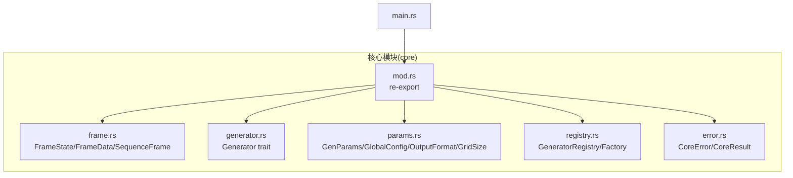
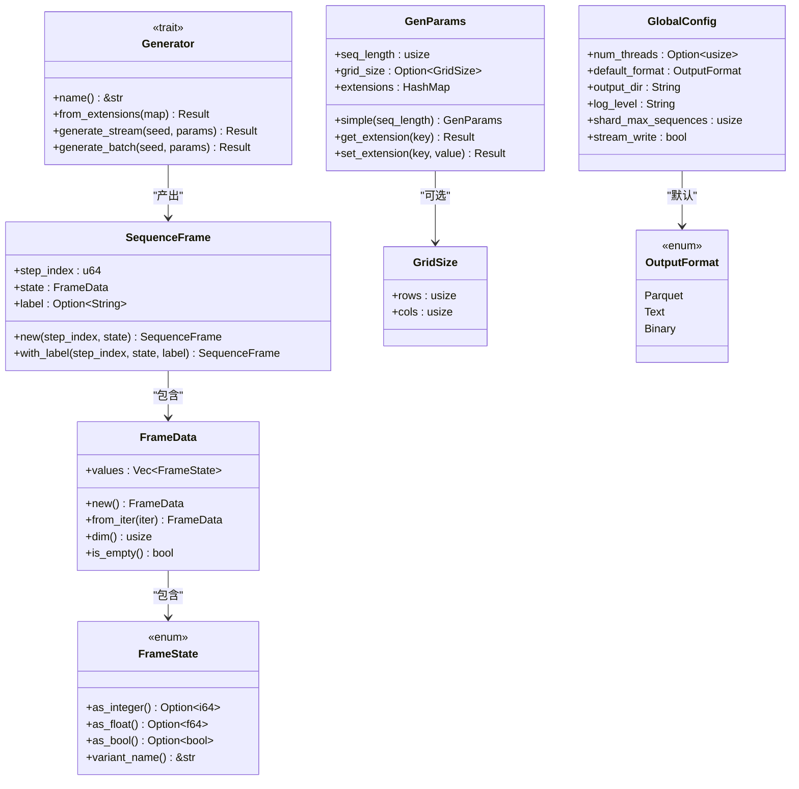
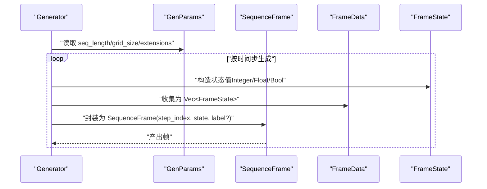
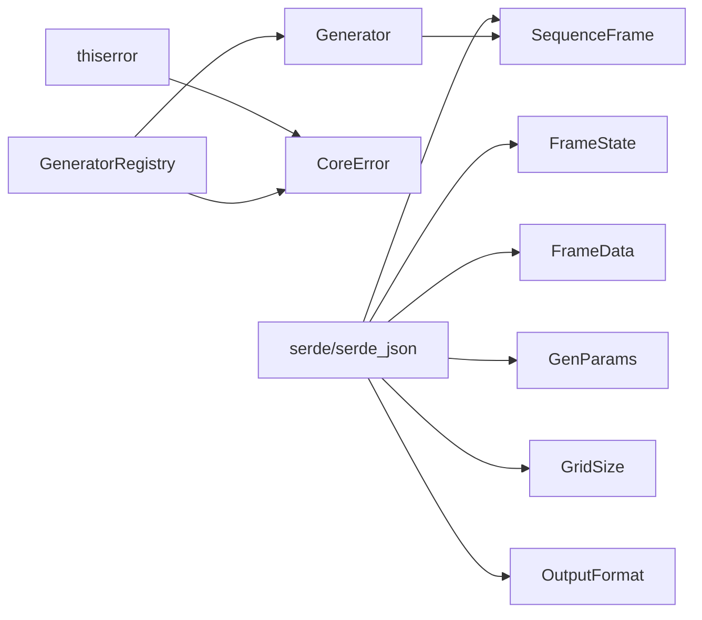

# 数据结构设计

<cite>
**本文引用的文件**
- [frame.rs](file://src/core/frame.rs)
- [mod.rs](file://src/core/mod.rs)
- [generator.rs](file://src/core/generator.rs)
- [params.rs](file://src/core/params.rs)
- [error.rs](file://src/core/error.rs)
- [registry.rs](file://src/core/registry.rs)
- [main.rs](file://src/main.rs)
- [Cargo.toml](file://Cargo.toml)
</cite>

## 目录
1. [简介](#简介)
2. [项目结构](#项目结构)
3. [核心组件](#核心组件)
4. [架构总览](#架构总览)
5. [详细组件分析](#详细组件分析)
6. [依赖分析](#依赖分析)
7. [性能考量](#性能考量)
8. [故障排查指南](#故障排查指南)
9. [结论](#结论)
10. [附录](#附录)

## 简介
本文件聚焦于 StructGen-rs 的数据结构设计，系统阐述以下核心类型：
- FrameState 枚举：标记联合体（tagged union）设计与内存优化策略
- FrameData 结构体：状态集合的容器、字段与约束
- SequenceFrame：完整帧的概念模型，包含时间步索引、状态快照与可选标签
- 三者之间的关系与转换规则
- 序列化机制与性能考虑
- 生命周期与线程安全要点
- 使用模式与最佳实践

本文件同时提供面向初学者的概念解释与面向高级开发者的实现细节，辅以可视化图示帮助理解。

## 项目结构
核心数据结构位于 core 模块，对外通过 re-export 暴露，供上层调度器与管线使用。核心文件职责如下：
- frame.rs：定义 FrameState、FrameData、SequenceFrame 以及它们的派生能力与方法
- generator.rs：定义 Generator trait，规定生成器接口与流式/批量生成约定
- params.rs：定义全局配置、通用参数与扩展字段机制
- registry.rs：定义生成器注册表与工厂类型，支持按名称实例化
- error.rs：统一错误类型与结果别名
- mod.rs：聚合导出核心类型与接口
- main.rs：最小入口，当前不直接使用核心类型
- Cargo.toml：声明 serde、serde_json、thiserror 等依赖

图表来源
- [frame.rs:1-210](file://src/core/frame.rs#L1-L210)
- [generator.rs:1-129](file://src/core/generator.rs#L1-L129)
- [params.rs:1-235](file://src/core/params.rs#L1-L235)
- [registry.rs:1-150](file://src/core/registry.rs#L1-L150)
- [error.rs:1-103](file://src/core/error.rs#L1-L103)
- [mod.rs:1-16](file://src/core/mod.rs#L1-L16)
- [main.rs:1-6](file://src/main.rs#L1-L6)

章节来源
- [mod.rs:1-16](file://src/core/mod.rs#L1-L16)
- [main.rs:1-6](file://src/main.rs#L1-L6)

## 核心组件
本节概述三个关键数据结构及其职责与特性。

- FrameState：标记联合体，统一承载整数、浮点、布尔三种基础状态值，支持安全的类型转换与判别名查询。
- FrameData：状态集合容器，按生成器定义的状态维度顺序存放 FrameState，提供维度查询与空帧判断。
- SequenceFrame：完整帧，包含时间步索引、状态快照与可选语义标签，用于序列化与下游处理。

章节来源
- [frame.rs:3-12](file://src/core/frame.rs#L3-L12)
- [frame.rs:52-81](file://src/core/frame.rs#L52-L81)
- [frame.rs:89-118](file://src/core/frame.rs#L89-L118)

## 架构总览
下图展示数据结构与生成器接口的关系，以及序列化支持如何贯穿其中。

图表来源
- [frame.rs:3-118](file://src/core/frame.rs#L3-L118)
- [generator.rs:9-56](file://src/core/generator.rs#L9-L56)
- [params.rs:8-123](file://src/core/params.rs#L8-L123)

## 详细组件分析

### FrameState：标记联合体设计与内存优化
FrameState 是一个标记联合体，统一承载整数、浮点、布尔三种基础状态值。其设计要点：
- 通过枚举变体携带实际数据，避免额外的指针或动态分配
- 提供 as_integer/as_float/as_bool 三种安全转换接口，返回 Option，便于调用方处理不兼容类型
- 提供 variant_name 用于调试与日志输出
- 实现了 Clone、Copy、Serialize、Deserialize，支持高效序列化与跨线程传递

内存优化策略：
- 使用 Copy 类型（i64、f64、bool）作为变体承载，避免堆分配与引用计数
- 通过 Option 返回值表达“不可转换”，避免抛错带来的开销与复杂性
- 与 Vec<FrameState> 组合时，内存局部性良好，适合批量处理

使用模式：
- 优先使用 as_* 接口进行类型转换，避免直接匹配
- 在需要统一处理不同数值类型的场景，先尝试 as_float，再回退到 as_integer 或 as_bool
- 通过 variant_name 辅助诊断与日志

章节来源
- [frame.rs:3-50](file://src/core/frame.rs#L3-L50)

### FrameData：状态集合容器
FrameData 是单个时间步的状态快照集合，字段与行为：
- values: Vec<FrameState>，顺序与生成器定义的状态维度一致
- 提供 new/from_iter 构造方式，from_iter 支持从任意可迭代对象构建
- dim 返回状态维度（values 长度）
- is_empty 判断是否为空帧
- 实现 Default::default 与 PartialEq，便于测试与比较

约束条件：
- values 的长度即为该帧的状态维度，应与生成器的 state_dim 保持一致
- values 中元素的类型由生成器决定，但统一以 FrameState 表达

使用模式：
- 从生成器产出的值序列构建 FrameData
- 在序列化前检查 dim 是否符合预期
- 与 SequenceFrame 组合形成完整帧

章节来源
- [frame.rs:52-87](file://src/core/frame.rs#L52-L87)

### SequenceFrame：完整帧与序列化机制
SequenceFrame 描述一个时间步的完整帧，包含：
- step_index：u64，从 0 开始递增的时间步索引
- state：FrameData，该时间步的完整状态快照
- label：Option<String>，可选的语义标签（如周期性标签）

构造方法：
- new(step_index, state)：创建无标签帧
- with_label(step_index, state, label)：创建带标签帧

序列化机制：
- 三者均实现 Serialize/Deserialize，支持 JSON 序列化
- 测试覆盖了 FrameState 与 SequenceFrame 的序列化往返一致性

性能考虑：
- 使用 Copy 类型（u64、Option<String>）减少堆分配
- Vec<FrameState> 在内存上连续存储，有利于缓存友好
- 通过 trait 接口（Generator）产出惰性迭代器，避免一次性收集大量数据

使用模式：
- 生成器通过 generate_stream 返回惰性迭代器，逐帧序列化输出
- 在批处理场景（generate_batch）中，内部调用 generate_stream 并收集为 Vec
- 通过 label 字段标注周期性、异常等语义信息，便于下游分析

章节来源
- [frame.rs:89-118](file://src/core/frame.rs#L89-L118)
- [generator.rs:27-55](file://src/core/generator.rs#L27-L55)

### 关系与转换规则
- SequenceFrame.state 由 FrameData 组成，FrameData.values 由多个 FrameState 组成
- 生成器（Generator）产出 SequenceFrame，遵循流式与批量两种模式
- GenParams 提供 seq_length、grid_size、extensions 等通用参数，供生成器读取
- GlobalConfig 提供全局运行时配置（如并行度、默认输出格式、分片策略等）

转换规则：
- FrameState 之间通过 as_* 接口进行类型转换，返回 Option
- GenParams 的 extensions 通过 get_extension/set_extension 进行类型安全的读写
- 生成器通过 from_extensions 从 extensions 反序列化自身配置

图表来源
- [generator.rs:27-55](file://src/core/generator.rs#L27-L55)
- [frame.rs:52-118](file://src/core/frame.rs#L52-L118)
- [params.rs:68-123](file://src/core/params.rs#L68-L123)

## 依赖分析
- serde/serde_json：为 FrameState、FrameData、SequenceFrame、GenParams、GridSize、OutputFormat 提供序列化支持
- thiserror：为 CoreError 提供错误派生宏，简化错误传播与显示
- 核心模块内部依赖关系清晰：frame.rs 被 generator.rs 引用，params.rs 被 generator.rs 引用，registry.rs 依赖 error.rs 与 generator.rs

图表来源
- [frame.rs:1-12](file://src/core/frame.rs#L1-L12)
- [params.rs:3-18](file://src/core/params.rs#L3-L18)
- [generator.rs:1-7](file://src/core/generator.rs#L1-L7)
- [registry.rs:1-7](file://src/core/registry.rs#L1-L7)
- [error.rs:1-49](file://src/core/error.rs#L1-L49)
- [Cargo.toml:6-9](file://Cargo.toml#L6-L9)

章节来源
- [Cargo.toml:6-9](file://Cargo.toml#L6-L9)

## 性能考量
- 内存布局优化
  - FrameState 使用 Copy 类型作为变体承载，避免堆分配与间接寻址
  - Vec<FrameState> 连续存储，提升缓存命中率
  - SequenceFrame 字段均为 Copy 或紧凑结构，减少内存占用
- 序列化性能
  - 通过 serde derive 自动生成序列化代码，减少手写样板
  - JSON 序列化用于配置与小规模数据传输；大规模数据建议结合其他格式（如 Parquet）与流式写入
- 并发与线程安全
  - Generator trait 要求 Send + Sync，确保生成器实例可在 rayon 线程池中安全共享
  - 生成器通过惰性迭代器产生帧，避免在多线程中共享大对象
- I/O 与吞吐
  - GlobalConfig 提供 stream_write 选项，支持流式写出以降低内存峰值
  - shard_max_sequences 控制分片大小，平衡内存与并发效率

[本节为通用性能讨论，无需特定文件来源]

## 故障排查指南
常见问题与定位思路：
- 参数解析失败
  - 检查 GenParams.extensions 中是否存在所需键，使用 get_extension 报错信息定位
  - 使用 set_extension 正确序列化生成器特有参数
- 生成器实例化失败
  - 确认 GeneratorRegistry 已正确注册名称与工厂函数
  - 检查 instantiate 返回的错误类型（GeneratorNotFound）
- 序列化/反序列化错误
  - 核对字段类型与 JSON 结构是否一致
  - 使用测试用例中的序列化往返验证
- 线程安全问题
  - 确保生成器实现满足 Send + Sync 约束
  - 避免在生成器内部持有非 Send/Sync 资源

章节来源
- [params.rs:99-122](file://src/core/params.rs#L99-L122)
- [registry.rs:43-53](file://src/core/registry.rs#L43-L53)
- [error.rs:5-49](file://src/core/error.rs#L5-L49)

## 结论
StructGen-rs 的数据结构设计围绕“标记联合体 + 紧凑容器 + 流式接口”展开：
- FrameState 以最小内存占用表达多种基础状态值，并提供安全的类型转换
- FrameData 以顺序向量承载状态，维度与约束清晰
- SequenceFrame 将时间步、状态与标签整合，支持序列化与流式处理
- 通过 Generator trait 与 GenParams/GlobalConfig 的配合，形成可扩展、可配置的生成框架
- 依赖 serde/thiserror 提供良好的序列化与错误处理体验

这些设计共同保证了在大规模序列生成场景下的内存效率、可维护性与可扩展性。

[本节为总结，无需特定文件来源]

## 附录
- 使用模式速览
  - 构建 FrameState：根据生成器需求选择 Integer/Float/Bool
  - 构建 FrameData：从状态值迭代器收集为 Vec<FrameState>
  - 构建 SequenceFrame：设置 step_index 与可选 label
  - 生成序列：通过 Generator.generate_stream 获取惰性迭代器
  - 批量生成：通过 Generator.generate_batch 收集为 Vec
  - 参数扩展：通过 GenParams.set_extension/get_extension 读写生成器特有参数
  - 注册与实例化：通过 GeneratorRegistry.register/instantiate 管理生成器

[本节为概念性附录，无需特定文件来源]