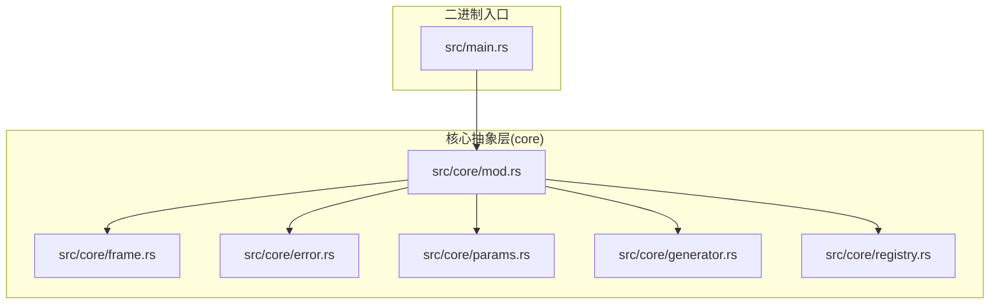
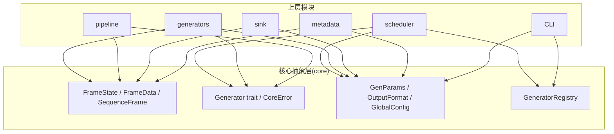
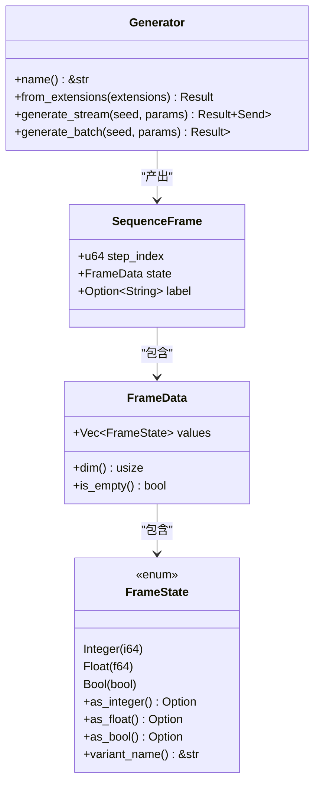
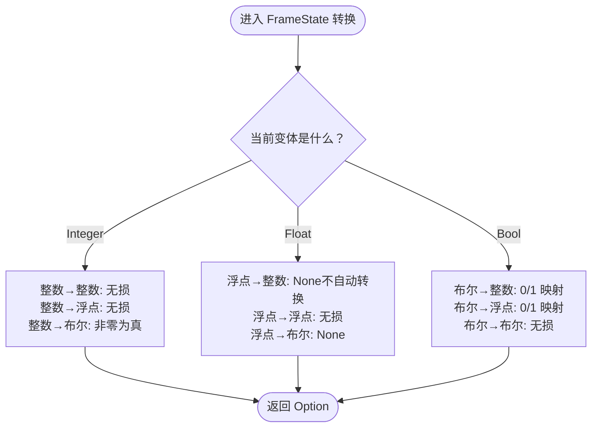
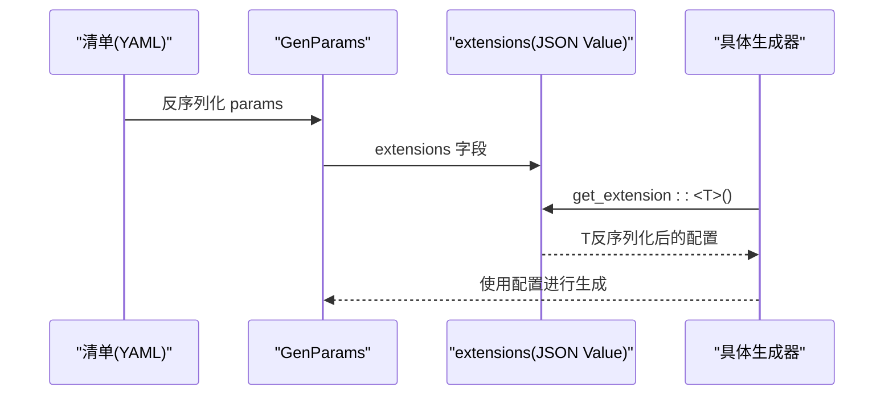
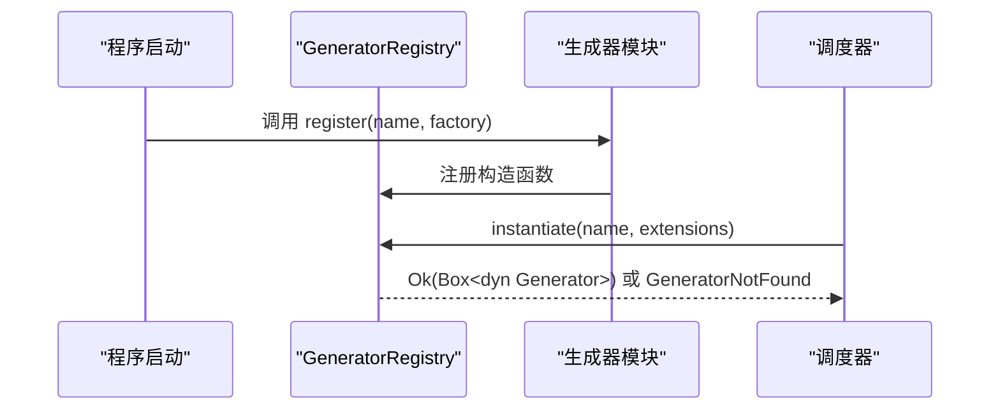
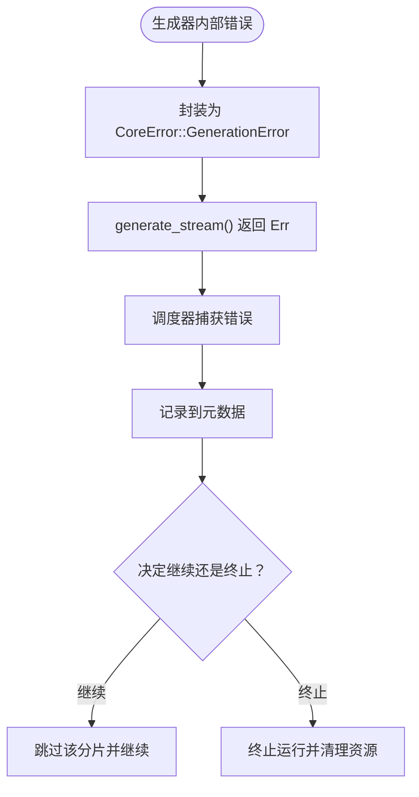
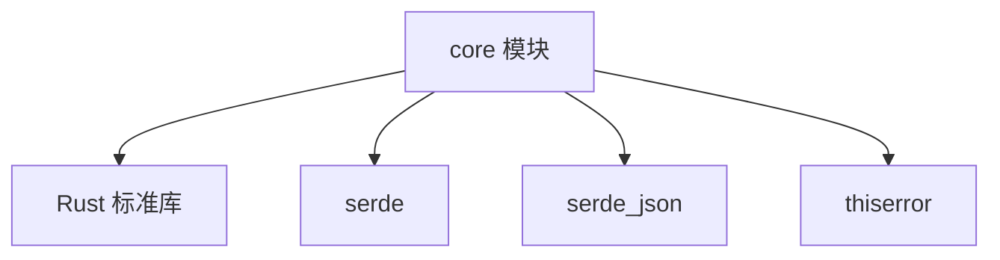

# 核心架构设计

<cite>
**本文引用的文件**
- [main.rs](file://src/main.rs)
- [core/mod.rs](file://src/core/mod.rs)
- [core/generator.rs](file://src/core/generator.rs)
- [core/frame.rs](file://src/core/frame.rs)
- [core/error.rs](file://src/core/error.rs)
- [core/params.rs](file://src/core/params.rs)
- [core/registry.rs](file://src/core/registry.rs)
- [Cargo.toml](file://Cargo.toml)
- [Cargo.lock](file://Cargo.lock)
- [core模块详细设计.md](file://docs/core模块详细设计.md)
- [开发规划.md](file://docs/开发规划.md)
- [需求规格说明书.md](file://docs/需求规格说明书.md)
</cite>

## 目录
1. [简介](#简介)
2. [项目结构](#项目结构)
3. [核心组件](#核心组件)
4. [架构总览](#架构总览)
5. [详细组件分析](#详细组件分析)
6. [依赖分析](#依赖分析)
7. [性能考量](#性能考量)
8. [故障排查指南](#故障排查指南)
9. [结论](#结论)
10. [附录](#附录)

## 简介
本文件面向 StructGen-rs 的核心抽象层（core），系统化阐述其整体架构模式、分层设计与系统边界，重点说明核心抽象层的设计理念、模块依赖关系、设计原则与约束条件，解释数据流架构、组件交互模式与集成模式，记录技术决策、权衡考虑与约束条件，并提供基础设施需求、可扩展性考虑与部署拓扑。同时，涵盖安全性、监控与灾难恢复等横切关注点，记录技术栈、第三方依赖与版本兼容性。

## 项目结构
仓库采用“二进制入口 + 多功能库”的分层组织方式，核心抽象层位于 src/core，作为其余模块（scheduler、generators、pipeline、sink、metadata、CLI）的共同依赖基础。二进制入口位于 src/main.rs，当前仅打印“Hello, world!”，实际运行逻辑将在后续阶段完善。

图表来源
- [main.rs:1-6](file://src/main.rs#L1-L6)
- [core/mod.rs:1-16](file://src/core/mod.rs#L1-L16)

章节来源
- [main.rs:1-6](file://src/main.rs#L1-L6)
- [core/mod.rs:1-16](file://src/core/mod.rs#L1-L16)

## 核心组件
核心抽象层定义了系统中所有可共享的数据结构、核心 trait 接口与公共类型别名，是其余模块的共同依赖基础。其职责包括：
- 定义统一的帧数据容器（FrameState、FrameData、SequenceFrame），承载生成器产出的结构化状态数据。
- 定义通用参数载体（GenParams），解耦生成器特有配置与公共调度信息。
- 定义生成器抽象接口（Generator trait），作为所有生成器的行为契约。
- 定义贯穿系统的错误类型体系（CoreError、CoreResult），统一错误传播语义。
- 定义公共配置与格式枚举，供上层模块引用。

设计原则
- 强类型抽象：使用 Rust 的标记联合体统一表示整型、浮点型与布尔型状态值，避免弱类型承载方式带来的语义歧义。
- 零依赖接口：core 模块仅依赖 Rust 标准库与极少数必需的基础 crate（serde、serde_json、thiserror），不引入任何领域特定库。
- Send + Sync 保证：所有 trait 对象必须标注 Send + Sync，确保可在线程池中安全跨线程传递。
- 迭代器优先：生成器主推流式迭代器接口，以惰性求值控制内存峰值；批量接口作为同步语法糖提供。
- 开放-封闭：数据容器预留扩展字段（extensions），支持生成器特有参数而不修改核心接口。
- 错误收敛：整个系统的错误类型收敛到统一的 CoreError 枚举，各上层模块可向其中追加变体。

章节来源
- [core模块详细设计.md:18-28](file://docs/core模块详细设计.md#L18-L28)
- [core/generator.rs:9-12](file://src/core/generator.rs#L9-L12)
- [core/params.rs:68-80](file://src/core/params.rs#L68-L80)
- [core/frame.rs:1-12](file://src/core/frame.rs#L1-L12)
- [core/error.rs:3-49](file://src/core/error.rs#L3-L49)

## 架构总览
核心抽象层在系统中处于最底层，向上被调度器、生成器、后处理管道、输出适配层、元数据与监控层所依赖。其职责是提供稳定、纯净的类型与接口契约，确保上层模块仅依赖 core 模块定义的接口，无需了解任何具体实现细节，从而实现清晰的架构分层。

图表来源
- [需求规格说明书.md:23-48](file://docs/需求规格说明书.md#L23-L48)
- [core/mod.rs:1-16](file://src/core/mod.rs#L1-L16)

章节来源
- [需求规格说明书.md:23-48](file://docs/需求规格说明书.md#L23-L48)
- [core/mod.rs:1-16](file://src/core/mod.rs#L1-L16)

## 详细组件分析

### Generator 接口与实现约束
Generator trait 定义了生成器的统一行为契约，要求实现者为 Send + Sync，确保实例可在 rayon 线程间安全共享。接口包含：
- name：返回生成器的唯一标识名称。
- from_extensions：从通用参数的扩展字段中反序列化自己的特有配置，构造生成器实例。
- generate_stream：流式生成（推荐模式），返回惰性迭代器，按时间步产出 SequenceFrame。
- generate_batch：批量生成（同步糖），内部调用 generate_stream 并收集为 Vec。

实现约束
- 迭代器的 Item 是 SequenceFrame（非 Result<SequenceFrame, _>），因为生成过程中的错误应在迭代器内部处理为提前终止或通过 Result 在外层捕获。
- 迭代器标注 + Send，确保可跨线程传输。
- 扩展字段使用 JSON Value 承载，生成器实例化时才从 JSON 反序列化配置，避免无效解析开销。

图表来源
- [core/generator.rs:9-56](file://src/core/generator.rs#L9-L56)
- [core/frame.rs:89-118](file://src/core/frame.rs#L89-L118)

章节来源
- [core/generator.rs:9-56](file://src/core/generator.rs#L9-L56)
- [core/frame.rs:89-118](file://src/core/frame.rs#L89-L118)

### 帧数据容器与值转换
FrameState 使用标记联合体统一承载整型、浮点型与布尔型数据，提供 as_integer/as_float/as_bool 方法族，用于下游模块安全取出原始值。FrameData 表示单个时间步的状态数据，SequenceFrame 则是一个时间步的完整帧，包含步索引、状态数据与可选的语义标签。

值转换逻辑
- 整数→浮点：安全，无损。
- 浮点→整数：不自动转换，防止精度静默丢失（需要标准化器显式处理）。
- 布尔→数值：安全，0/1 映射。

图表来源
- [core/frame.rs:14-50](file://src/core/frame.rs#L14-L50)

章节来源
- [core/frame.rs:1-210](file://src/core/frame.rs#L1-L210)

### 通用参数与全局配置
GenParams 作为通用参数载体，包含所有生成器共享的字段（如序列长度、网格尺寸）以及动态扩展字段（extensions），用于承载生成器特有参数。GlobalConfig 定义全局配置，适用于整个运行而非单个任务，包含并行线程数、默认输出格式、输出根目录、日志级别、每输出分片最大序列数、流式写出模式等。

扩展字段序列化协议
- 扩展字段使用 JSON 作为中间表示，生成器通过 get_extension::<T>() 与 set_extension::<T>() 完成序列化/反序列化。
- 清单中的 params.extensions 以 JSON Value 形式存储，生成器实例化时再反序列化为具体配置类型。

图表来源
- [core/params.rs:68-123](file://src/core/params.rs#L68-L123)

章节来源
- [core/params.rs:68-123](file://src/core/params.rs#L68-L123)

### 生成器注册表与实例化流程
GeneratorRegistry 采用名称→构造函数的静态映射，所有生成器在程序启动时通过 register 方法注册自身。调度器通过 instantiate 方法按名称查找构造函数并实例化生成器。注册表提供 list_names 与 contains 等辅助查询方法。

注册与查找流程
- 程序启动：各生成器模块调用 registry.register("ca", ca_generator::from_extensions)。
- HashMap<&str, GeneratorFactory> 建立完毕。
- Scheduler 调用 registry.instantiate("ca", extensions)，查找 factories["ca"]，存在则调用 factory(extensions) 返回 Box<dyn Generator>，否则返回 GeneratorNotFound 错误。

图表来源
- [core/registry.rs:28-53](file://src/core/registry.rs#L28-L53)

章节来源
- [core/registry.rs:1-150](file://src/core/registry.rs#L1-L150)

### 错误类型与错误传播
CoreError 枚举覆盖系统所有可预见的失败场景，包括无效参数、未找到生成器、生成器初始化失败、生成过程错误、I/O 错误、序列化/反序列化错误、清单错误、管道错误、输出适配器错误、配置错误与其它未分类错误。CoreResult<T> 作为全系统统一的结果类型别名。

错误分类与处理方式
- 用户输入错误：InvalidParams、ConfigError、ManifestError → 立即报错退出，给出明确提示。
- 资源错误：GeneratorNotFound → 立即报错，列出可用生成器。
- 运行时错误：GenerationError、PipelineError、SinkError → 记录日志，可选丢弃当前样本。
- 系统错误：IoError、SerializationError → 清理资源后报错退出。
- 初始化错误：GeneratorInitError → 立即报错，给出参数校验信息。

图表来源
- [core/error.rs:3-49](file://src/core/error.rs#L3-L49)

章节来源
- [core/error.rs:1-103](file://src/core/error.rs#L1-L103)

## 依赖分析
核心抽象层的依赖关系非常简洁，仅依赖 Rust 标准库与 serde、serde_json、thiserror 三个基础 crate，不引入任何领域特定库，保证了 core 模块的纯粹性与可移植性。

技术栈与版本兼容性
- Rust 标准库：无额外依赖。
- serde 与 serde_json：用于序列化与反序列化，版本兼容性良好。
- thiserror：用于错误派生宏，简化错误类型定义。

图表来源
- [Cargo.toml:6-9](file://Cargo.toml#L6-L9)

章节来源
- [Cargo.toml:1-10](file://Cargo.toml#L1-L10)
- [Cargo.lock:1-129](file://Cargo.lock#L1-L129)

## 性能考量
- FrameState 内存布局：enum FrameState 的大小为 16 字节（8 字节判别码 + 8 字节负载），与 i64 对齐。对于百万帧级序列，内存占用可控。
- 零拷贝传递：Generator::generate_stream 返回的迭代器按值产出 SequenceFrame（move 语义），下游模块可直接消费而不产生额外克隆。
- 注册表查找：HashMap<&str, GeneratorFactory> 使用静态字符串键，查找为 O(1)。
- 扩展字段解析：采用惰性解析策略——生成器实例化时才从 JSON 反序列化配置，而非预先解析整个扩展字段，避免无效解析开销。

章节来源
- [core/frame.rs:1-12](file://src/core/frame.rs#L1-L12)
- [core/registry.rs:15-18](file://src/core/registry.rs#L15-L18)
- [core/params.rs:68-80](file://src/core/params.rs#L68-L80)

## 故障排查指南
常见问题与定位思路
- 参数不合法：检查 GenParams 的 extensions 是否包含生成器所需的特有参数，确认序列长度与网格尺寸设置合理。
- 生成器未注册：确认生成器模块在程序启动时调用了 registry.register，且名称与清单中引用一致。
- 生成过程错误：查看 CoreError::GenerationError 的具体信息，结合日志定位问题。
- I/O 错误：检查输出目录权限与磁盘空间，确认文件写入无权限或磁盘满问题。
- 序列化/反序列化错误：检查清单中 extensions 的 JSON 格式与类型是否正确。

章节来源
- [core/error.rs:3-49](file://src/core/error.rs#L3-L49)
- [core/params.rs:99-122](file://src/core/params.rs#L99-L122)
- [core/registry.rs:43-53](file://src/core/registry.rs#L43-L53)

## 结论
核心抽象层通过强类型抽象、零依赖接口、Send + Sync 保证、迭代器优先与开放-封闭原则，为 StructGen-rs 提供了稳固的类型基础与清晰的接口契约。其设计确保上层模块仅依赖 core 模块定义的接口，无需了解任何具体实现细节，实现了清晰的架构分层与良好的可扩展性。配合后续阶段的调度器、生成器、后处理管道、输出适配层与元数据监控层，系统将具备高性能、可扩展、可复现与低资源开销的特性。

## 附录
- 系统边界：core 模块不依赖任何其他业务模块，仅依赖标准库与 serde、serde_json、thiserror。
- 部署拓扑：运行时无外部服务依赖，仅需文件系统读写权限；CPU 利用率可通过线程数调节，建议在专用计算节点上运行以快速生成 TB 级数据。
- 横切关注点：错误收敛、日志与进度上报、元数据记录与校验、确定性种子派生与分片策略等。

章节来源
- [开发规划.md:340-358](file://docs/开发规划.md#L340-L358)
- [需求规格说明书.md:207-212](file://docs/需求规格说明书.md#L207-L212)