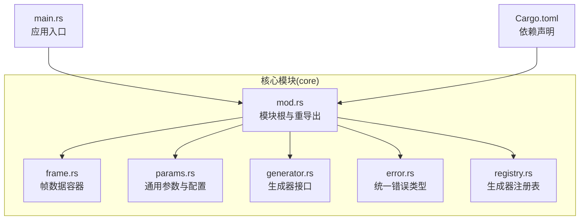
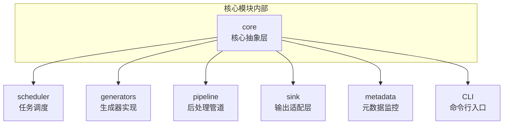
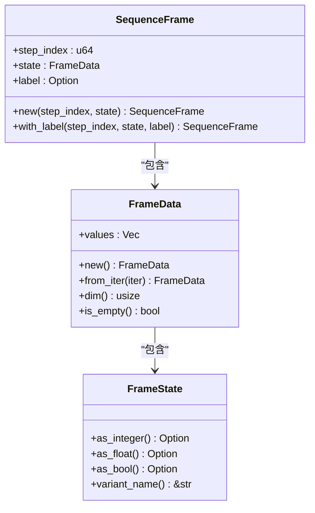
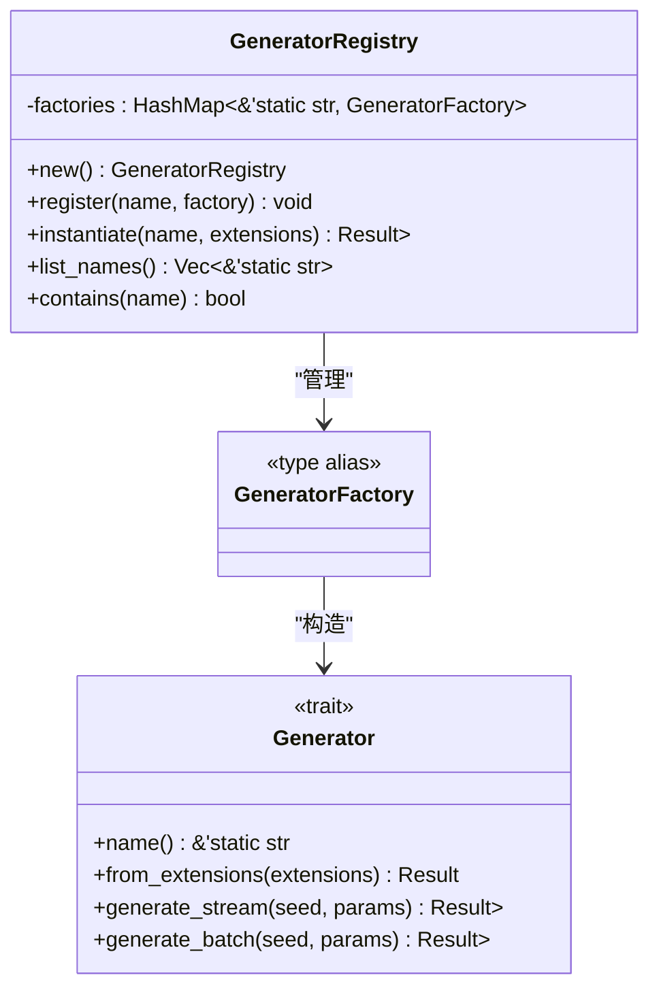
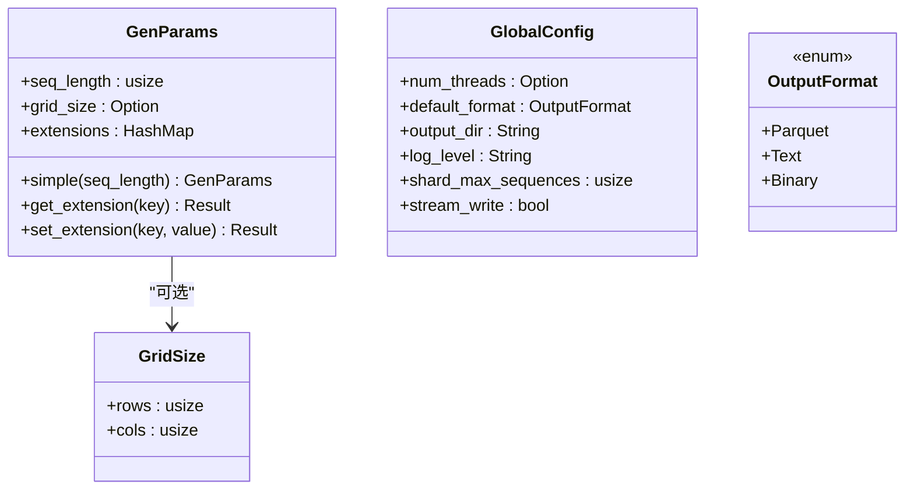
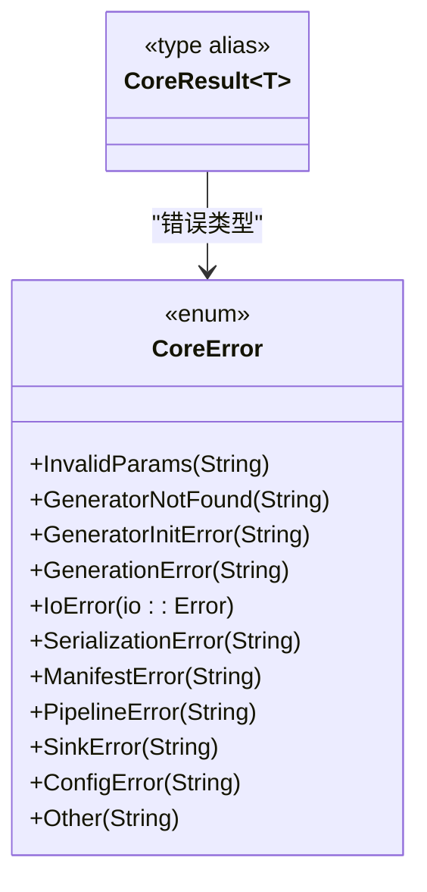
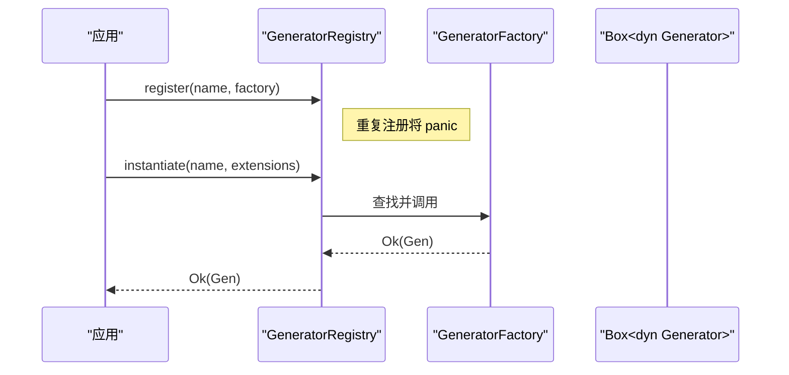
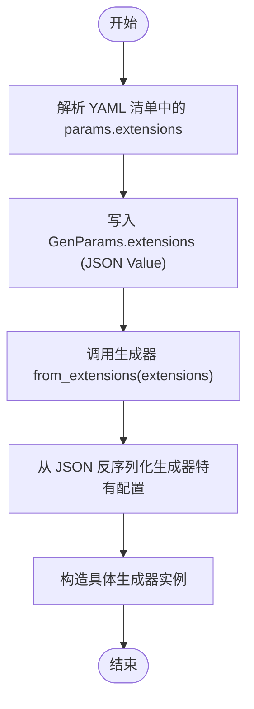
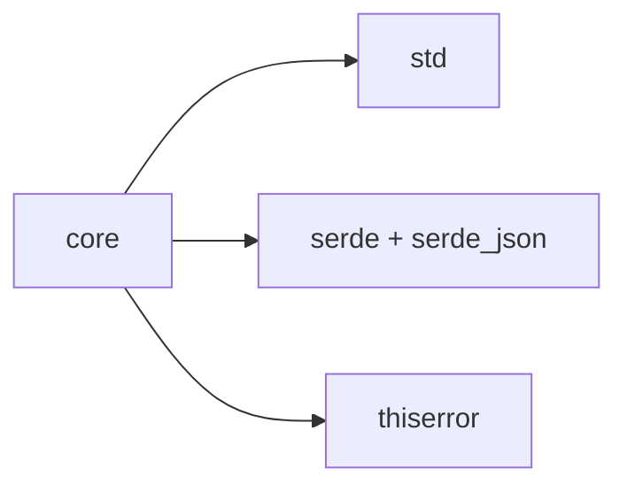

# 核心模块概览

<cite>
**本文档引用的文件**
- [core/mod.rs](file://src/core/mod.rs)
- [core/generator.rs](file://src/core/generator.rs)
- [core/frame.rs](file://src/core/frame.rs)
- [core/params.rs](file://src/core/params.rs)
- [core/error.rs](file://src/core/error.rs)
- [core/registry.rs](file://src/core/registry.rs)
- [main.rs](file://src/main.rs)
- [Cargo.toml](file://Cargo.toml)
- [docs/core模块详细设计.md](file://docs/core模块详细设计.md)
- [.trae/specs/implement-core-module/checklist.md](file://.trae/specs/implement-core-module/checklist.md)
</cite>

## 目录
1. [简介](#简介)
2. [项目结构](#项目结构)
3. [核心组件](#核心组件)
4. [架构总览](#架构总览)
5. [详细组件分析](#详细组件分析)
6. [依赖分析](#依赖分析)
7. [性能考虑](#性能考虑)
8. [故障排查指南](#故障排查指南)
9. [结论](#结论)
10. [附录](#附录)

## 简介
本文件为 StructGen-rs 核心模块（core）的综合概览文档。核心模块位于系统最底层，定义了所有可共享的数据结构、核心接口与公共类型别名，是调度器、生成器、后处理管道、输出适配层、元数据与 CLI 等上层模块的共同依赖基础。其设计原则强调“纯抽象、零业务逻辑”，通过强类型数据容器、统一错误体系与开放-封闭的参数扩展机制，向上层提供稳定可靠的基础支撑。

## 项目结构
核心模块采用“分层理念 + 文件职责分离”的组织方式，将抽象层、接口层与配置层清晰划分，确保模块内聚、模块间低耦合，并形成自底向上的单向依赖关系。

图表来源
- [core/mod.rs:1-16](file://src/core/mod.rs#L1-L16)
- [main.rs:1-6](file://src/main.rs#L1-L6)
- [Cargo.toml:1-10](file://Cargo.toml#L1-L10)

章节来源
- [core/mod.rs:1-16](file://src/core/mod.rs#L1-L16)
- [main.rs:1-6](file://src/main.rs#L1-L6)
- [Cargo.toml:1-10](file://Cargo.toml#L1-L10)

## 核心组件
- 抽象层（数据模型）
  - 帧状态值：统一承载整型、浮点型与布尔型状态值，提供类型安全的转换接口。
  - 帧数据：按时间步聚合的状态值集合，提供维度查询与空帧判断。
  - 时序帧：带时间步索引与可选语义标签的完整状态快照。
- 接口层（行为契约）
  - 生成器接口：定义流式与批量生成能力，要求实现者具备线程安全特性。
  - 生成器注册表：提供名称到构造函数的映射，支持注册、实例化与查询。
- 配置层（参数与格式）
  - 通用参数：解耦生成器特有配置与公共调度信息，支持扩展字段的序列化协议。
  - 全局配置：并行线程数、默认输出格式、输出目录、日志级别、分片策略与写出模式等。
  - 输出格式：Parquet、文本、二进制三种格式枚举。
- 错误体系（统一收敛）
  - 统一错误类型与结果别名，覆盖参数、生成、I/O、序列化、清单、管道、数据汇、配置等错误类别，并支持标准 I/O 错误自动转换。

章节来源
- [core/frame.rs:1-210](file://src/core/frame.rs#L1-L210)
- [core/generator.rs:1-129](file://src/core/generator.rs#L1-L129)
- [core/params.rs:1-235](file://src/core/params.rs#L1-L235)
- [core/error.rs:1-103](file://src/core/error.rs#L1-L103)
- [core/registry.rs:1-150](file://src/core/registry.rs#L1-L150)

## 架构总览
核心模块在系统中的定位与依赖关系如下：

图表来源
- [docs/core模块详细设计.md:420-433](file://docs/core模块详细设计.md#L420-L433)

章节来源
- [docs/core模块详细设计.md:7-18](file://docs/core模块详细设计.md#L7-L18)
- [docs/core模块详细设计.md:420-433](file://docs/core模块详细设计.md#L420-L433)

## 详细组件分析

### 抽象层：帧数据容器
- FrameState：标记联合体，统一承载 i64、f64、bool，提供 as_integer/as_float/as_bool/variant_name 等安全转换接口，避免弱类型承载带来的语义歧义。
- FrameData：按时间步聚合的状态值序列，提供 new/from_iter/dim/is_empty 等便捷方法。
- SequenceFrame：带 step_index、state 与可选 label 的完整帧，支持 new/with_label 构造。

图表来源
- [core/frame.rs:1-210](file://src/core/frame.rs#L1-L210)

章节来源
- [core/frame.rs:1-210](file://src/core/frame.rs#L1-L210)

### 接口层：生成器接口与注册表
- Generator trait：要求实现者为 Send + Sync，提供 name、from_extensions、generate_stream 与 generate_batch（默认实现）。流式接口优先，批量接口作为语法糖。
- GeneratorRegistry：名称→构造函数映射，提供 register（重复注册 panic）、instantiate（未注册返回错误）、list_names、contains 等能力。

图表来源
- [core/generator.rs:9-56](file://src/core/generator.rs#L9-L56)
- [core/registry.rs:8-64](file://src/core/registry.rs#L8-L64)

章节来源
- [core/generator.rs:1-129](file://src/core/generator.rs#L1-L129)
- [core/registry.rs:1-150](file://src/core/registry.rs#L1-L150)

### 配置层：参数与格式
- GenParams：目标序列长度、可选网格尺寸、动态扩展字段（JSON Value），提供 simple/get_extension/set_extension。
- GlobalConfig：并行线程数、默认输出格式、输出目录、日志级别、分片最大序列数、流式写出开关等。
- OutputFormat：Parquet、Text、Binary 三类输出格式。

图表来源
- [core/params.rs:68-123](file://src/core/params.rs#L68-L123)
- [core/params.rs:18-66](file://src/core/params.rs#L18-L66)
- [core/params.rs:8-18](file://src/core/params.rs#L8-L18)

章节来源
- [core/params.rs:1-235](file://src/core/params.rs#L1-L235)

### 错误体系：统一收敛
- CoreError：覆盖 InvalidParams、GeneratorNotFound、GeneratorInitError、GenerationError、IoError、SerializationError、ManifestError、PipelineError、SinkError、ConfigError、Other 等变体。
- CoreResult：统一结果别名，便于全系统传播。

图表来源
- [core/error.rs:4-52](file://src/core/error.rs#L4-L52)

章节来源
- [core/error.rs:1-103](file://src/core/error.rs#L1-L103)

### 生成器注册与实例化流程

图表来源
- [core/registry.rs:28-53](file://src/core/registry.rs#L28-L53)

章节来源
- [core/registry.rs:1-150](file://src/core/registry.rs#L1-L150)

### 参数扩展字段序列化协议

图表来源
- [docs/core模块详细设计.md:400-418](file://docs/core模块详细设计.md#L400-L418)
- [core/params.rs:99-122](file://src/core/params.rs#L99-L122)

章节来源
- [docs/core模块详细设计.md:400-418](file://docs/core模块详细设计.md#L400-L418)
- [core/params.rs:1-235](file://src/core/params.rs#L1-L235)

## 依赖分析
- 模块内聚：核心模块内部按职责拆分为 frame、params、generator、error、registry 五个文件，职责清晰、边界明确。
- 模块间依赖：核心模块仅依赖标准库与 serde/serde_json/thiserror，不依赖任何业务模块，形成自底向上的单向依赖图。
- 上层模块使用：调度器使用 Generator trait、GenParams、GeneratorRegistry、CoreError；生成器实现使用 Generator trait、FrameState/SequenceFrame/GenParams；后处理管道与输出适配层使用 SequenceFrame/CoreError/OutputFormat；元数据与 CLI 使用 GenParams/GlobalConfig/CoreError。

图表来源
- [Cargo.toml:6-10](file://Cargo.toml#L6-L10)

章节来源
- [Cargo.toml:1-10](file://Cargo.toml#L1-L10)
- [docs/core模块详细设计.md:435-442](file://docs/core模块详细设计.md#L435-L442)

## 性能考虑
- 帧状态内存布局：FrameState 为 16 字节（16B），与 i64 对齐，适合大规模序列的内存占用控制。
- 零拷贝传递：generate_stream 返回的迭代器按值产出 SequenceFrame，下游可直接消费，避免额外克隆。
- 注册表查找：HashMap<&str, GeneratorFactory> 使用静态字符串键，查找为 O(1)。
- 惰性解析：扩展字段采用惰性解析策略，仅在实例化时反序列化生成器特有配置，避免无效解析开销。

章节来源
- [docs/core模块详细设计.md:477-483](file://docs/core模块详细设计.md#L477-L483)

## 故障排查指南
- 参数错误（InvalidParams）：检查 GenParams 的 seq_length、grid_size 与 extensions 的类型与取值范围。
- 生成器未找到（GeneratorNotFound）：确认 GeneratorRegistry 中是否已注册对应名称，或检查清单中的生成器名称拼写。
- I/O 错误（IoError）：检查输出目录权限、磁盘空间与文件路径有效性。
- 序列化错误（SerializationError）：检查 extensions 中 JSON 结构与目标类型的一致性。
- 配置错误（ConfigError）：核对 GlobalConfig 的 num_threads、log_level、shard_max_sequences 等字段的有效性。

章节来源
- [core/error.rs:1-103](file://src/core/error.rs#L1-L103)
- [docs/core模块详细设计.md:455-476](file://docs/core模块详细设计.md#L455-L476)

## 结论
核心模块通过强类型数据容器、统一接口契约与开放-封闭的参数扩展机制，为 StructGen-rs 提供了稳固的类型基础与行为规范。其“纯抽象、零业务逻辑”的设计原则确保了模块的高内聚与低耦合，向上层模块屏蔽实现细节，实现清晰的分层架构。配合完善的错误收敛与性能考量，核心模块为系统的可维护性、可扩展性与可测试性奠定了坚实基础。

## 附录
- 设计原则与约束
  - 强类型抽象：使用标记联合体承载不同数值类型，避免弱类型带来的语义歧义。
  - Send + Sync：所有 trait 对象标注线程安全，确保 rayon 线程池安全共享。
  - 迭代器优先：generate_stream 为主接口，generate_batch 为语法糖。
  - 开放-封闭：通过 extensions 支持生成器特有参数，不修改核心接口。
  - 错误收敛：统一 CoreError 与 CoreResult，便于传播与处理。
- 扩展点
  - 新增生成器：实现 Generator trait 并通过 GeneratorRegistry 注册。
  - 新增输出格式：扩展 OutputFormat 并在输出适配层实现相应写出逻辑。
  - 新增错误类别：在 CoreError 中添加新变体，保持统一错误语义。

章节来源
- [docs/core模块详细设计.md:20-28](file://docs/core模块详细设计.md#L20-L28)
- [docs/core模块详细设计.md:539-552](file://docs/core模块详细设计.md#L539-L552)
- [.trae/specs/implement-core-module/checklist.md:8-28](file://.trae/specs/implement-core-module/checklist.md#L8-L28)