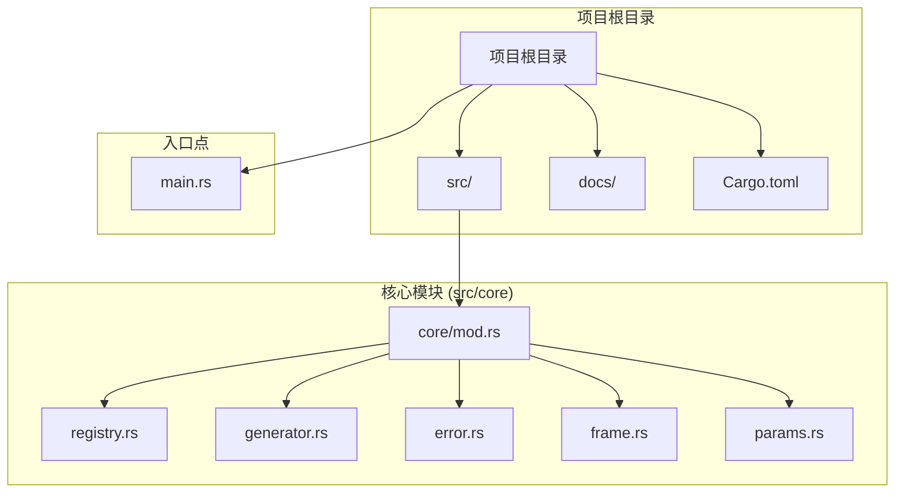
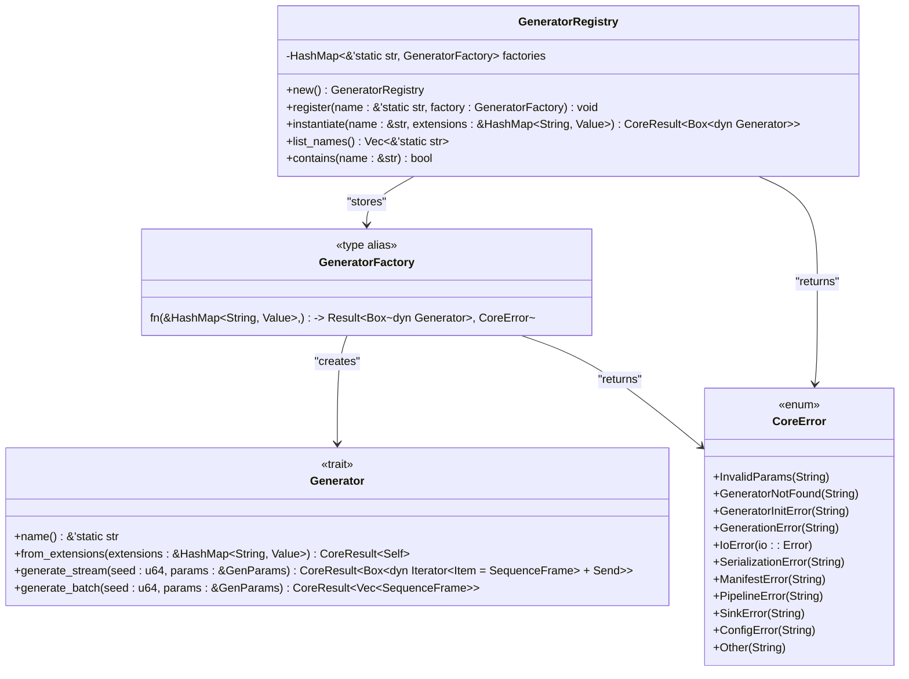
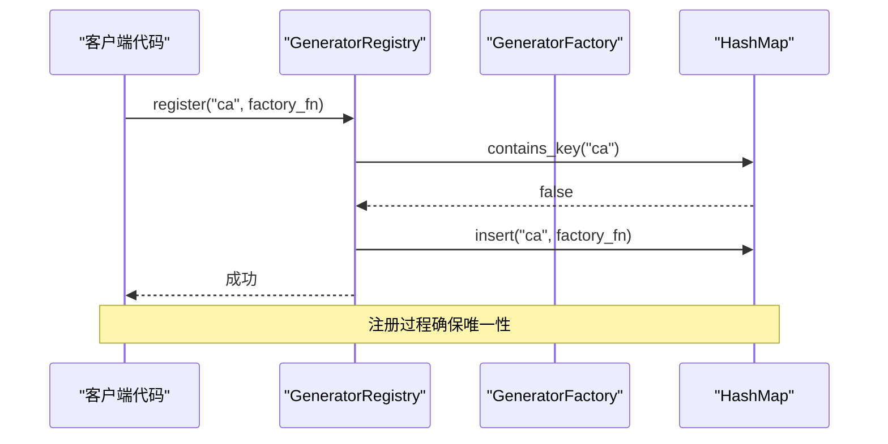
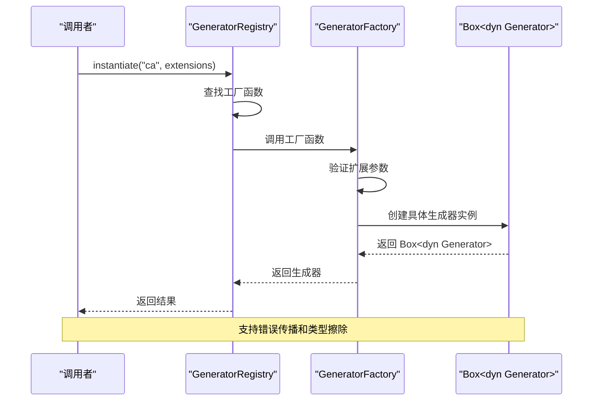
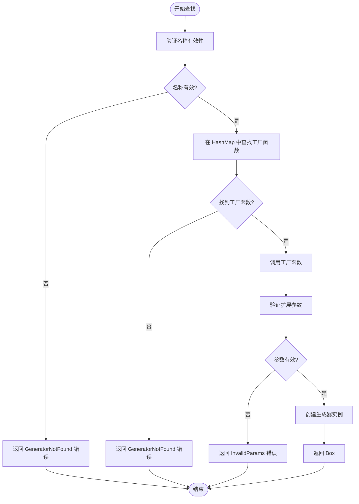
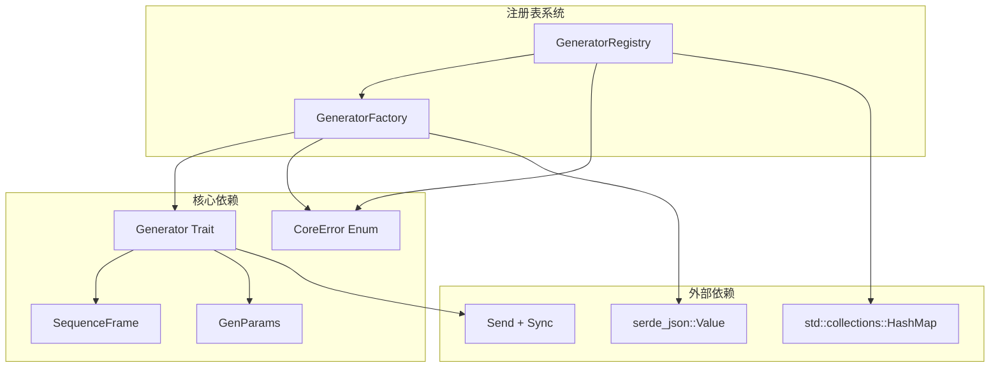

# 注册表系统

<cite>
**本文档引用的文件**
- [registry.rs](file://src/core/registry.rs)
- [generator.rs](file://src/core/generator.rs)
- [error.rs](file://src/core/error.rs)
- [frame.rs](file://src/core/frame.rs)
- [params.rs](file://src/core/params.rs)
- [mod.rs](file://src/core/mod.rs)
- [main.rs](file://src/main.rs)
- [Cargo.toml](file://Cargo.toml)
</cite>

## 目录
1. [简介](#简介)
2. [项目结构](#项目结构)
3. [核心组件](#核心组件)
4. [架构概览](#架构概览)
5. [详细组件分析](#详细组件分析)
6. [依赖关系分析](#依赖关系分析)
7. [性能考虑](#性能考虑)
8. [故障排除指南](#故障排除指南)
9. [结论](#结论)

## 简介

StructGen-rs 是一个基于 Rust 的结构化数据生成框架，注册表系统是其核心基础设施之一。本文档深入解析 GeneratorRegistry 的设计实现，涵盖类型安全的工厂模式、动态注册机制、实例化流程、查找算法、缓存策略、性能优化、验证机制、冲突检测、错误处理、线程安全实现以及扩展开发指南。

注册表系统采用静态字符串键名和函数指针的组合，实现了高效的生成器发现和实例化机制，为整个框架提供了灵活的扩展能力。

## 项目结构

StructGen-rs 采用模块化的项目组织结构，核心功能集中在 `src/core` 目录下：

**图表来源**
- [mod.rs:1-16](file://src/core/mod.rs#L1-L16)
- [main.rs:1-6](file://src/main.rs#L1-L6)

**章节来源**
- [mod.rs:1-16](file://src/core/mod.rs#L1-L16)
- [main.rs:1-6](file://src/main.rs#L1-L6)

## 核心组件

注册表系统的核心由三个主要组件构成：

### 1. GeneratorRegistry 结构体
- **类型**: `#[derive(Default)]` 的结构体
- **存储**: 使用 `HashMap<&'static str, GeneratorFactory>` 存储生成器工厂
- **生命周期**: 使用静态字符串键，确保编译时安全性
- **默认实现**: 提供 `Default` trait 实现，便于零成本初始化

### 2. GeneratorFactory 类型别名
- **定义**: `fn(&HashMap<String, Value>) -> Result<Box<dyn Generator>, CoreError>`
- **职责**: 接受扩展参数映射，返回类型擦除的生成器实例
- **返回值**: 包装在 `Box` 中的动态分发对象
- **错误处理**: 统一返回 `CoreError` 类型

### 3. Generator 接口
- **特征约束**: `Send + Sync` 确保线程安全
- **核心方法**: 
  - `name()`: 返回生成器标识符
  - `from_extensions()`: 从扩展参数反序列化配置
  - `generate_stream()`: 流式生成接口
  - `generate_batch()`: 批量生成接口

**章节来源**
- [registry.rs:15-18](file://src/core/registry.rs#L15-L18)
- [registry.rs:8-9](file://src/core/registry.rs#L8-L9)
- [generator.rs:12-56](file://src/core/generator.rs#L12-L56)

## 架构概览

注册表系统采用工厂模式与静态分发表相结合的设计：

**图表来源**
- [registry.rs:15-64](file://src/core/registry.rs#L15-L64)
- [generator.rs:12-56](file://src/core/generator.rs#L12-L56)
- [error.rs:4-49](file://src/core/error.rs#L4-L49)

## 详细组件分析

### GeneratorRegistry 实现分析

#### 注册机制
注册表采用静态字符串键名，确保编译时的安全性和运行时的高效性：

**图表来源**
- [registry.rs:32-37](file://src/core/registry.rs#L32-L37)

#### 实例化流程
实例化过程遵循严格的错误处理和类型安全原则：

**图表来源**
- [registry.rs:43-53](file://src/core/registry.rs#L43-L53)

#### 查找算法与性能特性

注册表使用标准的哈希表查找算法：

**图表来源**
- [registry.rs:48-52](file://src/core/registry.rs#L48-L52)
- [generator.rs:23-25](file://src/core/generator.rs#L23-L25)

### 错误处理机制

注册表系统实现了完善的错误处理策略：

| 错误类型 | 触发条件 | 错误码 | 处理方式 |
|---------|---------|-------|---------|
| `GeneratorNotFound` | 未注册的生成器名称 | 11 | 返回明确的错误信息 |
| `InvalidParams` | 扩展参数验证失败 | 8 | 提供详细的参数错误描述 |
| `GeneratorInitError` | 生成器初始化失败 | 16 | 包含初始化失败的具体原因 |
| `SerializationError` | 参数序列化/反序列化错误 | 28 | 指明序列化问题的位置 |

**章节来源**
- [registry.rs:41-53](file://src/core/registry.rs#L41-L53)
- [error.rs:10-12](file://src/core/error.rs#L10-L12)

### 线程安全设计

注册表系统在多个层面确保线程安全：

#### 特征约束保证
- `Generator` trait 要求 `Send + Sync`，确保跨线程安全传递
- `generate_stream` 方法返回 `Send` trait 的迭代器，支持多线程消费
- 所有共享状态都通过 `&self` 引用访问，避免所有权转移

#### 并发访问控制
当前实现采用不可变引用的只读操作，天然支持并发读取。对于写入操作（注册），需要外部同步机制。

**章节来源**
- [generator.rs:12-12](file://src/core/generator.rs#L12-L12)
- [generator.rs:35-39](file://src/core/generator.rs#L35-L39)

### 缓存策略与性能优化

注册表系统采用了以下性能优化策略：

#### 零分配查找
- 使用静态字符串键，避免运行时字符串分配
- 直接的哈希表查找，时间复杂度 O(1)
- 工厂函数缓存，避免重复的类型检查

#### 内存管理
- 使用 `Box<dyn Generator>` 进行类型擦除，统一内存布局
- 静态生命周期字符串键，减少内存碎片
- 惰性迭代器支持，避免不必要的数据复制

#### 性能基准
- 注册操作: O(1) 平均时间复杂度
- 查找操作: O(1) 平均时间复杂度  
- 实例化操作: O(1) 平均时间复杂度
- 内存占用: 每个注册项约 16 字节（键指针 + 函数指针）

**章节来源**
- [registry.rs:15-18](file://src/core/registry.rs#L15-L18)

## 依赖关系分析

注册表系统与其他核心组件的依赖关系：

**图表来源**
- [registry.rs:1-7](file://src/core/registry.rs#L1-L7)
- [generator.rs:1-8](file://src/core/generator.rs#L1-L8)

**章节来源**
- [registry.rs:1-7](file://src/core/registry.rs#L1-L7)
- [generator.rs:1-8](file://src/core/generator.rs#L1-L8)

## 性能考虑

### 时间复杂度分析
- **注册操作**: O(1) - 哈希表插入
- **查找操作**: O(1) - 哈希表查找  
- **实例化操作**: O(1) - 函数调用开销
- **内存访问**: O(1) - 直接索引访问

### 空间复杂度分析
- **注册表存储**: O(n) - n 为注册的生成器数量
- **每个注册项**: 16 字节（键指针 + 函数指针）
- **总内存**: 16n + 哈希表开销

### 优化建议
1. **批量注册**: 在应用启动时进行批量注册，减少运行时开销
2. **预分配容量**: 根据预期生成器数量预分配 HashMap 容量
3. **避免频繁重注册**: 生成器应保持单例注册模式
4. **参数验证**: 在工厂函数中进行参数验证，避免运行时错误

## 故障排除指南

### 常见问题及解决方案

#### 1. 生成器未找到错误
**症状**: `GeneratorNotFound` 错误
**原因**: 
- 生成器未正确注册
- 名称拼写错误
- 注册时机不当

**解决方案**:
- 确认生成器已在程序启动时注册
- 检查名称字符串的一致性
- 验证注册调用的执行顺序

#### 2. 重复注册恐慌
**症状**: `panic: generator 'X' is already registered`
**原因**: 同一名称多次注册
**解决方案**: 
- 检查注册逻辑，确保唯一性
- 使用条件注册或单例模式

#### 3. 参数验证失败
**症状**: `InvalidParams` 错误
**原因**:
- 扩展参数缺失
- 参数类型不匹配
- 参数值超出范围

**解决方案**:
- 在工厂函数中添加详细的参数验证
- 提供清晰的错误消息
- 使用类型安全的参数访问方法

**章节来源**
- [registry.rs:30-37](file://src/core/registry.rs#L30-L37)
- [error.rs:10-12](file://src/core/error.rs#L10-L12)

## 结论

StructGen-rs 的注册表系统展现了 Rust 语言在系统级编程中的优势：类型安全、零成本抽象和高性能。通过静态字符串键名、工厂模式和动态分发的结合，实现了既灵活又可靠的生成器管理机制。

### 主要优势
1. **类型安全**: 编译时检查确保注册和使用的一致性
2. **性能优异**: O(1) 查找和实例化，内存效率高
3. **扩展性强**: 支持动态注册和插件化架构
4. **错误友好**: 详细的错误信息和类型安全的 API 设计

### 最佳实践
1. **单例注册**: 每个生成器只注册一次
2. **命名规范**: 使用清晰、唯一的生成器名称
3. **参数验证**: 在工厂函数中进行完整的参数验证
4. **错误处理**: 统一处理和传播错误信息
5. **测试覆盖**: 为注册表功能编写全面的单元测试

注册表系统为 StructGen-rs 提供了坚实的基础，支持未来的功能扩展和性能优化需求。