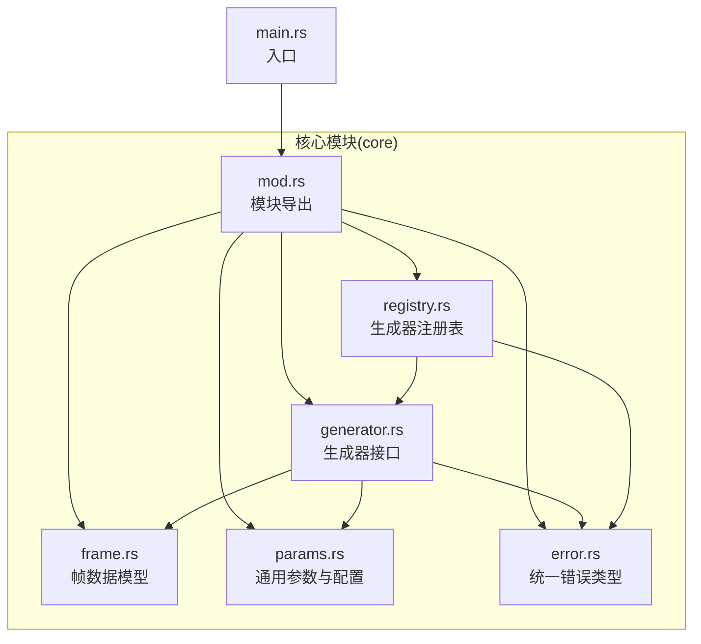
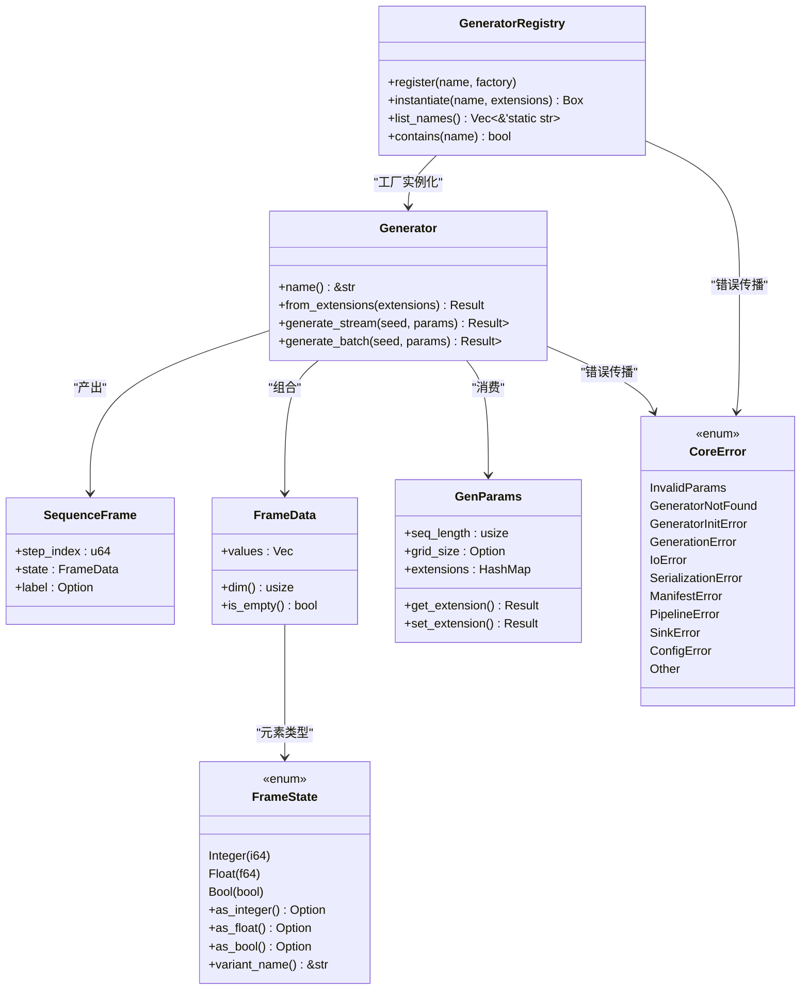
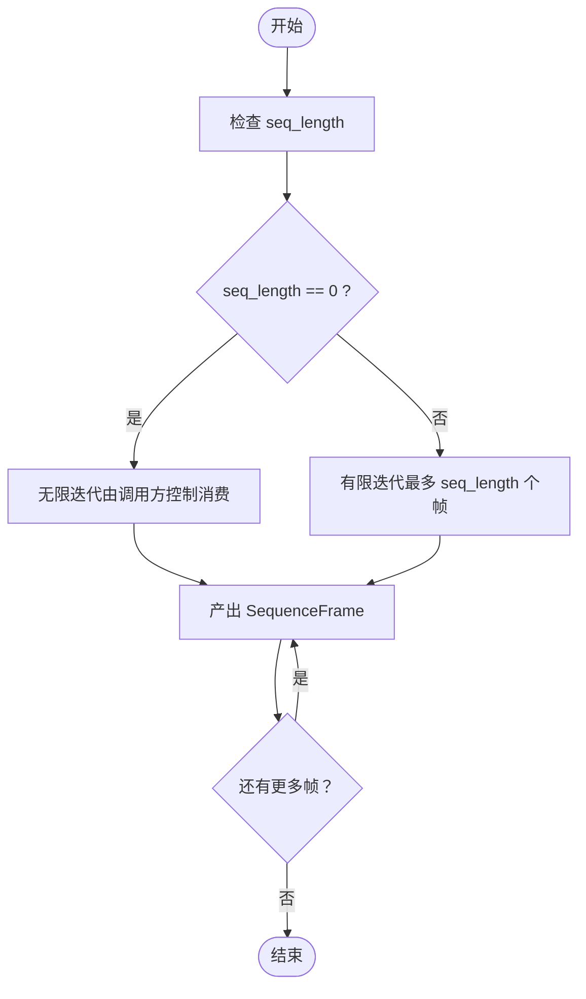
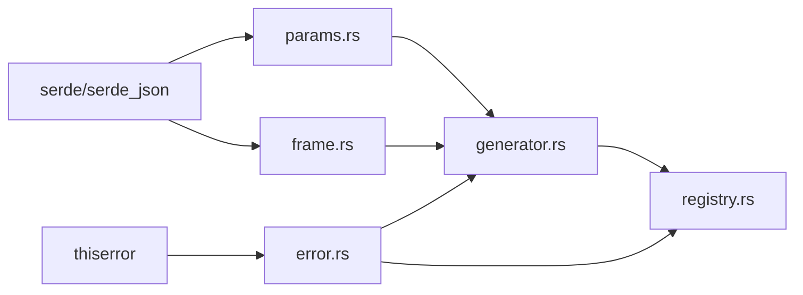

# 生成器接口设计

<cite>
**本文档引用的文件**
- [src/core/generator.rs](file://src/core/generator.rs)
- [src/core/registry.rs](file://src/core/registry.rs)
- [src/core/frame.rs](file://src/core/frame.rs)
- [src/core/params.rs](file://src/core/params.rs)
- [src/core/error.rs](file://src/core/error.rs)
- [src/core/mod.rs](file://src/core/mod.rs)
- [src/main.rs](file://src/main.rs)
- [Cargo.toml](file://Cargo.toml)
</cite>

## 目录
1. [简介](#简介)
2. [项目结构](#项目结构)
3. [核心组件](#核心组件)
4. [架构总览](#架构总览)
5. [详细组件分析](#详细组件分析)
6. [依赖分析](#依赖分析)
7. [性能考虑](#性能考虑)
8. [故障排除指南](#故障排除指南)
9. [结论](#结论)
10. [附录](#附录)

## 简介
本文件系统性阐述 StructGen-rs 的生成器接口设计，重点围绕 Generator trait 的设计理念、接口方法定义、参数规范与返回值约定，以及流式生成与批量生成两种模式的实现差异与适用场景。文档同时记录默认实现机制、工厂模式应用与类型安全保证，解释生成器的生命周期管理、状态维护与错误处理策略，并提供与注册表系统的集成方式与扩展机制。最后给出实现示例与最佳实践，帮助初学者快速理解接口，为开发者提供实现指南。

## 项目结构
项目采用模块化组织，核心抽象层位于 core 模块，包含生成器接口、帧数据模型、通用参数、错误类型与注册表系统。入口文件 main.rs 当前仅作为占位，核心逻辑集中在 core 子模块。

图表来源
- [src/core/mod.rs:1-16](file://src/core/mod.rs#L1-L16)
- [src/core/generator.rs:1-129](file://src/core/generator.rs#L1-L129)
- [src/core/registry.rs:1-150](file://src/core/registry.rs#L1-L150)
- [src/core/frame.rs:1-210](file://src/core/frame.rs#L1-L210)
- [src/core/params.rs:1-235](file://src/core/params.rs#L1-L235)
- [src/core/error.rs:1-103](file://src/core/error.rs#L1-L103)
- [src/main.rs:1-6](file://src/main.rs#L1-L6)

章节来源
- [src/core/mod.rs:1-16](file://src/core/mod.rs#L1-L16)
- [src/main.rs:1-6](file://src/main.rs#L1-L6)

## 核心组件
- 生成器接口 Generator：定义生成器的统一契约，要求实现 Send + Sync，确保在多线程环境下的安全共享。接口包含名称标识、从扩展参数构造实例、流式生成与批量生成等方法。
- 帧数据模型 SequenceFrame/FrameData/FrameState：统一承载不同类型的数值状态，支持整型、浮点型与布尔型，并提供序列化与转换能力。
- 通用参数 GenParams：承载序列长度、网格尺寸与动态扩展字段，支持扩展参数的读取与写入。
- 注册表 GeneratorRegistry：采用工厂函数模式，提供生成器的注册与按名称实例化能力。
- 统一错误类型 CoreError：集中管理各类错误，便于上层处理与传播。

章节来源
- [src/core/generator.rs:9-56](file://src/core/generator.rs#L9-L56)
- [src/core/frame.rs:3-118](file://src/core/frame.rs#L3-L118)
- [src/core/params.rs:68-123](file://src/core/params.rs#L68-L123)
- [src/core/registry.rs:8-64](file://src/core/registry.rs#L8-L64)
- [src/core/error.rs:4-49](file://src/core/error.rs#L4-L49)

## 架构总览
下图展示了生成器接口与注册表系统的交互关系，以及生成器如何消费通用参数并产出帧序列。

图表来源
- [src/core/generator.rs:9-56](file://src/core/generator.rs#L9-L56)
- [src/core/frame.rs:3-118](file://src/core/frame.rs#L3-L118)
- [src/core/params.rs:68-123](file://src/core/params.rs#L68-L123)
- [src/core/registry.rs:8-64](file://src/core/registry.rs#L8-L64)
- [src/core/error.rs:4-49](file://src/core/error.rs#L4-L49)

## 详细组件分析

### Generator 接口设计
- 设计理念
  - 抽象统一：所有具体生成器必须实现 Generator trait，确保对外行为一致。
  - 线程安全：要求实现者满足 Send + Sync，以便在 rayon 等并行库中跨线程安全共享。
  - 参数解耦：通过 GenParams 传递通用参数，扩展参数通过 from_extensions 从 extensions 中反序列化，实现参数解耦与类型安全。
  - 产出标准化：统一产出 SequenceFrame，便于后续管道处理与存储。
- 接口方法定义
  - name：返回生成器的唯一标识名称，用于注册表与日志。
  - from_extensions：从通用参数的扩展字段反序列化生成器特有配置，构造生成器实例；失败时返回 CoreError::InvalidParams。
  - generate_stream：流式生成，返回惰性迭代器，按时间步产出 SequenceFrame；当 seq_length 为 0 时由调用方控制消费数量。
  - generate_batch：批量生成，内部调用 generate_stream 并收集为 Vec；适用于中小规模数据。
- 参数规范与返回值约定
  - seed：确定性随机种子，决定初始状态与随机性注入。
  - params：通用参数，其中 seq_length 控制产出数量，0 表示无限制；extensions 承载生成器特有参数。
  - 返回值：成功返回 Ok(...)，失败返回 CoreError 枚举中的对应错误类型。
- 实现示例与最佳实践
  - 在实现 from_extensions 中严格校验扩展键是否存在与类型正确，避免运行时错误。
  - 在 generate_stream 中根据 seq_length 与 0 的语义进行分支控制，确保流式消费的可控性。
  - 使用 move 闭包捕获生成器状态，避免借用冲突。
  - 保持迭代器的惰性特性，避免不必要的内存占用。

章节来源
- [src/core/generator.rs:9-56](file://src/core/generator.rs#L9-L56)
- [src/core/generator.rs:58-129](file://src/core/generator.rs#L58-L129)

### 流式生成与批量生成
- 流式生成（generate_stream）
  - 特点：惰性迭代，按需产出，适合大规模数据与内存受限场景。
  - 控制：当 seq_length 为 0 时，迭代器无限产出，调用方负责消费数量控制。
  - 适用：大数据集、实时处理、内存敏感任务。
- 批量生成（generate_batch）
  - 特点：内部调用 generate_stream 并 collect，适合中小规模数据。
  - 适用：小数据集、测试验证、需要立即获得全部结果的场景。
- 差异对比
  - 内存占用：流式生成更优；批量生成一次性分配内存。
  - 性能特征：流式生成延迟更低；批量生成在收集阶段有额外开销。
  - 使用建议：优先选择流式生成，仅在确有必要时使用批量生成。

图表来源
- [src/core/generator.rs:27-55](file://src/core/generator.rs#L27-L55)

章节来源
- [src/core/generator.rs:27-55](file://src/core/generator.rs#L27-L55)

### 默认实现机制与工厂模式
- 默认实现
  - generate_batch：提供 generate_stream 的默认实现，内部调用 generate_stream 并收集为 Vec，简化实现负担。
- 工厂模式
  - GeneratorFactory：类型别名为 fn(&HashMap<String, Value>) -> Result<Box<dyn Generator>, CoreError>，用于注册表的工厂函数。
  - GeneratorRegistry：提供 register 与 instantiate 方法，通过名称映射到工厂函数，实现生成器的动态实例化。
- 类型安全保证
  - 通过 trait bound Generator: Send + Sync，确保跨线程安全。
  - 通过 from_extensions 的强类型反序列化，避免扩展参数的类型不匹配问题。
  - 通过 CoreError 的枚举化错误类型，统一错误处理路径。

章节来源
- [src/core/generator.rs:41-55](file://src/core/generator.rs#L41-L55)
- [src/core/registry.rs:8-64](file://src/core/registry.rs#L8-L64)

### 生命周期管理、状态维护与错误处理
- 生命周期管理
  - 注册阶段：在程序启动时通过 register 将生成器工厂注册到全局注册表。
  - 实例化阶段：通过 instantiate 按名称查找工厂并传入扩展参数进行实例化。
  - 使用阶段：调用 generate_stream 或 generate_batch 获取帧序列。
- 状态维护
  - 生成器实例持有必要的内部状态（如状态维度等），通过 move 闭包在迭代器中安全使用。
  - 通过确定性随机种子 seed 控制初始状态与随机性注入，确保可重复性。
- 错误处理策略
  - 参数错误：InvalidParams，通常来自扩展参数缺失或类型不匹配。
  - 未找到生成器：GeneratorNotFound，来自注册表的名称查找失败。
  - 初始化与生成错误：GeneratorInitError、GenerationError，用于区分初始化与运行期错误。
  - I/O 与序列化错误：IoError、SerializationError，便于上层处理。
  - 统一错误传播：所有方法返回 Result，错误类型集中于 CoreError。

章节来源
- [src/core/registry.rs:28-53](file://src/core/registry.rs#L28-L53)
- [src/core/error.rs:4-49](file://src/core/error.rs#L4-L49)

### 与注册表系统的集成与扩展机制
- 集成方式
  - 注册：实现生成器后，提供工厂函数（接收 extensions 并返回 Box<dyn Generator>），通过 register(name, factory) 注册。
  - 实例化：调度器或上层代码通过 instantiate(name, extensions) 获取生成器实例。
  - 查询：list_names 与 contains 提供注册表查询能力。
- 扩展机制
  - 通过 GenParams.extensions 承载生成器特有参数，实现参数的动态扩展。
  - 通过 get_extension/set_extension 提供类型安全的扩展参数访问与设置。
- 最佳实践
  - 注册时使用稳定的静态字符串作为名称，避免重复注册导致 panic。
  - 工厂函数中严格校验扩展参数，失败时返回 InvalidParams。
  - 在实现 generate_stream 时遵循 seq_length 的语义，确保流式消费的可控性。

章节来源
- [src/core/registry.rs:28-64](file://src/core/registry.rs#L28-L64)
- [src/core/params.rs:99-123](file://src/core/params.rs#L99-L123)

### 帧数据模型与参数体系
- 帧数据模型
  - FrameState：统一承载整型、浮点型与布尔型状态值，提供类型转换与变体名称查询。
  - FrameData：一帧中所有状态值的集合，提供维度查询与空帧判断。
  - SequenceFrame：包含步索引、状态数据与可选标签，支持无标签与带标签构造。
- 通用参数
  - GenParams：包含序列长度、网格尺寸与扩展字段，提供扩展参数的读取与写入。
  - GlobalConfig：全局配置（当前模块未直接使用，但为未来扩展预留）。

章节来源
- [src/core/frame.rs:3-118](file://src/core/frame.rs#L3-L118)
- [src/core/params.rs:68-123](file://src/core/params.rs#L68-L123)

## 依赖分析
- 外部依赖
  - serde 与 serde_json：用于序列化/反序列化，支撑参数与帧数据的持久化与传输。
  - thiserror：用于统一错误类型与错误传播。
- 内部依赖
  - core 模块内部通过 mod.rs 导出各子模块，形成清晰的 API 边界。
  - 生成器接口依赖帧数据模型与通用参数，注册表依赖生成器接口与错误类型。

图表来源
- [Cargo.toml:6-10](file://Cargo.toml#L6-L10)
- [src/core/params.rs:1-7](file://src/core/params.rs#L1-L7)
- [src/core/frame.rs:1-3](file://src/core/frame.rs#L1-L3)
- [src/core/error.rs:1](file://src/core/error.rs#L1)
- [src/core/generator.rs:3-7](file://src/core/generator.rs#L3-L7)
- [src/core/registry.rs:3-6](file://src/core/registry.rs#L3-L6)

章节来源
- [Cargo.toml:6-10](file://Cargo.toml#L6-L10)

## 性能考虑
- 流式生成优先：在大规模数据场景下，优先使用 generate_stream，避免一次性分配大量内存。
- 迭代器惰性：确保迭代器的惰性特性，减少中间缓冲与拷贝。
- 确定性随机：通过 seed 控制随机性，避免不必要的状态重置。
- 扩展参数缓存：在工厂函数中对扩展参数进行一次性解析与校验，避免重复开销。
- 并行友好：Generator trait 要求 Send + Sync，便于在 rayon 等并行库中并行执行。

## 故障排除指南
- 常见错误类型
  - GeneratorNotFound：注册表中不存在指定名称的生成器，检查注册是否正确或名称是否拼写错误。
  - InvalidParams：扩展参数缺失或类型不匹配，检查 extensions 的键与类型。
  - SerializationError：扩展参数序列化/反序列化失败，检查参数的 JSON 结构与类型。
  - IoError：I/O 相关错误，检查文件路径与权限。
- 定位与修复
  - 在工厂函数中添加详细的参数校验与错误信息，便于快速定位问题。
  - 使用单元测试覆盖关键路径，包括流式与批量生成、扩展参数读取与写入。
  - 在 generate_stream 中明确 seq_length 的语义，避免无限迭代导致的资源耗尽。

章节来源
- [src/core/error.rs:4-49](file://src/core/error.rs#L4-L49)
- [src/core/registry.rs:40-53](file://src/core/registry.rs#L40-L53)
- [src/core/generator.rs:21-25](file://src/core/generator.rs#L21-L25)

## 结论
Generator 接口通过抽象统一、类型安全与工厂模式，为 StructGen-rs 提供了可扩展且高性能的生成器框架。结合流式生成与批量生成两种模式，既能满足大规模数据处理需求，也能兼顾中小规模场景的便捷性。配合注册表系统与统一错误类型，实现了良好的扩展性与可维护性。建议在实际实现中遵循本文的最佳实践，确保接口一致性与运行稳定性。

## 附录
- 示例参考
  - 流式生成示例：参见 [src/core/generator.rs:76-94](file://src/core/generator.rs#L76-L94)
  - 批量生成示例：参见 [src/core/generator.rs:52-55](file://src/core/generator.rs#L52-L55)
  - 注册表使用示例：参见 [src/core/registry.rs:103-111](file://src/core/registry.rs#L103-L111)
  - 扩展参数读取示例：参见 [src/core/params.rs:99-123](file://src/core/params.rs#L99-L123)