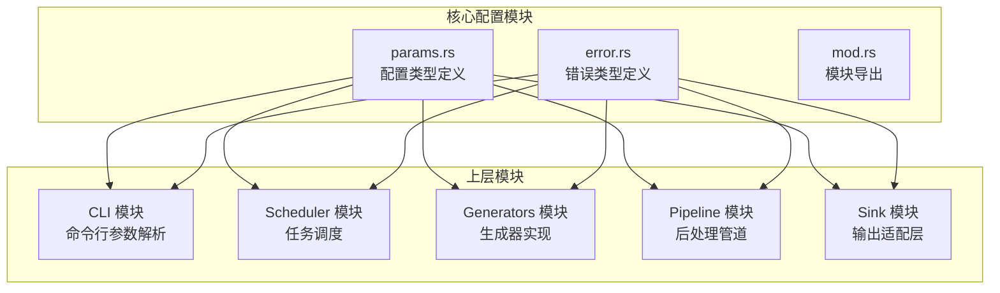
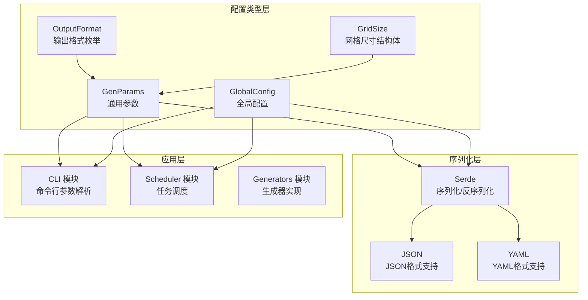
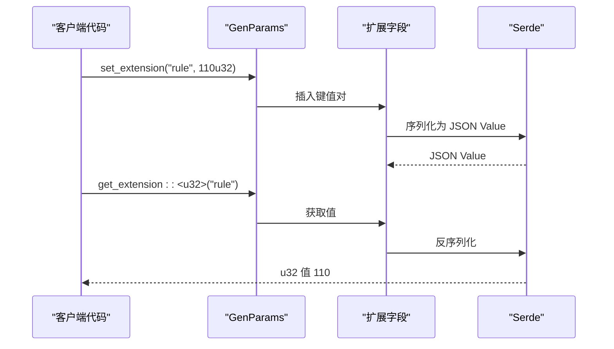
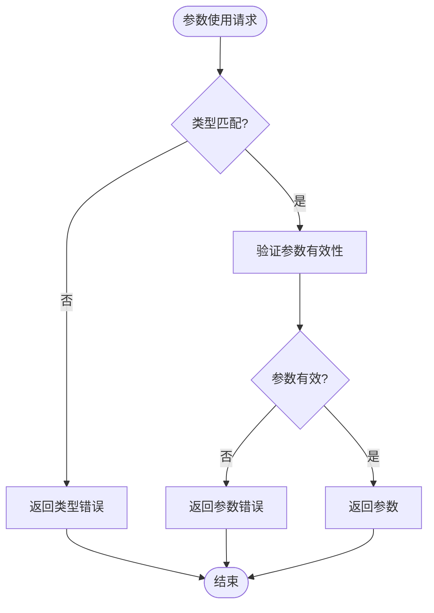
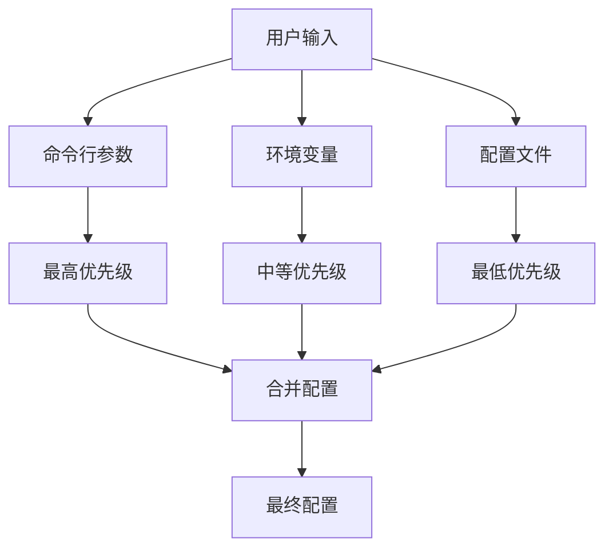
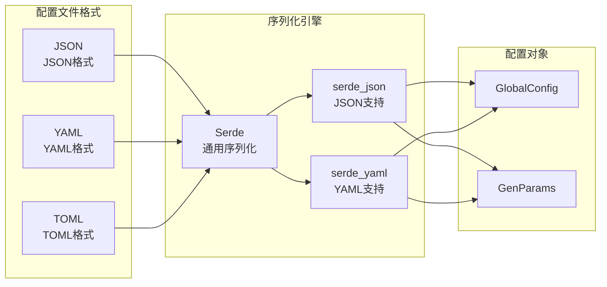
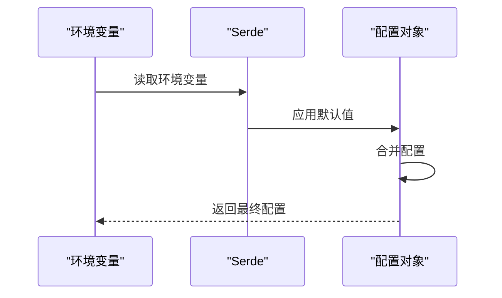
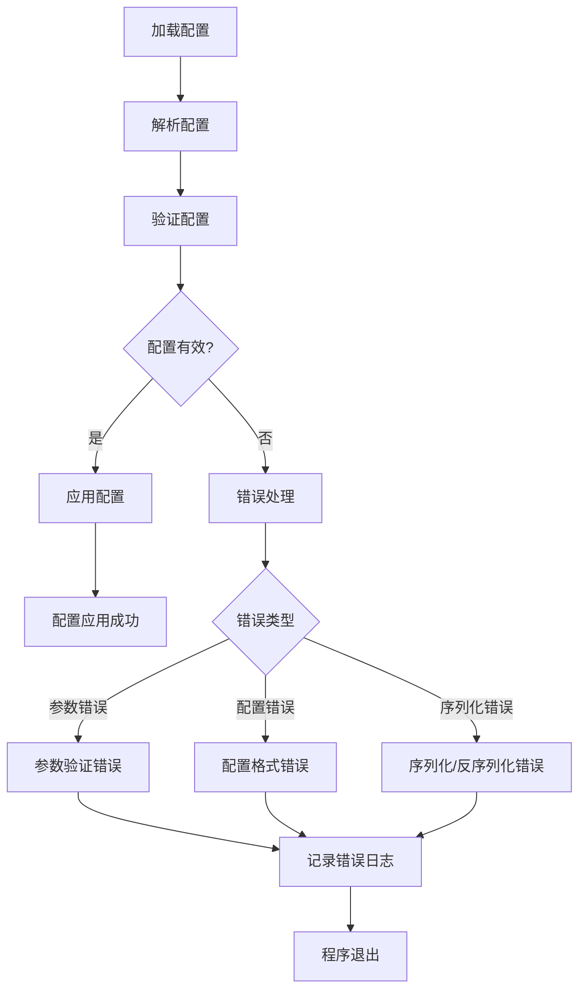
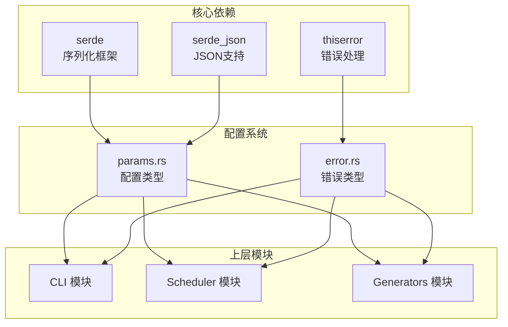

# 配置系统设计

<cite>
**本文档引用的文件**
- [params.rs](file://src/core/params.rs)
- [error.rs](file://src/core/error.rs)
- [mod.rs](file://src/core/mod.rs)
- [main.rs](file://src/main.rs)
- [Cargo.toml](file://Cargo.toml)
- [core模块详细设计.md](file://docs/core模块详细设计.md)
- [scheduler模块详细设计.md](file://docs/scheduler模块详细设计.md)
- [开发规划.md](file://docs/开发规划.md)
</cite>

## 目录
1. [简介](#简介)
2. [项目结构](#项目结构)
3. [核心组件](#核心组件)
4. [架构概览](#架构概览)
5. [详细组件分析](#详细组件分析)
6. [依赖分析](#依赖分析)
7. [性能考虑](#性能考虑)
8. [故障排除指南](#故障排除指南)
9. [结论](#结论)
10. [附录](#附录)

## 简介

StructGen-rs 的配置系统是一个精心设计的类型安全配置框架，专注于为生成器工作流提供灵活而可靠的配置管理。该系统采用分层架构设计，将配置类型定义与实际的配置加载机制分离，确保了高度的模块化和可扩展性。

配置系统的核心设计理念包括：
- **类型安全**：通过 Rust 的类型系统确保配置的正确性和一致性
- **可扩展性**：支持动态扩展字段，允许生成器模块自定义参数
- **层次化配置**：支持全局配置和任务级配置的组合使用
- **序列化友好**：基于 serde 的序列化支持，便于配置文件的读写
- **错误处理**：统一的错误类型系统，提供清晰的错误信息

## 项目结构

配置系统位于 `src/core/` 目录下的 `params.rs` 文件中，定义了所有核心配置相关的数据结构。整个配置系统遵循以下组织原则：



**图表来源**
- [params.rs:1-235](file://src/core/params.rs#L1-L235)
- [error.rs:1-103](file://src/core/error.rs#L1-L103)
- [mod.rs:1-16](file://src/core/mod.rs#L1-L16)

**章节来源**
- [params.rs:1-235](file://src/core/params.rs#L1-L235)
- [mod.rs:1-16](file://src/core/mod.rs#L1-L16)

## 核心组件

配置系统由三个核心组件构成，每个组件都有其特定的职责和设计特点：

### 1. GenParams 通用参数

GenParams 是配置系统的核心载体，负责封装所有生成器共享的通用参数。其设计体现了灵活性和类型安全的平衡。

### 2. GlobalConfig 全局配置

GlobalConfig 提供了运行时的全局配置选项，这些配置影响整个应用程序的行为，而不是单个任务。

### 3. OutputFormat 输出格式

OutputFormat 是一个专门的枚举类型，定义了系统支持的所有输出格式，为不同类型的输出需求提供了统一的接口。

**章节来源**
- [params.rs:68-123](file://src/core/params.rs#L68-L123)
- [params.rs:20-66](file://src/core/params.rs#L20-L66)
- [params.rs:8-18](file://src/core/params.rs#L8-L18)

## 架构概览

配置系统采用分层架构设计，将配置类型定义与配置加载机制分离，实现了高度的模块化：



**图表来源**
- [params.rs:8-123](file://src/core/params.rs#L8-L123)
- [params.rs:20-66](file://src/core/params.rs#L20-L66)

## 详细组件分析

### GenParams 通用参数设计

GenParams 是配置系统的核心数据结构，设计精巧地平衡了类型安全、灵活性和性能：

#### 核心字段设计

| 字段名 | 类型 | 默认值 | 描述 |
|--------|------|--------|------|
| seq_length | usize | 0 | 目标序列长度，0 表示无限制 |
| grid_size | Option<GridSize> | None | 网格尺寸，None 表示不适用 |
| extensions | HashMap<String, Value> | 空 | 动态扩展字段，存储生成器特有参数 |

#### 扩展字段机制

GenParams 的扩展字段系统是其最大的创新点，提供了强大的可扩展性：



**图表来源**
- [params.rs:99-122](file://src/core/params.rs#L99-L122)

#### 参数验证策略

GenParams 采用了延迟验证策略，只在需要时进行参数验证：



**图表来源**
- [params.rs:99-122](file://src/core/params.rs#L99-L122)

**章节来源**
- [params.rs:68-123](file://src/core/params.rs#L68-L123)

### GlobalConfig 全局配置设计

GlobalConfig 提供了运行时的全局配置选项，这些配置影响整个应用程序的行为：

#### 配置项定义

| 配置项 | 类型 | 默认值 | 描述 |
|--------|------|--------|------|
| num_threads | Option<usize> | None | 并行线程数，None 表示自动检测 |
| default_format | OutputFormat | Parquet | 默认输出格式 |
| output_dir | String | "" | 输出根目录 |
| log_level | String | "info" | 日志级别 |
| shard_max_sequences | usize | 10000 | 每个输出分片文件的最大序列数 |
| stream_write | bool | true | 流式写出模式 |

#### 优先级处理机制

全局配置支持多层优先级处理，确保配置的灵活性：



**图表来源**
- [params.rs:20-66](file://src/core/params.rs#L20-L66)

**章节来源**
- [params.rs:20-66](file://src/core/params.rs#L20-L66)

### OutputFormat 输出格式枚举

OutputFormat 是一个专门设计的枚举类型，定义了系统支持的所有输出格式：

#### 枚举值定义

| 枚举值 | 描述 | 默认行为 |
|--------|------|----------|
| Parquet | Apache Parquet 列式存储 | 默认格式 |
| Text | 纯文本（令牌映射后的 Unicode 序列） | 文本输出 |
| Binary | 内存映射二进制原始转储 | 二进制输出 |

#### 扩展策略

OutputFormat 设计支持未来的扩展，可以通过以下方式进行扩展：

1. **向后兼容扩展**：添加新的枚举值不会破坏现有代码
2. **配置驱动扩展**：通过配置文件支持新的输出格式
3. **插件化扩展**：通过注册表机制支持外部扩展

**章节来源**
- [params.rs:8-18](file://src/core/params.rs#L8-L18)

### 配置加载机制

配置系统的加载机制采用分层设计，确保配置的灵活性和可靠性：

#### 配置文件格式

系统支持多种配置文件格式，主要通过 serde 提供的序列化功能实现：



**图表来源**
- [params.rs:20-123](file://src/core/params.rs#L20-L123)

#### 环境变量支持

系统通过 serde 的默认值机制支持环境变量配置：



**图表来源**
- [params.rs:43-53](file://src/core/params.rs#L43-L53)

**章节来源**
- [params.rs:20-123](file://src/core/params.rs#L20-L123)

### 验证流程和错误处理

配置系统实现了完善的验证流程和错误处理机制：

#### 验证流程



**图表来源**
- [error.rs:4-49](file://src/core/error.rs#L4-L49)

#### 错误处理策略

配置系统使用统一的错误类型 `CoreError` 来处理各种配置相关的错误：

| 错误类型 | 触发场景 | 处理方式 |
|----------|----------|----------|
| InvalidParams | 参数不合法 | 立即报错，提供详细错误信息 |
| ConfigError | 配置格式错误 | 立即报错，指导用户修正配置 |
| SerializationError | 序列化/反序列化失败 | 立即报错，提供修复建议 |
| IoError | 文件读写错误 | 清理资源后报错退出 |

**章节来源**
- [error.rs:4-49](file://src/core/error.rs#L4-L49)

## 依赖分析

配置系统依赖于多个关键库，这些依赖关系确保了配置系统的功能完整性和性能表现：



**图表来源**
- [Cargo.toml:6-10](file://Cargo.toml#L6-L10)
- [params.rs:1-7](file://src/core/params.rs#L1-L7)
- [error.rs:1](file://src/core/error.rs#L1)

### 关键依赖特性

| 依赖库 | 版本 | 功能 | 用途 |
|--------|------|------|------|
| serde | ^1 | 序列化/反序列化 | 配置数据的序列化 |
| serde_json | ^1 | JSON支持 | JSON格式配置文件 |
| thiserror | ^1 | 错误处理 | 统一错误类型定义 |

**章节来源**
- [Cargo.toml:6-10](file://Cargo.toml#L6-L10)

## 性能考虑

配置系统在设计时充分考虑了性能因素，确保在提供强大功能的同时保持高效的运行性能：

### 内存效率

- **零拷贝设计**：配置数据采用按值传递，避免不必要的内存复制
- **惰性解析**：扩展字段采用惰性解析策略，只在需要时进行解析
- **紧凑数据结构**：使用 `#[derive(Copy)]` 的结构体减少内存占用

### 序列化性能

- **高效序列化**：利用 serde 的优化实现，提供快速的序列化/反序列化
- **缓存机制**：配置解析结果可以被缓存，避免重复解析
- **批量操作**：支持批量配置操作，减少序列化开销

### 并发安全性

- **不可变配置**：配置对象设计为不可变，支持安全的并发访问
- **线程安全**：所有配置类型都实现了 `Send` 和 `Sync` trait
- **无锁设计**：配置读取操作不使用锁，提高并发性能

## 故障排除指南

### 常见配置问题

#### 参数验证错误

当配置参数不符合要求时，系统会返回 `InvalidParams` 错误：

```rust
// 示例：序列长度必须大于 0
let params = GenParams::simple(0); // 将触发参数验证错误
```

#### 配置格式错误

当配置文件格式不正确时，系统会返回 `ConfigError` 或 `SerializationError`：

```rust
// 示例：无效的 JSON 格式
let invalid_json = "{ invalid json }";
let config: GlobalConfig = serde_json::from_str(invalid_json); // 将触发序列化错误
```

#### 环境变量问题

当环境变量配置不正确时，系统会使用默认值或返回错误：

```rust
// 示例：无效的日志级别
std::env::set_var("LOG_LEVEL", "invalid"); // 将使用默认值 "info"
```

### 调试技巧

1. **启用详细日志**：设置 `log_level` 为 "debug" 或 "trace" 获取更多调试信息
2. **检查配置文件**：使用在线 JSON/YAML 验证工具检查配置文件格式
3. **单元测试**：运行配置相关的单元测试验证配置正确性

**章节来源**
- [error.rs:4-49](file://src/core/error.rs#L4-L49)

## 结论

StructGen-rs 的配置系统设计体现了现代 Rust 应用程序的最佳实践。通过类型安全的设计、灵活的扩展机制和完善的错误处理，该系统为生成器工作流提供了强大而可靠的配置管理能力。

### 主要优势

1. **类型安全**：完整的类型系统确保配置的正确性和一致性
2. **高度可扩展**：动态扩展字段支持生成器模块自定义参数
3. **灵活配置**：多层配置优先级支持复杂的配置场景
4. **易于使用**：简洁的 API 设计降低了使用复杂度
5. **性能优秀**：优化的内存使用和序列化性能

### 未来发展方向

1. **配置热重载**：支持运行时配置更新而无需重启
2. **配置模板**：提供配置模板系统简化常用配置
3. **配置验证规则**：支持更复杂的配置验证规则
4. **配置版本管理**：支持配置版本控制和迁移

## 附录

### 配置使用指南

#### 初学者使用指南

1. **基本配置**：使用 `GlobalConfig::default()` 获取默认配置
2. **简单参数**：使用 `GenParams::simple(seq_length)` 创建基本参数
3. **扩展配置**：使用 `set_extension()` 添加生成器特有参数
4. **序列化配置**：使用 `serde_json` 进行配置的读写

#### 高级用户开发指南

1. **自定义扩展**：通过 `extensions` 字段添加自定义参数
2. **配置验证**：实现自定义验证逻辑确保配置有效性
3. **配置继承**：利用配置优先级机制实现配置继承
4. **错误处理**：使用 `CoreError` 类型处理配置相关错误

### API 参考

#### GenParams 方法

| 方法名 | 参数 | 返回值 | 描述 |
|--------|------|--------|------|
| simple | seq_length: usize | GenParams | 创建简单参数 |
| get_extension | key: &str | T | 获取扩展参数 |
| set_extension | key: &str, value: &T | Result<(), CoreError> | 设置扩展参数 |

#### GlobalConfig 方法

| 方法名 | 参数 | 返回值 | 描述 |
|--------|------|--------|------|
| default | 无 | GlobalConfig | 获取默认配置 |
| from_json | json: &str | Result<GlobalConfig, CoreError> | 从 JSON 创建配置 |
| to_json | 无 | String | 转换为 JSON 字符串 |