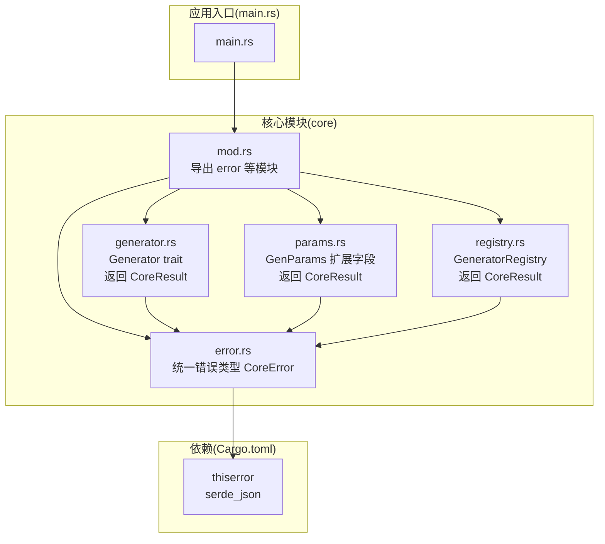
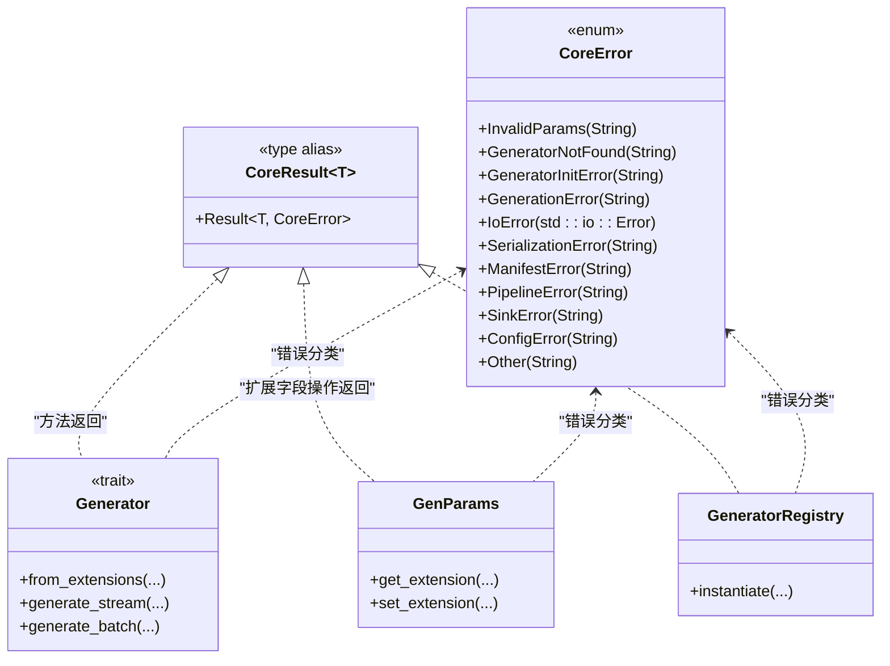
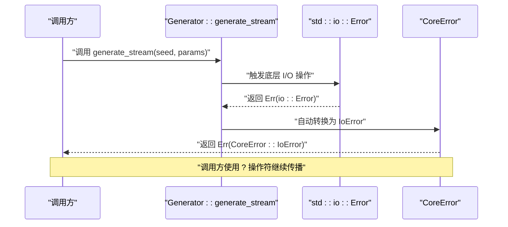
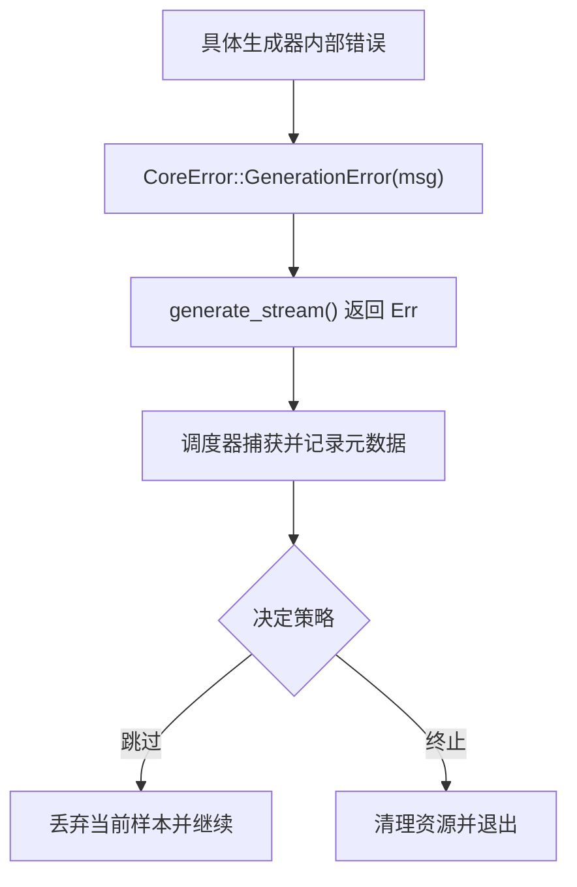
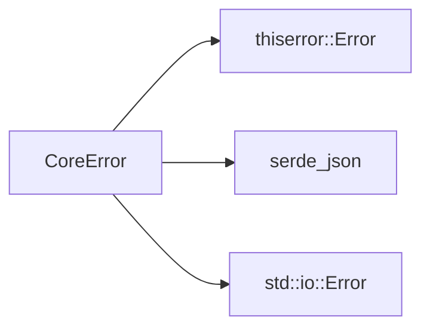

# 错误处理体系

<cite>
**本文档引用的文件**
- [src/core/error.rs](file://src/core/error.rs)
- [src/core/mod.rs](file://src/core/mod.rs)
- [src/core/generator.rs](file://src/core/generator.rs)
- [src/core/params.rs](file://src/core/params.rs)
- [src/core/registry.rs](file://src/core/registry.rs)
- [src/main.rs](file://src/main.rs)
- [Cargo.toml](file://Cargo.toml)
- [docs/core模块详细设计.md](file://docs/core模块详细设计.md)
</cite>

## 目录
1. [简介](#简介)
2. [项目结构](#项目结构)
3. [核心组件](#核心组件)
4. [架构总览](#架构总览)
5. [详细组件分析](#详细组件分析)
6. [依赖关系分析](#依赖关系分析)
7. [性能考虑](#性能考虑)
8. [故障排查指南](#故障排查指南)
9. [结论](#结论)
10. [附录](#附录)

## 简介
本文件系统性梳理 StructGen-rs 的错误处理体系，重点围绕 core 模块的统一错误类型 CoreError，阐述其层次结构、错误分类、错误码语义化消息、错误传播机制（含 ? 操作符、错误包装与上下文传递）、最佳实践（错误恢复策略、降级处理、用户反馈）、日志记录与监控集成建议，以及与标准库错误处理的集成方式。文档同时提供面向初学者的入门指导与面向开发者的高级技巧。

## 项目结构
- 错误处理的核心位于 core 模块，统一暴露错误类型与结果别名，供其他模块复用。
- 顶层模块导出 core 的公共 API，便于上层模块直接使用。
- 依赖项中包含 thiserror，用于自动生成错误类型实现与显示消息。

图表来源
- [src/core/mod.rs:1-16](file://src/core/mod.rs#L1-L16)
- [src/core/error.rs:1-103](file://src/core/error.rs#L1-L103)
- [src/core/generator.rs:1-129](file://src/core/generator.rs#L1-L129)
- [src/core/params.rs:1-235](file://src/core/params.rs#L1-L235)
- [src/core/registry.rs:1-150](file://src/core/registry.rs#L1-L150)
- [src/main.rs:1-6](file://src/main.rs#L1-L6)
- [Cargo.toml:1-10](file://Cargo.toml#L1-L10)

章节来源
- [src/core/mod.rs:1-16](file://src/core/mod.rs#L1-L16)
- [src/main.rs:1-6](file://src/main.rs#L1-L6)
- [Cargo.toml:1-10](file://Cargo.toml#L1-L10)

## 核心组件
- 统一错误类型 CoreError：基于 thiserror 宏派生，覆盖参数、生成器、I/O、序列化、清单、管道、数据汇、配置、其他等错误类别，并内置 std::io::Error 的自动转换。
- 结果别名 CoreResult<T>：统一替换为 Result<T, CoreError>，保证全系统一致的错误处理风格。
- 生成器接口 Generator：方法返回 CoreResult，确保生成流程中的错误可被上层捕获与传播。
- 参数容器 GenParams：扩展字段的序列化/反序列化返回 CoreResult，便于在参数解析阶段进行错误分类与提示。
- 注册表 GeneratorRegistry：实例化生成器时返回 CoreResult，支持“资源错误”类别的快速定位与提示。

章节来源
- [src/core/error.rs:1-103](file://src/core/error.rs#L1-L103)
- [src/core/generator.rs:1-129](file://src/core/generator.rs#L1-L129)
- [src/core/params.rs:1-235](file://src/core/params.rs#L1-L235)
- [src/core/registry.rs:1-150](file://src/core/registry.rs#L1-L150)

## 架构总览
下图展示错误类型在各模块中的使用与传播路径，体现“统一错误类型 + 结果别名”的一致性设计。

图表来源
- [src/core/error.rs:1-103](file://src/core/error.rs#L1-L103)
- [src/core/generator.rs:1-129](file://src/core/generator.rs#L1-L129)
- [src/core/params.rs:1-235](file://src/core/params.rs#L1-L235)
- [src/core/registry.rs:1-150](file://src/core/registry.rs#L1-L150)

## 详细组件分析

### CoreError 层次结构与语义化消息
- 分类与语义：
  - 参数类：InvalidParams、ConfigError、ManifestError，用于用户输入错误与配置错误，强调立即报错与明确提示。
  - 资源类：GeneratorNotFound，用于清单引用未注册生成器，配合列出可用生成器名称。
  - 运行时类：GenerationError、PipelineError、SinkError，用于生成或写出异常，支持记录日志并可选丢弃当前样本。
  - 系统类：IoError（自动转换自 std::io::Error）、SerializationError，用于磁盘、权限、序列化失败等，建议清理资源后退出。
  - 初始化类：GeneratorInitError，用于生成器构造失败，强调立即报错与参数校验信息。
  - 其他类：Other，用于未分类错误，保留原始消息。
- 语义化消息：每个变体均通过 thiserror 的 #[error(...)] 指定人类可读的消息模板，便于日志与用户反馈。

章节来源
- [src/core/error.rs:1-103](file://src/core/error.rs#L1-L103)
- [docs/core模块详细设计.md:455-465](file://docs/core模块详细设计.md#L455-L465)

### 错误传播机制与 ? 操作符使用
- 自动转换：IoError 通过 #[from] 自动从 std::io::Error 转换，简化 I/O 错误的传播。
- 显式包装：在参数扩展字段的序列化/反序列化中，将底层错误包装为 CoreError 的对应变体，保持语义一致。
- 上层传播：Generator、GenParams、GeneratorRegistry 的方法返回 CoreResult，调用方可使用 ? 操作符进行短路传播，避免重复错误分支。

图表来源
- [src/core/generator.rs:35-39](file://src/core/generator.rs#L35-L39)
- [src/core/error.rs:22-24](file://src/core/error.rs#L22-L24)

章节来源
- [src/core/error.rs:22-24](file://src/core/error.rs#L22-L24)
- [src/core/generator.rs:35-39](file://src/core/generator.rs#L35-L39)
- [src/core/params.rs:100-122](file://src/core/params.rs#L100-L122)
- [src/core/registry.rs:43-53](file://src/core/registry.rs#L43-L53)

### 错误包装与上下文传递
- 包装策略：在参数扩展字段的 get/set 方法中，将 serde_json 的错误包装为 CoreError::SerializationError，并携带扩展键与原始错误信息，便于定位问题。
- 上下文传递：错误消息模板包含关键上下文（如扩展键、生成器名称），帮助用户与运维快速定位问题来源。

章节来源
- [src/core/params.rs:100-122](file://src/core/params.rs#L100-L122)
- [src/core/registry.rs:48-52](file://src/core/registry.rs#L48-L52)

### 错误分类与处理策略
- 用户输入错误：InvalidParams、ConfigError、ManifestError，立即报错并给出明确提示。
- 资源错误：GeneratorNotFound，立即报错并列出可用生成器名称。
- 运行时错误：GenerationError、PipelineError、SinkError，记录日志，可选丢弃当前样本。
- 系统错误：IoError、SerializationError，清理资源后报错退出。
- 初始化错误：GeneratorInitError，立即报错并给出参数校验信息。

章节来源
- [docs/core模块详细设计.md:455-465](file://docs/core模块详细设计.md#L455-L465)

### 错误传播链示意

图表来源
- [docs/core模块详细设计.md:467-475](file://docs/core模块详细设计.md#L467-L475)

## 依赖关系分析
- thiserror：用于派生 Error trait 与生成 Display 实现，简化错误类型定义与消息格式化。
- serde_json：用于扩展字段的序列化/反序列化，错误时包装为 CoreError::SerializationError。
- std::io::Error：通过 #[from] 自动转换为 CoreError::IoError，统一 I/O 错误处理。

图表来源
- [src/core/error.rs:1-103](file://src/core/error.rs#L1-L103)
- [Cargo.toml:6-9](file://Cargo.toml#L6-L9)

章节来源
- [Cargo.toml:6-9](file://Cargo.toml#L6-L9)

## 性能考虑
- 错误类型大小与对齐：CoreError 作为 enum，具有稳定且紧凑的内存布局，适合高频错误路径。
- 零拷贝传播：错误对象通过 Result 返回，避免不必要的克隆与分配。
- 惰性解析：扩展字段仅在需要时进行 JSON 解析，减少无效开销，间接降低错误发生概率与处理成本。

章节来源
- [docs/core模块详细设计.md:477-482](file://docs/core模块详细设计.md#L477-L482)

## 故障排查指南
- 常见错误场景与解决思路：
  - 参数不合法：检查 InvalidParams 与 ConfigError，确认输入参数范围与类型，给出明确提示。
  - 生成器未注册：检查 GeneratorNotFound，列出可用生成器名称，修正清单引用。
  - 生成或写出异常：检查 GenerationError、PipelineError、SinkError，记录日志并根据策略选择丢弃样本或终止运行。
  - I/O 或序列化失败：检查 IoError 与 SerializationError，确认文件权限、磁盘空间与 JSON 格式。
  - 初始化失败：检查 GeneratorInitError，核对生成器构造所需的参数与配置。
- 调试建议：
  - 在关键路径打印错误消息与上下文（如扩展键、生成器名称）。
  - 使用日志级别区分 trace/debug/info/warn/error，结合错误分类进行分级处理。
  - 在上层模块对 CoreResult 进行统一处理，避免重复分支与遗漏处理。

章节来源
- [docs/core模块详细设计.md:455-465](file://docs/core模块详细设计.md#L455-L465)

## 结论
StructGen-rs 的错误处理体系以 CoreError 为核心，结合 thiserror 的自动转换与显式包装，实现了统一、可读、可维护的错误模型。通过 CoreResult 的全系统使用与 ? 操作符的传播机制，错误在各模块间得以一致地传递与处理。配合清晰的错误分类与处理策略，系统能够在不同场景下做出合理决策，既保障用户体验，也便于运维与调试。

## 附录

### 错误处理最佳实践
- 统一错误类型：全系统使用 CoreResult<T>，避免混合使用不同错误类型。
- 明确错误分类：根据错误性质选择合适的 CoreError 变体，便于上层策略处理。
- 语义化消息：在错误消息中包含关键上下文（如扩展键、生成器名称），提升可观测性。
- 短路传播：在调用链中使用 ? 操作符，避免重复错误分支。
- 资源清理：遇到系统类错误时，优先清理资源再退出。
- 用户反馈：针对用户输入错误与配置错误，提供明确的修复建议。

### 与标准库错误处理的集成
- std::io::Error：通过 #[from] 自动转换为 CoreError::IoError，无需手动包装。
- 错误链：thiserror 自动生成错误链，便于追踪原始错误来源。

章节来源
- [src/core/error.rs:22-24](file://src/core/error.rs#L22-L24)

### 第三方库使用建议
- thiserror：用于派生 Error trait 与 Display，简化错误类型定义。
- serde_json：用于扩展字段的序列化/反序列化，错误时包装为 CoreError::SerializationError。
- log/tracing：建议在上层模块引入日志库，结合错误分类进行分级记录与监控集成。

章节来源
- [Cargo.toml:6-9](file://Cargo.toml#L6-L9)