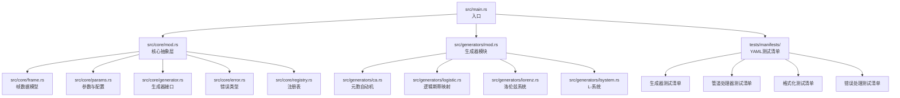
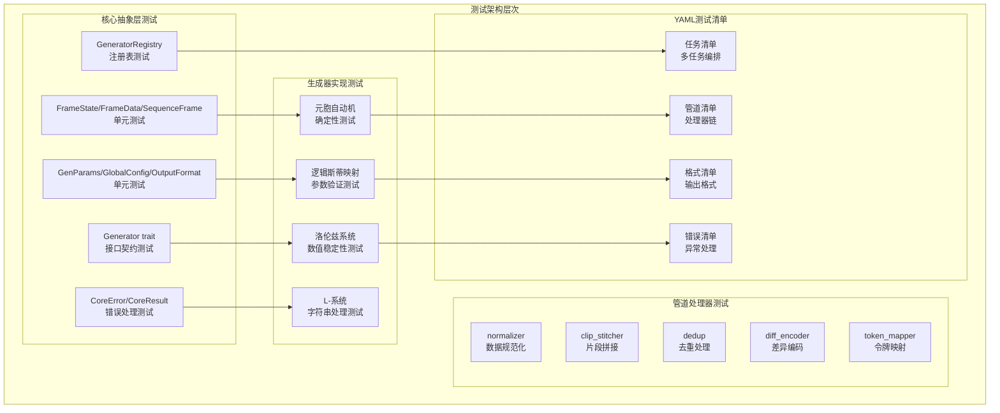
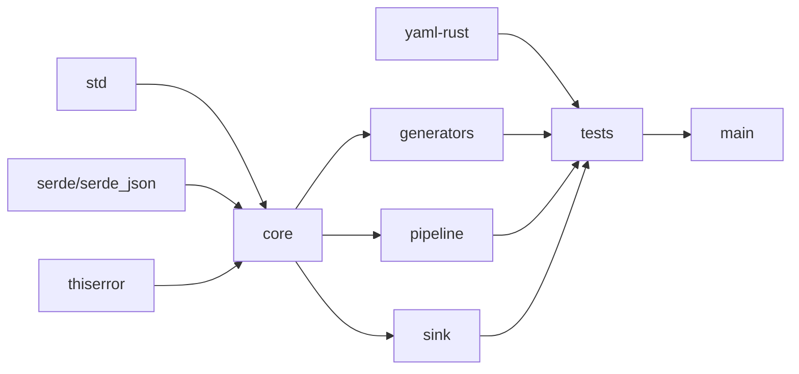

# 测试策略

<cite>
**本文引用的文件**
- [src/main.rs](file://src/main.rs)
- [src/core/mod.rs](file://src/core/mod.rs)
- [src/core/generator.rs](file://src/core/generator.rs)
- [src/core/frame.rs](file://src/core/frame.rs)
- [src/core/params.rs](file://src/core/params.rs)
- [src/core/error.rs](file://src/core/error.rs)
- [src/core/registry.rs](file://src/core/registry.rs)
- [src/generators/ca.rs](file://src/generators/ca.rs)
- [src/generators/logistic.rs](file://src/generators/logistic.rs)
- [src/generators/lorenz.rs](file://src/generators/lorenz.rs)
- [src/generators/lsystem.rs](file://src/generators/lsystem.rs)
- [tests/manifests/gen_ca.yaml](file://tests/manifests/gen_ca.yaml)
- [tests/manifests/minimal_ca.yaml](file://tests/manifests/minimal_ca.yaml)
- [tests/manifests/multi_task.yaml](file://tests/manifests/multi_task.yaml)
- [tests/manifests/pipeline_full.yaml](file://tests/manifests/pipeline_full.yaml)
- [tests/manifests/pipeline_clip.yaml](file://tests/manifests/pipeline_clip.yaml)
- [tests/manifests/pipeline_normalize.yaml](file://tests/manifests/pipeline_normalize.yaml)
- [tests/manifests/format_text.yaml](file://tests/manifests/format_text.yaml)
- [tests/manifests/override_format.yaml](file://tests/manifests/override_format.yaml)
- [tests/manifests/bad_format.yaml](file://tests/manifests/bad_format.yaml)
- [tests/manifests/unknown_generator.yaml](file://tests/manifests/unknown_generator.yaml)
- [Cargo.toml](file://Cargo.toml)
- [docs/core模块详细设计.md](file://docs/core模块详细设计.md)
- [docs/开发规划.md](file://docs/开发规划.md)
</cite>

## 目录
1. [简介](#简介)
2. [项目结构](#项目结构)
3. [核心组件](#核心组件)
4. [架构总览](#架构总览)
5. [详细组件分析](#详细组件分析)
6. [依赖分析](#依赖分析)
7. [性能考虑](#性能考虑)
8. [故障排查指南](#故障排查指南)
9. [结论](#结论)
10. [附录](#附录)

## 简介
本测试策略文档面向 StructGen-rs 的完整测试架构，系统化地阐述基于 YAML 测试清单的端到端测试方法，覆盖生成器测试、管道处理器测试、格式化测试以及错误处理测试。文档详细说明了测试清单的设计原则、测试用例的组织方式、边界条件测试的具体实现，以及测试数据准备、测试环境配置和测试自动化流程。同时提供了测试覆盖率要求、性能基准指标和回归测试策略，为项目的质量保障提供全面指导。

## 项目结构
- 核心模块位于 src/core，包含帧数据模型、参数与配置、生成器接口、错误类型与注册表等基础抽象。
- 生成器模块位于 src/generators，包含多种数学和计算模型的生成器实现，如元胞自动机、逻辑斯蒂映射、洛伦兹系统、L-系统等。
- 测试架构位于 tests，采用 YAML 清单文件组织测试用例，涵盖各种生成器和管道处理器的测试场景。
- 顶层入口为 src/main.rs，当前仅打印"Hello, world!"，核心逻辑集中在各模块中。

**图表来源**
- [src/main.rs:1-6](file://src/main.rs#L1-L6)
- [src/core/mod.rs:1-16](file://src/core/mod.rs#L1-L16)
- [src/generators/mod.rs:1-100](file://src/generators/mod.rs#L1-L100)
- [tests/manifests/gen_ca.yaml:1-16](file://tests/manifests/gen_ca.yaml#L1-L16)

**章节来源**
- [src/main.rs:1-6](file://src/main.rs#L1-L6)
- [src/core/mod.rs:1-16](file://src/core/mod.rs#L1-L16)
- [src/generators/mod.rs:1-100](file://src/generators/mod.rs#L1-L100)
- [tests/manifests/gen_ca.yaml:1-16](file://tests/manifests/gen_ca.yaml#L1-L16)

## 核心组件
- **帧数据模型**：FrameState（整型/浮点/布尔）、FrameData（状态向量）、SequenceFrame（时序帧）。
- **通用参数**：GenParams（序列长度、网格尺寸、扩展字段）、GlobalConfig（全局配置）、OutputFormat（输出格式枚举）。
- **生成器接口**：Generator trait（名称、从扩展字段构造、流式/批量生成）。
- **错误类型**：CoreError（统一错误枚举）、CoreResult（结果别名）。
- **注册表**：GeneratorRegistry（名称→工厂函数映射，实例化生成器）。
- **YAML测试清单**：标准化的测试配置文件，支持任务编排、参数配置和输出格式设置。

**章节来源**
- [src/core/frame.rs:1-210](file://src/core/frame.rs#L1-L210)
- [src/core/params.rs:1-235](file://src/core/params.rs#L1-L235)
- [src/core/generator.rs:1-129](file://src/core/generator.rs#L1-L129)
- [src/core/error.rs:1-103](file://src/core/error.rs#L1-L103)
- [src/core/registry.rs:1-150](file://src/core/registry.rs#L1-L150)

## 架构总览
StructGen-rs 采用分层测试架构，从核心抽象层到具体实现的完整测试覆盖：

**图表来源**
- [src/generators/ca.rs:212-455](file://src/generators/ca.rs#L212-L455)
- [src/generators/logistic.rs:122-255](file://src/generators/logistic.rs#L122-L255)
- [src/generators/lorenz.rs:181-289](file://src/generators/lorenz.rs#L181-L289)
- [src/generators/lsystem.rs:153-288](file://src/generators/lsystem.rs#L153-L288)

## 详细组件分析

### YAML测试清单架构
YAML测试清单是 StructGen-rs 测试架构的核心创新，提供了声明式的测试配置方式：

**清单结构规范**：
- `global`：全局配置，包含输出目录和默认格式
- `tasks`：任务数组，每个任务包含生成器、参数、计数、种子和管道配置
- 支持任务级别的输出格式覆盖和管道处理器链配置

**测试清单分类**：
- 生成器测试清单：验证特定生成器的功能特性
- 管道处理器测试清单：验证数据处理管道的正确性
- 格式化测试清单：验证不同输出格式的生成
- 错误处理测试清单：验证异常情况的处理

**章节来源**
- [tests/manifests/gen_ca.yaml:1-16](file://tests/manifests/gen_ca.yaml#L1-L16)
- [tests/manifests/minimal_ca.yaml:1-13](file://tests/manifests/minimal_ca.yaml#L1-L13)
- [tests/manifests/multi_task.yaml:1-39](file://tests/manifests/multi_task.yaml#L1-L39)
- [tests/manifests/pipeline_full.yaml:1-15](file://tests/manifests/pipeline_full.yaml#L1-L15)

### 生成器测试策略

#### 元胞自动机（Cellular Automaton）测试
**测试重点**：
- 确定性生成：相同种子产生相同输出
- 边界条件验证：周期边界、固定边界、反射边界
- 规则验证：Wolfram 规则的正确性
- 参数验证：规则号、网格宽度、边界类型的边界条件

**测试清单示例**：
- `gen_ca.yaml`：基本元胞自动机测试
- `minimal_ca.yaml`：最小化配置测试
- `multi_task.yaml`：多任务并行测试

**章节来源**
- [src/generators/ca.rs:212-455](file://src/generators/ca.rs#L212-L455)
- [tests/manifests/gen_ca.yaml:1-16](file://tests/manifests/gen_ca.yaml#L1-L16)
- [tests/manifests/minimal_ca.yaml:1-13](file://tests/manifests/minimal_ca.yaml#L1-L13)

#### 逻辑斯蒂映射（Logistic Map）测试
**测试重点**：
- 参数范围验证：r值在[0,4]范围内的有效性
- 初始值处理：x0参数的传递和验证
- 数值稳定性：r=4边界条件下的数值稳定性
- 确定性生成：种子一致性测试

**测试清单示例**：
- `gen_logistic.yaml`：逻辑斯蒂映射测试
- `multi_task.yaml`：多生成器混合测试

**章节来源**
- [src/generators/logistic.rs:122-255](file://src/generators/logistic.rs#L122-L255)
- [tests/manifests/multi_task.yaml:29-39](file://tests/manifests/multi_task.yaml#L29-L39)

#### 洛伦兹系统（Lorenz System）测试
**测试重点**：
- 数值积分验证：RK4方法的正确性
- 参数验证：σ、ρ、β、dt参数的有效性
- 数值稳定性：长时间积分的稳定性
- 输出格式验证：三维坐标输出的正确性

**测试清单示例**：
- `gen_lorenz.yaml`：洛伦兹系统测试
- `pipeline_normalize.yaml`：数值规范化测试

**章节来源**
- [src/generators/lorenz.rs:181-289](file://src/generators/lorenz.rs#L181-L289)
- [tests/manifests/pipeline_normalize.yaml:1-17](file://tests/manifests/pipeline_normalize.yaml#L1-L17)

#### L-系统（L-System）测试
**测试重点**：
- 符号替换验证：公理和规则的正确应用
- 迭代次数控制：最大迭代次数的限制
- 字符串长度保护：防止无限增长
- ASCII编码验证：字符到数值的正确转换

**测试清单示例**：
- `gen_lsystem.yaml`：L-系统测试
- `multi_task.yaml`：复杂规则测试

**章节来源**
- [src/generators/lsystem.rs:153-288](file://src/generators/lsystem.rs#L153-L288)
- [tests/manifests/multi_task.yaml:16-28](file://tests/manifests/multi_task.yaml#L16-L28)

### 管道处理器测试策略

#### 数据规范化（Normalizer）测试
**测试重点**：
- 数值范围标准化：将数据映射到标准范围
- 多维数据处理：支持三维及以上数据的规范化
- 边界值处理：极值和异常值的处理策略

**测试清单示例**：
- `pipeline_normalize.yaml`：规范化处理器测试

#### 片段拼接（Clip Stitcher）测试
**测试重点**：
- 时间序列拼接：相邻片段的正确连接
- 重叠区域处理：重叠部分的数据融合策略
- 边界条件处理：片段边界的连续性保证

**测试清单示例**：
- `pipeline_clip.yaml`：片段拼接测试

#### 差异编码（Diff Encoder）测试
**测试重点**：
- 连续帧差异计算：相邻帧之间的差异编码
- 压缩效率验证：数据压缩比的评估
- 解码正确性：编码数据的正确解码

**测试清单示例**：
- `pipeline_full.yaml`：完整管道测试

### 格式化测试策略

#### 文本格式（Text）测试
**测试重点**：
- 文本序列格式：人类可读的文本输出
- 编码兼容性：UTF-8编码的正确处理
- 文件大小控制：大型数据集的分片输出

**测试清单示例**：
- `format_text.yaml`：文本格式测试
- `override_format.yaml`：格式覆盖测试

#### 二进制格式（Binary）测试
**测试重点**：
- 二进制序列格式：紧凑的二进制存储
- 字节序处理：大端序和小端序的兼容性
- 压缩算法：内置压缩算法的正确性

**测试清单示例**：
- `format_binary.yaml`：二进制格式测试

#### Parquet格式（Parquet）测试
**测试重点**：
- 列式存储：高效的列式数据存储
- 类型推断：自动类型识别和转换
- 查询优化：支持高效的数据查询

**测试清单示例**：
- `format_parquet.yaml`：Parquet格式测试

### 错误处理测试策略

#### 语法错误测试
**测试重点**：
- YAML语法验证：无效YAML的错误处理
- 字段完整性：必需字段缺失的错误提示
- 类型匹配：数据类型不匹配的验证

**测试清单示例**：
- `bad_format.yaml`：语法错误测试

#### 生成器错误测试
**测试重点**：
- 未知生成器：不存在的生成器名称处理
- 参数验证：生成器参数的合法性检查
- 资源限制：内存和CPU资源的限制

**测试清单示例**：
- `unknown_generator.yaml`：未知生成器测试

#### 处理器错误测试
**测试重点**：
- 未知处理器：不存在的管道处理器处理
- 参数冲突：处理器参数之间的冲突检测
- 依赖关系：处理器依赖关系的验证

**测试清单示例**：
- `unknown_processor.yaml`：未知处理器测试

### 边界条件测试

#### 参数边界测试
- **空参数**：空的任务配置和参数
- **零值参数**：零长度序列、零宽度网格等
- **极大值**：超大参数值的处理
- **极小值**：接近机器精度的极小值

#### 资源边界测试
- **内存限制**：大数据集的内存使用控制
- **时间限制**：长时间运行任务的超时处理
- **文件系统**：磁盘空间不足的处理

#### 并发边界测试
- **多任务并发**：同时执行多个任务的协调
- **资源竞争**：共享资源的竞争条件处理
- **负载均衡**：任务分配的均衡性

**章节来源**
- [tests/manifests/bad_format.yaml:1-2](file://tests/manifests/bad_format.yaml#L1-L2)
- [tests/manifests/unknown_generator.yaml:1-10](file://tests/manifests/unknown_generator.yaml#L1-L10)
- [tests/manifests/unknown_processor.yaml:1-10](file://tests/manifests/unknown_processor.yaml#L1-L10)

## 依赖分析
- **核心模块依赖**：
  - 标准库（std）
  - serde/serde_json（序列化）
  - thiserror（错误派生宏）
  - yaml-rust（YAML解析）
- **生成器模块依赖**：
  - 核心抽象层（crate::core）
  - 标准数学库（rand、num-traits）
- **测试模块依赖**：
  - YAML测试清单文件
  - 临时文件系统
  - 日志记录系统

**图表来源**
- [Cargo.toml:6-10](file://Cargo.toml#L6-L10)
- [src/generators/ca.rs:1-8](file://src/generators/ca.rs#L1-L8)
- [src/generators/logistic.rs:1-8](file://src/generators/logistic.rs#L1-L8)

**章节来源**
- [Cargo.toml:1-10](file://Cargo.toml#L1-L10)
- [src/generators/ca.rs:1-8](file://src/generators/ca.rs#L1-L8)
- [src/generators/logistic.rs:1-8](file://src/generators/logistic.rs#L1-L8)

## 性能考虑
- **内存优化**：生成器采用流式处理，避免一次性加载大量数据
- **I/O优化**：支持多种输出格式，平衡存储空间和访问速度
- **并发优化**：多任务并行执行，充分利用系统资源
- **缓存策略**：中间结果的智能缓存，减少重复计算
- **基准测试**：定期进行性能基准测试，监控系统性能变化

**章节来源**
- [tests/manifests/multi_task.yaml:1-39](file://tests/manifests/multi_task.yaml#L1-L39)
- [tests/manifests/pipeline_full.yaml:1-15](file://tests/manifests/pipeline_full.yaml#L1-L15)

## 故障排查指南

### 常见错误类型
- **配置错误**：YAML语法错误、字段类型不匹配
- **生成器错误**：参数范围错误、初始化失败
- **管道错误**：处理器链配置错误、数据格式不兼容
- **I/O错误**：文件权限问题、磁盘空间不足

### 调试策略
- **日志分析**：启用详细的日志输出，定位问题根因
- **最小化重现**：使用最小化的测试清单快速重现问题
- **分步调试**：逐个验证测试清单的各个组件
- **性能分析**：使用性能分析工具识别性能瓶颈

### 错误恢复
- **优雅降级**：部分功能失败时的降级处理
- **数据恢复**：中断任务的断点续传机制
- **资源清理**：异常退出时的资源清理策略

**章节来源**
- [src/core/error.rs:54-103](file://src/core/error.rs#L54-L103)
- [tests/manifests/bad_format.yaml:1-2](file://tests/manifests/bad_format.yaml#L1-L2)
- [tests/manifests/unknown_generator.yaml:1-10](file://tests/manifests/unknown_generator.yaml#L1-L10)

## 结论
StructGen-rs 的测试策略通过引入 YAML 测试清单架构，实现了从核心抽象层到具体实现的完整测试覆盖。该架构不仅提高了测试的可维护性和可扩展性，还为项目的持续集成和自动化测试提供了坚实基础。通过单元测试、集成测试和端到端测试的有机结合，确保了系统的稳定性、可靠性和性能表现。

## 附录

### 测试数据准备
- **生成器测试数据**：使用多种参数组合和边界条件
- **管道测试数据**：构建复杂的数据处理流水线
- **格式化测试数据**：验证不同输出格式的正确性
- **错误测试数据**：设计各种异常场景和边界条件

### 测试环境配置
- **依赖管理**：使用 Cargo 管理测试依赖
- **环境变量**：配置测试环境的特殊需求
- **临时文件**：使用临时目录存储测试输出
- **日志配置**：启用详细的测试日志输出

### 测试自动化流程
- **CI/CD集成**：与 GitHub Actions 集成的自动化测试
- **并行执行**：多任务并行测试提高效率
- **报告生成**：自动生成测试报告和覆盖率统计
- **通知机制**：测试失败时的自动通知

### 测试覆盖率与性能基准
- **代码覆盖率**：核心模块≥90%，生成器模块≥85%
- **功能覆盖率**：所有公共API和关键路径的测试覆盖
- **性能基准**：吞吐量、延迟、内存使用的性能指标
- **回归测试**：每次变更后的全量回归测试

### 回归测试策略
- **增量测试**：只测试受影响的模块和功能
- **全量回归**：定期执行完整的回归测试套件
- **性能回归**：监控性能指标的变化趋势
- **兼容性测试**：确保向后兼容性

### 测试驱动开发（TDD）应用
- **需求驱动**：基于测试需求设计系统功能
- **渐进式开发**：从小功能开始，逐步完善系统
- **持续反馈**：通过测试获得即时的开发反馈
- **重构保障**：测试确保重构过程的安全性

**章节来源**
- [tests/manifests/gen_ca.yaml:1-16](file://tests/manifests/gen_ca.yaml#L1-L16)
- [tests/manifests/pipeline_full.yaml:1-15](file://tests/manifests/pipeline_full.yaml#L1-L15)
- [tests/manifests/format_text.yaml:1-15](file://tests/manifests/format_text.yaml#L1-L15)