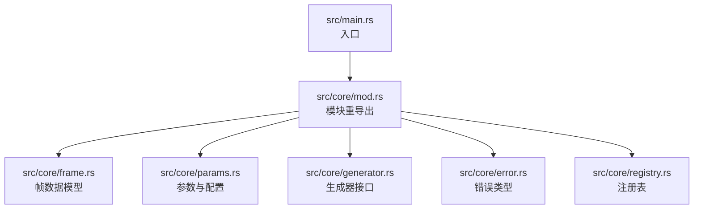
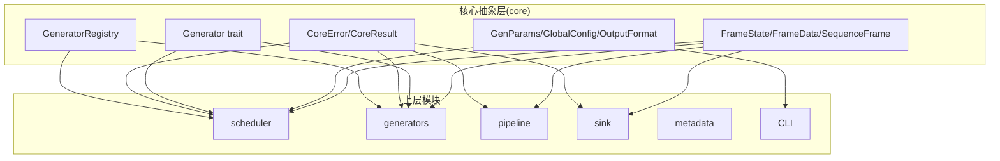
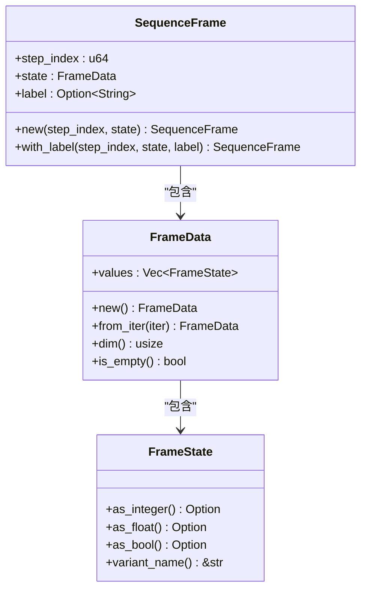
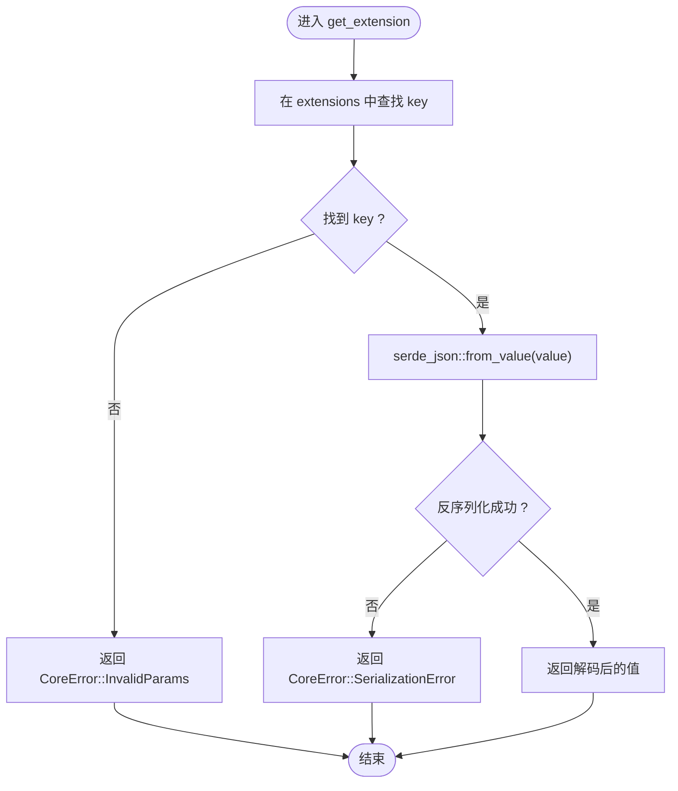
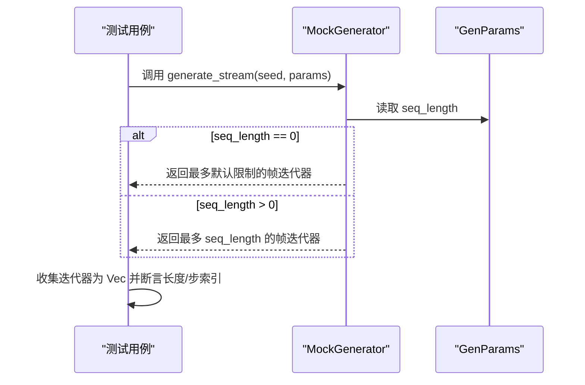
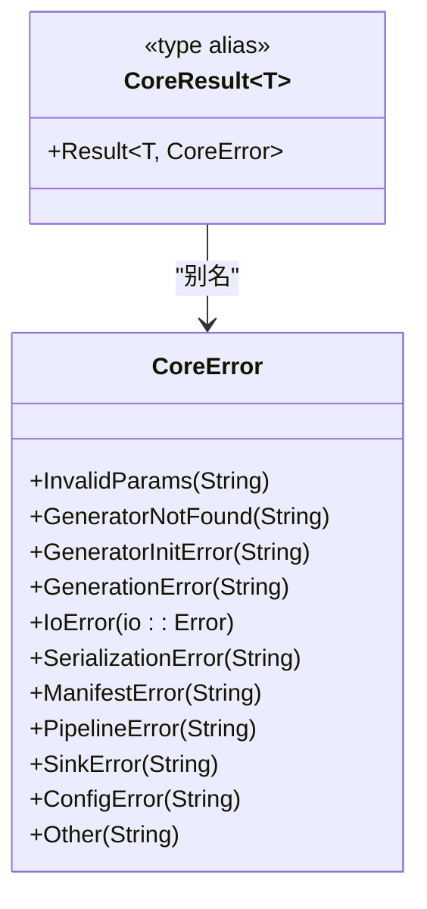
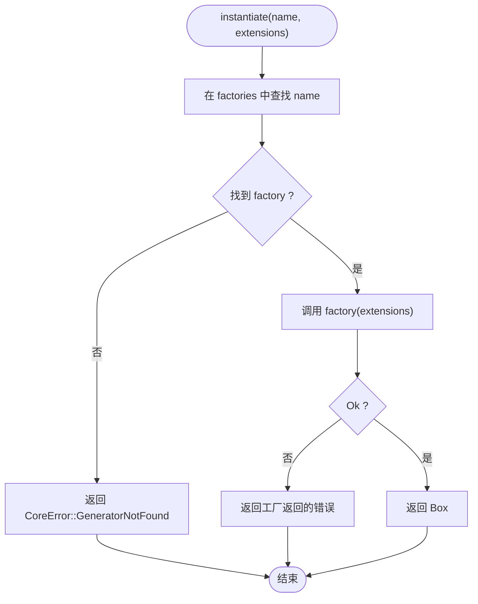
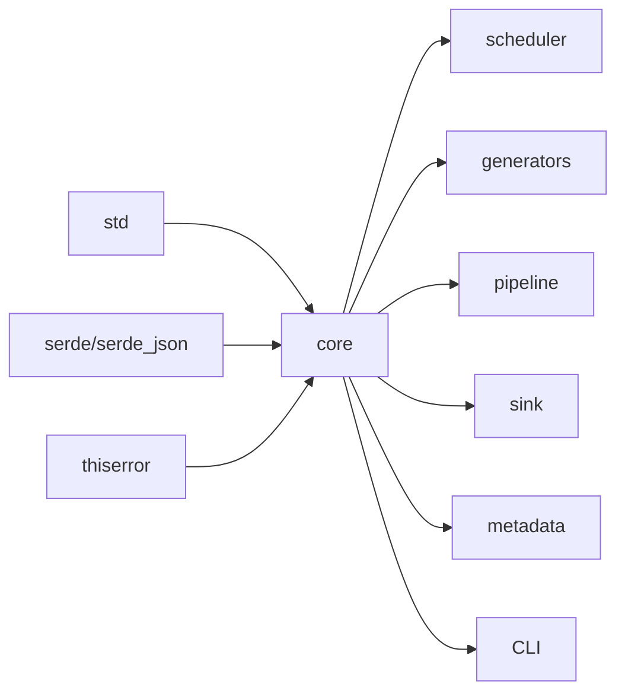

# 测试策略

<cite>
**本文引用的文件**
- [src/main.rs](file://src/main.rs)
- [src/core/mod.rs](file://src/core/mod.rs)
- [src/core/generator.rs](file://src/core/generator.rs)
- [src/core/frame.rs](file://src/core/frame.rs)
- [src/core/params.rs](file://src/core/params.rs)
- [src/core/error.rs](file://src/core/error.rs)
- [src/core/registry.rs](file://src/core/registry.rs)
- [Cargo.toml](file://Cargo.toml)
- [docs/core模块详细设计.md](file://docs/core模块详细设计.md)
- [docs/开发规划.md](file://docs/开发规划.md)
</cite>

## 目录
1. [简介](#简介)
2. [项目结构](#项目结构)
3. [核心组件](#核心组件)
4. [架构总览](#架构总览)
5. [详细组件分析](#详细组件分析)
6. [依赖分析](#依赖分析)
7. [性能考虑](#性能考虑)
8. [故障排查指南](#故障排查指南)
9. [结论](#结论)
10. [附录](#附录)

## 简介
本测试策略文档面向 StructGen-rs 的核心抽象层（core 模块），系统化地阐述单元测试、集成测试与性能基准测试的实施方法，覆盖核心模块测试、接口契约测试与边界条件测试，并提供测试数据准备、测试环境配置、测试自动化流程、覆盖率与性能基准指标、回归测试策略及 TDD 实践建议。文档以仓库现有代码与设计文档为基础，结合实际可落地的测试方案，帮助团队建立高质量、可维护的测试体系。

## 项目结构
- 核心模块位于 src/core，包含帧数据模型、参数与配置、生成器接口、错误类型与注册表等。
- 顶层入口为 src/main.rs，当前仅打印“Hello, world!”，核心逻辑集中在 core 模块。
- Cargo.toml 定义了 core 模块所需的依赖（serde、serde_json、thiserror）。

图表来源
- [src/main.rs:1-6](file://src/main.rs#L1-L6)
- [src/core/mod.rs:1-16](file://src/core/mod.rs#L1-L16)

章节来源
- [src/main.rs:1-6](file://src/main.rs#L1-L6)
- [src/core/mod.rs:1-16](file://src/core/mod.rs#L1-L16)
- [Cargo.toml:1-10](file://Cargo.toml#L1-L10)

## 核心组件
- 帧数据模型：FrameState（整型/浮点/布尔）、FrameData（状态向量）、SequenceFrame（时序帧）。
- 通用参数：GenParams（序列长度、网格尺寸、扩展字段）、GlobalConfig（全局配置）、OutputFormat（输出格式枚举）。
- 生成器接口：Generator trait（名称、从扩展字段构造、流式/批量生成）。
- 错误类型：CoreError（统一错误枚举）、CoreResult（结果别名）。
- 注册表：GeneratorRegistry（名称→工厂函数映射，实例化生成器）。

章节来源
- [src/core/frame.rs:1-210](file://src/core/frame.rs#L1-L210)
- [src/core/params.rs:1-235](file://src/core/params.rs#L1-L235)
- [src/core/generator.rs:1-129](file://src/core/generator.rs#L1-L129)
- [src/core/error.rs:1-103](file://src/core/error.rs#L1-L103)
- [src/core/registry.rs:1-150](file://src/core/registry.rs#L1-L150)

## 架构总览
core 模块作为系统最底层，向上游提供统一的数据结构、接口契约与错误类型，不依赖任何业务模块，形成自底向上的单向依赖。其职责包括：
- 定义帧数据容器与序列化能力。
- 定义通用参数载体与扩展字段协议。
- 定义生成器接口与注册表机制。
- 定义统一错误类型与传播语义。

图表来源
- [docs/core模块详细设计.md:420-454](file://docs/core模块详细设计.md#L420-L454)
- [docs/开发规划.md:9-50](file://docs/开发规划.md#L9-L50)

## 详细组件分析

### 帧数据模型（FrameState/FrameData/SequenceFrame）
- 目标：验证帧状态值的类型转换、帧数据的维度与空帧判断、时序帧的构造与序列化。
- 关键测试点：
  - FrameState 的 as_integer/as_float/as_bool 转换行为与 variant_name。
  - FrameData 的构造、dim/is_empty/default。
  - SequenceFrame 的 new/with_label 与序列化往返。
- 边界条件：
  - 空帧、零值布尔转换为 false。
  - 浮点→整数不自动转换，防止精度损失。
- 自动化建议：
  - 使用参数化测试覆盖多种状态组合。
  - 对序列化进行 round-trip 测试，确保 serde 正确性。

图表来源
- [src/core/frame.rs:3-118](file://src/core/frame.rs#L3-L118)

章节来源
- [src/core/frame.rs:120-210](file://src/core/frame.rs#L120-L210)
- [docs/core模块详细设计.md:56-131](file://docs/core模块详细设计.md#L56-L131)

### 通用参数与配置（GenParams/GlobalConfig/OutputFormat/GridSize）
- 目标：验证参数载体的构造、扩展字段的序列化/反序列化、全局配置的默认值与反序列化。
- 关键测试点：
  - GenParams.simple 构造与默认字段。
  - set_extension/get_extension 的类型安全往返。
  - GridSize 的序列化与相等性。
  - GlobalConfig 的默认值与自定义 JSON 反序列化。
- 边界条件：
  - 不存在的扩展键返回错误。
  - 类型不匹配时的反序列化错误。
- 自动化建议：
  - 使用 JSON fixture 进行反序列化测试。
  - 对扩展字段进行多类型（整数、浮点、布尔、对象）覆盖。

图表来源
- [src/core/params.rs:99-122](file://src/core/params.rs#L99-L122)

章节来源
- [src/core/params.rs:125-235](file://src/core/params.rs#L125-L235)
- [docs/core模块详细设计.md:133-198](file://docs/core模块详细设计.md#L133-L198)

### 生成器接口（Generator trait）
- 目标：验证生成器接口契约、流式/批量生成行为、Mock 生成器的实现正确性。
- 关键测试点：
  - name 返回固定名称。
  - from_extensions 构造成功。
  - generate_stream 在指定 seq_length 下产出正确数量帧；seq_length=0 时的默认限制。
  - generate_batch 的批量收集行为。
- 边界条件：
  - 无限流的消费控制（由调用方控制）。
- 自动化建议：
  - 使用 Mock 生成器模拟不同状态维度与长度。
  - 对流式迭代器进行惰性消费验证。

图表来源
- [src/core/generator.rs:76-95](file://src/core/generator.rs#L76-L95)
- [src/core/generator.rs:104-127](file://src/core/generator.rs#L104-L127)

章节来源
- [src/core/generator.rs:58-129](file://src/core/generator.rs#L58-L129)
- [docs/core模块详细设计.md:200-253](file://docs/core模块详细设计.md#L200-L253)

### 错误类型（CoreError/CoreResult）
- 目标：验证错误类型定义、错误消息显示、IO 错误的自动转换与传播。
- 关键测试点：
  - 各错误变体的消息格式。
  - std::io::Error 自动转换为 CoreError::IoError。
  - 错误在调用链中的传播与捕获。
- 边界条件：
  - 其他错误类型转换为 CoreError::Other。
- 自动化建议：
  - 使用错误断言匹配具体变体。
  - 对 IO 场景进行模拟与验证。

图表来源
- [src/core/error.rs:4-52](file://src/core/error.rs#L4-L52)

章节来源
- [src/core/error.rs:54-103](file://src/core/error.rs#L54-L103)
- [docs/core模块详细设计.md:305-360](file://docs/core模块详细设计.md#L305-L360)

### 注册表（GeneratorRegistry）
- 目标：验证注册表的注册、查找、重复注册 panic、名称列表与包含判断。
- 关键测试点：
  - register 后 instantiate 成功并返回正确名称。
  - 未注册名称返回 CoreError::GeneratorNotFound。
  - 重复注册 panic。
  - list_names 与 contains 的正确性。
- 边界条件：
  - 空注册表的默认行为。
- 自动化建议：
  - 使用 Mock 生成器工厂进行注册与实例化测试。
  - 对 panic 场景使用 should_panic 断言。

图表来源
- [src/core/registry.rs:43-53](file://src/core/registry.rs#L43-L53)

章节来源
- [src/core/registry.rs:66-150](file://src/core/registry.rs#L66-L150)
- [docs/core模块详细设计.md:260-303](file://docs/core模块详细设计.md#L260-L303)

## 依赖分析
- core 模块依赖：
  - 标准库（std）
  - serde/serde_json（序列化）
  - thiserror（错误派生宏）
- 上层模块对 core 的使用：
  - scheduler/generators/pipeline/sink/metadata/CLI 通过 core 类型进行协作。

图表来源
- [Cargo.toml:6-10](file://Cargo.toml#L6-L10)
- [docs/core模块详细设计.md:437-442](file://docs/core模块详细设计.md#L437-L442)
- [docs/开发规划.md:54-62](file://docs/开发规划.md#L54-L62)

章节来源
- [Cargo.toml:1-10](file://Cargo.toml#L1-L10)
- [docs/core模块详细设计.md:437-442](file://docs/core模块详细设计.md#L437-L442)
- [docs/开发规划.md:54-62](file://docs/开发规划.md#L54-L62)

## 性能考虑
- FrameState 内存布局为 16 字节，对百万级帧序列内存占用可控。
- 生成器主推流式迭代器，惰性求值降低内存峰值。
- 注册表查找为 O(1)，扩展字段解析采用惰性策略，避免无效解析开销。
- 建议在集成测试中加入基准测试，测量不同 seq_length 与状态维度下的吞吐与内存。

章节来源
- [docs/core模块详细设计.md:477-483](file://docs/core模块详细设计.md#L477-L483)

## 故障排查指南
- 常见错误与定位：
  - 参数错误（InvalidParams）：检查 GenParams 的扩展字段类型与键是否存在。
  - 生成器未找到（GeneratorNotFound）：确认注册表中已注册对应名称。
  - 序列化错误（SerializationError）：检查 JSON 结构与类型匹配。
  - IO 错误（IoError）：检查文件路径、权限与磁盘空间。
- 建议的调试步骤：
  - 使用最小化测试用例复现问题。
  - 对关键路径增加日志（在测试中使用 env_logger）。
  - 对序列化/反序列化进行 round-trip 验证。

章节来源
- [src/core/error.rs:54-103](file://src/core/error.rs#L54-L103)
- [src/core/params.rs:125-235](file://src/core/params.rs#L125-L235)
- [src/core/registry.rs:66-150](file://src/core/registry.rs#L66-L150)

## 结论
本测试策略围绕 core 模块的关键类型与接口，建立了覆盖单元测试、接口契约测试与边界条件测试的完整方案。通过参数化测试、序列化往返、Mock 生成器与注册表行为验证，确保核心抽象层的稳定性与可维护性。建议在后续阶段（generators、pipeline、scheduler、metadata、CLI）延续该策略，逐步扩展到端到端与性能基准测试，形成完整的质量保障体系。

## 附录

### 测试数据准备
- 帧数据：使用多种 FrameState 组合（整数、浮点、布尔）构造 FrameData。
- 参数数据：使用 JSON fixture 构造 GenParams，覆盖扩展字段的多类型场景。
- 注册表数据：使用 Mock 生成器工厂注册多个名称，验证列表与包含判断。

章节来源
- [src/core/frame.rs:120-210](file://src/core/frame.rs#L120-L210)
- [src/core/params.rs:125-235](file://src/core/params.rs#L125-L235)
- [src/core/registry.rs:66-150](file://src/core/registry.rs#L66-L150)

### 测试环境配置
- 依赖：serde、serde_json、thiserror（已在 Cargo.toml 声明）。
- 日志：在测试中使用 env_logger 初始化日志，便于调试。
- 临时文件：在需要 I/O 的场景使用 tempfile 创建临时目录与文件。

章节来源
- [Cargo.toml:6-10](file://Cargo.toml#L6-L10)

### 测试自动化流程
- 单元测试：每个模块的 #[cfg(test)] 测试块，使用 cargo test 运行。
- 集成测试：在 core 模块内使用 Mock 生成器与注册表，验证类型通路。
- 回归测试：每次修改后运行全量测试，确保不破坏现有契约。
- 性能基准：在集成测试中添加基准测试，测量不同参数下的吞吐与内存。

章节来源
- [src/core/generator.rs:58-129](file://src/core/generator.rs#L58-L129)
- [src/core/registry.rs:66-150](file://src/core/registry.rs#L66-L150)
- [docs/开发规划.md:357](file://docs/开发规划.md#L357)

### 测试覆盖率与性能基准指标
- 覆盖率目标：core 模块 ≥ 90%，scheduler 模块 ≥ 90%，generators 模块根据确定性测试覆盖度评估。
- 性能指标：帧生成吞吐（帧/秒）、内存峰值（MB）、序列化往返延迟（ms）。
- 基准测试建议：针对不同 seq_length、状态维度与输出格式进行基准对比。

章节来源
- [docs/开发规划.md:357](file://docs/开发规划.md#L357)
- [docs/core模块详细设计.md:477-483](file://docs/core模块详细设计.md#L477-L483)

### 回归测试策略
- 每次提交后运行全量测试，确保核心契约不变。
- 对扩展字段协议与序列化行为进行回归验证。
- 对注册表行为（重复注册 panic、名称查找）进行回归测试。

章节来源
- [src/core/params.rs:125-235](file://src/core/params.rs#L125-L235)
- [src/core/registry.rs:66-150](file://src/core/registry.rs#L66-L150)

### 测试驱动开发（TDD）应用与效果评估
- 应用建议：
  - 先编写最小化测试（如 Mock 生成器的 name/从扩展字段构造/流式生成），再实现核心逻辑。
  - 以接口契约为驱动，先定义 Generator trait 的行为，再实现具体生成器。
  - 对错误类型与注册表行为进行契约测试，确保上层模块依赖稳定。
- 效果评估：
  - 通过单元测试与契约测试，减少上层模块的耦合与不确定性。
  - 提升核心抽象层的可演进性与可维护性。
  - 为后续模块（generators、pipeline、scheduler、metadata、CLI）提供稳定的基石。

章节来源
- [docs/开发规划.md:353-357](file://docs/development_planning.md#L353-L357)
- [docs/core模块详细设计.md:484-531](file://docs/core模块详细设计.md#L484-L531)