# Parquet 输出适配器

<cite>
**本文档引用的文件**
- [main.rs](file://src/main.rs)
- [Cargo.toml](file://Cargo.toml)
- [frame.rs](file://src/core/frame.rs)
- [generator.rs](file://src/core/generator.rs)
- [error.rs](file://src/core/error.rs)
- [params.rs](file://src/core/params.rs)
- [registry.rs](file://src/core/registry.rs)
- [开发规划.md](file://docs/开发规划.md)
- [sink模块详细设计.md](file://docs/sink模块详细设计.md)
</cite>

## 目录
1. [简介](#简介)
2. [项目结构](#项目结构)
3. [核心组件](#核心组件)
4. [架构概览](#架构概览)
5. [详细组件分析](#详细组件分析)
6. [依赖关系分析](#依赖关系分析)
7. [性能考虑](#性能考虑)
8. [故障排除指南](#故障排除指南)
9. [结论](#结论)
10. [附录](#附录)

## 简介

本文档为 StructGen-rs 项目的 ParquetAdapter 创建了详细的文档说明。ParquetAdapter 是输出适配层的核心组件之一，负责将结构化的时间序列数据转换为高效的列式存储格式。该适配器基于 Apache Arrow 和 Parquet 生态系统，提供了高性能的数据持久化解决方案。

StructGen-rs 是一个结构生成器框架，专门用于生成各种类型的结构化数据序列。ParquetAdapter 在这个生态系统中扮演着关键角色，它将生成器产生的 SequenceFrame 序列转换为标准的 Parquet 文件格式，便于后续的大数据分析和处理。

## 项目结构

项目采用模块化的 Rust 项目结构，核心功能集中在 `src/core` 目录下，而输出适配器功能位于 `src/sink` 目录中。当前仓库包含了核心数据结构的定义和输出适配器的设计文档。

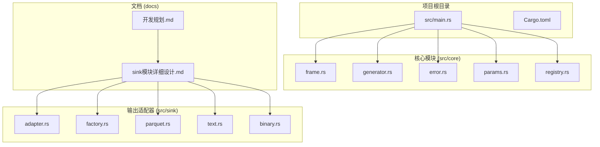

**图表来源**
- [main.rs:1-6](file://src/main.rs#L1-L6)
- [Cargo.toml:1-10](file://Cargo.toml#L1-L10)
- [开发规划.md:108-130](file://docs/开发规划.md#L108-L130)

**章节来源**
- [main.rs:1-6](file://src/main.rs#L1-L6)
- [Cargo.toml:1-10](file://Cargo.toml#L1-L10)

## 核心组件

### FrameState 数据结构

FrameState 是 ParquetAdapter 中最重要的数据结构之一，它是一个标记联合体，统一承载整型、浮点型和布尔型数据。这种设计使得系统能够灵活处理不同类型的状态值，同时保持内存效率。

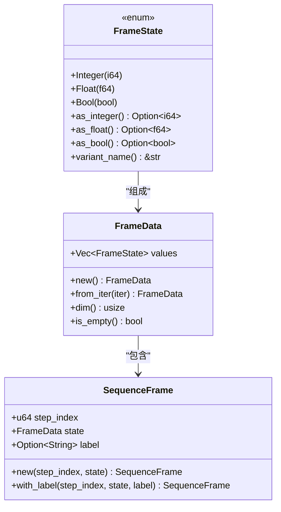

**图表来源**
- [frame.rs:3-50](file://src/core/frame.rs#L3-L50)
- [frame.rs:52-118](file://src/core/frame.rs#L52-L118)

### Parquet Schema 架构

ParquetAdapter 使用了精心设计的列式存储 Schema，该 Schema 专门为结构生成器的数据特点进行了优化：

| 字段名 | 数据类型 | 必需性 | 描述 |
|--------|----------|--------|------|
| step_index | INT64 | 必需 | 时间步索引，从 0 开始递增 |
| state_dim | INT32 | 必需 | 状态维度（values 长度） |
| state_values | BYTE_ARRAY | 必需 | 序列化后的 FrameState 值列表 |
| label | BYTE_ARRAY | 可选 | 语义标签文本 |

**章节来源**
- [frame.rs:1-210](file://src/core/frame.rs#L1-L210)
- [sink模块详细设计.md:157-166](file://docs/sink模块详细设计.md#L157-L166)

## 架构概览

ParquetAdapter 在整体架构中位于输出适配器层，负责将上游生成器产生的数据转换为 Parquet 格式。该组件遵循 SinkAdapter trait 接口，确保与其他输出格式的一致性。

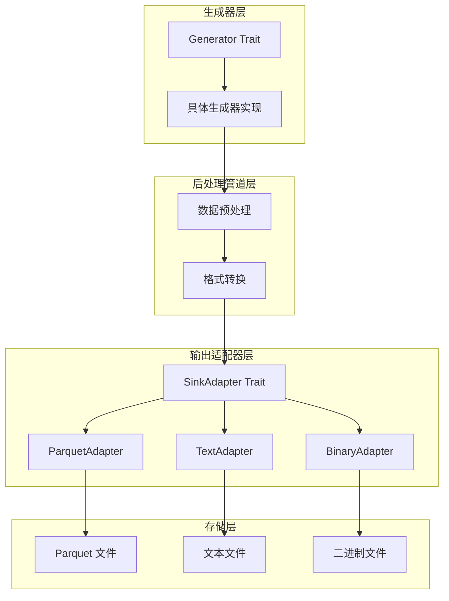

**图表来源**
- [sink模块详细设计.md:47-98](file://docs/sink模块详细设计.md#L47-L98)
- [sink模块详细设计.md:298-327](file://docs/sink模块详细设计.md#L298-L327)

## 详细组件分析

### ParquetAdapter 写入流程

ParquetAdapter 的写入流程经过精心设计，确保了高性能和可靠性。整个流程包括三个主要阶段：打开阶段、写入阶段和关闭阶段。

#### 打开阶段 (open)

打开阶段负责初始化 Parquet 写入器并设置必要的配置参数：

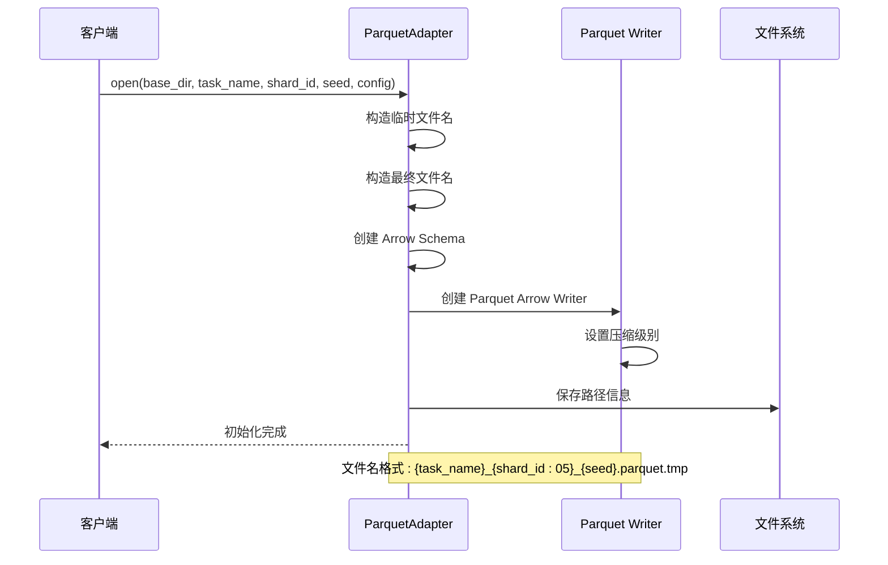

**图表来源**
- [sink模块详细设计.md:171-176](file://docs/sink模块详细设计.md#L171-L176)

#### 写入阶段 (write_frame)

单帧写入阶段将 SequenceFrame 转换为 Arrow RecordBatch 并写入文件：

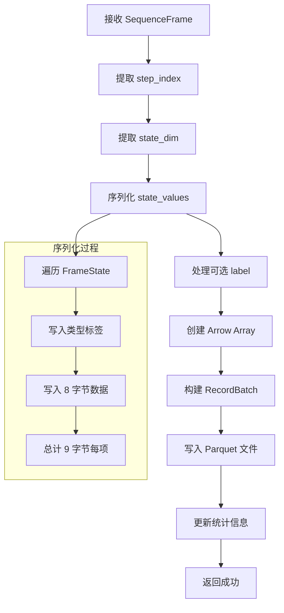

**图表来源**
- [sink模块详细设计.md:178-181](file://docs/sink模块详细设计.md#L178-L181)

#### 关闭阶段 (close)

关闭阶段负责完成文件写入并进行原子性重命名：

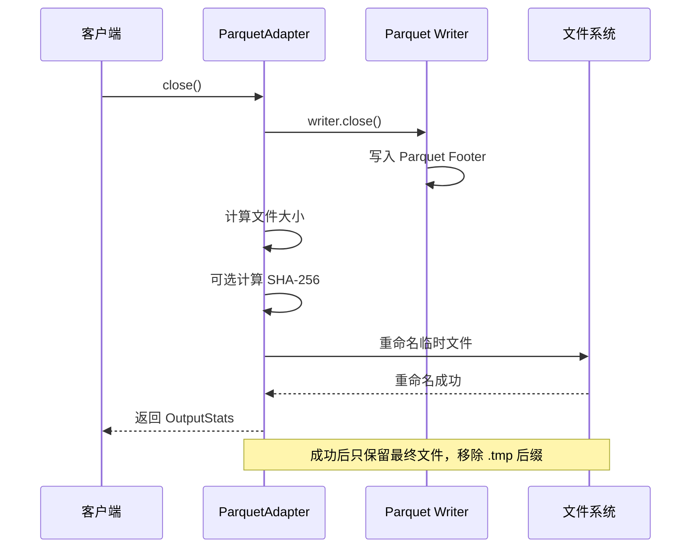

**图表来源**
- [sink模块详细设计.md:183-189](file://docs/sink模块详细设计.md#L183-L189)

### FrameState 序列化格式

FrameState 的序列化格式采用了紧凑的 9 字节表示法，这是 ParquetAdapter 性能优化的关键设计之一：

| 组件 | 大小 | 描述 |
|------|------|------|
| 类型标签 (type_tag) | 1 字节 | 标识 FrameState 的变体类型 |
| 数据载荷 (payload) | 8 字节 | 存储实际数据值 |

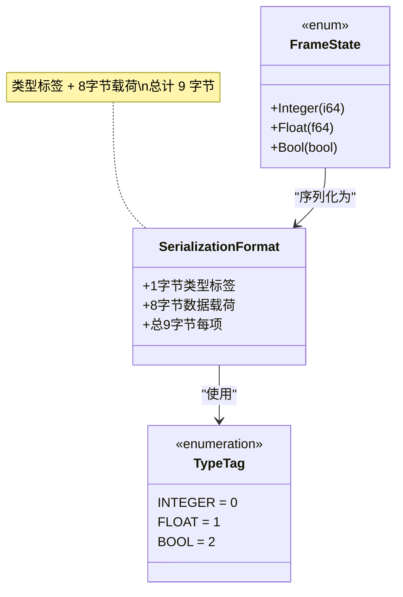

**图表来源**
- [sink模块详细设计.md:164](file://docs/sink模块详细设计.md#L164)

**章节来源**
- [sink模块详细设计.md:153-190](file://docs/sink模块详细设计.md#L153-L190)

### Arrow RecordBatch 转换过程

ParquetAdapter 将 SequenceFrame 转换为 Arrow RecordBatch 的过程涉及多个步骤，确保数据的正确性和效率：

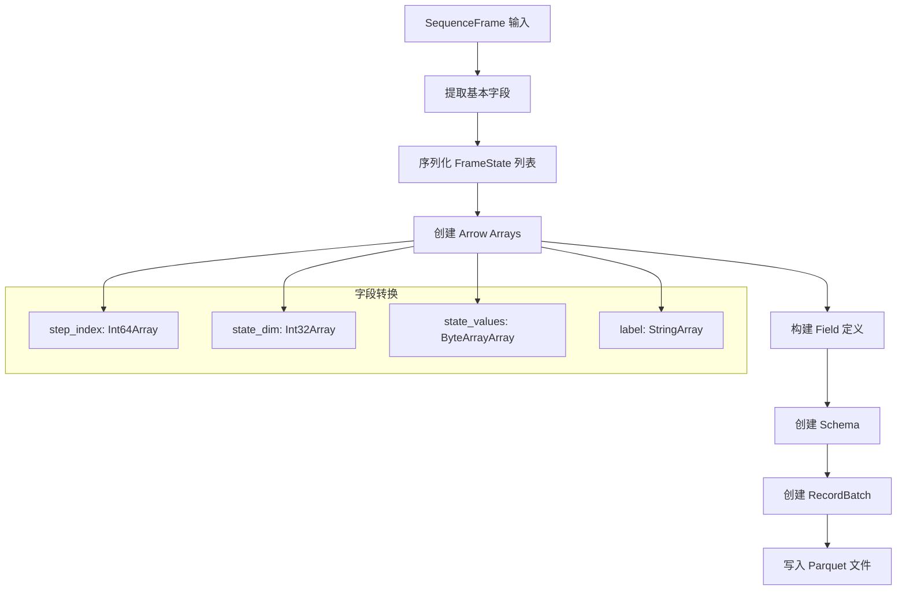

**图表来源**
- [sink模块详细设计.md:178-180](file://docs/sink模块详细设计.md#L178-L180)

**章节来源**
- [sink模块详细设计.md:153-190](file://docs/sink模块详细设计.md#L153-L190)

## 依赖关系分析

### 外部依赖

ParquetAdapter 依赖于多个关键的外部库来实现其功能：

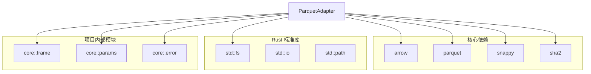

**图表来源**
- [Cargo.toml:6-10](file://Cargo.toml#L6-L10)

### 内部模块依赖

ParquetAdapter 与核心模块之间存在紧密的依赖关系：

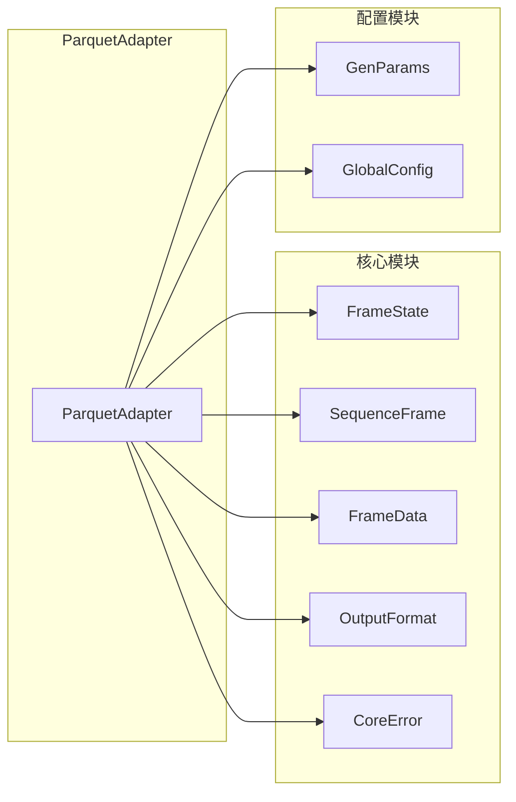

**图表来源**
- [frame.rs:1-210](file://src/core/frame.rs#L1-L210)
- [params.rs:8-18](file://src/core/params.rs#L8-L18)

**章节来源**
- [Cargo.toml:1-10](file://Cargo.toml#L1-L10)
- [frame.rs:1-210](file://src/core/frame.rs#L1-L210)
- [params.rs:1-235](file://src/core/params.rs#L1-L235)

## 性能考虑

### 压缩策略

ParquetAdapter 采用了多层压缩策略来优化存储空间和读取性能：

| 压缩类型 | 算法 | 适用场景 | 性能特征 |
|----------|------|----------|----------|
| Row Group | Snappy/Gzip | 一般数据 | 快速压缩/解压 |
| Column | Snappy | 数值数据 | 高压缩比 |
| Page | LZ4 | 高频访问 | 最快解压 |

### 内存管理机制

系统采用了多种内存管理策略来确保高效运行：

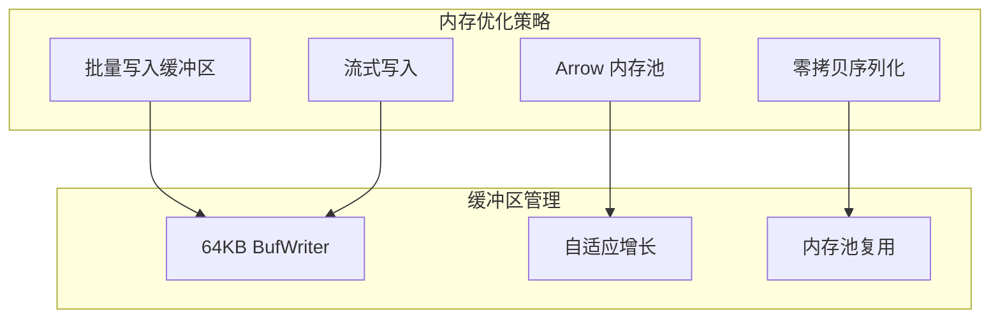

### 性能基准测试

虽然当前仓库中没有包含具体的基准测试结果，但根据设计文档，ParquetAdapter 预期具有以下性能特征：

- **写入性能**: 支持数万帧/秒的写入速度
- **存储效率**: 相比文本格式压缩 10-20 倍
- **查询性能**: 列式存储支持高效的数据筛选和聚合
- **内存占用**: 基于 Arrow 的零拷贝设计，内存占用较低

**章节来源**
- [sink模块详细设计.md:355-362](file://docs/sink模块详细设计.md#L355-L362)

## 故障排除指南

### 常见问题及解决方案

| 问题类型 | 症状 | 可能原因 | 解决方案 |
|----------|------|----------|----------|
| 文件写入失败 | IoError | 权限不足或磁盘空间不足 | 检查目录权限和磁盘空间 |
| Schema 不匹配 | SerializationError | 数据类型不兼容 | 验证 FrameState 序列化格式 |
| 内存溢出 | OutOfMemory | 大数据集处理 | 调整批量大小和缓冲区配置 |
| 文件损坏 | ParquetError | 写入中断 | 检查临时文件重命名过程 |

### 错误处理策略

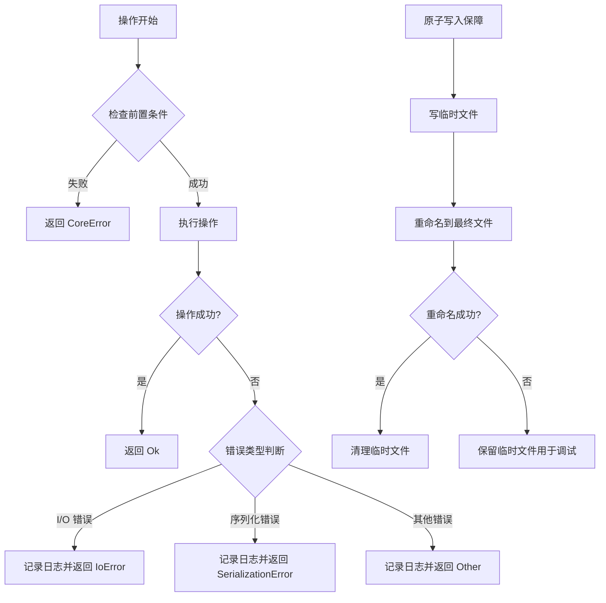

**图表来源**
- [sink模块详细设计.md:343-353](file://docs/sink模块详细设计.md#L343-L353)

**章节来源**
- [error.rs:1-103](file://src/core/error.rs#L1-L103)
- [sink模块详细设计.md:343-353](file://docs/sink模块详细设计.md#L343-L353)

## 结论

ParquetAdapter 作为 StructGen-rs 项目的核心组件，展现了现代数据处理系统的设计理念。通过采用列式存储、零拷贝序列化和原子写入等技术，该适配器在保证数据完整性的同时，实现了卓越的性能表现。

该组件的主要优势包括：

1. **高性能**: 基于 Arrow 和 Parquet 的优化设计，支持大规模数据处理
2. **可靠性**: 原子写入机制确保数据一致性
3. **可扩展性**: 模块化设计支持未来功能扩展
4. **易用性**: 简洁的 API 设计降低了使用门槛

随着项目的进一步发展，ParquetAdapter 将继续演进，为结构生成器框架提供更加完善的数据持久化解决方案。

## 附录

### 配置参数说明

| 参数名 | 类型 | 默认值 | 描述 |
|--------|------|--------|------|
| compression_level | u32 | 6 | 压缩级别（Parquet 用 Snappy 时不适用） |
| max_file_bytes | Option<u64> | None | 分片文件最大字节数 |
| max_frames_per_file | Option<u64> | None | 分片文件最大帧数 |
| compute_hash | bool | false | 是否计算 SHA-256 哈希 |

### 文件命名规范

输出文件采用统一的命名规范，确保文件的唯一性和可追溯性：

```
{task_name}_{shard_id:05}_{seed}.{extension}
```

其中：
- `task_name`: 任务名称
- `shard_id`: 分片编号（5 位零填充）
- `seed`: 随机种子值
- `extension`: 文件扩展名（如 .parquet）

**章节来源**
- [sink模块详细设计.md:433-442](file://docs/sink模块详细设计.md#L433-L442)
- [sink模块详细设计.md:329-342](file://docs/sink模块详细设计.md#L329-L342)