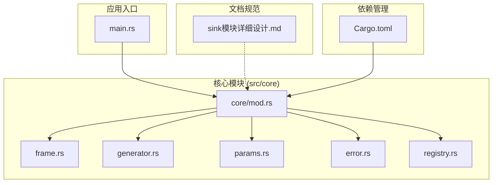
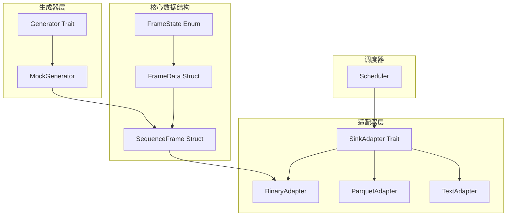
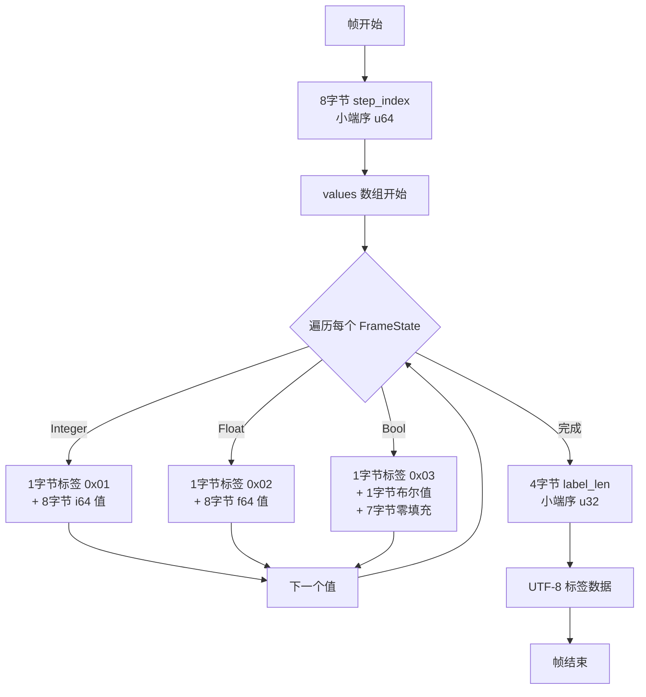
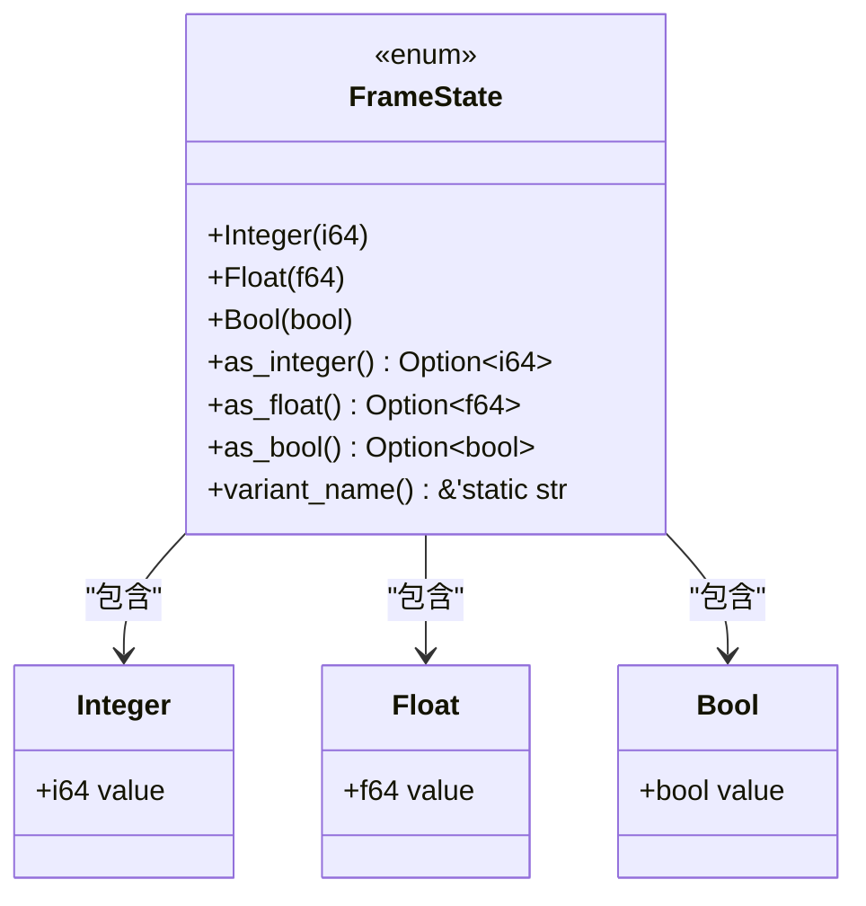
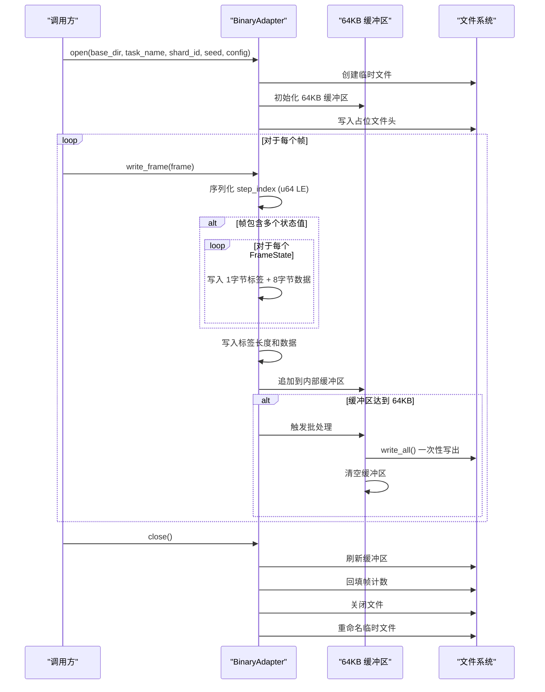
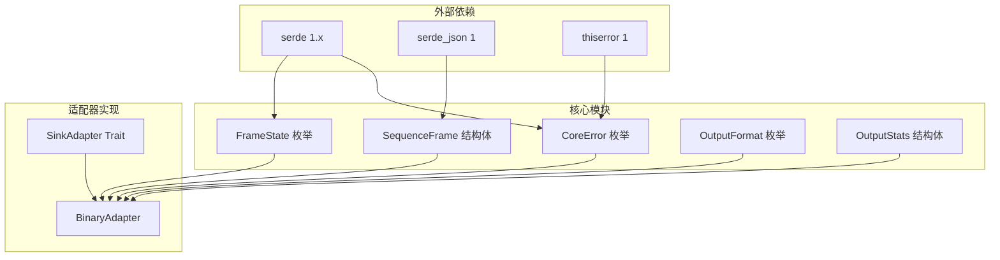

# 二进制输出适配器

<cite>
**本文档引用的文件**
- [main.rs](file://src/main.rs)
- [mod.rs](file://src/core/mod.rs)
- [frame.rs](file://src/core/frame.rs)
- [generator.rs](file://src/core/generator.rs)
- [params.rs](file://src/core/params.rs)
- [error.rs](file://src/core/error.rs)
- [registry.rs](file://src/core/registry.rs)
- [sink模块详细设计.md](file://docs/sink模块详细设计.md)
- [Cargo.toml](file://Cargo.toml)
</cite>

## 目录
1. [简介](#简介)
2. [项目结构](#项目结构)
3. [核心组件](#核心组件)
4. [架构概览](#架构概览)
5. [详细组件分析](#详细组件分析)
6. [依赖分析](#依赖分析)
7. [性能考虑](#性能考虑)
8. [故障排除指南](#故障排除指南)
9. [结论](#结论)
10. [附录](#附录)

## 简介

BinaryAdapter 是 StructGen-rs 项目中的二进制输出适配器，专门设计用于将帧序列以紧凑的二进制格式进行转储，并支持后续通过内存映射（mmap）进行高效的随机访问。该适配器遵循严格的小端序字节序规范，实现了零拷贝优化，能够处理大规模数据集而无需额外的序列化开销。

BinaryAdapter 的设计目标是提供高性能的数据持久化解决方案，支持 TB 级别的数据输出，同时保持格式的透明性和流式写入能力。通过采用 64KB 缓冲区管理和批写入机制，该适配器能够显著减少系统调用次数，提高整体写入性能。

## 项目结构

StructGen-rs 项目采用模块化的架构设计，核心功能集中在 `src/core` 目录下，而输出适配器功能则位于 `docs/sink模块详细设计.md` 文档中。项目的主要组成部分包括：



**图表来源**
- [main.rs:1-6](file://src/main.rs#L1-L6)
- [mod.rs:1-16](file://src/core/mod.rs#L1-L16)
- [sink模块详细设计.md:29-37](file://docs/sink模块详细设计.md#L29-L37)

**章节来源**
- [main.rs:1-6](file://src/main.rs#L1-L6)
- [mod.rs:1-16](file://src/core/mod.rs#L1-L16)
- [sink模块详细设计.md:29-37](file://docs/sink模块详细设计.md#L29-L37)

## 核心组件

BinaryAdapter 作为输出适配器体系中的重要成员，与其他适配器共同构成了完整的数据输出解决方案。其核心组件包括：

### 文件格式规范

BinaryAdapter 采用精心设计的二进制文件格式，具有以下特点：

- **16字节文件头**：包含魔数、版本号、帧计数和状态维度信息
- **紧凑帧格式**：每帧包含时间步索引、状态值数组和可选标签
- **小端序字节序**：所有多字节值均采用小端序存储
- **零拷贝优化**：FrameState 的二进制表示与内存布局完全一致

### 写入流程

适配器采用流式写入策略，支持大规模数据的高效处理：

1. **打开文件**：创建临时文件，写入占位的文件头
2. **批量写入**：维护 64KB 缓冲区，攒满后一次性写出
3. **关闭文件**：回填帧计数，重命名临时文件

**章节来源**
- [sink模块详细设计.md:233-286](file://docs/sink模块详细设计.md#L233-L286)

## 架构概览

BinaryAdapter 在整个系统架构中扮演着关键的数据输出角色，与生成器、调度器和其他组件协同工作：



**图表来源**
- [generator.rs:9-56](file://src/core/generator.rs#L9-L56)
- [frame.rs:3-118](file://src/core/frame.rs#L3-L118)
- [sink模块详细设计.md:292-296](file://docs/sink模块详细设计.md#L292-L296)

**章节来源**
- [generator.rs:9-56](file://src/core/generator.rs#L9-L56)
- [frame.rs:3-118](file://src/core/frame.rs#L3-L118)
- [sink模块详细设计.md:292-296](file://docs/sink模块详细设计.md#L292-L296)

## 详细组件分析

### BinaryAdapter 文件格式设计

BinaryAdapter 采用了高度优化的二进制文件格式，专为内存映射和随机访问而设计：

#### 文件头结构（16字节）

文件头采用固定的 16 字节布局，包含以下关键信息：

| 字段名 | 类型 | 描述 | 字节偏移 |
|--------|------|------|----------|
| magic | [u8; 4] | 魔数 "SGEN" | 0-3 |
| version | u32 | 文件格式版本 | 4-7 |
| frame_count | u64 | 帧总数（写入时占位） | 8-15 |
| state_dim | u32 | 状态维度（每帧状态值数量） | 16-19 |

#### 帧格式规范

每个帧采用紧凑的二进制格式，具有确定的字节偏移：



**图表来源**
- [sink模块详细设计.md:240-261](file://docs/sink模块详细设计.md#L240-L261)

#### FrameState 紧凑二进制表示

FrameState 枚举类型经过精心设计，实现了零拷贝优化：



**图表来源**
- [frame.rs:3-12](file://src/core/frame.rs#L3-L12)

**章节来源**
- [sink模块详细设计.md:240-261](file://docs/sink模块详细设计.md#L240-L261)
- [frame.rs:3-12](file://src/core/frame.rs#L3-L12)

### 批写入机制与缓冲区管理

BinaryAdapter 实现了高效的批写入机制，通过 64KB 缓冲区管理来优化 I/O 性能：

#### 写入流程序列图



**图表来源**
- [sink模块详细设计.md:265-286](file://docs/sink模块详细设计.md#L265-L286)

#### 缓冲区管理策略

- **64KB 批处理窗口**：当缓冲区累积达到 64KB 时，一次性执行 `write_all` 操作
- **零拷贝优化**：直接将内存中的二进制数据写入文件，避免额外的序列化步骤
- **内存映射友好**：固定长度的帧头和确定的字节偏移支持高效的随机访问

**章节来源**
- [sink模块详细设计.md:265-286](file://docs/sink模块详细设计.md#L265-L286)

### 内存映射支持与随机访问

BinaryAdapter 的设计充分考虑了内存映射的需求，提供了高效的随机访问能力：

#### 内存映射读取流程

```mermaid
flowchart TD
MAP_START[开始内存映射] --> READ_HEADER[读取 16字节文件头]
READ_HEADER --> VERIFY_MAGIC{验证魔数 "SGEN"}
VERIFY_MAGIC --> |成功| CALC_DIM[计算状态维度]
VERIFY_MAGIC --> |失败| ERROR[返回错误]
CALC_DIM --> GET_FRAME_COUNT[获取帧总数]
GET_FRAME_COUNT --> CALC_OFFSET[计算帧偏移]
CALC_OFFSET --> ACCESS_FRAME{请求特定帧?}
ACCESS_FRAME --> |是| COMPUTE_OFFSET[计算目标帧字节偏移]
COMPUTE_OFFSET --> READ_FRAME[读取完整帧数据]
READ_FRAME --> PARSE_VALUES[解析状态值]
PARSE_VALUES --> RETURN_RESULT[返回帧数据]
ACCESS_FRAME --> |否| CONTINUE[继续处理其他帧]
CONTINUE --> ACCESS_FRAME
```

**图表来源**
- [sink模块详细设计.md:359-361](file://docs/sink模块详细设计.md#L359-L361)

#### 随机访问优势

- **固定帧大小**：每帧包含确定数量的状态值，便于计算偏移量
- **小端序一致性**：所有多字节值采用小端序存储，简化跨平台兼容性
- **零序列化开销**：FrameState 的二进制表示与内存布局完全一致，读取时无需额外转换

**章节来源**
- [sink模块详细设计.md:359-361](file://docs/sink模块详细设计.md#L359-L361)

## 依赖分析

BinaryAdapter 的实现依赖于核心模块提供的数据结构和接口，形成了清晰的依赖层次：



**图表来源**
- [Cargo.toml:6-10](file://Cargo.toml#L6-L10)
- [error.rs:4-49](file://src/core/error.rs#L4-L49)
- [frame.rs:91-98](file://src/core/frame.rs#L91-L98)
- [params.rs:8-18](file://src/core/params.rs#L8-L18)

**章节来源**
- [Cargo.toml:6-10](file://Cargo.toml#L6-L10)
- [error.rs:4-49](file://src/core/error.rs#L4-L49)
- [frame.rs:91-98](file://src/core/frame.rs#L91-L98)
- [params.rs:8-18](file://src/core/params.rs#L8-L18)

## 性能考虑

BinaryAdapter 在设计时充分考虑了各种性能因素，采用了多项优化策略：

### I/O 性能优化

- **64KB 缓冲区**：显著减少系统调用次数，提高写入吞吐量
- **批处理写入**：当缓冲区达到阈值时一次性写出，避免频繁的小 I/O 操作
- **零拷贝序列化**：直接使用内存中的二进制数据，无需额外的序列化步骤

### 内存映射优化

- **固定长度帧头**：支持快速跳转到任意帧位置
- **确定的字节偏移**：每种数据类型的存储位置固定，便于解析
- **小端序一致性**：简化跨平台数据交换和解析

### 错误处理策略

- **原子写入保证**：通过临时文件和重命名策略确保文件完整性
- **严格的类型检查**：在编译时防止格式不匹配问题
- **资源清理机制**：确保文件句柄正确关闭，避免资源泄漏

**章节来源**
- [sink模块详细设计.md:355-361](file://docs/sink模块详细设计.md#L355-L361)

## 故障排除指南

在使用 BinaryAdapter 时可能遇到的各种问题及解决方案：

### 常见错误场景

| 错误类型 | 症状描述 | 可能原因 | 解决方案 |
|----------|----------|----------|----------|
| I/O 错误 | 文件写入失败 | 权限不足、磁盘空间不足 | 检查文件权限和磁盘空间，确保有足够的可用空间 |
| 格式不匹配 | 读取数据异常 | 文件损坏或格式版本不兼容 | 验证文件完整性，确认使用正确的读取器版本 |
| 内存不足 | 大文件处理失败 | 系统内存不足 | 考虑使用流式读取而非一次性加载到内存 |
| 编码错误 | 标签数据乱码 | UTF-8 编码问题 | 确保标签数据使用有效的 UTF-8 编码 |

### 调试建议

- **验证文件头**：检查魔数 "SGEN" 和版本号是否正确
- **检查帧计数**：确认文件头中的帧计数与实际帧数一致
- **验证数据类型**：确保每帧的状态值类型与预期相符
- **测试随机访问**：验证内存映射功能是否正常工作

**章节来源**
- [sink模块详细设计.md:343-353](file://docs/sink模块详细设计.md#L343-L353)

## 结论

BinaryAdapter 作为 StructGen-rs 项目中的核心组件，成功实现了高性能的二进制数据输出功能。通过精心设计的文件格式、高效的批写入机制和内存映射支持，该适配器能够处理大规模数据集而无需牺牲性能。

其主要优势包括：

1. **高性能写入**：通过 64KB 缓冲区和批处理机制显著提升写入效率
2. **内存映射友好**：固定长度的帧结构支持高效的随机访问
3. **零拷贝优化**：直接使用内存中的二进制数据，避免额外的序列化开销
4. **格式透明**：通过 SinkAdapter trait 提供统一的接口抽象
5. **原子写入保证**：确保数据完整性和文件系统安全性

这些特性使得 BinaryAdapter 成为了处理 TB 级别数据的理想选择，为 StructGen-rs 项目提供了强大的数据持久化能力。

## 附录

### 文件格式参考

BinaryAdapter 的完整文件格式规范如下：

#### 文件头（16字节）
- 魔数：4 字节（"SGEN"）
- 版本号：4 字节（u32，当前为 1）
- 帧计数：8 字节（u64，写入时占位）
- 状态维度：4 字节（u32）

#### 帧格式
- 时间步索引：8 字节（u64，小端序）
- 状态值数组：每值 9 字节
  - 1 字节类型标签（0x01=Integer, 0x02=Float, 0x03=Bool）
  - 8 字节数据（对应类型的二进制表示）
- 标签长度：4 字节（u32，0 表示无标签）
- 标签数据：UTF-8 编码的字节序列

### 使用示例

虽然本文档不包含具体的代码示例，但根据设计文档，BinaryAdapter 的典型使用流程包括：

1. 创建适配器实例并调用 `open()` 方法
2. 逐帧调用 `write_frame()` 方法写入数据
3. 调用 `close()` 方法完成写入并返回统计信息

这种设计确保了流式处理能力和内存效率，适合处理大规模数据集。