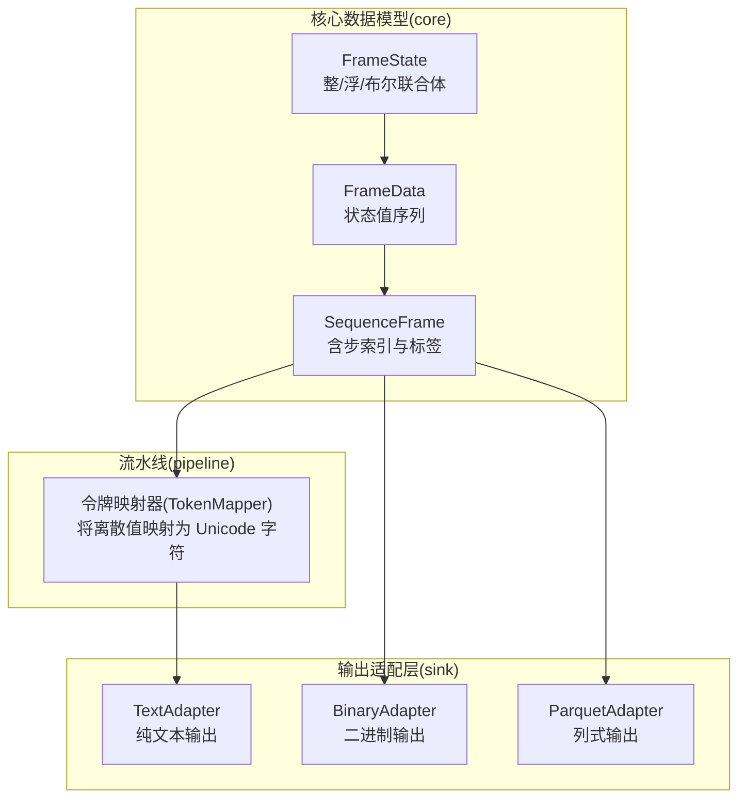
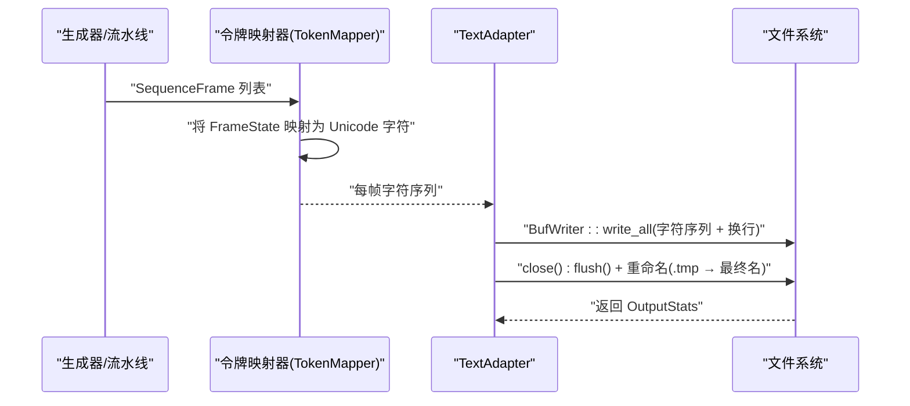
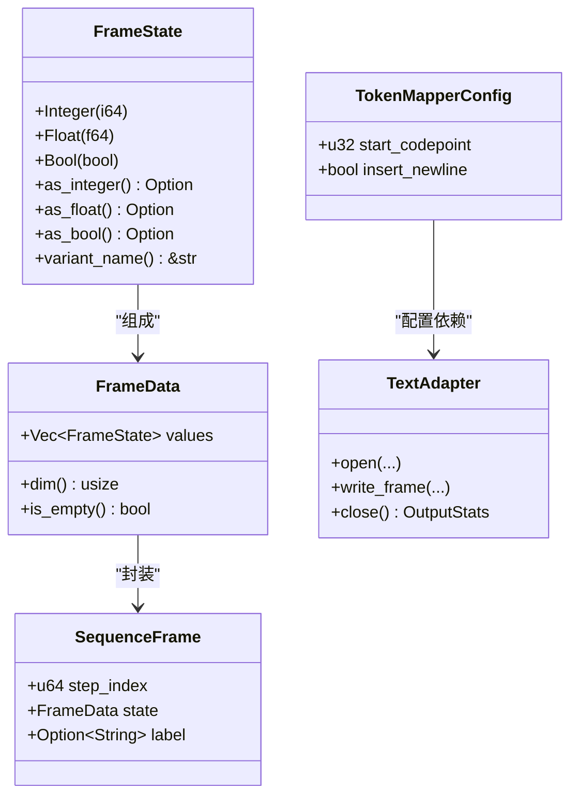

# 文本输出适配器

<cite>
**本文引用的文件**
- [sink模块详细设计.md](file://docs/sink模块详细设计.md)
- [pipeline模块详细设计.md](file://docs/pipeline模块详细设计.md)
- [frame.rs](file://src/core/frame.rs)
- [params.rs](file://src/core/params.rs)
- [error.rs](file://src/core/error.rs)
</cite>

## 目录
1. [简介](#简介)
2. [项目结构](#项目结构)
3. [核心组件](#核心组件)
4. [架构总览](#架构总览)
5. [组件详细分析](#组件详细分析)
6. [依赖关系分析](#依赖关系分析)
7. [性能特性](#性能特性)
8. [故障排查指南](#故障排查指南)
9. [结论](#结论)
10. [附录](#附录)

## 简介
本文件针对 StructGen-rs 的 TextAdapter（纯文本输出适配器）进行系统化文档化说明，重点涵盖：
- 文本输出格式的设计理念与字符映射机制
- FrameState 到 Unicode 字符的转换规则（Integer、Float、Bool）
- 缓冲写入优化、UTF-8 编码处理与换行分隔格式
- 文件内容格式规范、性能特性与与语言模型 DataLoader 的兼容性
- 实际文本文件示例与字符编码验证方法

## 项目结构
TextAdapter 属于输出适配层（sink）的一部分，负责将“已令牌映射”的帧序列以 Unicode 文本形式写出，并支持语言模型 DataLoader 直接加载。



图表来源
- [frame.rs:1-210](file://src/core/frame.rs#L1-L210)
- [pipeline模块详细设计.md:303-325](file://docs/pipeline模块详细设计.md#L303-L325)
- [sink模块详细设计.md:192-231](file://docs/sink模块详细设计.md#L192-L231)

章节来源
- [sink模块详细设计.md:192-231](file://docs/sink模块详细设计.md#L192-L231)
- [pipeline模块详细设计.md:303-325](file://docs/pipeline模块详细设计.md#L303-L325)
- [frame.rs:1-210](file://src/core/frame.rs#L1-L210)

## 核心组件
- FrameState：统一承载整型、浮点型、布尔型状态值的枚举，用于描述单个时间步的状态。
- FrameData：一帧中所有状态值的集合。
- SequenceFrame：包含步索引、状态数据与可选语义标签的时间步快照。
- TokenMapper：将离散化后的整数值映射为 Unicode 字符，形成可直接供语言模型使用的文本令牌序列。
- TextAdapter：将已令牌映射的帧序列写出为纯文本文件，采用 UTF-8 编码与换行分隔。

章节来源
- [frame.rs:3-118](file://src/core/frame.rs#L3-L118)
- [pipeline模块详细设计.md:168-177](file://docs/pipeline模块详细设计.md#L168-L177)
- [sink模块详细设计.md:192-231](file://docs/sink模块详细设计.md#L192-L231)

## 架构总览
TextAdapter 的工作流遵循“令牌映射 → 文本写出”的标准链路，核心要点如下：
- 令牌映射阶段：将 FrameState 离散化后的整数值映射到 Unicode 码点区间，形成字符序列。
- 文本写出阶段：使用缓冲写入，逐帧将字符序列写入文件，末尾追加换行符，最终以原子方式重命名临时文件。



图表来源
- [pipeline模块详细设计.md:303-325](file://docs/pipeline模块详细设计.md#L303-L325)
- [sink模块详细设计.md:211-231](file://docs/sink模块详细设计.md#L211-L231)

## 组件详细分析

### 文本输出格式与设计理念
- 文件内容格式
  - 每行代表一帧的所有状态值经映射后的字符序列，末尾以换行符分隔。
  - 文件内部编码为 UTF-8，确保跨平台与语言模型兼容。
- 设计目标
  - 与语言模型 DataLoader 直接兼容：输出的字符序列可作为模型输入。
  - 原子写入：先写临时文件，关闭时重命名为最终文件，避免部分写入。
  - 缓冲优化：使用 64KB 缓冲写入，降低系统调用次数，提升吞吐。

章节来源
- [sink模块详细设计.md:196-206](file://docs/sink模块详细设计.md#L196-L206)
- [sink模块详细设计.md:211-231](file://docs/sink模块详细设计.md#L211-L231)
- [sink模块详细设计.md:355-357](file://docs/sink模块详细设计.md#L355-L357)

### FrameState 到 Unicode 字符的映射规则
- Integer(v)
  - 将 v 视为 u32，加上配置的起始码点后钳位至 Unicode 安全上界，再映射为字符。
  - 该策略确保整数域内的离散值映射到稳定的 Unicode 区间。
- Float(v)
  - 将 v 映射到 0–255 的整数范围，再与起始码点相加，得到字符码点。
  - 该策略将连续值离散化为有限字符集，便于建模与压缩。
- Bool(v)
  - 将布尔值映射为 0 或 1，再与起始码点相加，得到字符码点。
  - 该策略将二值状态映射为两个稳定字符。

```mermaid
flowchart TD
Start(["进入 write_frame"]) --> Loop["遍历 frame.state.values"]
Loop --> Choice{"FrameState 类型？"}
Choice --> |Integer(v)| MapInt["code_point = start + clamp(v as u32, 0..=0x10_FFFF)"]
Choice --> |Float(v)| MapFloat["code_point = start + clamp((v*256) as u32, 0..=255)"]
Choice --> |Bool(v)| MapBool["code_point = start + v as u32"]
MapInt --> ToChar["char::from_u32(code_point) 或 ''"]
MapFloat --> ToChar
MapBool --> ToChar
ToChar --> Append["累积字符"]
Append --> Next{"还有值？"}
Next --> |是| Loop
Next --> |否| NL{"是否插入换行？"}
NL --> |是| AddNL["追加 '\\n'"]
NL --> |否| SkipNL["跳过换行"]
AddNL --> Write["BufWriter::write_all"]
SkipNL --> Write
Write --> End(["结束"])
```

图表来源
- [pipeline模块详细设计.md:310-325](file://docs/pipeline模块详细设计.md#L310-L325)
- [sink模块详细设计.md:216-224](file://docs/sink模块详细设计.md#L216-L224)

章节来源
- [pipeline模块详细设计.md:307-325](file://docs/pipeline模块详细设计.md#L307-L325)
- [sink模块详细设计.md:216-224](file://docs/sink模块详细设计.md#L216-L224)

### 缓冲写入优化与 UTF-8 编码
- 缓冲写入
  - 使用 BufWriter<File>，缓冲区大小为 64KB，显著减少系统调用次数，提高写入效率。
- UTF-8 编码
  - 文本文件采用 UTF-8 编码，确保字符正确显示与跨平台兼容。
- 换行分隔
  - 每行末尾追加换行符，便于语言模型 DataLoader 以行读取。

章节来源
- [sink模块详细设计.md:211-214](file://docs/sink模块详细设计.md#L211-L214)
- [sink模块详细设计.md:216-224](file://docs/sink模块详细设计.md#L216-L224)
- [sink模块详细设计.md:205](file://docs/sink模块详细设计.md#L205)

### 与语言模型 DataLoader 的兼容性
- 直接兼容
  - 输出的字符序列可直接作为语言模型的文本输入，无需额外解码。
- 文件命名与原子写入
  - 采用“任务名_分片ID_种子.txt.tmp”命名并在关闭时重命名为最终文件，保证 DataLoader 在读取时仅看到完整文件。

章节来源
- [sink模块详细设计.md:194](file://docs/sink模块详细设计.md#L194)
- [sink模块详细设计.md:146-148](file://docs/sink模块详细设计.md#L146-L148)
- [sink模块详细设计.md:353](file://docs/sink模块详细设计.md#L353)

### 文件内容格式规范
- 每行一个帧的字符序列，字符来自令牌映射器的输出。
- 行尾追加换行符。
- 文件内部编码为 UTF-8。
- 文件名包含任务名、分片索引与种子，便于溯源与复现。

章节来源
- [sink模块详细设计.md:199-206](file://docs/sink模块详细设计.md#L199-L206)
- [sink模块详细设计.md:146-148](file://docs/sink模块详细设计.md#L146-L148)

### 实际文本文件示例与字符编码验证方法
- 示例说明
  - 每行代表一帧的状态序列，字符来源于令牌映射器的输出。
- 字符编码验证
  - 可通过读取文件内容并确认其为有效的 UTF-8 文本，确保字符正确写入与显示。
  - 可统计行数以验证帧数与期望一致。

章节来源
- [sink模块详细设计.md:391-400](file://docs/sink模块详细设计.md#L391-L400)

## 依赖关系分析
- TextAdapter 依赖于核心数据模型（FrameState、FrameData、SequenceFrame）与输出配置（OutputConfig）。
- 令牌映射器（TokenMapper）位于流水线阶段，负责将 FrameState 离散化为字符码点，随后由 TextAdapter 写出。
- 适配器接口（SinkAdapter）定义了 open/write_frame/close 的生命周期，调度器通过该接口透明地选择输出格式。



图表来源
- [frame.rs:3-118](file://src/core/frame.rs#L3-L118)
- [pipeline模块详细设计.md:168-177](file://docs/pipeline模块详细设计.md#L168-L177)
- [sink模块详细设计.md:192-231](file://docs/sink模块详细设计.md#L192-L231)

章节来源
- [frame.rs:3-118](file://src/core/frame.rs#L3-L118)
- [params.rs:8-18](file://src/core/params.rs#L8-L18)
- [sink模块详细设计.md:49-98](file://docs/sink模块详细设计.md#L49-L98)

## 性能特性
- 缓冲写入：64KB BufWriter 减少系统调用，提升吞吐。
- 原子写入：临时文件写入完成后重命名，避免部分写入文件污染。
- UTF-8 编码：跨平台兼容，利于语言模型 DataLoader 直接读取。
- 与 TokenMapper 协作：令牌映射阶段完成离散化与范围钳位，降低写出阶段的复杂度。

章节来源
- [sink模块详细设计.md:355-357](file://docs/sink模块详细设计.md#L355-L357)
- [sink模块详细设计.md:353](file://docs/sink模块详细设计.md#L353)
- [pipeline模块详细设计.md:307-325](file://docs/pipeline模块详细设计.md#L307-L325)

## 故障排查指南
- 写入失败（磁盘空间不足、权限问题）
  - open/write_frame/close 可能返回 I/O 错误，需检查输出目录权限与可用空间。
- 临时文件残留
  - 关闭失败可能导致 .tmp 文件未被重命名，应检查日志并清理。
- Unicode 码点无效
  - 当映射结果超出有效范围时，令牌映射器会回退到替换字符，不影响写出流程。

章节来源
- [error.rs:22-24](file://src/core/error.rs#L22-L24)
- [sink模块详细设计.md:347-351](file://docs/sink模块详细设计.md#L347-L351)

## 结论
TextAdapter 通过“令牌映射 + 缓冲写出 + 原子写入”的组合，实现了与语言模型 DataLoader 高度兼容的纯文本输出。其设计兼顾性能与可靠性，既满足快速验证，也支持大规模数据落地。配合 TokenMapper 的离散化与范围钳位策略，能够稳定地将多类型状态值映射为 Unicode 字符序列，确保输出质量与一致性。

## 附录
- 相关配置
  - TokenMapperConfig：起始码点与是否插入换行。
  - OutputConfig：压缩级别、文件大小/帧数上限、是否计算哈希等。
- 文件命名规则
  - 采用“任务名_分片ID_种子.扩展名”，便于溯源与复现。

章节来源
- [pipeline模块详细设计.md:168-177](file://docs/pipeline模块详细设计.md#L168-L177)
- [sink模块详细设计.md:120-135](file://docs/sink模块详细设计.md#L120-L135)
- [sink模块详细设计.md:139-148](file://docs/sink模块详细设计.md#L139-L148)