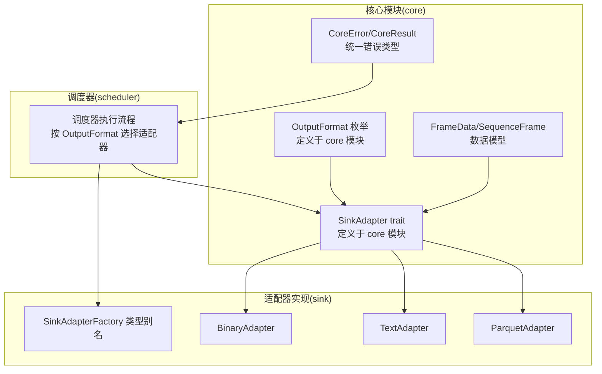
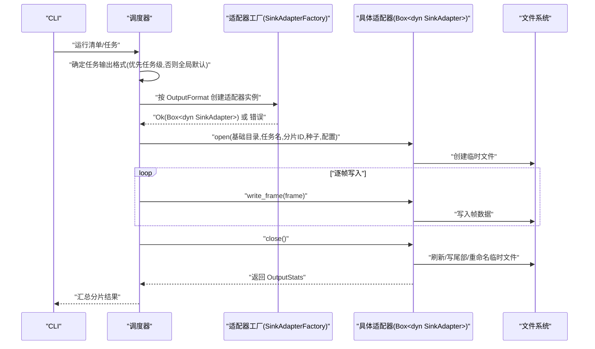
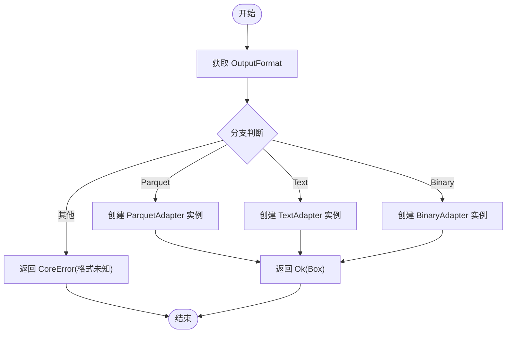
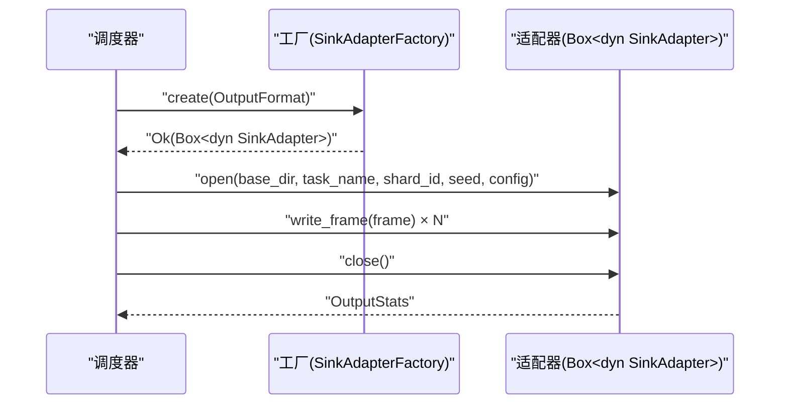
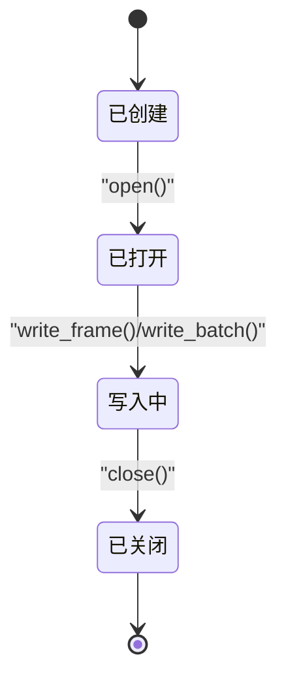
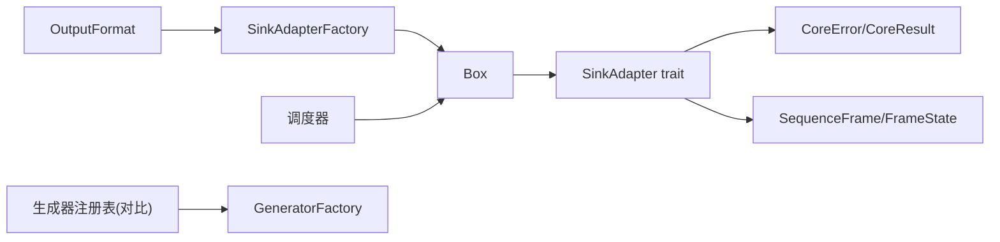

# 输出适配器工厂

<cite>
**本文引用的文件**
- [sink模块详细设计.md](file://docs/sink模块详细设计.md)
- [scheduler模块详细设计.md](file://docs/scheduler模块详细设计.md)
- [core模块详细设计.md](file://docs/core模块详细设计.md)
- [params.rs](file://src/core/params.rs)
- [error.rs](file://src/core/error.rs)
- [frame.rs](file://src/core/frame.rs)
- [registry.rs](file://src/core/registry.rs)
- [main.rs](file://src/main.rs)
</cite>

## 目录
1. [简介](#简介)
2. [项目结构](#项目结构)
3. [核心组件](#核心组件)
4. [架构总览](#架构总览)
5. [组件详细分析](#组件详细分析)
6. [依赖关系分析](#依赖关系分析)
7. [性能考量](#性能考量)
8. [故障排查指南](#故障排查指南)
9. [结论](#结论)
10. [附录](#附录)

## 简介
本文件围绕 StructGen-rs 的 SinkAdapterFactory 展开，系统性阐述输出适配器工厂模式在调度器中的作用与实现原理，重点说明如何基于 OutputFormat 枚举值动态创建对应的适配器实例，记录工厂函数类型定义、类型安全的实例化机制与错误处理策略，并给出与调度器集成的使用模式、配置传递与生命周期管理建议。最后总结最佳实践与扩展新输出格式的方法。

## 项目结构
- 适配器工厂位于核心模块的公共类型定义中，配合调度器在执行分片时按任务配置选择具体适配器实现。
- 适配器接口与三种内置实现分别在文档中定义，工厂类型别名用于按枚举值创建适配器实例。
- 调度器通过适配器接口与工厂协作，屏蔽具体输出格式差异，实现“格式透明”的数据落盘。

**图表来源**
- [params.rs:8-18](file://src/core/params.rs#L8-L18)
- [sink模块详细设计.md:49-101](file://docs/sink模块详细设计.md#L49-L101)
- [scheduler模块详细设计.md:324-371](file://docs/scheduler模块详细设计.md#L324-L371)

**章节来源**
- [params.rs:1-235](file://src/core/params.rs#L1-L235)
- [sink模块详细设计.md:1-447](file://docs/sink模块详细设计.md#L1-L447)
- [scheduler模块详细设计.md:324-371](file://docs/scheduler模块详细设计.md#L324-L371)

## 核心组件
- OutputFormat 枚举：定义可用的输出格式（Parquet、Text、Binary），用于驱动工厂创建对应适配器。
- SinkAdapter trait：统一的输出适配器接口，规定 open/write/close 生命周期与统计返回。
- SinkAdapterFactory 类型别名：工厂函数签名，接受 OutputFormat，返回适配器实例或错误。
- 三种内置适配器实现：ParquetAdapter、TextAdapter、BinaryAdapter，分别满足列式分析、文本可读与二进制高效读取需求。
- 统一错误类型 CoreError/CoreResult：为工厂与适配器的错误传播提供一致的错误模型。

**章节来源**
- [params.rs:8-18](file://src/core/params.rs#L8-L18)
- [sink模块详细设计.md:49-101](file://docs/sink模块详细设计.md#L49-L101)
- [error.rs:1-103](file://src/core/error.rs#L1-L103)

## 架构总览
下图展示调度器在执行分片时，如何依据任务配置选择输出格式并通过工厂创建适配器实例，随后进行流式写入与统计收集。

**图表来源**
- [scheduler模块详细设计.md:337-371](file://docs/scheduler模块详细设计.md#L337-L371)
- [sink模块详细设计.md:298-327](file://docs/sink模块详细设计.md#L298-L327)

## 组件详细分析

### 工厂函数类型定义与类型安全
- 工厂函数类型别名：接受 OutputFormat，返回适配器实例或 CoreError。该签名确保调用方仅依赖枚举值即可获得类型安全的适配器对象。
- 类型安全的实例化机制：通过 match 或 if-else 分支，将 OutputFormat 与具体适配器构造函数绑定，返回 Box<dyn SinkAdapter>，从而在运行时实现多态调用。
- 错误处理策略：当工厂无法识别的格式传入时，应返回 CoreError（例如格式未知），以便调度器捕获并终止当前分片。

**图表来源**
- [sink模块详细设计.md:49-101](file://docs/sink模块详细设计.md#L49-L101)

**章节来源**
- [sink模块详细设计.md:49-101](file://docs/sink模块详细设计.md#L49-L101)
- [error.rs:38-49](file://src/core/error.rs#L38-L49)

### 基于 OutputFormat 的动态创建
- 调度器在执行分片前，会根据任务配置确定输出格式（优先任务级覆盖，否则使用全局默认）。随后调用工厂函数，传入该枚举值，得到具体适配器实例。
- 适配器实例在 open 时接收输出根目录、任务名、分片 ID、种子与输出配置，随后进入流式写入阶段；close 时返回 OutputStats，包含帧数、字节数、输出路径与可选哈希。

**图表来源**
- [scheduler模块详细设计.md:337-371](file://docs/scheduler模块详细设计.md#L337-L371)
- [sink模块详细设计.md:298-327](file://docs/sink模块详细设计.md#L298-L327)

**章节来源**
- [scheduler模块详细设计.md:324-371](file://docs/scheduler模块详细设计.md#L324-L371)
- [sink模块详细设计.md:298-327](file://docs/sink模块详细设计.md#L298-L327)

### 适配器接口与生命周期
- 接口契约：format/open/write_frame/write_batch/close，明确生命周期与职责边界。
- 生命周期管理：open 准备阶段创建临时文件；write_frame 逐帧写入；close 刷新缓冲、写入尾部、重命名临时文件并返回统计信息。
- 并发与原子性：不同分片写入不同文件，天然无锁；临时文件+重命名策略保证原子写入，避免部分写入文件残留。

**图表来源**
- [sink模块详细设计.md:49-98](file://docs/sink模块详细设计.md#L49-L98)

**章节来源**
- [sink模块详细设计.md:49-98](file://docs/sink模块详细设计.md#L49-L98)

### 错误处理策略
- 工厂侧：当传入未知的 OutputFormat 时，返回 CoreError，便于调度器捕获并终止当前分片。
- 适配器侧：open/write_frame/close 在 I/O 错误、权限不足、磁盘空间不足等情况下返回 CoreError；close 失败时保留临时文件以便调试。
- 统一错误模型：CoreError 提供 IoError、SerializationError、SinkError 等变体，便于上层区分与处理。

**章节来源**
- [error.rs:1-103](file://src/core/error.rs#L1-L103)
- [sink模块详细设计.md:343-353](file://docs/sink模块详细设计.md#L343-L353)

### 与调度器集成的使用模式
- 配置传递：任务级 OutputFormat 优先，否则使用全局默认；配置对象包含压缩级别、分片大小上限、是否计算哈希等。
- 生命周期管理：调度器负责创建适配器、打开、写入、关闭与统计收集；适配器负责具体的序列化与文件落盘。
- 并发写入：不同分片各自持有独立适配器实例，天然并发安全；若需共享文件，应引入互斥或消息队列。

**章节来源**
- [scheduler模块详细设计.md:324-371](file://docs/scheduler模块详细设计.md#L324-L371)
- [params.rs:20-66](file://src/core/params.rs#L20-L66)

### 扩展新输出格式的方法
- 定义新枚举值：在 OutputFormat 中新增变体，保持与现有变体一致的序列化语义。
- 实现适配器：遵循 SinkAdapter 接口，实现 open/write_frame/close，并在工厂中添加对应分支。
- 集成测试：编写单元测试验证写入正确性、原子写入与文件命名唯一性。
- 性能与兼容性：评估缓冲策略、压缩选项与文件格式特性，确保与现有流水线兼容。

**章节来源**
- [params.rs:8-18](file://src/core/params.rs#L8-L18)
- [sink模块详细设计.md:49-101](file://docs/sink模块详细设计.md#L49-L101)

## 依赖关系分析
- 适配器接口依赖核心数据模型（SequenceFrame/FrameState）与统一错误类型。
- 调度器依赖适配器接口与工厂类型，通过枚举值驱动实例化。
- 生成器注册表与适配器工厂类似，均采用“名称/枚举→构造函数”的工厂模式，体现系统内一致的扩展机制。

**图表来源**
- [params.rs:8-18](file://src/core/params.rs#L8-L18)
- [sink模块详细设计.md:49-101](file://docs/sink模块详细设计.md#L49-L101)
- [registry.rs:8-18](file://src/core/registry.rs#L8-L18)

**章节来源**
- [params.rs:1-235](file://src/core/params.rs#L1-L235)
- [registry.rs:1-150](file://src/core/registry.rs#L1-L150)

## 性能考量
- 流式写入：逐帧写入，避免 OOM，适合 TB 级数据输出。
- 缓冲策略：统一使用 BufWriter，减少系统调用次数；BinaryAdapter 内部维护 64KB 批缓冲，进一步降低小 IO。
- 压缩与格式：Parquet 支持 Snappy/Gzip 压缩，列式存储利于状态向量压缩；BinaryAdapter 零序列化开销，支持 mmap 随机访问。
- 并发与原子性：分片并行写入，临时文件+重命名保证原子写入，避免部分文件残留。

**章节来源**
- [sink模块详细设计.md:355-361](file://docs/sink模块详细设计.md#L355-L361)

## 故障排查指南
- 输出目录不存在/无权限：open 返回 IoError，调度器应记录错误并终止当前分片。
- 写入期间磁盘满：write_frame 返回 IoError，分片失败。
- 临时文件重命名失败：close 返回 IoError，保留临时文件以便调试。
- 文本编码问题：TextAdapter 对无效码点进行钳位，不报错但可能影响可读性。
- Parquet schema 不匹配：开发阶段通过静态断言预防，避免运行期异常。

**章节来源**
- [sink模块详细设计.md:343-353](file://docs/sink模块详细设计.md#L343-L353)
- [error.rs:22-28](file://src/core/error.rs#L22-L28)

## 结论
SinkAdapterFactory 通过 OutputFormat 枚举实现了类型安全、可扩展的适配器创建机制，配合统一的 SinkAdapter 接口与 CoreError 错误模型，为调度器提供了“格式透明”的数据落盘能力。工厂模式与调度器的集成清晰、健壮，具备良好的并发与原子性保障。扩展新输出格式的成本低、风险可控，只需遵循接口契约并在工厂中添加对应分支即可。

## 附录
- 相关数据模型：FrameState/FrameData/SequenceFrame，用于描述状态值与帧结构。
- 全局配置：GlobalConfig 包含默认输出格式、输出根目录、日志级别、分片最大序列数与流式写出开关等。

**章节来源**
- [frame.rs:1-210](file://src/core/frame.rs#L1-L210)
- [params.rs:20-66](file://src/core/params.rs#L20-L66)