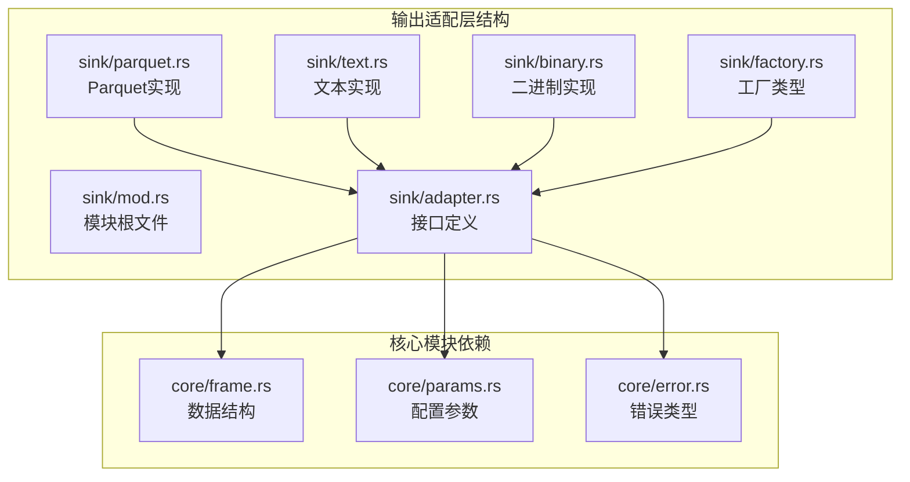
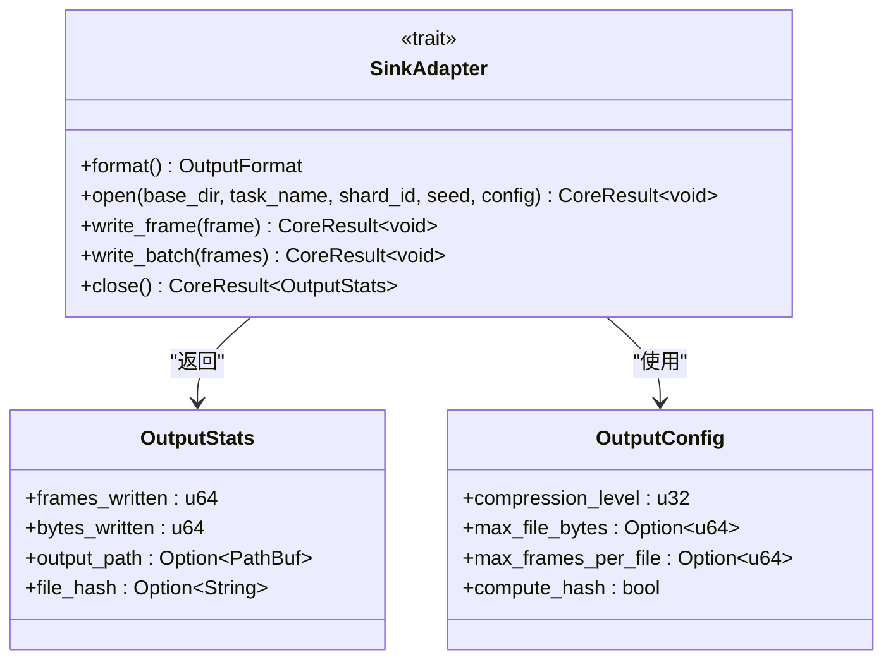
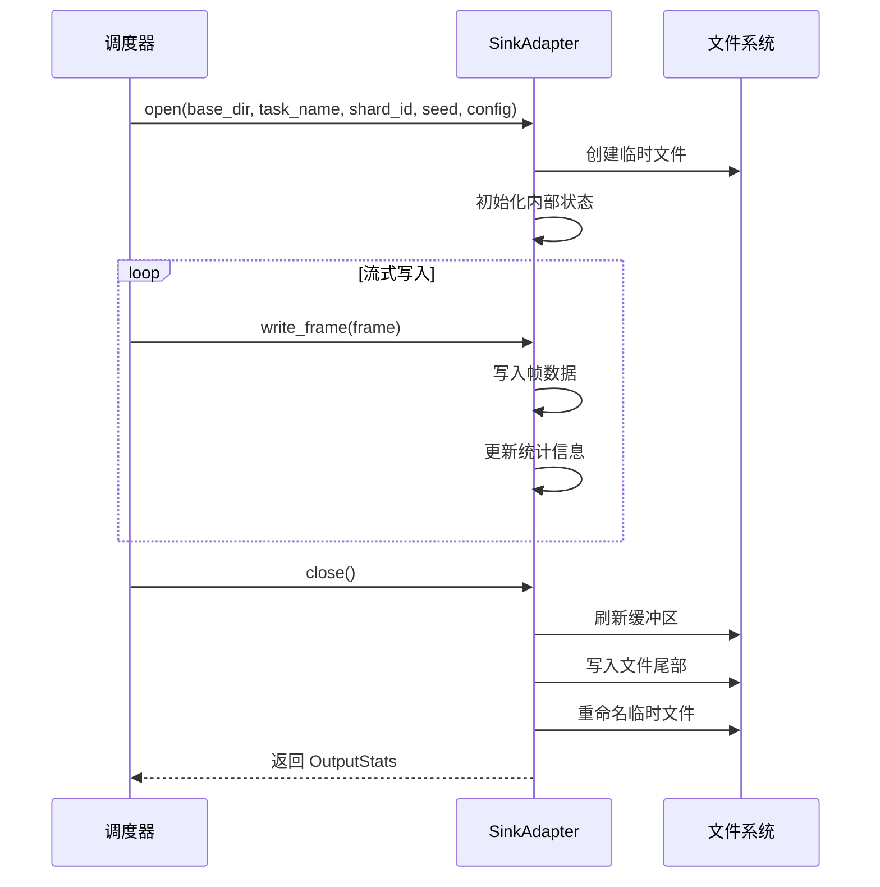
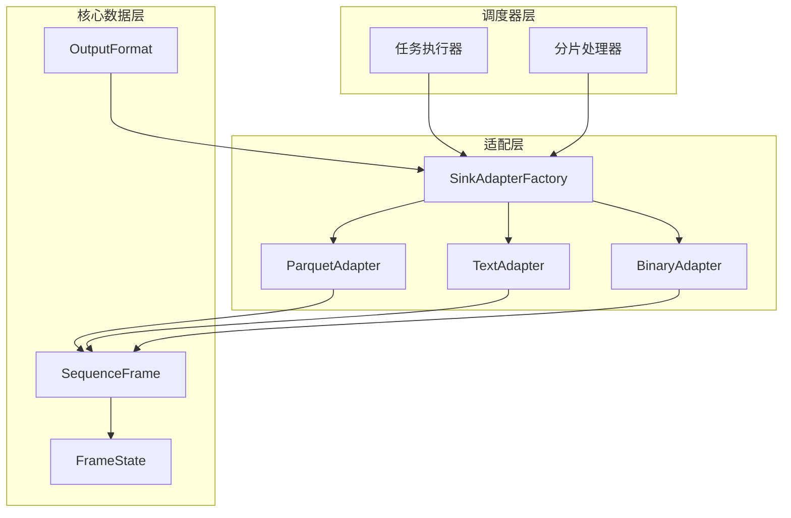
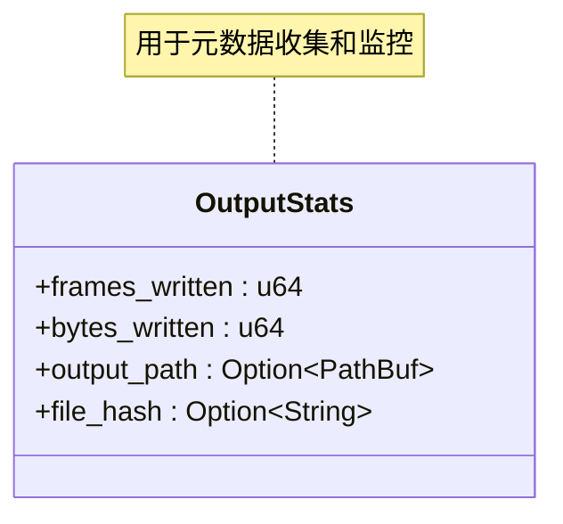
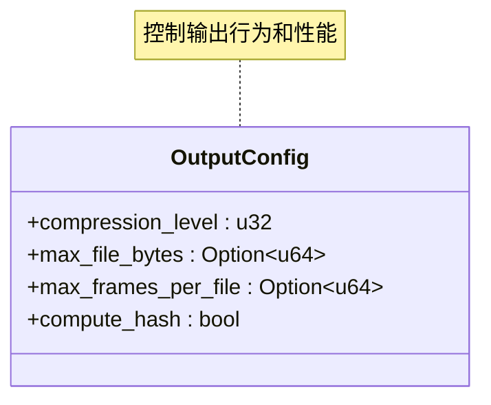
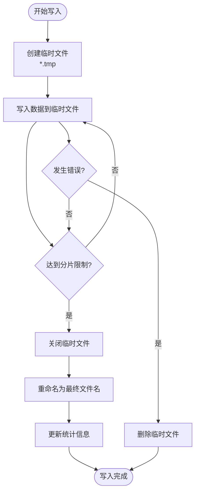
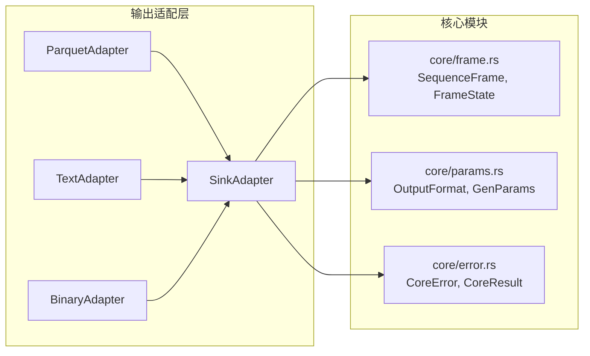

# 输出适配器接口设计

<cite>
**本文档引用的文件**
- [sink模块详细设计.md](file://docs/sink模块详细设计.md)
- [core模块详细设计.md](file://docs/core模块详细设计.md)
- [core/error.rs](file://src/core/error.rs)
- [core/params.rs](file://src/core/params.rs)
- [core/frame.rs](file://src/core/frame.rs)
</cite>

## 目录
1. [简介](#简介)
2. [项目结构](#项目结构)
3. [核心组件](#核心组件)
4. [架构概览](#架构概览)
5. [详细组件分析](#详细组件分析)
6. [依赖关系分析](#依赖关系分析)
7. [性能考虑](#性能考虑)
8. [故障排除指南](#故障排除指南)
9. [结论](#结论)

## 简介

StructGen-rs 的输出适配层（Sink Layer）是数据持久化的核心组件，负责将生成器产生的结构化帧序列转换为各种文件格式并写入磁盘。该层通过统一的 SinkAdapter 接口实现了格式透明的输出能力，支持 Apache Parquet、纯文本和二进制三种输出格式，并提供了原子写入、流式处理和并发安全等关键特性。

## 项目结构

输出适配层位于独立的 `src/sink/` 目录中，包含以下核心文件：

**图表来源**
- [sink模块详细设计.md: 29-46:29-46](file://docs/sink模块详细设计.md#L29-L46)

**章节来源**
- [sink模块详细设计.md: 27-46:27-46](file://docs/sink模块详细设计.md#L27-L46)

## 核心组件

### SinkAdapter Trait 接口

SinkAdapter 是输出适配层的核心抽象接口，定义了统一的输出格式接口规范：

**图表来源**
- [sink模块详细设计.md: 55-98:55-98](file://docs/sink模块详细设计.md#L55-L98)
- [sink模块详细设计.md: 107-135:107-135](file://docs/sink模块详细设计.md#L107-L135)

### 生命周期管理

SinkAdapter 采用严格的生命周期管理模式：

**图表来源**
- [sink模块详细设计.md: 57-98:57-98](file://docs/sink模块详细设计.md#L57-L98)

**章节来源**
- [sink模块详细设计.md: 55-98:55-98](file://docs/sink模块详细设计.md#L55-L98)

## 架构概览

输出适配层采用插件化架构，通过工厂模式实现格式透明的输出：

**图表来源**
- [sink模块详细设计.md: 290-327:290-327](file://docs/sink模块详细设计.md#L290-L327)

**章节来源**
- [sink模块详细设计.md: 288-327:288-327](file://docs/sink模块详细设计.md#L288-L327)

## 详细组件分析

### SinkAdapter 接口规范

#### open() 方法
open() 方法负责初始化输出适配器，建立与文件系统的连接：

**方法签名**: `open(&mut self, base_dir: &Path, task_name: &str, shard_id: usize, seed: u64, config: &OutputConfig) -> CoreResult<()>`

**参数说明**:
- `base_dir`: 输出根目录路径
- `task_name`: 任务名称，用于文件命名
- `shard_id`: 分片编号，确保文件唯一性
- `seed`: 种子值，保证输出的可追溯性
- `config`: 输出配置对象

**实现要求**:
1. 创建临时文件用于写入
2. 初始化内部状态和统计信息
3. 验证输出目录权限和可用空间
4. 支持并发安全的多分片写入

#### write_frame() 方法
write_frame() 方法负责写入单个帧数据：

**方法签名**: `write_frame(&mut self, frame: &SequenceFrame) -> CoreResult<()>`

**处理流程**:
1. 序列化帧数据到目标格式
2. 写入到临时文件
3. 更新内部统计计数器
4. 检查分片大小限制

**章节来源**
- [sink模块详细设计.md: 79-88:79-88](file://docs/sink模块详细设计.md#L79-L88)

#### write_batch() 方法
write_batch() 方法提供批量写入优化：

**默认实现**: 逐帧调用 write_frame()

**优化策略**:
- 减少系统调用次数
- 利用底层格式的批量写入能力
- 实现格式特定的优化算法

**章节来源**
- [sink模块详细设计.md: 82-88:82-88](file://docs/sink模块详细设计.md#L82-L88)

#### close() 方法
close() 方法完成输出并返回统计信息：

**方法签名**: `close(&mut self) -> CoreResult<OutputStats>`

**主要职责**:
1. 刷新所有内部缓冲区
2. 写入文件尾部信息（如 Parquet footer）
3. 计算文件哈希（可选）
4. 将临时文件重命名为最终文件名
5. 返回 OutputStats 结构体

**章节来源**
- [sink模块详细设计.md: 90-97:90-97](file://docs/sink模块详细设计.md#L90-L97)

### OutputStats 结构体

OutputStats 用于记录每个输出分片的详细统计信息：

**字段说明**:
- `frames_written`: 写入的帧总数
- `bytes_written`: 实际写入的字节数
- `output_path`: 最终输出文件的完整路径
- `file_hash`: 文件的 SHA-256 哈希值（可选）

**章节来源**
- [sink模块详细设计.md: 107-118:107-118](file://docs/sink模块详细设计.md#L107-L118)

### OutputConfig 结构体

OutputConfig 提供灵活的输出配置选项：

**配置选项**:
- `compression_level`: 压缩级别（0-9），0 表示不压缩
- `max_file_bytes`: 单文件最大字节数，None 表示不限制
- `max_frames_per_file`: 单文件最大帧数，None 表示不限制
- `compute_hash`: 关闭时是否计算 SHA-256 哈希

**章节来源**
- [sink模块详细设计.md: 120-135:120-135](file://docs/sink模块详细设计.md#L120-L135)

### 文件命名规则

输出文件采用统一的命名规范，确保唯一性和可追溯性：

**命名格式**: `<task_name>_<shard_id:05>_<seed:016x>.<extension>`

**示例**:
- `rule30_ca_00001_0000000000003039.parquet`
- `lorenz_chaos_00042_0000000000010932.txt`

**命名规则优势**:
1. 包含任务名称，便于识别数据来源
2. 包含分片编号，支持并行输出
3. 包含种子值，保证输出可复现
4. 包含文件扩展名，指示输出格式

**章节来源**
- [sink模块详细设计.md: 139-148:139-148](file://docs/sink模块详细设计.md#L139-L148)

### 原子写入机制

系统采用"写临时文件→重命名"的原子写入策略：

**原子写入优势**:
1. 避免部分写入的损坏文件
2. 确保文件系统一致性
3. 支持写入中断后的安全恢复
4. 提供清晰的错误诊断

**章节来源**
- [sink模块详细设计.md: 24-25:24-25](file://docs/sink模块详细设计.md#L24-L25)

## 依赖关系分析

输出适配层与核心模块的依赖关系如下：

**图表来源**
- [sink模块详细设计.md: 292-296:292-296](file://docs/sink模块详细设计.md#L292-L296)

**章节来源**
- [sink模块详细设计.md: 292-296:292-296](file://docs/sink模块详细设计.md#L292-L296)

## 性能考虑

### 缓冲策略

所有适配器都采用高效的缓冲策略：

- **BufWriter 缓冲**: 使用 64KB-256KB 缓冲区减少系统调用
- **批量写入**: BinaryAdapter 维护 64KB 缓冲区，攒满后一次性写出
- **零拷贝优化**: BinaryAdapter 的二进制表示与内存布局完全一致

### 压缩策略

- **Parquet 压缩**: 默认 Snappy 压缩，支持 Gzip 等其他算法
- **压缩级别**: 0-9 级别可调，平衡压缩比和性能
- **列式存储优势**: 适合状态向量的压缩和随机访问

### 并发安全

- **无锁设计**: 不同分片写入不同文件，天然无锁
- **临时文件隔离**: 每个分片使用独立的临时文件
- **原子重命名**: 使用文件系统原子操作确保一致性

**章节来源**
- [sink模块详细设计.md: 355-362:355-362](file://docs/sink模块详细设计.md#L355-L362)

## 故障排除指南

### 常见错误场景

| 错误情景 | 适配器行为 | 调度器处理 |
|----------|-----------|-----------|
| 输出目录不存在/无权限 | `open()` 返回 `CoreError::IoError` | 记录错误，终止当前 Shard |
| 写入期间磁盘满 | `write_frame()` 返回 `CoreError::IoError` | 记录错误，Shard 失败 |
| 临时文件重命名失败 | `close()` 返回 `CoreError::IoError` | Shard 失败，临时文件保留供调试 |
| Unicode 码点无效 | TextAdapter 钳位到有效范围，不出错 | 无影响 |
| Parquet schema 不匹配 | 开发阶段 static_assert 防止 | N/A |

### 错误处理最佳实践

1. **及时检查返回值**: 每个适配器方法都可能返回错误
2. **合理设置超时**: 避免长时间阻塞导致的资源占用
3. **监控磁盘空间**: 在 open() 时检查剩余空间
4. **定期清理临时文件**: 确保系统磁盘空间充足

**章节来源**
- [sink模块详细设计.md: 343-354:343-354](file://docs/sink模块详细设计.md#L343-L354)

## 结论

StructGen-rs 的 SinkAdapter 接口设计体现了现代数据处理系统的最佳实践：

1. **格式透明**: 通过 trait 对象实现格式无关的输出能力
2. **流式处理**: 支持 TB 级数据的流式写入，避免内存溢出
3. **原子写入**: 确保输出文件的完整性和一致性
4. **并发安全**: 支持多分片并行输出，提高整体性能
5. **可扩展性**: 插件化架构支持新格式的轻松添加

该设计为 StructGen-rs 提供了强大而灵活的数据持久化能力，能够满足从快速文本验证到大规模列式分析的各种应用场景需求。