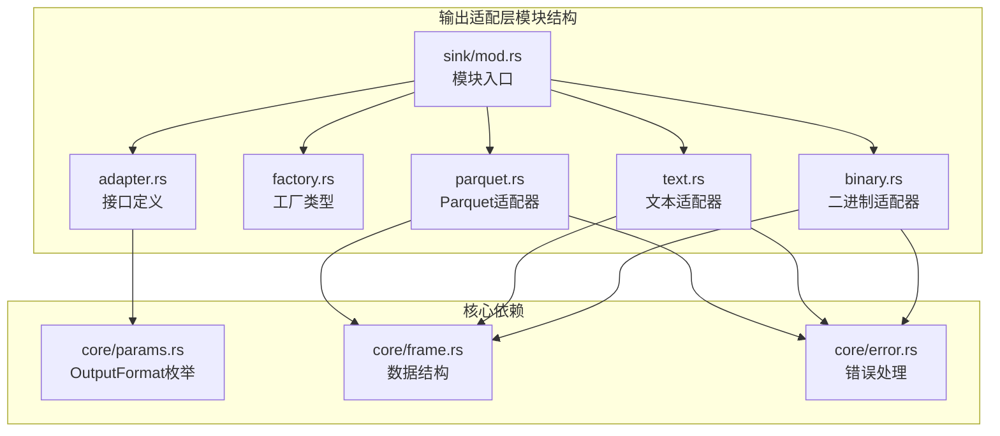
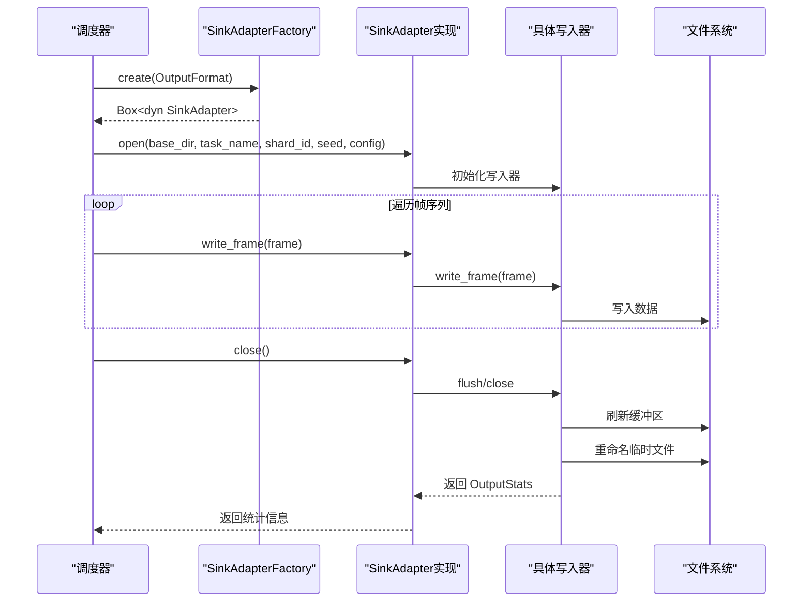
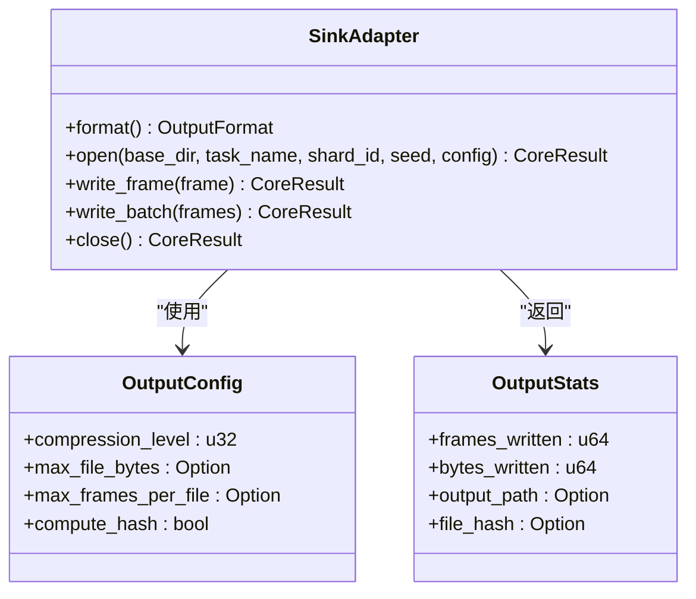
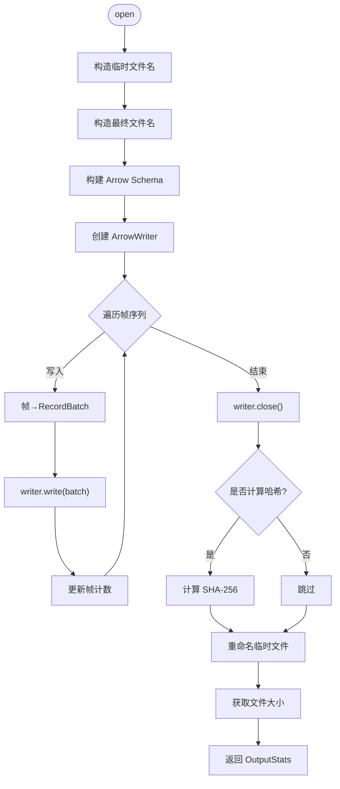
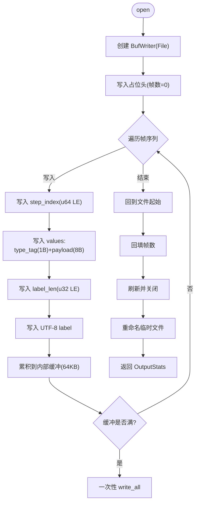
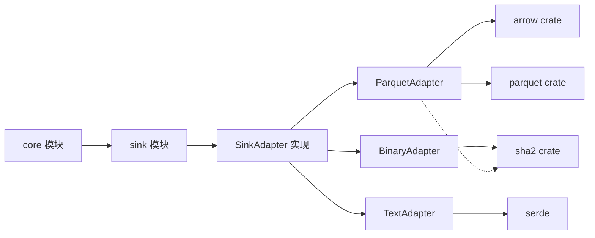

# 输出适配层

<cite>
**本文档引用的文件**
- [mod.rs](file://src/sink/mod.rs)
- [adapter.rs](file://src/sink/adapter.rs)
- [factory.rs](file://src/sink/factory.rs)
- [parquet.rs](file://src/sink/parquet.rs)
- [text.rs](file://src/sink/text.rs)
- [binary.rs](file://src/sink/binary.rs)
- [params.rs](file://src/core/params.rs)
- [mod.rs](file://src/core/mod.rs)
- [Cargo.toml](file://Cargo.toml)
</cite>

## 更新摘要
**变更内容**
- 更新了基于实际代码实现的完整适配器架构
- 新增了三种输出格式的具体实现细节
- 更新了文件格式设计和性能优化策略
- 添加了内存映射支持和原子写入机制
- 完善了组件交互和数据流说明

## 目录
1. [简介](#简介)
2. [项目结构](#项目结构)
3. [核心组件](#核心组件)
4. [架构总览](#架构总览)
5. [组件详细分析](#组件详细分析)
6. [依赖关系分析](#依赖关系分析)
7. [性能考量](#性能考量)
8. [故障排查指南](#故障排查指南)
9. [结论](#结论)
10. [附录](#附录)

## 简介
本文档详细介绍 StructGen-rs 的输出适配层（Sink），这是一个完整的实现模块，负责将后处理管道产出的 SequenceFrame 序列转换为特定文件格式并写入磁盘。系统支持三种输出格式：Parquet 列式存储、文本格式和二进制格式，并提供了统一的接口抽象和完善的配置管理机制。

## 项目结构
输出适配层位于 `src/sink` 目录下，包含以下核心模块：
- `adapter.rs`：定义 SinkAdapter 抽象接口和输出配置结构体
- `parquet.rs`：Apache Parquet 列式存储适配器实现
- `text.rs`：纯文本输出适配器实现
- `binary.rs`：二进制输出适配器实现
- `factory.rs`：适配器工厂类型定义
- `mod.rs`：模块入口和重导出

**图表来源**
- [mod.rs:1-24](file://src/sink/mod.rs#L1-L24)
- [adapter.rs:1-199](file://src/sink/adapter.rs#L1-L199)
- [parquet.rs:1-484](file://src/sink/parquet.rs#L1-L484)
- [text.rs:1-440](file://src/sink/text.rs#L1-L440)
- [binary.rs:1-572](file://src/sink/binary.rs#L1-L572)

**章节来源**
- [mod.rs:1-24](file://src/sink/mod.rs#L1-L24)
- [adapter.rs:1-199](file://src/sink/adapter.rs#L1-L199)

## 核心组件
输出适配层包含以下核心组件：

### SinkAdapter 抽象接口
定义了统一的适配器接口，所有具体实现都必须遵循此契约：
- 生命周期：`open()` → 多次 `write_frame()` → `close()`
- 格式查询：`format()` 返回 OutputFormat
- 配置注入：`open()` 接收 OutputConfig 参数
- 批量写入：`write_batch()` 默认逐帧调用，可覆盖优化
- 统计返回：`close()` 返回 OutputStats

### 输出配置管理
- `OutputConfig`：控制压缩级别、文件大小/帧数上限、哈希计算等
- `OutputStats`：记录写入统计信息（帧数、字节数、文件路径、可选哈希）
- 文件命名：`format_output_filename()` 生成标准化文件名

### 三种内置适配器实现
- **ParquetAdapter**：列式存储，使用 Arrow/Parquet crate，支持 Snappy 压缩
- **TextAdapter**：纯文本输出，每行一帧，适合语言模型加载
- **BinaryAdapter**：紧凑二进制格式，支持内存映射随机访问

**章节来源**
- [adapter.rs:12-55](file://src/sink/adapter.rs#L12-L55)
- [adapter.rs:57-100](file://src/sink/adapter.rs#L57-L100)
- [adapter.rs:102-111](file://src/sink/adapter.rs#L102-L111)

## 架构总览
输出适配层采用"接口抽象 + 多实现"的架构模式，遵循以下设计原则：

**图表来源**
- [factory.rs:9-10](file://src/sink/factory.rs#L9-L10)
- [adapter.rs:15-54](file://src/sink/adapter.rs#L15-L54)

### 格式透明性
- 调度器通过 trait 对象调用，不感知底层文件格式
- 基于 OutputFormat 枚举的动态创建机制
- 统一的接口契约确保格式切换的透明性

### 原子写入机制
- 临时文件写入完成后重命名为最终文件
- 避免残缺文件污染输出目录
- 支持失败恢复和调试

**章节来源**
- [adapter.rs:47-54](file://src/sink/adapter.rs#L47-L54)
- [parquet.rs:251-252](file://src/sink/parquet.rs#L251-L252)
- [text.rs:180-181](file://src/sink/text.rs#L180-L181)
- [binary.rs:265-266](file://src/sink/binary.rs#L265-L266)

## 组件详细分析

### SinkAdapter 接口设计
SinkAdapter trait 定义了完整的生命周期管理：

**图表来源**
- [adapter.rs:12-55](file://src/sink/adapter.rs#L12-L55)
- [adapter.rs:57-100](file://src/sink/adapter.rs#L57-L100)

**章节来源**
- [adapter.rs:12-55](file://src/sink/adapter.rs#L12-L55)
- [adapter.rs:57-100](file://src/sink/adapter.rs#L57-L100)

### 输出配置管理
OutputConfig 提供灵活的配置选项：

- **压缩级别**：0-9，0 表示不压缩，9 为最大压缩
- **文件大小限制**：`max_file_bytes` 控制单个分片文件大小
- **帧数限制**：`max_frames_per_file` 控制单个分片帧数
- **哈希计算**：`compute_hash` 控制是否计算 SHA-256 哈希

配置继承机制：
- 任务级 OutputFormat 可覆盖全局默认格式
- 分片级 OutputConfig 可覆盖全局默认配置

**章节来源**
- [adapter.rs:70-100](file://src/sink/adapter.rs#L70-L100)

### 统计信息收集机制
OutputStats 结构体提供详细的写入统计：

- **frames_written**：实际写入的帧数
- **bytes_written**：物理文件大小（字节数）
- **output_path**：最终输出文件路径
- **file_hash**：SHA-256 文件哈希（可选）

统计收集时机：close() 阶段刷新缓冲、写入尾部、重命名文件后获取文件大小并可选计算哈希。

**章节来源**
- [adapter.rs:57-68](file://src/sink/adapter.rs#L57-L68)

### Parquet 输出实现

#### 目标与特性
- 列式存储，适合大规模数据分析与高效随机访问
- 使用 Arrow/Parquet crate，支持 Snappy 压缩
- Schema 设计：step_index、state_dim、state_values（Binary）、label（可选）

#### 文件格式设计
ParquetAdapter 使用 Arrow Schema 定义列结构：
- `step_index`: Int64（帧索引）
- `state_dim`: Int32（状态维度）
- `state_values`: Binary（每项 9 字节：1 字节类型标签 + 8 字节数据）
- `label`: Utf8（可选标签）

#### 写入流程

**图表来源**
- [parquet.rs:157-272](file://src/sink/parquet.rs#L157-L272)

#### 性能优化策略
- **压缩策略**：默认 Snappy 压缩，列式格式天然适合状态向量压缩
- **缓冲策略**：使用 ArrowWriter 的内部缓冲机制
- **零拷贝**：FrameState 二进制表示与内存布局一致

**章节来源**
- [parquet.rs:23-46](file://src/sink/parquet.rs#L23-L46)
- [parquet.rs:62-70](file://src/sink/parquet.rs#L62-L70)
- [parquet.rs:157-205](file://src/sink/parquet.rs#L157-L205)
- [parquet.rs:231-272](file://src/sink/parquet.rs#L231-L272)

### 文本输出实现

#### 目标与特性
- 将已令牌映射的帧序列以 Unicode 文本格式写出
- 每行代表一帧，字符为 FrameState 映射后的 Unicode 字符
- UTF-8 编码，便于快速验证与语言模型加载

#### 写入格式设计
文本适配器的帧序列化规则：
- **Integer**：`char::from_u32` 映射为 Unicode 字符，负值使用替换字符 U+FFFD
- **Float**：映射到 0-255 整数范围再映射为字符
- **Bool**：'0' 或 '1'

#### 写入流程

**图表来源**
- [text.rs:94-189](file://src/sink/text.rs#L94-L189)

#### 性能优化策略
- **缓冲策略**：BufWriter 缓冲区大小 64KB，减少系统调用次数
- **字符映射**：高效的 Unicode 字符映射算法
- **内存友好**：逐帧写入，避免内存峰值

**章节来源**
- [text.rs:14-31](file://src/sink/text.rs#L14-L31)
- [text.rs:45-81](file://src/sink/text.rs#L45-L81)
- [text.rs:94-129](file://src/sink/text.rs#L94-L129)
- [text.rs:155-189](file://src/sink/text.rs#L155-L189)

### 二进制输出实现

#### 目标与特性
- 紧凑二进制格式，支持后续通过内存映射（mmap）高效随机访问
- 固定头格式，支持零序列化开销
- 支持随机访问单帧而不解析全文件

#### 文件格式设计
二进制文件格式（小端序）：

**Header (20 字节)**：
- magic: [u8; 4] = b"SGEN"
- version: u32 = 1
- frame_count: u64 = 0（占位）
- state_dim: u32

**每帧数据**：
- step_index: u64（帧索引）
- values: state_dim * 9 字节（每值 9 字节）
- label_len: u32（标签长度）
- label_bytes: UTF-8 标签

**帧状态值编码**（每 9 字节）：
- tag: 1 字节（0x01=整型, 0x02=浮点, 0x03=布尔）
- payload: 8 字节（对应类型的二进制表示）

#### 写入流程

**图表来源**
- [binary.rs:151-274](file://src/sink/binary.rs#L151-L274)

#### 性能优化策略
- **零序列化开销**：FrameState 二进制表示与内存布局一致，写入直接 as_bytes() 拷贝
- **缓冲策略**：64KB 批写入，减少系统调用
- **内存映射友好**：固定头 + 确定字节偏移，支持随机访问单帧
- **一致性校验**：首帧写入时确定 state_dim，后续帧严格校验

**章节来源**
- [binary.rs:24-41](file://src/sink/binary.rs#L24-L41)
- [binary.rs:56-73](file://src/sink/binary.rs#L56-L73)
- [binary.rs:151-187](file://src/sink/binary.rs#L151-L187)
- [binary.rs:227-274](file://src/sink/binary.rs#L227-L274)

### 文件命名与分片策略
标准化文件命名规则：`{task_name}_{shard_id:05}_{seed:016x}.{ext}`

示例：
- `rule30_ca_00001_0000000000003039.parquet`
- `lorenz_chaos_00042_0000000000010932.txt`
- `binary_data_00000_0000000000000000.bin`

分片上限控制：
- `max_file_bytes`：单个分片文件的最大字节数
- `max_frames_per_file`：单个分片文件的最大帧数

**章节来源**
- [adapter.rs:102-111](file://src/sink/adapter.rs#L102-L111)

## 依赖关系分析
输出适配层的依赖关系清晰明确：

**图表来源**
- [Cargo.toml:10-23](file://Cargo.toml#L10-L23)
- [parquet.rs:16-21](file://src/sink/parquet.rs#L16-L21)

### 核心依赖
- **core 模块**：提供 SequenceFrame、FrameState、OutputFormat 等核心类型
- **arrow/parquet**：ParquetAdapter 的核心依赖
- **serde**：序列化支持（用于配置和统计）
- **sha2**：文件哈希计算

### 适配器间关系
- 三种适配器相互独立，通过统一接口解耦
- 共享相同的配置管理和统计机制
- 支持通过工厂函数动态创建

**章节来源**
- [Cargo.toml:10-23](file://Cargo.toml#L10-L23)
- [mod.rs:1-24](file://src/sink/mod.rs#L1-L24)

## 性能考量
输出适配层在多个层面进行了性能优化：

### 缓冲策略
- **所有适配器**：使用 BufWriter，缓冲区大小 64KB–256KB
- **批量写入**：BinaryAdapter 内部维护 64KB 缓冲，满后一次性写出
- **减少系统调用**：通过缓冲区聚合 I/O 操作

### 压缩策略
- **ParquetAdapter**：默认 Snappy 压缩，列式格式天然适合状态向量压缩
- **可配置压缩级别**：0-9 的压缩级别设置
- **零压缩选项**：当 compression_level=0 时不进行压缩

### 内存优化
- **流式写入**：逐帧写入，避免 OOM，支持 TB 级数据输出
- **状态维度校验**：BinaryAdapter 确保帧间一致性
- **最小内存占用**：TextAdapter 和 BinaryAdapter 都采用流式处理

### I/O 优化
- **原子写入**：临时文件写入完成后重命名为最终文件
- **零拷贝操作**：BinaryAdapter 的 FrameState 直接 as_bytes() 拷贝
- **内存映射支持**：二进制格式支持后续 mmap 随机访问

**章节来源**
- [parquet.rs:183-189](file://src/sink/parquet.rs#L183-L189)
- [text.rs:116-118](file://src/sink/text.rs#L116-L118)
- [binary.rs:173-175](file://src/sink/binary.rs#L173-L175)
- [binary.rs:203-210](file://src/sink/binary.rs#L203-L210)

## 故障排查指南

### 常见错误类型
1. **适配器未打开错误**：调用 write_frame 或 close 时适配器未正确初始化
2. **文件系统错误**：输出目录不存在、无权限或磁盘空间不足
3. **格式不匹配错误**：BinaryAdapter 中帧的 state_dim 与首帧不一致
4. **配置错误**：OutputConfig 中的参数值不合法

### 错误处理机制
- **CoreError::SinkError**：适配器相关的错误
- **CoreError::IoError**：文件系统相关的 I/O 错误
- **CoreError::SerializationError**：序列化/反序列化错误

### 调试建议
- **检查文件命名**：确认文件名格式正确且唯一
- **验证输出目录**：确保目录存在且具有写权限
- **监控分片大小**：检查 max_file_bytes 和 max_frames_per_file 配置
- **验证数据一致性**：特别是 BinaryAdapter 的帧间一致性

**章节来源**
- [parquet.rs:216-223](file://src/sink/parquet.rs#L216-L223)
- [text.rs:131-135](file://src/sink/text.rs#L131-L135)
- [binary.rs:203-210](file://src/sink/binary.rs#L203-L210)

## 结论
输出适配层通过统一的 SinkAdapter 接口与完善的配置、统计机制，实现了格式透明、流式写入、并发安全与原子写入的综合能力。三种内置格式（Parquet、文本、二进制）覆盖了从快速文本验证到大规模列式分析与内存映射访问的全场景需求。

### 主要优势
- **架构清晰**：接口抽象与多实现分离，易于扩展新格式
- **性能优异**：多种缓冲策略和压缩选项优化 I/O 性能
- **可靠性高**：原子写入机制确保数据完整性
- **内存友好**：流式处理支持大规模数据输出
- **工具链完善**：支持哈希计算、统计收集和错误处理

### 技术特色
- **内存映射支持**：二进制格式天然支持 mmap 随机访问
- **零拷贝优化**：关键路径避免不必要的数据复制
- **配置驱动**：灵活的配置选项满足不同使用场景
- **测试完备**：每个适配器都有完整的单元测试覆盖

## 附录

### 术语表
- **帧（Frame）**：单个时间步的状态快照
- **分片（Shard）**：任务的一个执行单元，对应一组样本与种子
- **原子写入**：先写临时文件，关闭后重命名为最终文件，确保输出目录中只出现完整文件
- **内存映射**：将文件内容映射到进程地址空间，支持随机访问

### 文件格式规范

#### Parquet 文件格式
- **Schema**：step_index(Int64), state_dim(Int32), state_values(Binary), label(Utf8)
- **压缩**：Snappy（默认），可配置
- **特点**：列式存储，适合大规模数据分析

#### 文本文件格式
- **编码**：UTF-8
- **结构**：每行一帧，帧内状态值映射为字符
- **特点**：人类可读，适合快速验证

#### 二进制文件格式
- **Header**：20 字节固定头
- **帧格式**：step_index(u64) + values + label_len(u32) + label_bytes
- **特点**：紧凑存储，支持内存映射

### 参考文档
- [core 模块详细设计](file://docs/core模块详细设计.md)
- [sink 模块详细设计](file://docs/sink模块详细设计.md)

**章节来源**
- [params.rs:8-18](file://src/core/params.rs#L8-L18)
- [mod.rs:1-16](file://src/core/mod.rs#L1-L16)
- [Cargo.toml:10-23](file://Cargo.toml#L10-L23)