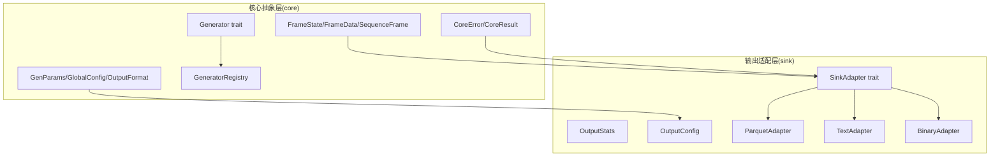
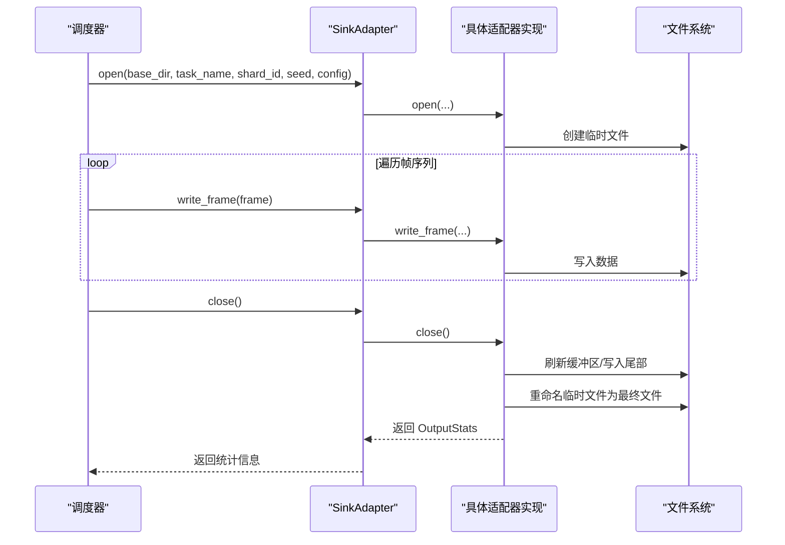
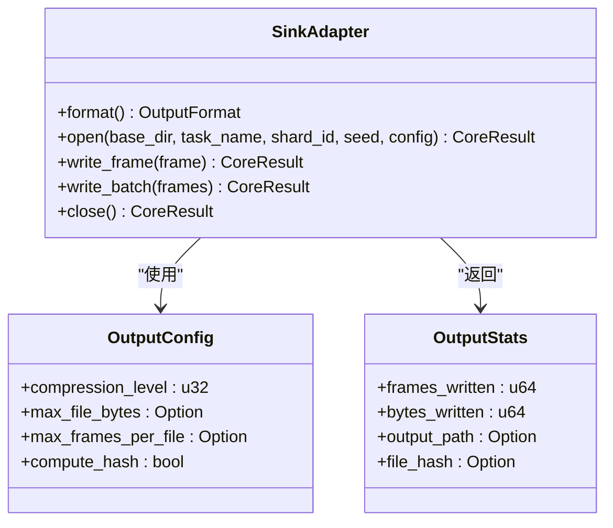
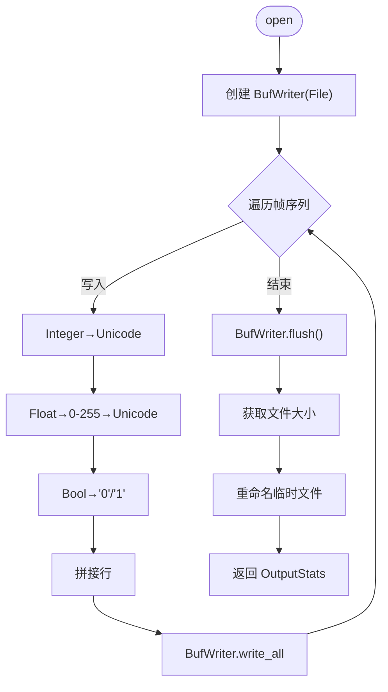
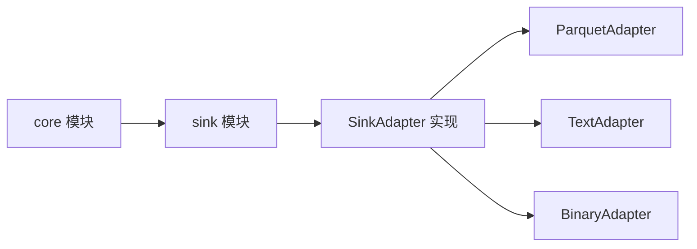

# 输出适配层

<cite>
**本文档引用的文件**
- [main.rs](file://src/main.rs)
- [mod.rs](file://src/core/mod.rs)
- [frame.rs](file://src/core/frame.rs)
- [generator.rs](file://src/core/generator.rs)
- [params.rs](file://src/core/params.rs)
- [registry.rs](file://src/core/registry.rs)
- [error.rs](file://src/core/error.rs)
- [sink模块详细设计.md](file://docs/sink模块详细设计.md)
- [core模块详细设计.md](file://docs/core模块详细设计.md)
- [Cargo.toml](file://Cargo.toml)
</cite>

## 目录
1. [简介](#简介)
2. [项目结构](#项目结构)
3. [核心组件](#核心组件)
4. [架构总览](#架构总览)
5. [组件详细分析](#组件详细分析)
6. [依赖关系分析](#依赖关系分析)
7. [性能考量](#性能考量)
8. [故障排查指南](#故障排查指南)
9. [结论](#结论)
10. [附录](#附录)

## 简介
本文件面向 StructGen-rs 的输出适配层（Sink），系统性阐述其整体设计、架构模式、系统边界、接口契约、配置与统计机制，以及三种内置输出格式（Parquet、文本、二进制）的实现要点与性能优化策略。文档同时覆盖组件交互、数据流、集成模式、安全与监控等横切关注点，帮助读者在不深入源码的情况下理解并正确使用输出适配层。

## 项目结构
- 输出适配层位于独立的 sink 模块（设计文档中定义），当前仓库尚未包含其实现代码，但已通过设计文档明确了接口、配置、统计与三种格式的实现规范。
- 核心抽象层（core）提供统一的数据结构与接口契约，输出适配层通过 core 的类型与错误体系进行交互。

图表来源
- [core模块详细设计.md](file://docs/core模块详细设计.md)
- [sink模块详细设计.md](file://docs/sink模块详细设计.md)

章节来源
- [core模块详细设计.md](file://docs/core模块详细设计.md)
- [sink模块详细设计.md](file://docs/sink模块详细设计.md)

## 核心组件
- SinkAdapter 抽象接口：定义 open/write_frame/write_batch/close 的生命周期，屏蔽具体文件格式差异，便于调度器透明切换。
- OutputConfig：封装压缩级别、分片大小上限、是否计算哈希等输出配置。
- OutputStats：记录每个分片的写入统计（帧数、字节数、最终文件路径、可选哈希）。
- 三种内置适配器：
  - ParquetAdapter：列式存储，适合大规模数据分析与高效随机访问。
  - TextAdapter：纯文本输出，适合快速验证与语言模型加载。
  - BinaryAdapter：二进制原始转储，支持内存映射读取与零拷贝访问。

章节来源
- [sink模块详细设计.md](file://docs/sink模块详细设计.md)

## 架构总览
输出适配层采用“接口抽象 + 多实现”的架构模式，遵循以下原则：
- 格式透明：调度器通过 trait 对象调用，不感知底层文件格式。
- 流式写入：逐帧写入，避免 OOM，支持 TB 级数据输出。
- 并发安全：不同分片写入不同文件，天然无锁；若需共享文件，采用互斥或消息通道。
- 原子写入：临时文件写入完成后重命名为最终文件，避免残缺文件。
- 可恢复性：文件名包含任务名、分片索引与种子，便于定位与复现。

图表来源
- [sink模块详细设计.md](file://docs/sink模块详细设计.md)

## 组件详细分析

### SinkAdapter 接口设计
- 生命周期：open → 多次 write_frame → close。
- 格式查询：format() 返回 OutputFormat。
- 配置注入：open 接收 OutputConfig，包含压缩级别、分片大小上限、是否计算哈希等。
- 批量写入：write_batch 默认逐帧调用 write_frame，子类可覆盖以优化性能。
- 统计返回：close 返回 OutputStats，包含帧数、字节数、最终路径、可选哈希。

图表来源
- [sink模块详细设计.md](file://docs/sink模块详细设计.md)

章节来源
- [sink模块详细设计.md](file://docs/sink模块详细设计.md)

### 输出配置管理
- GlobalConfig（core 模块）：全局运行配置（线程数、默认输出格式、输出目录、日志级别、分片序列上限、流式写出开关）。
- OutputConfig（sink 模块）：分片级输出配置（压缩级别、文件大小/帧数上限、关闭时是否计算哈希）。
- 配置继承：任务级 OutputFormat 可覆盖全局默认格式；分片级 OutputConfig 可覆盖全局默认配置。

章节来源
- [core模块详细设计.md](file://docs/core模块详细设计.md)
- [sink模块详细设计.md](file://docs/sink模块详细设计.md)

### 统计信息收集机制
- OutputStats 字段：frames_written、bytes_written、output_path、file_hash。
- 收集时机：close() 阶段刷新缓冲、写入尾部、重命名文件后获取文件大小并可选计算哈希。
- 用途：元数据层汇总统计，用于监控与质量审计。

章节来源
- [sink模块详细设计.md](file://docs/sink模块详细设计.md)

### Parquet 输出实现
- 目标：列式存储，适合大规模数据分析与高效随机访问。
- Schema 设计：step_index、state_dim、state_values（FrameState 序列化为 9 字节/项）、label（可选）。
- 写入流程：open 构造临时/最终文件名，创建 Arrow Schema 与 Writer；write_frame 将帧转换为 RecordBatch 写入；close 刷新并重命名，返回统计。
- 压缩策略：默认 Snappy（或 Gzip），列式格式天然适合状态向量压缩。

图表来源
- [sink模块详细设计.md](file://docs/sink模块详细设计.md)

章节来源
- [sink模块详细设计.md](file://docs/sink模块详细设计.md)

### 文本输出实现
- 目标：将已令牌映射的帧序列以 Unicode 文本格式写出，便于快速验证与语言模型加载。
- 写入格式：每行代表一帧，字符为 FrameState 映射后的 Unicode 字符；UTF-8 编码。
- 写入流程：open 创建 BufWriter；write_frame 将 FrameState 映射为字符并写入；close 刷新、获取大小、重命名。
- 性能：BufWriter 缓冲区大小 64KB，减少系统调用次数。

图表来源
- [sink模块详细设计.md](file://docs/sink模块详细设计.md)

章节来源
- [sink模块详细设计.md](file://docs/sink模块详细设计.md)

### 二进制输出实现
- 目标：紧凑二进制格式，支持后续通过内存映射（mmap）高效随机访问。
- 文件格式：固定头（magic、版本、帧数、state_dim）+ 帧数组（每帧含 step_index、values、label_len、label）。
- 写入流程：open 创建 BufWriter 并写入占位头；write_frame 序列化帧数据并累积到内部缓冲（64KB 批写入）；close 回填帧数、刷新并重命名。
- 性能：零序列化开销（FrameState 二进制表示与内存布局一致），支持随机访问单帧。

图表来源
- [sink模块详细设计.md](file://docs/sink模块详细设计.md)

章节来源
- [sink模块详细设计.md](file://docs/sink模块详细设计.md)

### 文件命名与分片策略
- 命名规则：<task_name>_<shard_id:05>_<seed:016x>.<extension>，确保唯一性与可追溯性。
- 分片上限：max_file_bytes 与 max_frames_per_file 可选配置，超限自动切分。
- 原子写入：临时文件写入完成后重命名为最终文件，避免残缺文件。

章节来源
- [sink模块详细设计.md](file://docs/sink模块详细设计.md)

## 依赖关系分析
- 输出适配层依赖 core 模块提供的类型与错误体系：
  - SequenceFrame/FrameState/FrameData：作为输入数据结构。
  - OutputFormat：作为适配器格式标识。
  - CoreError/CoreResult：作为错误传播与处理的统一入口。
- 适配器之间无直接依赖，通过统一接口与配置解耦。
- 与调度器的集成：调度器按任务配置选择 OutputFormat，创建对应适配器实例，流式写入帧序列并收集统计。

图表来源
- [core模块详细设计.md](file://docs/core模块详细设计.md)
- [sink模块详细设计.md](file://docs/sink模块详细设计.md)

章节来源
- [core模块详细设计.md](file://docs/core模块详细设计.md)
- [sink模块详细设计.md](file://docs/sink模块详细设计.md)

## 性能考量
- 缓冲策略：所有适配器使用 BufWriter，缓冲区大小 64KB–256KB，降低系统调用次数。
- 压缩策略：Parquet 默认 Snappy/Gzip，列式格式天然适合状态向量压缩。
- 批写入优化：BinaryAdapter 内部维护 64KB 缓冲，满后一次性写出，避免逐帧小 IO。
- 零序列化开销：BinaryAdapter 的 FrameState 二进制表示与内存布局一致，写入直接 as_bytes() 拷贝。
- mmap 友好布局：二进制定头 + 确定字节偏移，支持随机访问单帧而不解析全文件。
- 流式写入：逐帧写入，避免 OOM，支持 TB 级数据输出。

章节来源
- [sink模块详细设计.md](file://docs/sink模块详细设计.md)

## 故障排查指南
- 输出目录不存在/无权限：open 返回 CoreError::IoError，调度器记录错误并终止当前分片。
- 写入期间磁盘满：write_frame 返回 CoreError::IoError，调度器记录错误并失败当前分片。
- 临时文件重命名失败：close 返回 CoreError::IoError，分片失败，临时文件保留以便调试。
- Unicode 码点无效：TextAdapter 钳位到有效范围，不报错。
- Parquet schema 不匹配：开发阶段通过静态断言防止，避免运行时错误。

章节来源
- [sink模块详细设计.md](file://docs/sink模块详细设计.md)

## 结论
输出适配层通过统一的 SinkAdapter 接口与完善的配置、统计机制，实现了格式透明、流式写入、并发安全与原子写入的综合能力。三种内置格式覆盖从快速文本验证到大规模列式分析与内存映射访问的全场景需求。结合 core 模块的强类型数据结构与错误体系，输出适配层为 StructGen-rs 提供了稳健、可扩展、高性能的数据落地能力。

## 附录
- 术语
  - 帧（Frame）：单个时间步的状态快照。
  - 分片（Shard）：任务的一个执行单元，对应一组样本与种子。
  - 原子写入：先写临时文件，关闭后重命名为最终文件，确保输出目录中只出现完整文件。
- 参考文档
  - [core模块详细设计.md](file://docs/core模块详细设计.md)
  - [sink模块详细设计.md](file://docs/sink模块详细设计.md)