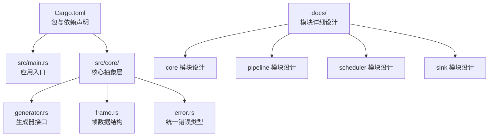
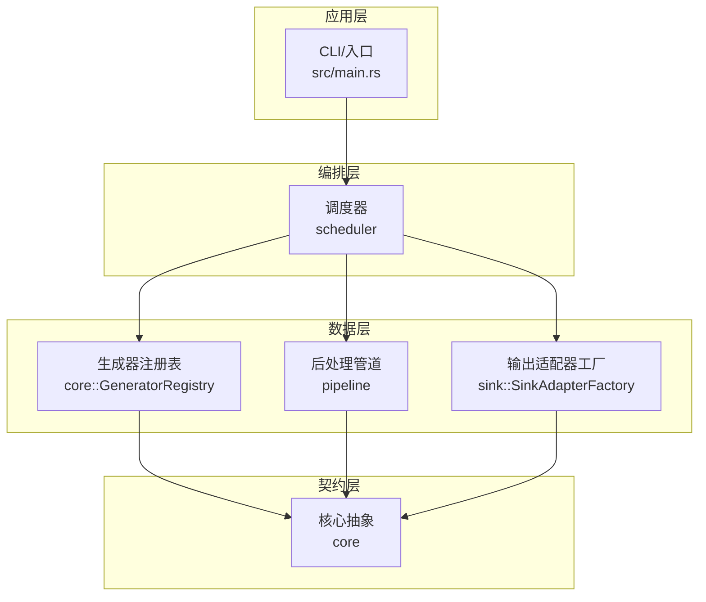
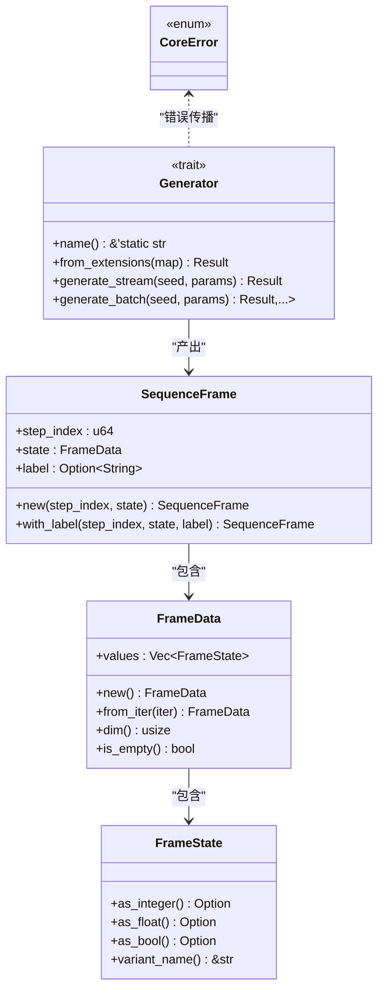
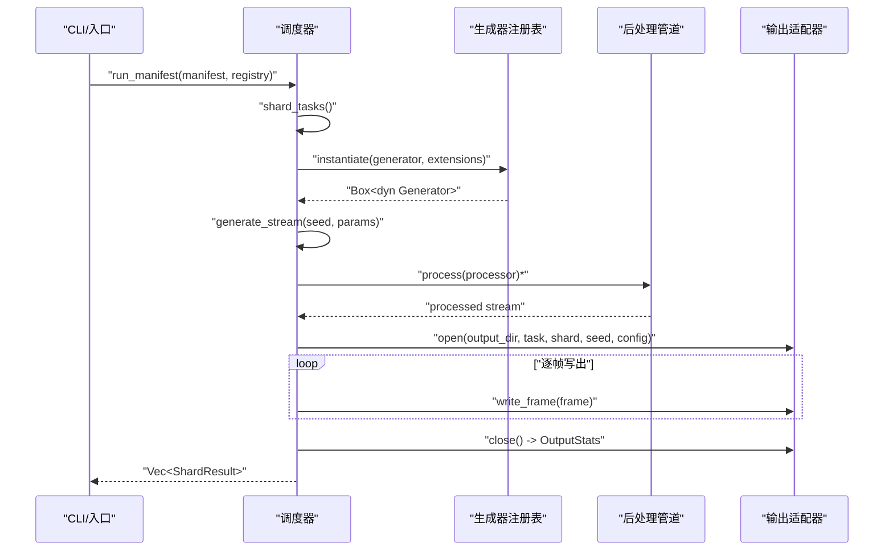
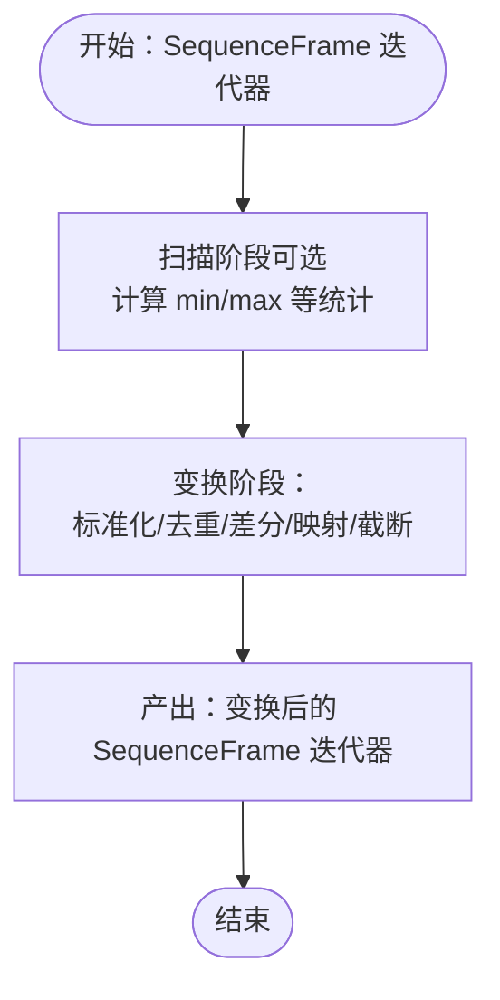
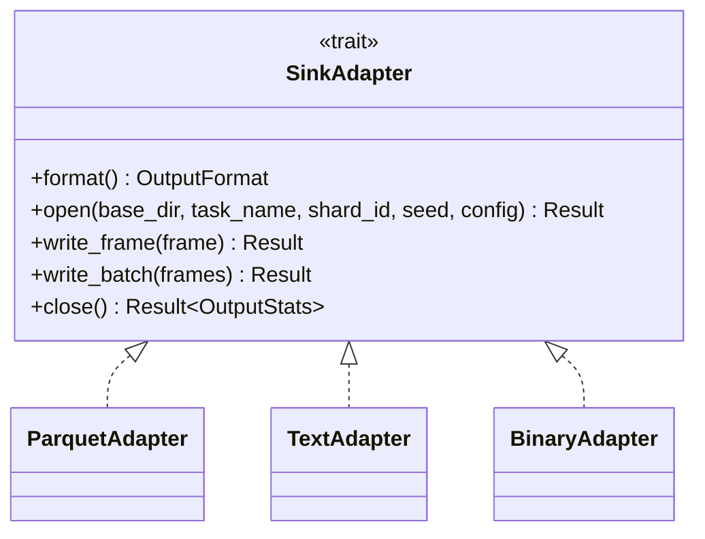
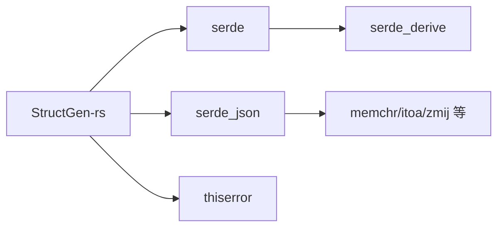

# 部署运维

<cite>
**本文档引用的文件**   
- [Cargo.toml](file://Cargo.toml)
- [Cargo.lock](file://Cargo.lock)
- [src/main.rs](file://src/main.rs)
- [src/core/mod.rs](file://src/core/mod.rs)
- [src/core/generator.rs](file://src/core/generator.rs)
- [src/core/frame.rs](file://src/core/frame.rs)
- [src/core/error.rs](file://src/core/error.rs)
- [docs/core模块详细设计.md](file://docs/core模块详细设计.md)
- [docs/pipeline模块详细设计.md](file://docs/pipeline模块详细设计.md)
- [docs/scheduler模块详细设计.md](file://docs/scheduler模块详细设计.md)
- [docs/sink模块详细设计.md](file://docs/sink模块详细设计.md)
</cite>

## 目录
1. [简介](#简介)
2. [项目结构](#项目结构)
3. [核心组件](#核心组件)
4. [架构总览](#架构总览)
5. [详细组件分析](#详细组件分析)
6. [依赖分析](#依赖分析)
7. [性能考量](#性能考量)
8. [运维最佳实践](#运维最佳实践)
9. [故障排除指南](#故障排除指南)
10. [CI/CD 流程](#cicd-流程)
11. [版本与发布管理](#版本与发布管理)
12. [结论](#结论)

## 简介
本文件面向 StructGen-rs 的部署与运维团队，提供从构建打包、依赖管理、发布策略到性能监控、故障排除与 CI/CD 的完整指南。文档基于仓库现有源码与设计文档，聚焦于核心抽象层、调度层、后处理管道与输出适配层的工程化落地要点，帮助读者在不同环境（Linux/macOS/Windows）下稳定、可重复地交付与运行该系统。

## 项目结构
仓库采用按模块分层的组织方式，核心模块位于 src/core，另有 docs 目录存放详细设计文档。当前仓库包含一个可运行的最小入口 main.rs，以及核心抽象层的模块化实现。

图表来源
- [Cargo.toml:1-10](file://Cargo.toml#L1-L10)
- [src/main.rs:1-6](file://src/main.rs#L1-L6)
- [src/core/mod.rs:1-16](file://src/core/mod.rs#L1-L16)
- [docs/core模块详细设计.md:1-553](file://docs/core模块详细设计.md#L1-L553)

章节来源
- [Cargo.toml:1-10](file://Cargo.toml#L1-L10)
- [src/main.rs:1-6](file://src/main.rs#L1-L6)
- [src/core/mod.rs:1-16](file://src/core/mod.rs#L1-L16)

## 核心组件
- 核心抽象层（core）：定义帧数据结构、生成器接口、统一错误类型与注册表，作为系统契约层。
- 调度层（scheduler）：解析清单、分片与并行执行、容错与统计。
- 后处理管道（pipeline）：可组合的处理器链，惰性变换数据。
- 输出适配层（sink）：格式透明的写出器，支持 Parquet/文本/二进制。

章节来源
- [src/core/generator.rs:1-129](file://src/core/generator.rs#L1-L129)
- [src/core/frame.rs:1-210](file://src/core/frame.rs#L1-L210)
- [src/core/error.rs:1-103](file://src/core/error.rs#L1-L103)
- [docs/core模块详细设计.md:1-553](file://docs/core模块详细设计.md#L1-L553)
- [docs/pipeline模块详细设计.md:1-498](file://docs/pipeline模块详细设计.md#L1-L498)
- [docs/scheduler模块详细设计.md:1-528](file://docs/scheduler模块详细设计.md#L1-L528)
- [docs/sink模块详细设计.md:1-447](file://docs/sink模块详细设计.md#L1-L447)

## 架构总览
系统采用“调度器编排 + 生成器/处理器/适配器”的分层架构，核心通过 trait 与注册表实现松耦合扩展。

图表来源
- [src/main.rs:1-6](file://src/main.rs#L1-L6)
- [docs/scheduler模块详细设计.md:1-528](file://docs/scheduler模块详细设计.md#L1-L528)
- [docs/pipeline模块详细设计.md:1-498](file://docs/pipeline模块详细设计.md#L1-L498)
- [docs/sink模块详细设计.md:1-447](file://docs/sink模块详细设计.md#L1-L447)
- [src/core/mod.rs:1-16](file://src/core/mod.rs#L1-L16)

## 详细组件分析

### 核心抽象层（core）
- 帧数据结构：FrameState/FrameData/SequenceFrame，统一承载整数、浮点、布尔状态值，支持序列化与变体判别。
- 生成器接口：Generator trait，要求 Send + Sync，提供流式 generate_stream 与批量 generate_batch。
- 错误体系：CoreError 统一错误类型，CoreResult 结果别名，便于传播与聚合。
- 注册表：GeneratorRegistry 以名称→工厂映射管理生成器实例化。

图表来源
- [src/core/frame.rs:1-210](file://src/core/frame.rs#L1-L210)
- [src/core/generator.rs:1-129](file://src/core/generator.rs#L1-L129)
- [src/core/error.rs:1-103](file://src/core/error.rs#L1-L103)

章节来源
- [src/core/frame.rs:1-210](file://src/core/frame.rs#L1-L210)
- [src/core/generator.rs:1-129](file://src/core/generator.rs#L1-L129)
- [src/core/error.rs:1-103](file://src/core/error.rs#L1-L103)
- [src/core/mod.rs:1-16](file://src/core/mod.rs#L1-L16)

### 调度层（scheduler）
- 清单解析与校验：Manifest/TaskSpec，校验生成器名称、处理器名称、参数合法性。
- 分片与种子派生：按任务样本数与 CPU 数自动/手动分片，确定性 derive_seed。
- 并行执行：rayon 并行区域，每个分片独立写出，失败不影响其他分片。
- 两种模式：阻塞收集（小规模）与流式写出（TB 级）。

图表来源
- [docs/scheduler模块详细设计.md:150-154](file://docs/scheduler模块详细设计.md#L150-L154)
- [docs/scheduler模块详细设计.md:228-278](file://docs/scheduler模块详细设计.md#L228-L278)
- [docs/sink模块详细设计.md:50-98](file://docs/sink模块详细设计.md#L50-L98)

章节来源
- [docs/scheduler模块详细设计.md:1-528](file://docs/scheduler模块详细设计.md#L1-L528)

### 后处理管道（pipeline）
- Processor trait：迭代器适配器，可链式组合，惰性求值。
- 内置处理器：标准化器、去重过滤器、差分编码器、令牌映射器、序列截断/拼接器。
- 配置：JSON 反序列化，支持默认配置与显式 min/max 等。

图表来源
- [docs/pipeline模块详细设计.md:55-79](file://docs/pipeline模块详细设计.md#L55-L79)
- [docs/pipeline模块详细设计.md:195-224](file://docs/pipeline模块详细设计.md#L195-L224)
- [docs/pipeline模块详细设计.md:226-257](file://docs/pipeline模块详细设计.md#L226-L257)

章节来源
- [docs/pipeline模块详细设计.md:1-498](file://docs/pipeline模块详细设计.md#L1-L498)

### 输出适配层（sink）
- SinkAdapter trait：open/write_frame/close 生命周期，格式透明。
- 三种实现：Parquet（列式存储）、Text（Unicode 令牌）、Binary（紧凑二进制 + mmap 友好）。
- 原子写入：临时文件 + 重命名，避免残缺文件；统计输出文件大小与可选哈希。

图表来源
- [docs/sink模块详细设计.md:49-102](file://docs/sink模块详细设计.md#L49-L102)
- [docs/sink模块详细设计.md:153-190](file://docs/sink模块详细设计.md#L153-L190)
- [docs/sink模块详细设计.md:192-231](file://docs/sink模块详细设计.md#L192-L231)
- [docs/sink模块详细设计.md:233-286](file://docs/sink模块详细设计.md#L233-L286)

章节来源
- [docs/sink模块详细设计.md:1-447](file://docs/sink模块详细设计.md#L1-L447)

## 依赖分析
- 包与版本：项目使用 Rust 2021 edition，核心依赖 serde/serde_json/thiserror。
- 依赖锁定：Cargo.lock 记录了 serde 生态与派生宏链路，确保可重复构建。
- 依赖关系图（简化）：

图表来源
- [Cargo.toml:6-10](file://Cargo.toml#L6-L10)
- [Cargo.lock:44-129](file://Cargo.lock#L44-L129)

章节来源
- [Cargo.toml:1-10](file://Cargo.toml#L1-L10)
- [Cargo.lock:1-129](file://Cargo.lock#L1-L129)

## 性能考量
- 内存使用
  - 帧状态 FrameState 为 16 字节，序列化为标记联合体，避免额外指针与装箱开销。
  - 迭代器零成本抽象：处理器链为惰性适配器，不物化中间结果，降低峰值内存。
- CPU 利用率
  - 调度层通过 rayon 工作窃取，分片数为 CPU 核心数的 2–4 倍，提升负载均衡。
  - 标准化器支持显式 min/max 避免二次扫描，减少 CPU 预热成本。
- I/O 与吞吐
  - 输出适配器统一使用 BufWriter 缓冲，减少系统调用。
  - Parquet 使用列式存储与压缩，Binary 适配器支持 mmap 随机访问。

章节来源
- [docs/core模块详细设计.md:477-483](file://docs/core模块详细设计.md#L477-L483)
- [docs/pipeline模块详细设计.md:396-403](file://docs/pipeline模块详细设计.md#L396-L403)
- [docs/scheduler模块详细设计.md:413-419](file://docs/scheduler模块详细设计.md#L413-L419)
- [docs/sink模块详细设计.md:355-362](file://docs/sink模块详细设计.md#L355-L362)

## 运维最佳实践
- 构建与打包
  - 使用 Cargo Release 或手工版本号更新，确保 Cargo.lock 与 Cargo.toml 同步提交。
  - 产物建议包含 Linux/x86_64、Linux/aarch64、macOS/x86_64、macOS/aarch64、Windows/x86_64 二进制。
- 依赖管理
  - 严格遵循 Cargo.lock，禁止手动修改依赖树；升级依赖需回归测试。
  - 通过 cargo tree 检视依赖图，避免重复或冲突。
- 平台兼容性
  - 使用 rust-toolchain.toml 锁定工具链版本，确保跨平台一致性。
  - 在 CI 中对多平台交叉编译进行预检，避免运行时 ABI 不匹配。
- 日志与可观测性
  - 使用 env_logger/log 设置日志级别，结合任务/分片上下文输出。
  - 在关键路径（生成、处理、写出）埋点统计帧数/字节数/耗时，便于容量规划。
- 资源限制
  - 通过 GlobalConfig 控制 num_threads、shard_max_sequences、stream_write，避免 OOM 与磁盘压力。
  - 对超大样本任务，优先选择流式写出与较小分片，降低峰值内存。

章节来源
- [docs/scheduler模块详细设计.md:515-524](file://docs/scheduler模块详细设计.md#L515-L524)
- [docs/core模块详细设计.md:18-27](file://docs/core模块详细设计.md#L18-L27)

## 故障排除指南
- 常见错误与定位
  - 生成器未注册：Manifest 校验阶段抛出 CoreError::GeneratorNotFound，检查注册表初始化与名称拼写。
  - 参数非法：CoreError::InvalidParams，核对清单中 seq_length/grid_size/extensions。
  - I/O 错误：CoreError::IoError，检查输出目录权限、磁盘空间与路径可写性。
  - 处理器配置反序列化失败：CoreError::SerializationError，检查 pipeline_config 的 JSON 结构。
- 定位手段
  - 启用更高日志级别（如 debug），观察分片级 ShardResult.error 字段。
  - 对失败分片单独重放，缩小问题范围。
  - 使用最小化清单与 mock 生成器复现问题。
- 容错与隔离
  - 单分片失败不影响整体运行，汇总错误后继续执行，便于快速产出可用数据。

章节来源
- [docs/scheduler模块详细设计.md:382-411](file://docs/scheduler模块详细设计.md#L382-L411)
- [src/core/error.rs:1-103](file://src/core/error.rs#L1-L103)

## CI/CD 流程
- 触发条件
  - push 到 main 分支触发发布构建；PR 触发单元与集成测试。
- 步骤建议
  - 依赖安装：安装 rustup 与目标三元组（x86_64-unknown-linux-gnu、aarch64-unknown-linux-gnu、x86_64-apple-darwin、aarch64-apple-darwin、x86_64-pc-windows-msvc）。
  - 构建：cargo build --release；交叉编译：cargo build --target <target> --release。
  - 测试：cargo test；可选 cargo nextest。
  - 打包：将二进制与必要配置模板打包为 tar.gz/zip。
  - 发布：上传制品至发布页面或镜像仓库，附带校验和。
- 质量门禁
  - 必须通过单元测试与关键集成测试；依赖不得引入安全漏洞（可结合 cargo-audit）。

[本节为通用流程建议，不直接分析具体文件，故无章节来源]

## 版本与发布管理
- 版本号策略
  - 遵循语义化版本（MAJOR.MINOR.PATCH），变更破坏性接口或行为时提升 MAJOR。
- 发布流程
  - 更新 Cargo.toml 版本；生成/更新 CHANGELOG；打 Tag 并推送；发布制品。
- 回滚策略
  - 保留最近 3 个版本的二进制与配置；回滚时恢复对应版本的二进制与清单模板。
- 配置与元数据
  - 通过 GlobalConfig 控制默认线程数、输出格式、日志级别与分片策略，便于灰度与回滚。

章节来源
- [docs/scheduler模块详细设计.md:515-524](file://docs/scheduler模块详细设计.md#L515-L524)
- [docs/core模块详细设计.md:182-198](file://docs/core模块详细设计.md#L182-L198)

## 结论
本文档基于仓库现有源码与设计文档，给出了 StructGen-rs 的部署运维全景：从构建打包、依赖管理、发布策略，到性能监控、故障排除与 CI/CD 流程。建议在实际落地时结合生产环境的资源约束与合规要求，细化日志与告警策略，完善自动化巡检与回滚预案，确保系统在多平台、多规模场景下的稳定交付与长期可维护。