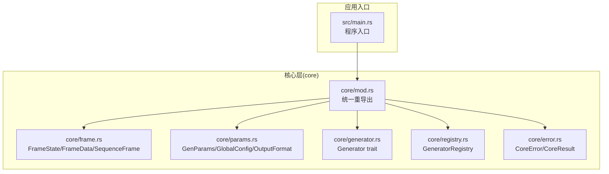
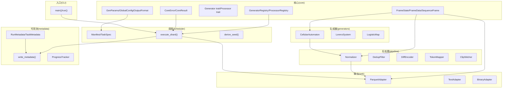
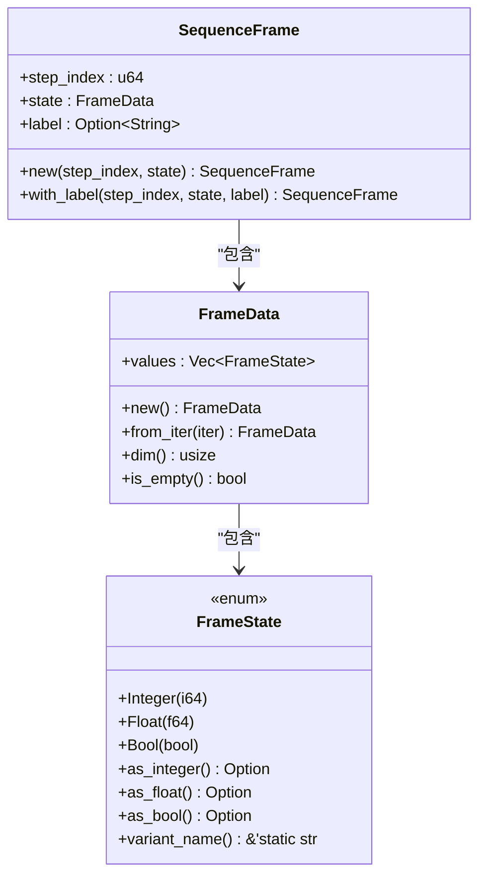
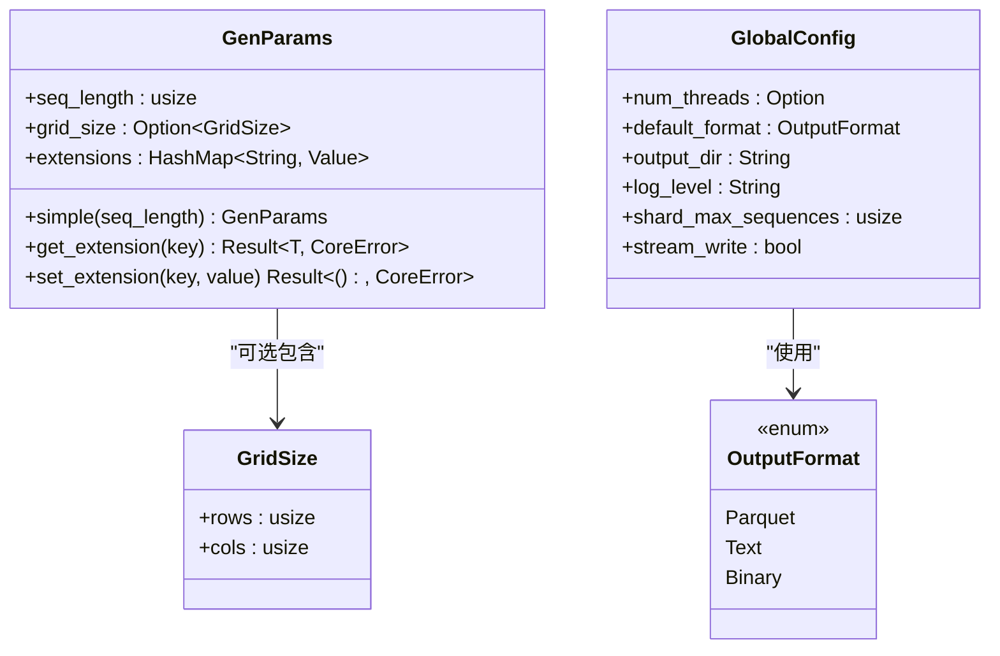
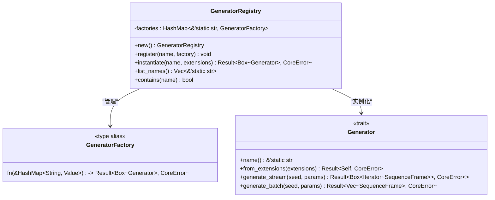
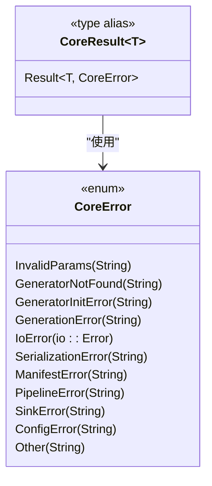
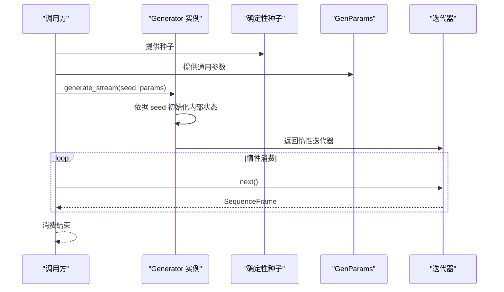
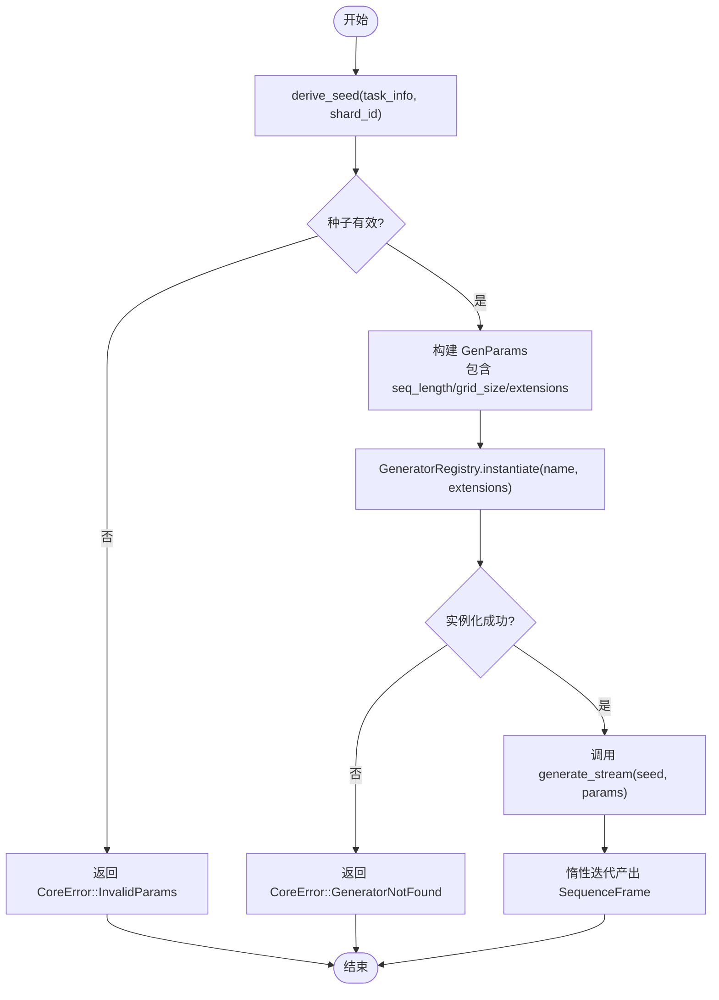
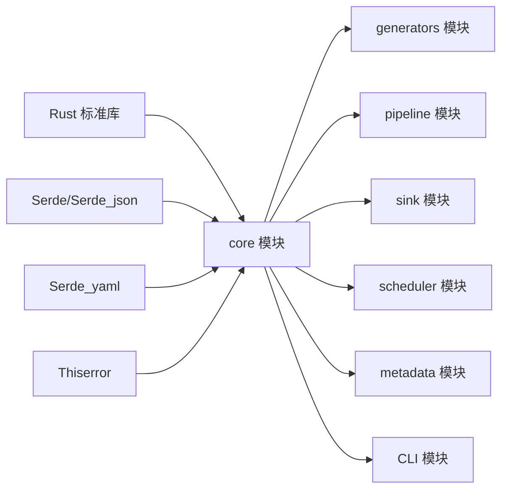

# 项目概述

<cite>
**本文档引用的文件**
- [main.rs](file://src/main.rs)
- [mod.rs](file://src/core/mod.rs)
- [generator.rs](file://src/core/generator.rs)
- [frame.rs](file://src/core/frame.rs)
- [params.rs](file://src/core/params.rs)
- [registry.rs](file://src/core/registry.rs)
- [error.rs](file://src/core/error.rs)
- [Cargo.toml](file://Cargo.toml)
- [core模块详细设计.md](file://docs/core模块详细设计.md)
- [开发规划.md](file://docs/开发规划.md)
- [pipeline模块详细设计.md](file://docs/pipeline模块详细设计.md)
- [sink模块详细设计.md](file://docs/sink模块详细设计.md)
</cite>

## 目录
1. [简介](#简介)
2. [项目结构](#项目结构)
3. [核心组件](#核心组件)
4. [架构总览](#架构总览)
5. [详细组件分析](#详细组件分析)
6. [依赖关系分析](#依赖关系分析)
7. [性能考虑](#性能考虑)
8. [故障排查指南](#故障排查指南)
9. [结论](#结论)

## 简介
StructGen-rs 是一个基于 Rust 的结构化数据生成框架，专为机器学习与人工智能研究提供高质量的时序数据集。项目采用分层架构，核心抽象层（core）定义统一的数据结构与接口契约，其余模块（generators、pipeline、sink、scheduler、metadata、CLI）围绕 core 构建，形成可扩展、可并行、可确定性的数据生成流水线。

项目主要特性：
- 多格式输出支持：Parquet（列式存储）、文本（令牌映射后的 Unicode 序列）、二进制（内存映射原始转储）
- 可扩展的插件化架构：通过注册表机制实现生成器与处理器的动态发现与实例化
- 确定性随机性机制：通过种子派生确保相同输入产生可复现的结果
- 流式处理与惰性求值：生成器与处理器均以迭代器形式提供，避免大规模数据的内存压力
- 强类型与序列化：使用 Serde 对核心数据结构进行序列化，确保跨模块数据交换的一致性

## 项目结构
仓库采用“模块化 + 分层”的组织方式，核心位于 src/core，其余模块在开发规划中逐步实现。当前已实现核心抽象层，其他模块的设计文档已完备，等待按阶段开发。

图表来源
- [mod.rs:1-16](file://src/core/mod.rs#L1-L16)
- [frame.rs:1-210](file://src/core/frame.rs#L1-L210)
- [params.rs:1-235](file://src/core/params.rs#L1-L235)
- [generator.rs:1-129](file://src/core/generator.rs#L1-L129)
- [registry.rs:1-150](file://src/core/registry.rs#L1-L150)
- [error.rs:1-103](file://src/core/error.rs#L1-L103)
- [main.rs:1-6](file://src/main.rs#L1-L6)

章节来源
- [mod.rs:1-16](file://src/core/mod.rs#L1-L16)
- [main.rs:1-6](file://src/main.rs#L1-L6)

## 核心组件
本节深入介绍 core 模块的关键类型与接口，它们是整个系统的基础契约。

- FrameState/FrameData/SequenceFrame：统一承载整型、浮点型、布尔型状态值，形成时序帧的最小单元
- GenParams/GlobalConfig/OutputFormat：通用参数载体、全局配置与输出格式枚举
- Generator trait：生成器抽象接口，定义流式与批量生成能力
- GeneratorRegistry：生成器注册表，实现名称到构造函数的映射
- CoreError/CoreResult：统一错误类型与结果别名，收敛错误传播

章节来源
- [frame.rs:1-210](file://src/core/frame.rs#L1-L210)
- [params.rs:1-235](file://src/core/params.rs#L1-L235)
- [generator.rs:1-129](file://src/core/generator.rs#L1-L129)
- [registry.rs:1-150](file://src/core/registry.rs#L1-L150)
- [error.rs:1-103](file://src/core/error.rs#L1-L103)

## 架构总览
StructGen-rs 的架构遵循“自底向上”的依赖原则：core 作为最底层，仅依赖标准库与少量基础库；上层模块（generators、pipeline、sink、scheduler、metadata、CLI）依次依赖 core，并通过注册表与接口契约实现松耦合。

图表来源
- [core模块详细设计.md:422-433](file://docs/core模块详细设计.md#L422-L433)
- [开发规划.md:13-50](file://docs/开发规划.md#L13-L50)
- [pipeline模块详细设计.md:1-200](file://docs/pipeline模块详细设计.md#L1-L200)
- [sink模块详细设计.md:1-200](file://docs/sink模块详细设计.md#L1-L200)

## 详细组件分析

### 核心数据模型
- FrameState：标记联合体，统一承载 i64、f64、bool，提供安全的类型转换方法
- FrameData：帧状态向量，按生成器定义的状态维度排列
- SequenceFrame：带时间步索引与可选语义标签的完整帧快照

图表来源
- [frame.rs:1-210](file://src/core/frame.rs#L1-L210)

章节来源
- [frame.rs:1-210](file://src/core/frame.rs#L1-L210)

### 通用参数与配置
- GenParams：包含目标序列长度、网格尺寸与动态扩展字段，扩展字段以 JSON Value 存储，支持生成器特有参数的序列化/反序列化
- GlobalConfig：全局运行配置，如并行线程数、默认输出格式、输出目录、日志级别、分片大小与流式写出开关
- OutputFormat：输出格式枚举，支持 Parquet、Text、Binary

图表来源
- [params.rs:1-235](file://src/core/params.rs#L1-L235)

章节来源
- [params.rs:1-235](file://src/core/params.rs#L1-L235)

### 生成器接口与注册表
- Generator trait：定义生成器的名称、从扩展字段反序列化配置、流式生成与批量生成接口；迭代器标注 Send，确保 rayon 并行安全
- GeneratorRegistry：名称→构造函数映射，提供注册、实例化、查询与列表功能；重复注册会 panic，确保编译期发现冲突

图表来源
- [generator.rs:1-129](file://src/core/generator.rs#L1-L129)
- [registry.rs:1-150](file://src/core/registry.rs#L1-L150)

章节来源
- [generator.rs:1-129](file://src/core/generator.rs#L1-L129)
- [registry.rs:1-150](file://src/core/registry.rs#L1-L150)

### 错误类型与传播
- CoreError：统一错误类型，涵盖参数、生成、I/O、序列化、清单、管道、适配器、配置等错误类别
- CoreResult：CoreError 的 Result 别名，全系统统一使用

图表来源
- [error.rs:1-103](file://src/core/error.rs#L1-L103)

章节来源
- [error.rs:1-103](file://src/core/error.rs#L1-L103)

### 流式生成工作流
下面的序列图展示了生成器的流式生成过程，从种子与参数到惰性迭代器产出帧序列。

图表来源
- [generator.rs:27-56](file://src/core/generator.rs#L27-L56)
- [frame.rs:89-118](file://src/core/frame.rs#L89-L118)

章节来源
- [generator.rs:1-129](file://src/core/generator.rs#L1-L129)
- [frame.rs:1-210](file://src/core/frame.rs#L1-L210)

### 确定性随机性机制
- 种子派生：通过 derive_seed() 从任务与分片信息派生确定性种子，确保相同输入产生相同输出
- 流式与批量：生成器提供 generate_stream 与 generate_batch，前者优先，后者作为同步糖
- 扩展字段：生成器通过 GenParams.extensions 传递特有配置，使用 JSON Value 中间表示，按需反序列化

图表来源
- [registry.rs:39-53](file://src/core/registry.rs#L39-L53)
- [generator.rs:35-55](file://src/core/generator.rs#L35-L55)
- [params.rs:89-123](file://src/core/params.rs#L89-L123)

章节来源
- [registry.rs:1-150](file://src/core/registry.rs#L1-L150)
- [generator.rs:1-129](file://src/core/generator.rs#L1-L129)
- [params.rs:1-235](file://src/core/params.rs#L1-L235)

## 依赖关系分析
- 技术栈：Rust（2021 edition）、Serde（derive）、Serde_json、Serde_yaml、Thiserror
- 外部依赖：当前 core 仅依赖标准库与上述基础库，不引入领域特定库，保证核心模块的纯粹性
- 上层模块依赖：generators、pipeline、sink、scheduler、metadata、CLI 依次依赖 core

图表来源
- [Cargo.toml:6-10](file://Cargo.toml#L6-L10)
- [core模块详细设计.md:437-442](file://docs/core模块详细设计.md#L437-L442)

章节来源
- [Cargo.toml:1-10](file://Cargo.toml#L1-L10)
- [core模块详细设计.md:437-442](file://docs/core模块详细设计.md#L437-L442)

## 性能考虑
- FrameState 内存布局：16 字节大小，与 i64 对齐，适合大规模序列的内存占用控制
- 零拷贝传递：迭代器按值产出 SequenceFrame，下游可直接消费，避免额外克隆
- 注册表查找：HashMap<&str, GeneratorFactory>，静态字符串键，查找 O(1)
- 惰性解析：扩展字段仅在生成器实例化时从 JSON 反序列化，避免无效解析开销
- 流式处理：生成器与处理器均为惰性迭代器，全程流式处理，不物化中间结果

章节来源
- [core模块详细设计.md:477-483](file://docs/core模块详细设计.md#L477-L483)

## 故障排查指南
常见问题与处理建议：
- 参数不合法：检查 GenParams 的 seq_length、grid_size 与 extensions 的类型与取值范围
- 生成器未注册：确认 GeneratorRegistry 中已注册对应名称，重复注册会导致 panic
- I/O 错误：检查输出目录权限与磁盘空间，确保临时文件可写
- 序列化/反序列化错误：核对 YAML 清单与 JSON 配置的字段名与类型
- 确定性问题：确保 derive_seed() 输入一致，避免跨平台浮点差异影响

章节来源
- [error.rs:1-103](file://src/core/error.rs#L1-L103)
- [registry.rs:28-37](file://src/core/registry.rs#L28-L37)
- [params.rs:99-122](file://src/core/params.rs#L99-L122)

## 结论
StructGen-rs 通过 core 模块的强类型抽象与统一接口契约，为机器学习与 AI 研究提供了可扩展、可并行、可确定性的时序数据生成框架。当前已实现核心层，后续将按开发规划分阶段实现生成器、管道、输出适配、调度、可观测性与 CLI，最终形成完整的端到端数据生成流水线。项目采用 Rust 的类型系统与所有权模型，结合 Serde 的序列化能力与可选的并行执行（rayon），在保证性能的同时兼顾易用性与可维护性。